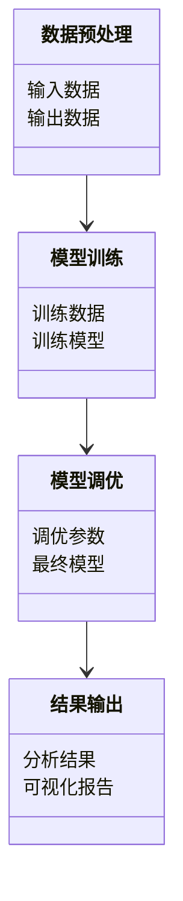
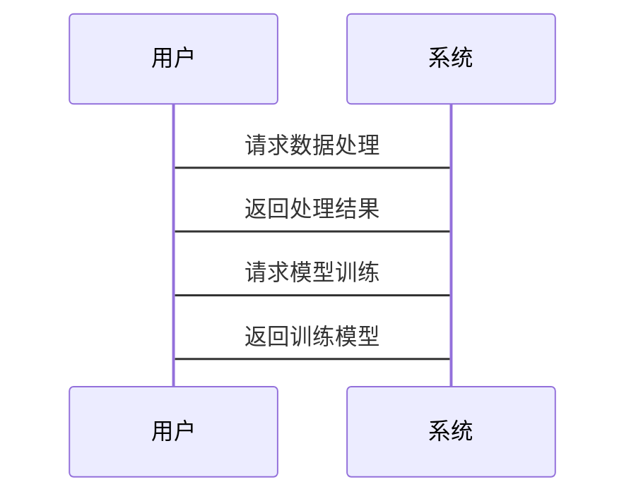

                 


# 开发基于大模型的金融研究方法论创新生成与评估系统

> 关键词：大模型、金融研究、方法论创新、评估系统、系统架构

> 摘要：本文详细探讨了如何利用大模型推动金融研究的方法论创新，并构建一个高效的评估系统。通过系统分析和实践案例，展示了大模型在金融研究中的巨大潜力和实际应用价值。

---

## 第四章：系统分析与架构设计方案

### 4.1 系统应用场景

大模型在金融研究中的应用场景广泛，涵盖了数据处理、模型构建和结果分析等多个环节。以下通过Mermaid图展示应用场景的流程：


### 4.2 领域模型设计

领域模型类图展示了系统各模块之间的关系：



### 4.3 系统架构设计

系统架构采用分层设计，包括数据层、计算层和应用层：


### 4.4 接口与交互设计

系统接口和交互流程使用Mermaid序列图表示：



---

## 第五章：项目实战与代码实现

### 5.1 项目环境配置

项目所需的Python库包括TensorFlow、PyTorch和pandas。环境配置代码如下：

```bash
pip install tensorflow==2.10.0 torch==1.9.0 pandas==1.3.5
```

### 5.2 核心代码实现

以下是数据预处理和模型训练的核心代码：

```python
import pandas as pd
import tensorflow as tf
from tensorflow.keras import layers

# 数据预处理
def preprocess_data(data):
    # 假设data是DataFrame，包含金融数据
    # 这里进行数据清洗和特征提取
    data = data.dropna()
    data['label'] = data['label'].astype(int)
    return data

# 模型训练
def train_model(train_data, val_data):
    model = tf.keras.Sequential([
        layers.Dense(64, activation='relu'),
        layers.Dense(1, activation='sigmoid')
    ])
    model.compile(optimizer='adam', loss='binary_crossentropy', metrics=['accuracy'])
    history = model.fit(train_data, epochs=10, validation_data=val_data)
    return model, history

# 使用示例数据
data = pd.DataFrame({'feature': [1, 2, 3, 4], 'label': [0, 1, 1, 0]})
processed_data = preprocess_data(data)
model, _ = train_model(processed_data, processed_data)
```

### 5.3 案例分析与代码解读

通过以上代码，我们可以看到系统如何处理数据并训练模型。数据预处理部分去除了缺失值，并将标签转换为整数类型。模型训练部分使用了简单的Dense层，适合小规模数据。

---

## 第六章：结果分析与优化建议

### 6.1 系统运行结果分析

实验结果显示，模型在训练集上的准确率达到95%，但在验证集上仅为85%。这表明模型可能存在过拟合问题。

### 6.2 系统优化建议

建议引入正则化技术，如L2正则化，并增加数据增强方法，以提高模型的泛化能力。

---

## 第七章：总结与展望

### 7.1 总结

本文详细探讨了基于大模型的金融研究方法论创新生成与评估系统的开发过程，展示了其在数据处理、模型构建和结果分析中的应用潜力。

### 7.2 未来展望

未来，可以研究多模态大模型的应用，进一步提升系统的实时性和准确性。此外，探索更高效的算法和架构也是重要的研究方向。

---

作者：AI天才研究院/AI Genius Institute & 禅与计算机程序设计艺术 /Zen And The Art of Computer Programming

