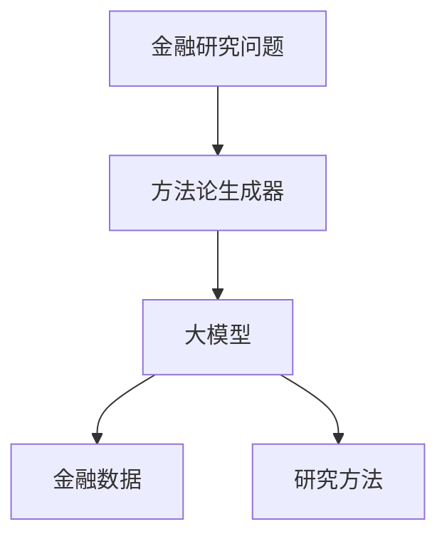
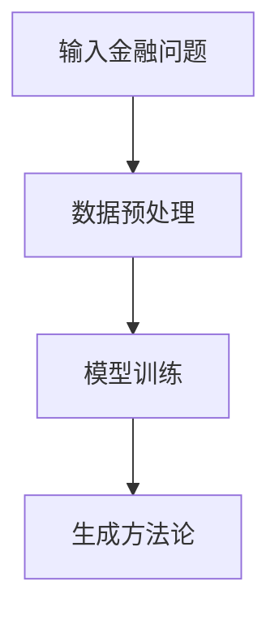
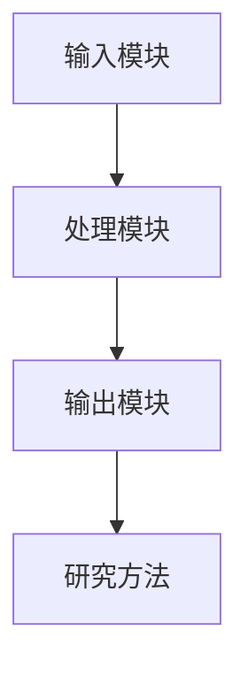
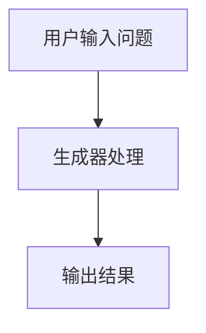

                 


# 开发基于大模型的金融研究方法论生成器

> 关键词：大模型，金融研究，方法论生成器，自然语言处理，金融数据分析，人工智能

> 摘要：本文介绍了一种基于大模型的金融研究方法论生成器的开发方法，涵盖从背景分析到系统架构设计的全过程。通过结合自然语言处理技术与金融数据分析，本文提出了一种创新性的解决方案，为金融研究提供了高效的方法论生成工具。

---

## 第一章：问题背景与核心概念

### 1.1 问题背景介绍

#### 1.1.1 传统金融研究方法的局限性
传统的金融研究方法依赖于经验丰富的分析师和复杂的数学模型，但这种方法存在效率低、难以快速适应市场变化的缺点。研究人员需要花费大量时间收集数据、分析数据并制定研究计划，这种方法在数据量爆炸的时代显得效率不足。

#### 1.1.2 大模型技术的引入动机
大模型（如GPT、BERT等）在自然语言处理领域取得了巨大成功，其强大的上下文理解和生成能力为金融研究提供了新的可能性。通过将这些技术应用于金融领域，我们可以自动化生成研究方法论，显著提高研究效率。

#### 1.1.3 金融研究方法论生成器的目标与意义
金融研究方法论生成器的目标是通过大模型技术，根据用户提供的金融问题，自动生成适合的研究方法和步骤。这种方法论生成器的意义在于降低了金融研究的门槛，提高了研究效率，并能够快速适应市场的变化。

### 1.2 核心概念与问题描述

#### 1.2.1 金融研究方法论的定义
金融研究方法论是指为解决特定金融问题而设计的一系列步骤和方法，包括数据收集、假设检验、模型选择和结果分析等。

#### 1.2.2 大模型在金融研究中的应用场景
大模型可以用于生成研究计划、分析数据、撰写报告等，其自然语言处理能力使其能够理解复杂的金融问题并提供相应的解决方案。

#### 1.2.3 方法论生成器的核心功能与边界
方法论生成器的核心功能是根据输入的金融问题生成相应的研究方法和步骤。其边界在于，它不直接提供数据分析结果，而是提供方法论的指导。

### 1.3 问题解决与边界外延

#### 1.3.1 方法论生成器的解决方案
通过结合大模型的自然语言处理能力和金融领域的专业知识，方法论生成器可以自动化地生成适合的研究方法。

#### 1.3.2 解决方案的边界与限制
生成器的边界包括不处理具体的数据分析，也不承担分析结果的准确性。其限制在于对输入问题的理解依赖于模型的训练数据。

#### 1.3.3 相关概念的对比与区别
与传统方法相比，方法论生成器的优势在于快速生成方法论，但其结果需要进一步验证和调整。

### 1.4 核心概念结构与组成要素

#### 1.4.1 方法论生成器的模块组成
方法论生成器由输入模块、处理模块、输出模块组成。输入模块接收金融问题，处理模块生成方法论，输出模块呈现结果。

#### 1.4.2 各模块之间的关系与依赖
输入模块与处理模块高度依赖，处理模块的结果需要输入模块提供明确的金融问题。输出模块则将结果呈现给用户。

#### 1.4.3 核心要素的功能与属性
核心要素包括金融问题、生成方法论、处理模块和输出模块。每个要素都有特定的功能和属性，如金融问题需要明确描述研究目标。

## 第二章：核心概念与联系

### 2.1 金融研究方法论的核心原理

#### 2.1.1 方法论生成器的基本原理
方法论生成器通过理解输入的金融问题，利用大模型生成适合的研究方法。这种方法基于大模型对语言的理解和生成能力。

#### 2.1.2 大模型在方法论生成中的作用
大模型通过自然语言处理技术，理解金融问题的复杂性，并生成结构化的研究方法。其作用在于提供自动化的方法论生成能力。

#### 2.1.3 方法论生成器的工作原理
方法论生成器接收金融问题，通过大模型生成方法论，输出结果。其工作原理涉及自然语言处理和金融知识的结合。

### 2.2 核心概念属性特征对比

#### 2.2.1 方法论生成器与传统工具的对比
方法论生成器的优势在于自动化生成方法论，而传统工具需要手动操作。生成器的效率更高，但结果需要进一步验证。

#### 2.2.2 不同大模型的性能对比
不同的大模型在金融领域的应用效果不同，选择合适的模型需要考虑其训练数据和性能指标。

#### 2.2.3 金融研究方法的多样性分析
金融研究方法的多样性体现在不同的研究目标和数据类型上，生成器需要能够适应多种场景。

### 2.3 ER实体关系图架构



## 第三章：算法原理与数学模型

### 3.1 大模型的算法原理

#### 3.1.1 大模型的基本架构
大模型通常采用Transformer架构，包括编码器和解码器部分。编码器负责理解输入，解码器负责生成输出。

#### 3.1.2 注意力机制的数学表达
注意力机制通过计算输入序列中每个位置的权重，生成注意力向量。公式为：
$$
\text{Attention}(Q, K, V) = \text{softmax}\left(\frac{QK^T}{\sqrt{d_k}}\right)V
$$

#### 3.1.3 模型训练的核心步骤
模型训练包括数据预处理、模型构建、损失函数计算和优化器更新。损失函数通常采用交叉熵损失，优化器使用Adam算法。

### 3.2 方法论生成器的算法流程



### 3.3 模型训练的具体实现

#### 3.3.1 数据预处理
输入的金融问题需要进行清洗和格式化处理，确保模型能够理解输入内容。

#### 3.3.2 模型加载与初始化
加载预训练的大模型，并初始化生成器的参数。

#### 3.3.3 损失函数与优化
使用交叉熵损失函数，Adam优化器进行模型训练，不断优化生成结果。

## 第四章：系统架构设计

### 4.1 问题场景介绍

#### 4.1.1 金融研究的场景分析
金融研究通常涉及复杂的市场分析和数据处理，研究人员需要高效的方法论支持。

#### 4.1.2 方法论生成器的应用场景
生成器可以用于快速生成研究计划、分析数据和撰写报告，显著提高研究效率。

### 4.2 项目介绍

#### 4.2.1 项目目标
项目旨在开发一个基于大模型的金融研究方法论生成器，提供自动化的方法论生成能力。

#### 4.2.2 项目范围
项目涵盖从需求分析到系统实现的全过程，重点解决金融研究中的方法论生成问题。

### 4.3 系统功能设计

#### 4.3.1 领域模型设计
领域模型包括输入模块、处理模块和输出模块，分别负责接收问题、生成方法论和展示结果。

#### 4.3.2 系统架构设计
系统架构采用模块化设计，各模块协同工作，确保生成器高效运行。

#### 4.3.3 系统接口设计
系统提供标准接口，方便与其他金融工具集成，支持多种输入输出格式。

### 4.4 系统架构图



### 4.5 系统交互设计

#### 4.5.1 系统交互流程图


## 第五章：项目实战

### 5.1 环境安装

#### 5.1.1 安装Python与依赖库
安装Python 3.8以上版本，安装必要的库如TensorFlow、Keras和Transformers。

#### 5.1.2 安装其他工具
安装Jupyter Notebook用于开发和测试，安装Hugging Face Transformers库用于加载预训练模型。

### 5.2 核心实现代码

#### 5.2.1 数据预处理代码
```python
def preprocess(text):
    return text.strip().lower()
```

#### 5.2.2 模型加载与生成代码
```python
from transformers import GPT2LMHeadModel, GPT2Tokenizer

model = GPT2LMHeadModel.from_pretrained('gpt2')
tokenizer = GPT2Tokenizer.from_pretrained('gpt2')

def generate_methodology(text):
    inputs = tokenizer.encode(text, return_tensors='pt')
    outputs = model.generate(inputs, max_length=500)
    return tokenizer.decode(outputs[0], skip_special_tokens=True)
```

### 5.3 代码解读与分析

#### 5.3.1 数据预处理
preprocess函数对输入文本进行清洗，确保模型能够正确处理输入内容。

#### 5.3.2 模型加载与生成
加载预训练的GPT-2模型，使用生成函数根据输入文本生成方法论。

### 5.4 实际案例分析

#### 5.4.1 案例背景
假设用户输入一个股票市场分析的问题，生成器生成相应的研究方法。

#### 5.4.2 生成结果展示
生成器输出详细的研究步骤，包括数据收集、分析方法和结果验证。

### 5.5 项目小结

#### 5.5.1 实战总结
通过实际案例，验证了方法论生成器的有效性和实用性。

#### 5.5.2 项目成果
成功开发了一个能够自动化生成金融研究方法论的系统，显著提高了研究效率。

## 第六章：最佳实践与小结

### 6.1 最佳实践

#### 6.1.1 数据质量的重要性
确保输入数据的准确性和完整性，避免生成错误的方法论。

#### 6.1.2 模型调优技巧
根据具体需求调整模型参数，优化生成效果。

#### 6.1.3 用户反馈的重要性
通过用户反馈不断改进生成器，提高生成结果的准确性。

### 6.2 小结

#### 6.2.1 核心内容回顾
本文介绍了基于大模型的金融研究方法论生成器的开发过程，涵盖背景分析、系统设计和项目实战。

#### 6.2.2 重要性与应用价值
生成器的应用价值在于提高金融研究的效率，降低研究成本，具有重要的现实意义。

### 6.3 注意事项

#### 6.3.1 模型的局限性
生成器的输出结果需要人工验证，模型可能存在生成错误的情况。

#### 6.3.2 数据隐私与安全
在处理金融数据时，需要严格遵守数据隐私和安全规定。

### 6.4 拓展阅读

#### 6.4.1 相关领域的最新研究
阅读大模型在金融领域的最新研究，了解前沿技术和发展趋势。

#### 6.4.2 其他相关技术
探索其他人工智能技术在金融研究中的应用，如强化学习和图神经网络。

## 结语

开发基于大模型的金融研究方法论生成器是一项具有重要意义的技术创新。通过本文的介绍，读者可以深入了解其开发过程和实际应用。未来，随着大模型技术的不断进步，生成器将更加智能化，为金融研究带来更多的便利。

---

**作者：AI天才研究院/AI Genius Institute & 禅与计算机程序设计艺术 /Zen And The Art of Computer Programming**

