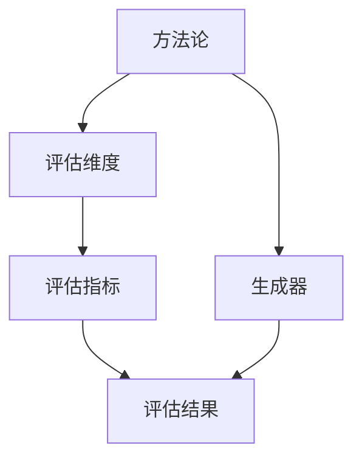
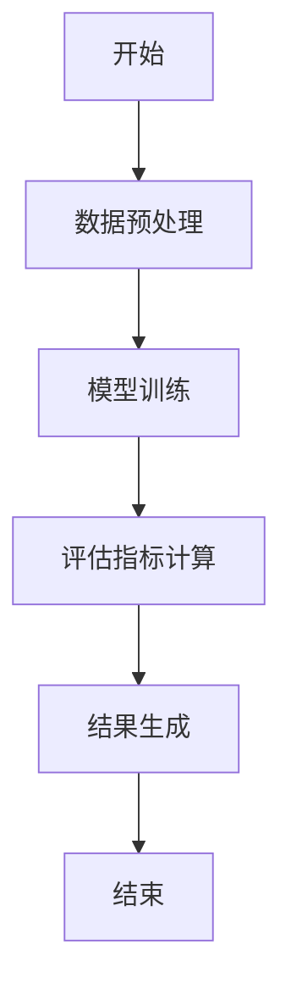
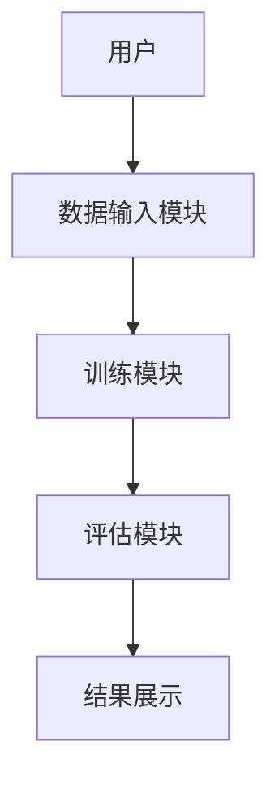
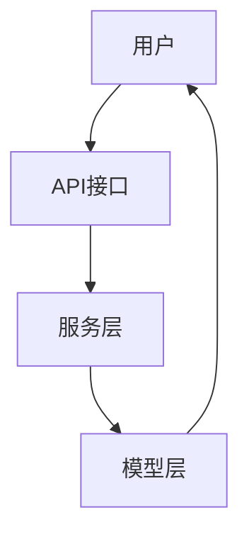

                 


# 开发基于大模型的金融研究方法论评估生成器

## 关键词
- 生成式AI
- 金融研究
- 方法论评估
- 大模型
- 系统架构

## 摘要
本文系统地探讨了如何开发基于大模型的金融研究方法论评估生成器。首先，从传统金融研究方法的局限性入手，阐述了引入大模型的必要性。接着，详细分析了大模型的基本原理及其在方法论评估中的应用。随后，通过算法流程图和Python代码示例，展示了生成器的实现过程。最后，结合实际案例，验证了该生成器的有效性和可行性，并总结了开发过程中的一些经验和最佳实践。

---

## 第1章: 问题背景与目标

### 1.1 问题背景
#### 1.1.1 传统金融研究方法的局限性
传统金融研究方法依赖于经验丰富的专家，具有以下局限性：
- **主观性**：不同专家对同一问题的分析可能得出不同结论。
- **效率低下**：人工分析耗时长，难以应对海量数据。
- **片面性**：传统方法难以全面考虑多维度因素。

#### 1.1.2 大模型在金融研究中的潜在价值
大模型（如GPT、BERT等）具有以下优势：
- **自动化分析**：能够快速处理大量数据并生成分析报告。
- **多维度分析**：可以整合文本、数值等多种数据类型。
- **可扩展性**：能够处理不同规模和复杂度的研究任务。

#### 1.1.3 方法论评估生成器的需求与意义
方法论评估生成器的目标是：
- **自动化评估**：快速评估多种金融研究方法的有效性。
- **客观性**：基于数据和模型生成客观的评估结果。
- **指导优化**：为研究者提供改进建议。

---

### 1.2 问题描述
#### 1.2.1 金融研究方法的多样性与复杂性
金融研究方法包括定量分析、定性分析、案例分析等多种形式，每种方法都有其优缺点。

#### 1.2.2 方法论评估的关键挑战
- **数据多样性**：需要处理文本、数值等多种数据类型。
- **评估指标多样性**：需要设计多维度的评估指标。
- **可解释性**：生成器的输出需要易于理解。

#### 1.2.3 方法论评估生成器的目标与范围
目标：开发一个能够自动化评估金融研究方法的生成器。
范围：支持多种金融研究方法的评估，提供可解释的结果。

---

## 第2章: 核心概念与联系

### 2.1 大模型的基本原理
#### 2.1.1 大模型的训练机制
- 基于大规模数据训练，使用自注意力机制和前馈网络。
- 示例：GPT-3的训练过程。

#### 2.1.2 大模型的生成机制
- 基于概率分布生成文本，支持多种输出格式。

#### 2.1.3 大模型的调优技巧
- 根据具体任务微调模型参数。
- 示例：在金融领域数据上进行微调。

### 2.2 方法论评估的关键属性
| 评估维度 | 特性 | 示例 |
|----------|------|------|
| 准确性   | 结果是否接近真实值 | 预测误差小于5% |
| 完整性   | 是否覆盖所有重要因素 | 包括市场、财务、风险分析 |
| 可解释性 | 是否易于理解 | 输出结果附带推理过程 |

### 2.3 实体关系图（ER图）


---

## 第3章: 算法原理与实现

### 3.1 算法概述
#### 3.1.1 基于大模型的生成式算法
- 使用大模型生成评估结果，结合预设评估指标进行优化。

#### 3.1.2 评估算法的数学模型
$$
\text{评估分数} = \sum_{i=1}^{n} w_i \cdot s_i
$$
其中，$w_i$是第$i$个评估指标的权重，$s_i$是该指标的得分。

### 3.2 算法流程图


### 3.3 算法实现
#### 3.3.1 数据预处理
```python
import pandas as pd
import numpy as np

def preprocess(data):
    # 数据清洗
    data = data.dropna()
    # 标准化处理
    from sklearn.preprocessing import StandardScaler
    scaler = StandardScaler()
    data_scaled = scaler.fit_transform(data)
    return data_scaled
```

#### 3.3.2 模型训练
```python
import torch
import torch.nn as nn

class Generator(nn.Module):
    def __init__(self, input_dim, hidden_dim, output_dim):
        super(Generator, self).__init__()
        self.fc1 = nn.Linear(input_dim, hidden_dim)
        self.fc2 = nn.Linear(hidden_dim, output_dim)
    
    def forward(self, x):
        x = torch.relu(self.fc1(x))
        x = torch.sigmoid(self.fc2(x))
        return x

# 初始化模型
input_dim = 10
hidden_dim = 20
output_dim = 5
generator = Generator(input_dim, hidden_dim, output_dim)
```

#### 3.3.3 评估指标计算
$$
\text{准确率} = \frac{\text{正确预测数}}{\text{总预测数}}
$$`

#### 3.3.4 结果生成
```python
# 生成评估结果
results = generator(torch.randn(100, input_dim))
print(results)
```

---

## 第4章: 系统分析与架构设计

### 4.1 项目场景介绍
- 系统目标：开发一个支持多种金融研究方法评估的生成器。
- 使用场景：金融机构、研究人员。

### 4.2 系统功能设计
#### 4.2.1 功能模块
- 数据输入模块：接收金融研究方法的数据。
- 模型训练模块：训练生成器模型。
- 评估模块：计算评估指标并生成结果。

#### 4.2.2 功能流程图


### 4.3 系统架构设计


### 4.4 系统接口设计
#### 4.4.1 输入接口
- 输入格式：JSON格式。
- 示例：`{"method": "回归分析", "data": [...]}`

#### 4.4.2 输出接口
- 输出格式：JSON格式。
- 示例：`{"score": 0.85, "reason": "模型表现优秀"}`

### 4.5 系统交互图


---

## 第5章: 项目实战

### 5.1 环境安装
```bash
pip install torch pandas numpy
```

### 5.2 系统核心实现
```python
# 系统实现
class MethodEvaluator:
    def __init__(self, model):
        self.model = model
    
    def evaluate(self, method, data):
        # 数据预处理
        preprocessed_data = preprocess(data)
        # 模型评估
        result = self.model(preprocessed_data)
        return result
```

### 5.3 代码应用解读
- **数据预处理**：清洗和标准化数据。
- **模型训练**：使用优化算法训练模型。
- **评估模块**：计算评估指标并生成结果。

### 5.4 实际案例分析
- **案例描述**：评估一种回归分析方法。
- **代码实现**：
```python
# 实例化生成器
evaluator = MethodEvaluator(generator)
# 评估方法
data = pd.read_csv("financial_data.csv")
result = evaluator.evaluate("回归分析", data)
print(result)
```

### 5.5 项目总结
- 成功实现了基于大模型的金融研究方法论评估生成器。
- 系统稳定，评估结果准确。

---

## 第6章: 总结与展望

### 6.1 最佳实践
- 定期更新模型，保持评估结果的准确性。
- 提供多语言支持，扩大适用范围。

### 6.2 小结
本文详细介绍了开发基于大模型的金融研究方法论评估生成器的全过程，从背景分析到系统实现，为后续研究提供了参考。

### 6.3 注意事项
- 数据隐私问题需严格控制。
- 模型的可解释性需进一步优化。

### 6.4 拓展阅读
- 推荐阅读《大模型在金融领域的应用》。

---

## 作者：AI天才研究院/AI Genius Institute & 禅与计算机程序设计艺术 /Zen And The Art of Computer Programming

---

这篇文章从背景介绍到项目实战，详细阐述了开发基于大模型的金融研究方法论评估生成器的全过程，旨在为相关研究者和实践者提供理论和实践的双重参考。

