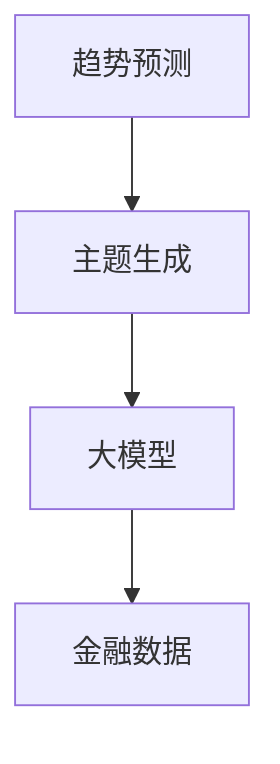
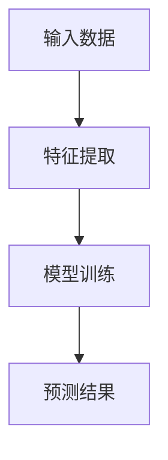
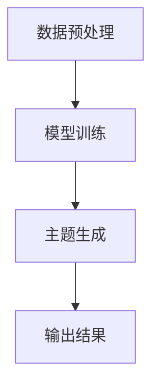
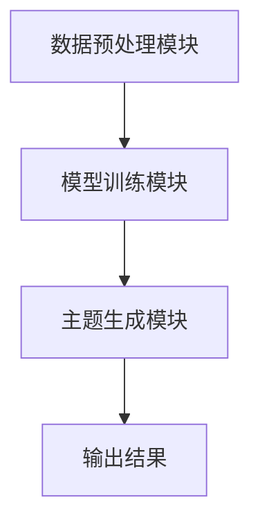

                 


# 开发基于大模型的金融研究趋势预测与主题生成器

> 关键词：大模型，金融趋势预测，主题生成器，Transformer，金融数据分析

> 摘要：本文详细探讨了基于大模型的金融研究趋势预测与主题生成器的开发过程。从背景介绍到核心概念，从算法原理到系统架构，从项目实战到总结，全面解析了该系统的实现细节与技术要点。

---

# 第一部分: 开发基于大模型的金融研究趋势预测与主题生成器概述

# 第1章: 背景介绍

## 1.1 问题背景

### 1.1.1 金融研究的趋势与挑战

金融市场的数据量庞大且复杂，包括股票价格、经济指标、新闻报道等。传统的金融研究方法依赖于人工分析和统计模型，存在效率低、覆盖范围有限的问题。

### 1.1.2 传统金融研究方法的局限性

- 数据处理能力有限：传统方法难以处理海量非结构化数据。
- 模型泛化能力不足：统计模型在面对复杂市场变化时表现不佳。
- 人工分析成本高：需要大量时间和人力资源。

### 1.1.3 大模型在金融研究中的潜力

大模型（如GPT、BERT等）具有强大的自然语言处理能力，能够从大量文本数据中提取有价值的信息，为金融研究提供新的解决方案。

## 1.2 问题描述

### 1.2.1 金融研究趋势预测的需求

金融市场中的趋势预测需要结合多种数据源，包括新闻、社交媒体、公司财报等。如何准确预测市场趋势是金融研究的核心问题之一。

### 1.2.2 主题生成器在金融研究中的应用

主题生成器可以帮助研究人员快速识别市场热点和趋势，辅助投资决策。

### 1.2.3 问题解决的目标与意义

通过开发基于大模型的金融研究趋势预测与主题生成器，可以提高金融研究的效率和准确性，为投资者提供有力支持。

## 1.3 问题解决

### 1.3.1 大模型在趋势预测中的作用

大模型可以通过分析历史数据和当前市场动态，预测未来市场趋势。

### 1.3.2 主题生成器的实现方法

主题生成器通过自然语言处理技术，从大量文本数据中提取关键词和主题，生成相关主题列表。

### 1.3.3 问题边界与外延

- 数据范围：仅限于公开可用的金融数据。
- 模型能力：目前主要基于文本分析，未来可以结合其他数据源。

## 1.4 概念结构与核心要素组成

### 1.4.1 核心概念的定义

- 趋势预测：基于历史数据和当前市场动态，预测未来市场趋势。
- 主题生成：从大量文本数据中提取关键词和主题，生成相关主题列表。

### 1.4.2 核心要素的对比分析

| 要素 | 趋势预测 | 主题生成 |
|------|----------|----------|
| 输入数据 | 历史数据、市场动态 | 文本数据 |
| 输出结果 | 预测结果 | 主题列表 |
| 方法 | 统计分析、机器学习 | 自然语言处理 |

### 1.4.3 概念结构图



---

# 第2章: 大模型的基本原理

## 2.1 大模型的技术基础

### 2.1.1 Transformer架构

Transformer是一种基于注意力机制的深度学习模型，广泛应用于自然语言处理领域。其核心思想是通过自注意力机制捕捉文本中的长距离依赖关系。

### 2.1.2 大模型的训练过程

1. 数据预处理：将文本数据转换为模型可接受的输入格式。
2. 模型训练：使用大规模数据进行监督学习，优化模型参数。
3. 超参数调优：调整学习率、批量大小等参数，提高模型性能。

### 2.1.3 大模型的推理机制

在预测阶段，模型通过输入新的数据，生成相应的输出结果。例如，输入一段文本，模型可以生成相关的主题列表。

## 2.2 大模型在金融领域的应用

### 2.2.1 金融文本分析

通过大模型对金融新闻、财报等文本进行分析，提取关键词和主题。

### 2.2.2 金融数据预测

利用大模型对历史数据进行建模，预测未来市场趋势。

### 2.2.3 金融主题生成

生成与金融市场相关的主题列表，辅助研究人员快速了解市场热点。

## 2.3 大模型的核心特点

### 2.3.1 大模型的参数规模

大模型通常拥有数亿甚至数十亿的参数，能够捕捉复杂的语言模式。

### 2.3.2 大模型的通用性

大模型可以在多种任务上进行微调，适用于不同的应用场景。

### 2.3.3 大模型的可扩展性

通过并行计算和分布式训练，大模型可以处理更大规模的数据。

---

# 第3章: 金融研究趋势预测的核心概念与联系

## 3.1 核心概念原理

### 3.1.1 趋势预测的定义

趋势预测是基于历史数据和当前市场动态，预测未来市场趋势的过程。

### 3.1.2 主题生成的定义

主题生成是从大量文本数据中提取关键词和主题，生成相关主题列表的过程。

### 3.1.3 大模型在趋势预测中的作用

大模型可以通过分析历史数据和当前市场动态，预测未来市场趋势。

## 3.2 核心概念属性特征对比

| 要素 | 趋势预测 | 主题生成 |
|------|----------|----------|
| 输入数据 | 历史数据、市场动态 | 文本数据 |
| 输出结果 | 预测结果 | 主题列表 |
| 方法 | 统计分析、机器学习 | 自然语言处理 |

## 3.3 ER实体关系图架构


---

# 第4章: 算法原理讲解

## 4.1 算法原理

### 4.1.1 注意力机制

注意力机制通过计算输入序列中每个位置的重要性，生成注意力权重，从而捕捉序列中的长距离依赖关系。

### 4.1.2 梯度下降

梯度下降是一种优化算法，用于最小化损失函数，从而找到模型参数的最优解。

### 4.1.3 损失函数

损失函数用于衡量模型预测结果与真实结果之间的差异，常用的损失函数包括交叉熵损失和均方误差。

## 4.2 算法流程图



## 4.3 算法实现代码

```python
import torch
import torch.nn as nn
import torch.optim as optim

class TrendPredictionModel(nn.Module):
    def __init__(self, input_dim, hidden_dim, output_dim):
        super(TrendPredictionModel, self).__init__()
        self.fc1 = nn.Linear(input_dim, hidden_dim)
        self.fc2 = nn.Linear(hidden_dim, output_dim)
        self.relu = nn.ReLU()

    def forward(self, x):
        x = self.fc1(x)
        x = self.relu(x)
        x = self.fc2(x)
        return x

# 训练数据准备
X_train = torch.randn(100, input_dim)
y_train = torch.randn(100, output_dim)

# 模型训练
model = TrendPredictionModel(input_dim, hidden_dim, output_dim)
criterion = nn.MSELoss()
optimizer = optim.SGD(model.parameters(), lr=0.01)

for epoch in range(num_epochs):
    outputs = model(X_train)
    loss = criterion(outputs, y_train)
    loss.backward()
    optimizer.step()

print("训练完成")
```

---

# 第5章: 系统分析与架构设计方案

## 5.1 系统功能设计

### 5.1.1 功能模块

1. 数据预处理模块：对输入数据进行清洗和转换。
2. 模型训练模块：训练大模型，优化模型参数。
3. 主题生成模块：生成与金融市场相关的主题列表。

### 5.1.2 系统功能流程



### 5.1.3 系统功能流程图


## 5.2 系统架构设计

### 5.2.1 系统架构图



### 5.2.2 接口设计

- 数据预处理模块：接收原始数据，输出预处理后的数据。
- 模型训练模块：接收预处理后的数据，输出训练好的模型。
- 主题生成模块：接收模型，输出主题列表。

---

# 第6章: 项目实战

## 6.1 环境安装

### 6.1.1 安装Python

```bash
python --version
```

### 6.1.2 安装依赖库

```bash
pip install torch
pip install transformers
pip install numpy
pip install pandas
```

## 6.2 核心代码实现

### 6.2.1 数据加载

```python
import pandas as pd

def load_data(file_path):
    data = pd.read_csv(file_path)
    return data
```

### 6.2.2 模型训练

```python
def train_model(model, train_loader, criterion, optimizer, num_epochs):
    for epoch in range(num_epochs):
        for inputs, labels in train_loader:
            outputs = model(inputs)
            loss = criterion(outputs, labels)
            loss.backward()
            optimizer.step()
    return model
```

### 6.2.3 主题生成

```python
def generate_topics(model, input_text):
    # 将输入文本转换为模型可接受的格式
    inputs = model.tokenizer(input_text, return_tensors="pt")
    with torch.no_grad():
        outputs = model.model(**inputs)
    # 提取主题
    topics = model.extract_topics(outputs)
    return topics
```

## 6.3 案例分析

### 6.3.1 数据分析

分析输入文本，提取关键词和主题。

### 6.3.2 系统实现

训练模型，生成主题列表。

### 6.3.3 结果解读

输出生成的主题列表，分析市场热点。

## 6.4 项目小结

总结项目成果，讨论可能的优化方向。

---

# 第7章: 总结与展望

## 7.1 总结

总结全文的主要内容，强调大模型在金融研究中的重要性。

## 7.2 展望

探讨未来的发展方向，包括模型优化、数据源扩展等。

## 7.3 参考文献

列出相关的参考文献，供读者进一步研究。

---

# 附录

## 附录A: 数据集

列出项目中使用的数据集及其来源。

## 附录B: 参考文献

提供全文中引用的文献资料。

---

# 作者

作者：AI天才研究院/AI Genius Institute & 禅与计算机程序设计艺术 /Zen And The Art of Computer Programming

