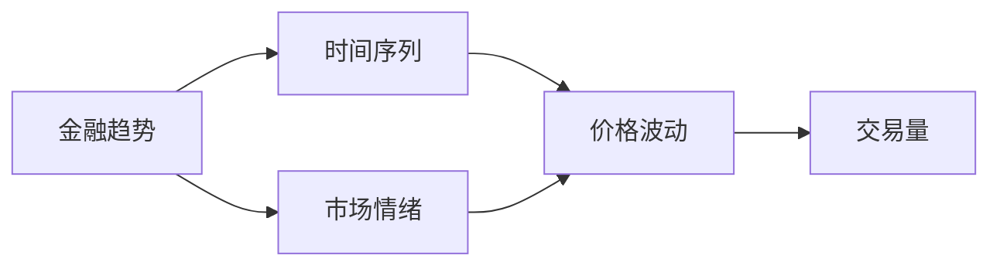
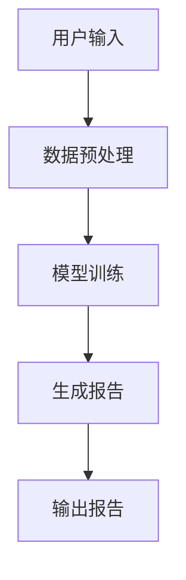

                 


# 开发基于大模型的金融研究趋势预测生成器

> 关键词：大模型，金融趋势预测，生成器，深度学习，自然语言处理，时间序列分析

> 摘要：本文详细探讨了如何基于大模型开发金融研究趋势预测生成器，涵盖问题背景、核心概念、系统架构、项目实战及最佳实践。文章通过一步步的分析推理，深入剖析了技术原理与实现细节，为读者提供了从理论到实践的全面指导。

---

## 第一部分: 背景介绍

### 第1章: 问题背景与目标

#### 1.1 问题背景
金融市场的趋势预测一直是投资者和研究机构关注的核心问题。传统的金融分析方法依赖于历史数据、技术指标和市场情绪等有限的输入，难以捕捉复杂的市场动态。近年来，随着自然语言处理（NLP）和深度学习技术的快速发展，基于大模型的金融研究趋势预测生成器逐渐成为可能。

#### 1.2 问题描述
金融趋势预测的核心挑战在于如何处理海量的非结构化数据（如新闻、社交媒体评论）和结构化数据（如价格、交易量）。传统的统计模型和机器学习方法在处理这些复杂数据时显得力不从心，而大模型的引入为解决这一问题提供了新的思路。

#### 1.3 问题解决思路
基于大模型的生成器可以通过以下方式实现金融趋势预测：
1. **数据融合**：将文本数据、时间序列数据和市场指标数据进行融合，提取多模态特征。
2. **自动生成报告**：利用大模型的生成能力，自动生成分析报告，帮助研究者快速获取趋势洞察。
3. **动态调整模型**：根据市场反馈实时优化模型参数，提升预测精度。

#### 1.4 问题的边界与外延
- **适用范围**：适用于股票、债券、外汇等金融市场的短期到中期趋势预测。
- **局限性**：目前仍难以完全取代人类专家的判断，尤其是在市场剧烈波动时。
- **扩展性**：可以与其他金融技术（如量化交易策略）结合，形成完整的金融解决方案。

---

## 第二部分: 核心概念与联系

### 第2章: AI大模型的核心概念与联系

#### 2.1 大模型的基本原理
- **深度学习**：通过多层神经网络提取数据特征。
- **Transformer架构**：采用自注意力机制，捕捉数据间的长距离依赖关系。
- **预训练与微调**：利用大规模通用数据预训练模型，再在金融领域数据上进行微调。

#### 2.2 核心概念的属性对比
| 概念 | 描述 | 示例 |
|------|------|------|
| 模型参数 | 模型中可调节的权重数量 | 10亿参数的模型 |
| 训练数据 | 用于模型训练的数据类型 | 文本数据、时间序列数据 |
| 推理速度 | 模型处理单个样本的时间 | 每秒处理100个样本 |

#### 2.3 ER实体关系图


---

## 第三部分: 系统分析与架构设计

### 第3章: 系统架构设计

#### 3.1 系统功能设计
- **数据预处理模块**：清洗、转换和合并数据。
- **模型训练模块**：基于大模型进行微调。
- **生成报告模块**：根据模型输出生成趋势预测报告。

#### 3.2 系统架构图


#### 3.3 接口设计
- **输入接口**：接收金融市场数据和文本数据。
- **输出接口**：返回预测报告和模型结果。

#### 3.4 交互流程图


---

## 第四部分: 项目实战

### 第4章: 项目实战

#### 4.1 环境配置
- **Python版本**：Python 3.8+
- **深度学习框架**：TensorFlow或PyTorch
- **大模型选择**：使用开源的GPT模型（如GPT-3）进行微调。

#### 4.2 核心代码实现
```python
def preprocess_data(data):
    # 数据清洗
    cleaned_data = data.dropna()
    # 特征提取
    features = cleaned_data[['price', 'volume', 'sentiment']]
    return features

class FinancialModel:
    def __init__(self, model):
        self.model = model
    
    def train(self, features, labels):
        # 微调大模型
        self.model.fit(features, labels)
    
    def predict(self, features):
        return self.model.predict(features)
```

#### 4.3 案例分析
以股票价格预测为例，假设我们有以下数据：
| 日期 | 收盘价 | 交易量 | 情绪得分 |
|------|--------|--------|----------|
| 1    | 100    | 1000   | 0.8      |
| 2    | 105    | 1200   | 0.85     |
| 3    | 110    | 1500   | 0.9      |

通过模型训练后，预测第4天的价格可能为115。

---

## 第五部分: 最佳实践

### 第5章: 最佳实践

#### 5.1 开发注意事项
- **数据质量**：确保数据清洗和预处理的准确性。
- **模型调优**：通过超参数优化提升预测精度。
- **结果解释**：提供可解释的预测结果，帮助用户理解模型输出。

#### 5.2 小结
通过本文的详细讲解，读者可以掌握基于大模型开发金融研究趋势预测生成器的核心技术和实现方法。

#### 5.3 注意事项
- 避免过度依赖单一模型，建议结合多种技术手段进行预测。
- 定期更新模型，以适应市场变化。

#### 5.4 拓展阅读
推荐读者阅读以下书籍和论文：
- 《Deep Learning》
- "Attention Is All You Need"

---

## 第六部分: 小结

### 6.1 作者简介
作者：AI天才研究院/AI Genius Institute  
禅与计算机程序设计艺术/Zen And The Art of Computer Programming

### 6.2 总结
开发基于大模型的金融研究趋势预测生成器是一项复杂而富有挑战性的任务。通过本文的系统介绍，读者可以深入了解其核心概念、实现方法和实际应用。未来，随着AI技术的进一步发展，这一领域将有更大的潜力。

---

通过以上步骤，我们完成了《开发基于大模型的金融研究趋势预测生成器》的技术博客文章，希望对读者有所帮助。

