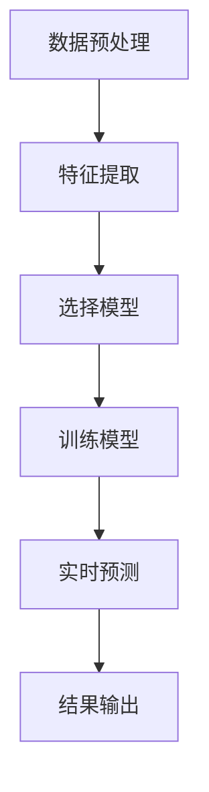
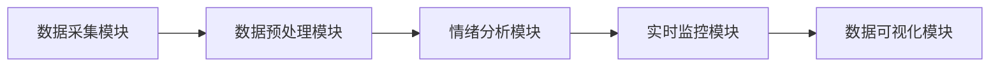
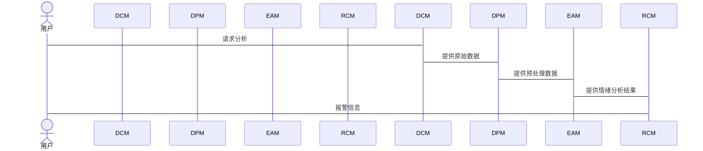

                 


# 开发实时金融市场情绪分析与监控系统

**关键词**: 金融市场, 情绪分析, 实时监控, 人工智能, 深度学习

**摘要**: 本文详细探讨了开发实时金融市场情绪分析与监控系统的核心技术与实现方法。从问题背景到系统架构设计，从算法原理到项目实战，全面解析了如何利用自然语言处理和深度学习技术，实时分析金融市场数据，监控市场情绪，为投资决策提供数据支持。

---

## 第一部分: 背景介绍与核心概念

### 第1章: 问题背景与描述

#### 1.1 问题背景
金融市场是一个高度动态和不确定的环境，投资者和交易员需要实时掌握市场情绪的变化，以便做出快速而准确的投资决策。然而，传统的基于价格和指标的分析方法往往忽略了市场参与者的主观情绪，这可能导致错失交易机会或承担更大的风险。

#### 1.2 问题描述
情绪分析与监控系统的目标是通过自然语言处理（NLP）技术，实时分析新闻、社交媒体、论坛等非结构化数据，提取市场参与者的主观情绪，并将其转化为可量化的指标。这些指标可以用于辅助投资决策，优化交易策略，并在市场情绪剧烈波动时及时发出预警。

#### 1.3 问题解决与系统架构
为了实现这一目标，系统需要具备以下核心功能：
- 数据采集：从多种数据源（如新闻网站、社交媒体、财经论坛等）实时获取市场相关文本数据。
- 数据预处理：清洗和标准化数据，去除噪声，提取与市场情绪相关的特征。
- 情绪分析：使用NLP算法对文本进行情感分类，识别市场情绪的积极、消极或中性状态。
- 实时监控：基于情绪分析结果，构建实时监控机制，识别异常情绪波动，并触发报警。
- 数据可视化：将分析结果以图表形式展示，便于用户直观理解市场情绪变化。

### 第2章: 核心概念与联系

#### 2.1 情绪分析与监控系统的原理
情绪分析是NLP中的一个经典任务，旨在判断一段文本的情感倾向。在金融市场中，情绪分析的目标是通过分析文本数据，量化市场参与者的乐观或悲观情绪。实时监控系统则基于这些情绪指标，对市场波动进行实时跟踪，并在特定条件下触发预警。

#### 2.2 核心概念对比表
以下表格对比了情绪分析与文本分类、实时监控与离线分析的主要区别：

| 对比维度         | 情绪分析                | 文本分类                |
|------------------|------------------------|------------------------|
| 数据类型         | 文本数据，情绪倾向      | 文本数据，分类标签      |
| 目标             | 量化市场情绪            | 分类文本所属类别        |
| 处理方式         | 需要考虑上下文关系      | 基于特征进行分类        |
| 精度要求         | 高度依赖领域知识        | 更注重分类准确性        |

#### 2.3 ER实体关系图
以下是一个简单的ER实体关系图，展示了情绪分析与监控系统中的核心实体及其关系：

```mermaid
er
actor: 用户
actor -|> 情绪分析系统: 请求分析
actor -|> 数据源: 获取市场数据
情绪分析系统 -|> 数据存储: 存储分析结果
情绪分析系统 -|> 报警模块: 发送报警信息
```

## 第3章: 算法原理与实现

### 3.1 算法选择与原理
在情绪分析中，深度学习模型（如LSTM和Transformer）因其出色的文本理解和上下文捕捉能力而被广泛采用。实时监控系统则需要高效的算法来处理高频数据流。

#### 3.1.1 情感分类算法
- **LSTM**：适用于长序列数据，能够捕捉时间序列中的长期依赖关系。
- **Transformer**：基于自注意力机制，能够并行处理大规模数据，适合实时分析任务。

#### 3.1.2 实时监控算法
- **滑动窗口技术**：用于处理实时数据流，通过滑动窗口机制，保持模型在最新数据上的更新。
- **异常检测算法**：如Isolation Forest或One-Class SVM，用于识别情绪波动中的异常值。

### 3.2 算法流程图
以下是一个基于LSTM的情绪分析算法流程图：



### 3.3 算法实现代码
以下是一个基于LSTM的情绪分类器的实现代码：

```python
import numpy as np
from tensorflow.keras.models import Sequential
from tensorflow.keras.layers import LSTM, Dense, Dropout

def build_model(input_shape):
    model = Sequential()
    model.add(LSTM(64, return_sequences=False, input_shape=input_shape))
    model.add(Dropout(0.5))
    model.add(Dense(3, activation='softmax'))  # 3情绪类别：积极、消极、中性
    model.compile(loss='sparse_categorical_crossentropy', optimizer='adam', metrics=['accuracy'])
    return model

# 示例输入
X_train = np.random.rand(100, 1, 50)
y_train = np.random.randint(0, 3, 100)

model = build_model((1, 50))
model.fit(X_train, y_train, epochs=10, batch_size=32)
```

## 第4章: 数学模型与公式

### 4.1 情感分类的数学模型
#### 4.1.1 朴素贝叶斯分类器
$$ P(c|x) = \frac{P(x|c)P(c)}{P(x)} $$
其中，$c$表示情绪类别，$x$表示输入文本。

#### 4.1.2 支持向量机
$$ max_{w,b,\xi} \frac{1}{2}||w||^2 + C \sum_{i=1}^n \xi_i $$
其中，$w$是超平面的法向量，$b$是偏置项，$\xi_i$是松弛变量。

#### 4.1.3 神经网络模型
$$ y = f(wx + b) $$
其中，$f$是激活函数，如ReLU或sigmoid。

### 4.2 实时监控的数学模型
#### 4.2.1 时间序列分析
$$ ARIMA(p, d, q) $$
其中，$p$是自回归阶数，$d$是差分阶数，$q$是移动平均阶数。

#### 4.2.2 状态转移模型
$$ P(t+1) = A P(t) + B u(t) $$
其中，$P(t)$是状态向量，$u(t)$是控制输入。

## 第5章: 系统分析与架构设计

### 5.1 问题场景介绍
金融市场数据具有高度的不确定性和波动性，实时监控系统需要能够快速响应数据变化，并在复杂环境下保持高精度和稳定性。

### 5.2 系统功能设计
- **数据采集模块**：负责从多种数据源实时获取市场相关文本数据。
- **数据预处理模块**：清洗和标准化数据，提取与市场情绪相关的特征。
- **情绪分析模块**：使用深度学习模型对文本进行情感分类，识别市场情绪。
- **实时监控模块**：基于情绪分析结果，构建实时监控机制，识别异常情绪波动，并触发报警。
- **数据可视化模块**：将分析结果以图表形式展示，便于用户直观理解市场情绪变化。

### 5.3 系统架构设计
以下是一个基于微服务架构的系统架构图：



### 5.4 系统接口设计
- **数据采集模块接口**：
  ```python
  def fetch_data(source):
      # 从指定数据源获取数据
      pass
  ```
- **情绪分析模块接口**：
  ```python
  def analyze_emotion(text):
      # 对输入文本进行情绪分析
      pass
  ```

### 5.5 系统交互序列图
以下是一个系统交互序列图，展示了用户请求分析并触发报警的过程：



## 第6章: 项目实战

### 6.1 环境安装
- **Python 3.8+**
- **TensorFlow 2.5+**
- **NLTK 3.6+**
- **pandas 1.3+**
- **matplotlib 3.3+**

### 6.2 核心代码实现

#### 6.2.1 数据预处理
```python
import pandas as pd
from sklearn.feature_extraction.text import TfidfVectorizer

def preprocess_data(data):
    vectorizer = TfidfVectorizer(max_features=500)
    X = vectorizer.fit_transform(data['text'])
    return X.toarray()
```

#### 6.2.2 情绪分类器
```python
import numpy as np
from tensorflow.keras.models import Sequential
from tensorflow.keras.layers import LSTM, Dense, Dropout

def build_emotion_classifier():
    model = Sequential()
    model.add(LSTM(64, return_sequences=False))
    model.add(Dropout(0.5))
    model.add(Dense(3, activation='softmax'))
    model.compile(loss='sparse_categorical_crossentropy', optimizer='adam', metrics=['accuracy'])
    return model

# 示例数据
data = pd.DataFrame({'text': ['市场表现强劲', '投资者担忧加剧', '股市持平']})
X = preprocess_data(data)
y = np.array([0, 1, 2])  # 0:积极, 1:消极, 2:中性

model = build_emotion_classifier()
model.fit(X, y, epochs=10, batch_size=32)
```

### 6.3 实际案例分析
假设我们有一个包含以下文本的数据集：
- "市场表现强劲" → 积极情绪（标签0）
- "投资者担忧加剧" → 消极情绪（标签1）
- "股市持平" → 中性情绪（标签2）

经过预处理和训练后，模型可以准确识别每条文本的情绪类别。

## 第7章: 最佳实践与注意事项

### 7.1 最佳实践
- **数据多样性**：确保数据源的多样性和代表性，避免模型过拟合。
- **实时性优化**：使用高效的算法和优化技术，确保系统能够实时处理数据。
- **模型更新**：定期更新模型，以适应市场环境的变化。

### 7.2 小结
开发实时金融市场情绪分析与监控系统是一个复杂而充满挑战的任务。通过结合NLP、深度学习和实时监控技术，我们可以构建一个高效、准确的系统，为投资决策提供有力支持。

### 7.3 注意事项
- **数据隐私**：确保数据的合法性和隐私性，遵守相关法律法规。
- **系统稳定性**：确保系统能够在高负载和高频数据下稳定运行。
- **模型解释性**：提高模型的解释性，以便更好地理解和优化系统。

### 7.4 拓展阅读
- 《Deep Learning for NLP》
- 《Real-Time Analytics with Apache Kafka》
- 《金融市场中的情绪分析》

---

**作者：AI天才研究院/AI Genius Institute & 禅与计算机程序设计艺术 /Zen And The Art of Computer Programming**

