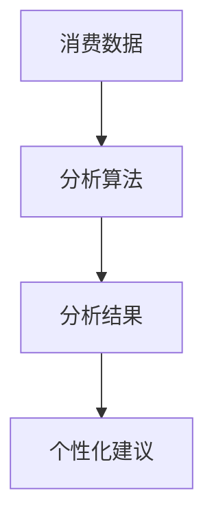
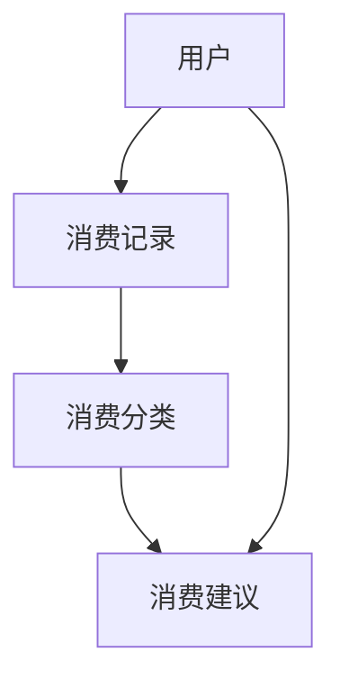
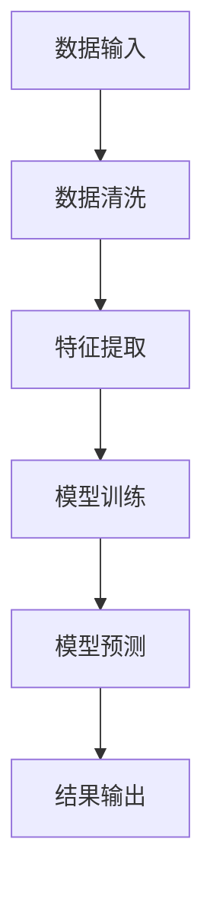
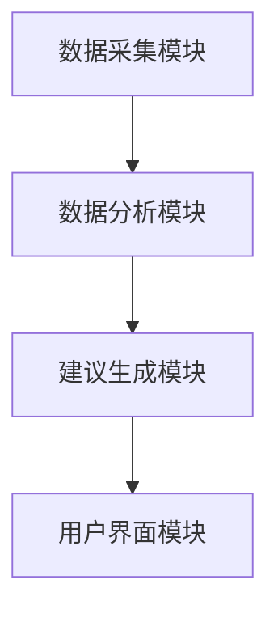
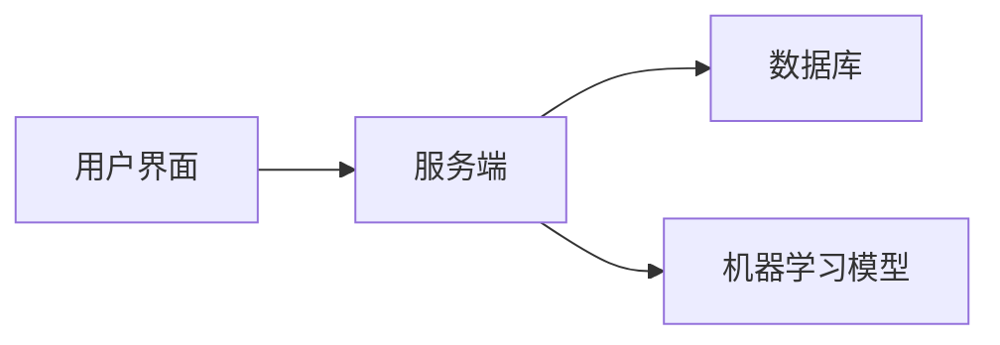
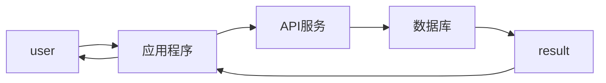

                 


# 开发智能化的个人消费习惯改善建议工具

## 关键词：个人消费习惯、人工智能、数据驱动、机器学习、系统架构

## 摘要：本文详细介绍了开发一个智能化的个人消费习惯改善建议工具的过程，从背景分析、核心概念到算法实现、系统架构设计，再到项目实战和最佳实践，全面阐述了如何利用数据驱动和人工智能技术帮助个人改善消费习惯。

---

# 第1章: 背景介绍

## 1.1 问题背景

### 1.1.1 当代个人消费习惯的问题
现代人面临着多种消费问题，如冲动消费、超前消费和不理性消费，这些问题严重影响了个人的财务健康和生活质量。

### 1.1.2 消费习惯对个人财务健康的影响
消费习惯不佳可能导致债务积累、储蓄不足以及财务危机，进而影响个人的长期财务规划。

### 1.1.3 智能化工具在消费习惯改善中的作用
通过智能化工具，个人可以实时监控消费行为，分析消费数据，并获得个性化的改善建议，从而实现科学的财务管理。

## 1.2 问题描述

### 1.2.1 个人消费习惯的常见问题
- 冲动消费：购买不必要的物品。
- 超前消费：超出收入范围的消费。
- 缺乏规划：没有明确的消费目标和预算。

### 1.2.2 消费数据的碎片化与不透明性
消费数据分散在不同平台，缺乏统一的管理工具，难以进行有效的分析和总结。

### 1.2.3 现有解决方案的不足
现有的财务管理工具多为简单的记账功能，缺乏智能化的分析和个性化建议。

## 1.3 问题解决思路

### 1.3.1 数据驱动的改善方法
通过收集和分析消费数据，识别不良消费习惯，制定改善计划。

### 1.3.2 人工智能在消费习惯分析中的应用
利用机器学习算法，分析消费数据，预测潜在的消费问题，并提供个性化的改善建议。

### 1.3.3 工具化解决方案的设计理念
开发一个智能化的消费习惯改善工具，集成数据采集、分析和建议生成功能，帮助用户实现科学的消费管理。

## 1.4 问题的边界与外延

### 1.4.1 工具适用的场景范围
- 个人财务管理：帮助用户监控和管理日常消费。
- 消费习惯分析：识别不良消费行为，提供改善建议。
- 预算制定与执行：根据消费数据，制定合理的预算计划。

### 1.4.2 边界条件与限制
- 工具仅适用于个人消费数据的分析，不涉及企业或团体消费。
- 数据分析基于历史消费记录，不能预测未来的所有消费行为。

### 1.4.3 外延与扩展的可能性
- 集成更多数据源：支持更多平台的消费数据导入。
- 引入更多分析模型：如时间序列分析、聚类分析等，提高分析的准确性。
- 实现实时监控：实时跟踪消费行为，提供即时反馈。

## 1.5 概念结构与核心要素

### 1.5.1 核心概念的组成
- **消费数据采集**：从各种消费渠道获取消费记录。
- **消费行为分析**：通过数据挖掘和机器学习技术，分析消费行为。
- **个性化建议生成**：根据分析结果，生成个性化的改善建议。

### 1.5.2 关键要素的定义与关系
- **消费数据**：包括消费金额、时间、地点、商品类别等信息。
- **分析算法**：用于识别消费模式和趋势。
- **建议生成机制**：根据分析结果，制定改善计划。

### 1.5.3 概念结构图


---

# 第2章: 核心概念与系统架构

## 2.1 核心概念原理

### 2.1.1 数据采集与处理
消费数据的采集和处理是工具运行的基础，需要确保数据的完整性和准确性。

### 2.1.2 消费行为分析算法
利用机器学习算法，分析消费数据，识别不良消费习惯。

### 2.1.3 个性化建议生成机制
根据分析结果，生成个性化的消费改善建议，帮助用户调整消费行为。

## 2.2 概念属性对比

### 2.2.1 数据类型与处理方式对比
| 数据类型 | 处理方式 |
|----------|----------|
| 消费金额 | 数据清洗、特征提取 |
| 消费时间 | 数据归一化、时间序列分析 |
| 消费地点 | 地理位置分析 |

### 2.2.2 算法特征与应用场景对比
| 算法类型 | 应用场景 |
|----------|----------|
| 决策树 | 分类消费行为 |
| 聚类分析 | 发现消费模式 |
| 回归分析 | 预测消费趋势 |

### 2.2.3 建议生成策略对比
| 消耗类型 | 策略 |
|----------|------|
| 冲动消费 | 提供购物黑名单建议 |
| 超前消费 | 调整预算计划 |
| 缺乏规划 | 提供消费计划模板 |

## 2.3 ER实体关系图


---

# 第3章: 基于机器学习的消费习惯分析算法

## 3.1 算法原理

### 3.1.1 数据预处理与特征提取
消费数据需要进行清洗、归一化和特征提取，以便后续分析。

### 3.1.2 算法选择与实现
选择合适的机器学习算法，如决策树、随机森林等，进行消费行为分类。

### 3.1.3 模型训练与优化
通过训练数据优化模型参数，提高分类准确率。

## 3.2 算法流程图


## 3.3 算法实现代码

### 数据清洗示例
```python
import pandas as pd

# 加载数据
data = pd.read_csv('consumption.csv')

# 删除缺失值
data = data.dropna()

# 去重
data = data.drop_duplicates()
```

### 特征提取示例
```python
from sklearn.preprocessing import StandardScaler

# 标准化处理
scaler = StandardScaler()
features = scaler.fit_transform(data[['amount', 'time', 'location']])
```

---

# 第4章: 系统分析与架构设计方案

## 4.1 系统场景介绍
工具的主要场景是帮助用户监控和管理个人消费行为，提供个性化的改善建议。

## 4.2 系统功能设计

### 系统功能模块


## 4.3 系统架构设计


## 4.4 系统接口设计
### 数据接口
```python
class DataInterface:
    def get_consumption_data(self):
        pass
```

### 建议生成接口
```python
class SuggestionInterface:
    def generate_suggestions(self):
        pass
```

## 4.5 系统交互设计


---

# 第5章: 项目实战

## 5.1 环境安装
### 安装Python和相关库
```bash
pip install python
pip install pandas
pip install scikit-learn
```

## 5.2 核心实现

### 数据处理代码
```python
import pandas as pd
from sklearn.tree import DecisionTreeClassifier

# 加载数据
data = pd.read_csv('consumption.csv')

# 特征工程
X = data[['amount', 'time', 'location']]
y = data['category']

# 训练模型
model = DecisionTreeClassifier()
model.fit(X, y)
```

### 模型预测
```python
# 预测消费类别
new_data = [[1000, 10, '超市']]
predicted = model.predict(new_data)
print(predicted)
```

## 5.3 案例分析
### 示例数据
| amount | time | location | category |
|--------|------|----------|----------|
| 500    | 10   | 超市      | 必需品    |
| 300    | 5    | 餐厅      | 餐饮      |

### 分析结果
模型预测用户在超市消费500元，分类为必需品。

---

# 第6章: 最佳实践与小结

## 6.1 小结
本文详细介绍了开发智能化的个人消费习惯改善建议工具的过程，从背景分析到系统设计，再到项目实现，全面阐述了工具的核心功能和技术实现。

## 6.2 注意事项
- 数据隐私保护：确保用户数据的安全性和隐私性。
- 模型可解释性：确保模型结果的可解释性，方便用户理解建议的依据。

## 6.3 拓展阅读
- 《Python机器学习实战》
- 《数据驱动的决策》

---

# 附录

## 工具安装包
```bash
pip install pandas scikit-learn
```

## 参考文献
1. 周志华. 《机器学习》
2. 李航. 《统计学习题》

---

# 作者
作者：AI天才研究院/AI Genius Institute  
作者：禅与计算机程序设计艺术/Zen And The Art of Computer Programming

