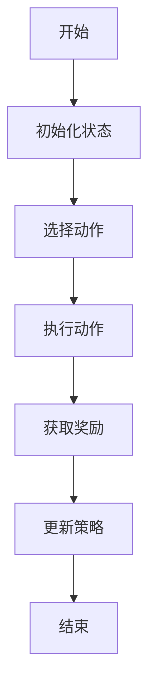
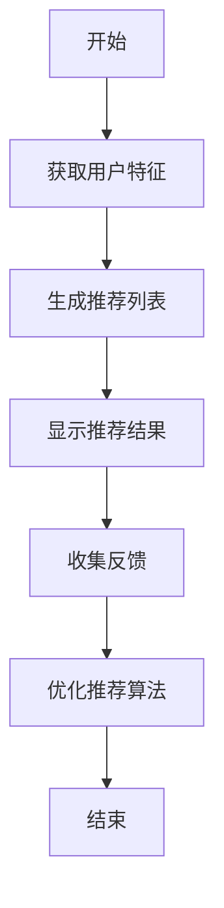
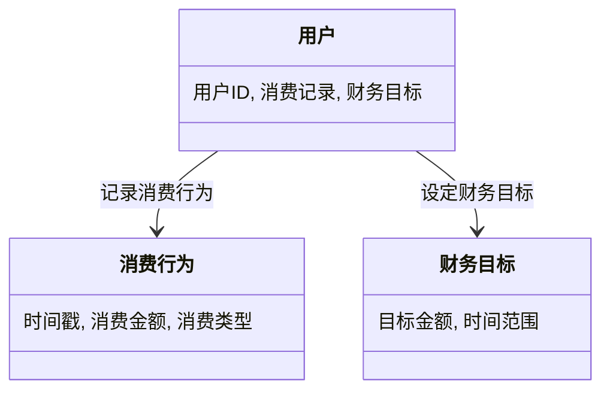
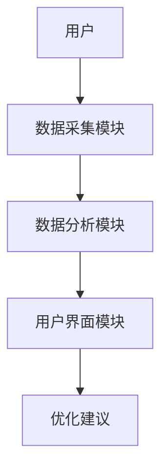
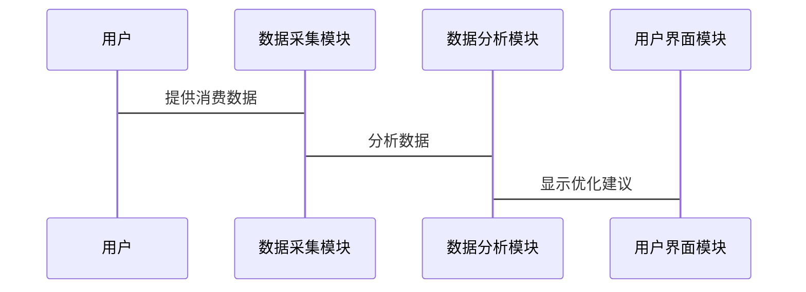

                 


# 开发智能化的个人消费行为优化与财务目标对齐工具

## 关键词：智能化，消费行为优化，财务目标对齐，人工智能算法，机器学习，系统架构

## 摘要：  
随着人工智能技术的飞速发展，个人消费行为优化和财务目标对齐的重要性日益凸显。本文旨在探讨如何利用智能化工具帮助个人实现消费行为的优化，并确保其与财务目标保持一致。文章从问题背景出发，详细介绍了消费行为优化与财务目标对齐的核心概念，分析了相关的算法原理和数学模型，并通过系统架构设计和项目实战展示了如何将理论应用于实践。最后，文章总结了最佳实践经验和未来发展方向，为读者提供了一套完整的解决方案。

---

# 第一部分：背景介绍

## 第1章：背景介绍

### 1.1 问题背景与描述

#### 1.1.1 个人消费行为的复杂性
个人消费行为受到多种因素的影响，包括收入水平、消费习惯、市场环境和个人偏好等。这些因素的综合作用使得消费行为的优化变得复杂。

#### 1.1.2 财务目标对齐的重要性
财务目标是指个人在一定时间内希望实现的财务状况，如储蓄目标、投资目标等。消费行为与财务目标之间的对齐是实现财务健康的关键。

#### 1.1.3 当前消费与财务规划的痛点
当前，许多人缺乏科学的消费规划，导致财务状况不稳定。例如，过度消费可能导致债务积累，而消费不足则可能错失投资机会。

### 1.2 核心概念与问题解决

#### 1.2.1 消费行为优化的定义
消费行为优化是指通过调整消费习惯和选择，使得消费支出与个人财务目标一致，同时最大化个人效用。

#### 1.2.2 财务目标对齐的实现路径
财务目标对齐需要通过消费行为优化、投资规划和风险管理等多方面努力，以确保消费支出与财务目标一致。

#### 1.2.3 问题解决的核心思路
通过人工智能技术，分析个人的消费数据和财务目标，制定个性化的消费优化方案，帮助用户实现财务目标对齐。

### 1.3 概念结构与核心要素

#### 1.3.1 核心概念属性对比表
| 核心概念 | 消费行为优化 | 财务目标对齐 |
|----------|--------------|--------------|
| 目标     | 减少浪费，提高效用 | 实现财务健康 |
| 方法     | 强化学习，推荐系统 | 投资规划，风险管理 |
| 输入     | 消费数据 | 财务目标 |
| 输出     | 优化建议 | 对齐方案 |

#### 1.3.2 ER实体关系图
```mermaid
erDiagram
    user {
        <属性：用户ID, 消费记录, 财务目标>
    }
   消费行为 {
        <属性：时间戳, 消费金额, 消费类型>
    }
    财务目标 {
        <属性：目标金额, 时间范围>
    }
    user --> 消费行为 : 记录消费行为
    user --> 财务目标 : 设定财务目标
```

---

# 第二部分：核心概念与联系

## 第2章：核心概念与联系

### 2.1 核心概念原理

#### 2.1.1 消费行为优化的数学模型
消费行为优化的数学模型可以通过强化学习算法来实现。模型的目标是最小化消费偏差，同时最大化效用函数。

#### 2.1.2 财务目标对齐的算法原理
财务目标对齐可以通过推荐系统算法来实现。系统根据用户的消费数据和财务目标，推荐最优的消费方案。

### 2.2 概念属性对比

#### 2.2.1 消费行为与财务目标的对比分析
| 对比维度 | 消费行为优化 | 财务目标对齐 |
|----------|--------------|--------------|
| 输入     | 消费数据 | 财务目标 |
| 输出     | 优化建议 | 对齐方案 |
| 目标     | 提高效用 | 实现财务健康 |

#### 2.2.2 模型与算法的对比
| 对比维度 | 强化学习 | 推荐系统 |
|----------|---------|----------|
| 输入     | 状态空间 | 用户行为 |
| 输出     | 行动策略 | 推荐结果 |
| 应用场景 | 消费决策 | 财务规划 |

### 2.3 ER实体关系图

```mermaid
erDiagram
    user {
        <属性：用户ID, 消费记录, 财务目标>
    }
    消费行为 {
        <属性：时间戳, 消费金额, 消费类型>
    }
    财务目标 {
        <属性：目标金额, 时间范围>
    }
    user --> 消费行为 : 记录消费行为
    user --> 财务目标 : 设定财务目标
```

---

# 第三部分：算法原理讲解

## 第3章：算法原理讲解

### 3.1 强化学习算法

#### 3.1.1 算法流程图



#### 3.1.2 Python源代码实现

```python
import numpy as np

class强化学习算法:
    def __init__(self, 状态空间, 动作空间):
        self.状态空间 = 状态空间
        self.动作空间 = 动作空间
        self.奖励函数 = self.定义奖励函数()

    def 定义奖励函数(self):
        # 返回奖励值
        pass

    def 选择动作(self, 当前状态):
        # 根据策略选择动作
        pass

    def 执行动作(self, 当前状态, 选择的动作):
        # 执行动作并返回新状态
        pass

    def 更新策略(self, 当前状态, 选择的动作, 奖励):
        # 更新策略参数
        pass
```

### 3.2 推荐系统算法

#### 3.2.1 算法流程图



#### 3.2.2 Python源代码实现

```python
import numpy as np

class推荐系统算法:
    def __init__(self, 用户特征, 数据集):
        self.用户特征 = 用户特征
        self.数据集 = 数据集
        self.相似度计算方法 = self.定义相似度计算方法()

    def 定义相似度计算方法(self):
        # 返回相似度值
        pass

    def 生成推荐列表(self, 用户ID):
        # 根据相似度生成推荐列表
        pass

    def 收集反馈(self, 用户ID, 反馈):
        # 更新推荐算法
        pass
```

---

## 第4章：数学模型与公式

### 4.1 消费行为优化模型

#### 4.1.1 数学模型
消费行为优化模型可以通过强化学习算法中的Q-learning模型来实现：

$$ Q(s, a) = Q(s, a) + \alpha [r + \gamma \max Q(s', a') - Q(s, a)] $$

其中：
- \( Q(s, a) \) 表示状态 \( s \) 下采取动作 \( a \) 的价值。
- \( \alpha \) 表示学习率。
- \( r \) 表示奖励值。
- \( \gamma \) 表示折扣因子。

### 4.2 财务目标对齐模型

#### 4.2.1 数学模型
财务目标对齐模型可以通过推荐系统算法中的协同过滤模型来实现：

$$ \hat{r}_{u,i} = \bar{r} + \sum_{k=1}^K \alpha_k (r_{u,k} - \bar{r}_k) $$

其中：
- \( \hat{r}_{u,i} \) 表示用户 \( u \) 对物品 \( i \) 的预测评分。
- \( \bar{r} \) 表示全局平均评分。
- \( \alpha_k \) 表示第 \( k \) 个特征的重要性。
- \( r_{u,k} \) 表示用户 \( u \) 在第 \( k \) 个特征上的评分。
- \( \bar{r}_k \) 表示第 \( k \) 个特征的平均评分。

---

## 第5章：系统分析与架构设计

### 5.1 问题场景介绍

#### 5.1.1 用户需求分析
用户希望通过智能化工具优化消费行为，并确保消费支出与财务目标一致。

#### 5.1.2 系统目标设定
系统的目标是通过分析用户的消费数据和财务目标，提供个性化的优化建议。

### 5.2 系统功能设计

#### 5.2.1 领域模型类图



#### 5.2.2 功能模块划分
- 数据采集模块：采集用户的消费数据和财务目标。
- 数据分析模块：通过算法对数据进行分析，生成优化建议。
- 用户界面模块：展示优化建议和对齐方案。

### 5.3 系统架构设计

#### 5.3.1 架构图展示



#### 5.3.2 接口设计
- 数据采集模块接口：`get_consumption_data()` 和 `get_financial_goals()`。
- 数据分析模块接口：`analyze_data()` 和 `generate_recommendations()`。
- 用户界面模块接口：`display_results()`。

### 5.4 系统交互设计

#### 5.4.1 序列图展示



#### 5.4.2 交互流程说明
用户首先提供消费数据和财务目标，系统通过数据分析模块生成优化建议，并通过用户界面模块展示结果。

---

## 第6章：项目实战

### 6.1 环境安装与配置

#### 6.1.1 开发环境搭建
安装Python、TensorFlow和Scikit-learn等必要的库。

#### 6.1.2 工具安装
安装Jupyter Notebook和Git用于代码开发和版本控制。

### 6.2 核心实现

#### 6.2.1 源代码实现
```python
import numpy as np
from sklearn import neighbors

class消费行为优化工具:
    def __init__(self, 消费数据, 财务目标):
        self.消费数据 = 消费数据
        self.财务目标 = 财务目标
        self.模型 = self.训练模型()

    def 训练模型(self):
        # 使用K近邻算法训练模型
        model = neighbors.KNeighborsRegressor()
        model.fit(self.消费数据, self.财务目标)
        return model

    def 优化建议(self, 输入数据):
        # 使用模型生成优化建议
        建议 = self.模型.predict(输入数据)
        return 建议
```

#### 6.2.2 代码解读
上述代码实现了消费行为优化工具的基本功能，包括数据训练和优化建议生成。

### 6.3 案例分析

#### 6.3.1 实际案例分析
假设用户设定的财务目标是每月储蓄1000元，系统会根据用户的消费数据生成优化建议。

#### 6.3.2 详细讲解
通过分析用户的消费记录，系统会识别出不必要的开支，并建议减少这些开支以实现财务目标。

---

## 第7章：最佳实践与总结

### 7.1 最佳实践Tips

#### 7.1.1 开发建议
- 确保数据的准确性和完整性。
- 定期更新模型以适应用户的最新需求。

#### 7.1.2 使用注意事项
- 用户应确保提供真实准确的消费数据。
- 系统应具备良好的数据隐私保护机制。

### 7.2 项目总结

#### 7.2.1 项目回顾
通过智能化工具，用户可以更科学地优化消费行为，并实现财务目标对齐。

#### 7.2.2 未来展望
未来，随着人工智能技术的进一步发展，消费行为优化工具将更加智能化和个性化。

### 7.3 拓展阅读

#### 7.3.1 推荐书籍
- 《机器学习实战》
- 《强化学习导论》

#### 7.3.2 相关资源
- TensorFlow官方文档
- Scikit-learn官方文档

---

# 作者：AI天才研究院/AI Genius Institute & 禅与计算机程序设计艺术 /Zen And The Art of Computer Programming

