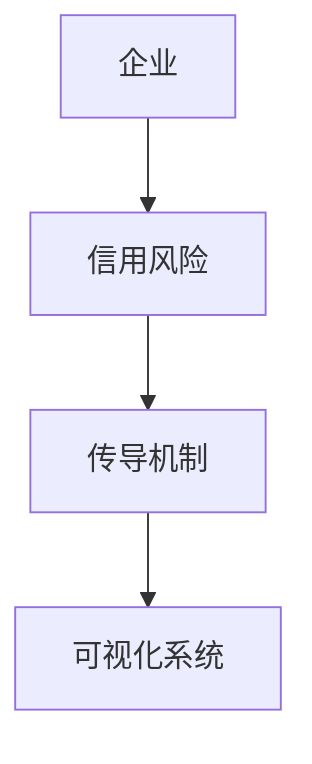
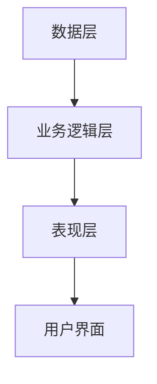

                 

# 开发智能化的企业信用风险传导模拟与可视化系统

**关键词：** 信用风险，风险传导，模拟系统，可视化，智能化

**摘要：** 本文详细探讨了开发智能化的企业信用风险传导模拟与可视化系统的全过程，从问题背景分析到系统设计，再到算法实现和项目实战，结合理论与实践，为读者提供一套系统化的解决方案。

---

# 第一部分: 企业信用风险传导模拟与可视化系统概述

# 第1章: 企业信用风险问题背景与需求分析

## 1.1 信用风险的基本概念

### 1.1.1 信用风险的定义与特征

信用风险是指由于债务人或交易对手无法履行其合同义务，导致债权人或相关方蒙受损失的可能性。其主要特征包括不确定性、传染性、系统性和可测量性。

### 1.1.2 信用风险对企业的影响

信用风险可能影响企业的财务稳定性、声誉和市场信任度。例如，一家企业的信用违约可能引发连锁反应，影响整个供应链或金融市场的稳定性。

### 1.1.3 信用风险传导机制的复杂性

信用风险的传导机制复杂，涉及多个层级和链条。例如，一家企业的违约可能影响其供应商和客户的信用状况，进而波及整个行业或金融市场。

## 1.2 企业信用风险模拟的必要性

### 1.2.1 传统信用风险管理的局限性

传统方法主要依赖历史数据和经验判断，难以捕捉复杂的市场变化和非线性关系。此外，传统方法通常缺乏对风险传导机制的动态模拟能力。

### 1.2.2 智能化信用风险模拟的需求

随着市场环境的复杂化，企业需要更精准和动态的风险评估工具。智能化模拟系统能够利用大数据和人工智能技术，实时捕捉市场变化，提高风险预测的准确性。

### 1.2.3 可视化技术在信用风险分析中的作用

可视化技术能够将复杂的信用风险数据转化为直观的图表，帮助决策者快速理解风险分布和传导路径，提升决策效率。

## 1.3 系统开发目标与边界

### 1.3.1 系统开发目标

开发一个智能化的企业信用风险传导模拟与可视化系统，能够实时分析企业间的信用关系，模拟风险传导过程，并提供直观的可视化结果。

### 1.3.2 系统边界与外延

系统主要关注企业层面的信用风险，不涉及个人信用或消费者层面的风险。系统边界包括企业信用数据的采集、处理、模拟和可视化展示。

### 1.3.3 核心功能模块的初步规划

系统初步规划包括以下几个核心模块：

1. **数据采集模块：** 采集企业信用数据，包括财务数据、交易数据和市场数据。
2. **风险模拟模块：** 利用算法模拟信用风险的传导过程。
3. **可视化模块：** 将模拟结果转化为直观的图表和报告。

## 1.4 本章小结

本章主要介绍了企业信用风险的基本概念、传统管理方法的局限性以及智能化模拟的必要性。同时，明确了系统开发的目标和边界，为后续章节的展开奠定了基础。

---

# 第二部分: 核心概念与理论基础

# 第2章: 信用风险传导机制的理论分析

## 2.1 信用风险传导的基本原理

### 2.1.1 风险传导的路径分析

信用风险的传导路径主要包括直接传导和间接传导。直接传导是指某一家企业的违约直接影响其合作伙伴；间接传导则是指风险通过供应链或金融市场逐步扩散。

### 2.1.2 传导机制的关键影响因素

影响信用风险传导的关键因素包括企业的财务状况、市场环境、供应链结构和企业之间的依赖关系。

### 2.1.3 传导过程的数学模型

信用风险传导的过程可以用图论中的网络模型来描述。例如，企业之间的信用关系可以用图中的边表示，而企业的信用状况可以用节点的属性表示。

### 2.1.4 通过 Mermaid 绘制的 ER 实体关系图

## 2.2 信用风险传导的系统模型

### 2.2.1 系统模型的构建方法

系统模型的构建方法包括数据采集、模型建立、模拟和可视化。需要考虑数据的准确性和模型的可解释性。

### 2.2.2 系统模型的输入与输出

系统的输入包括企业信用数据、市场数据和供应链数据；输出包括风险传导路径、概率分布和可视化报告。

### 2.2.3 模型的假设与限制条件

模型假设企业之间的信用关系是线性的，且不考虑市场波动对信用风险的影响。

## 2.3 核心概念的属性对比

### 2.3.1 核心概念的特征对比表

| 核心概念 | 定义 | 特征 |
|----------|------|------|
| 信用风险 | 债务人违约可能性 | 不确定性、传染性、系统性 |
| 传导机制 | 风险扩散路径 | 直接传导、间接传导、网络效应 |

### 2.3.2 通过 Mermaid 绘制的 ER 实体关系图

## 2.4 本章小结

本章详细分析了信用风险传导的基本原理和系统模型，为后续的算法设计和系统实现奠定了理论基础。

---

# 第三部分: 算法原理与数学模型

# 第3章: 信用风险模拟的算法原理

## 3.1 蒙特卡洛模拟算法

### 3.1.1 算法的基本原理

蒙特卡洛模拟是一种基于随机数的模拟方法，常用于估计系统的概率分布和风险评估。

### 3.1.2 算法的实现步骤

1. **定义输入参数：** 包括企业信用数据和市场参数。
2. **生成随机数：** 用于模拟不确定性的因素。
3. **模拟风险传导：** 根据随机数生成风险事件，计算风险传导路径和影响。
4. **统计结果：** 计算风险的概率分布和期望值。

### 3.1.3 算法的优缺点分析

优点：能够捕捉系统的非线性关系，适合处理复杂的市场环境。缺点：计算量较大，需要大量的计算资源。

## 3.2 基于图论的信用传导网络构建

### 3.2.1 图论的基本概念

图论中的图由节点和边组成，节点代表企业，边代表企业之间的信用关系。

### 3.2.2 信用传导网络的构建方法

1. **数据采集：** 采集企业之间的信用关系数据。
2. **构建图模型：** 将企业信用关系表示为图中的节点和边。
3. **分析网络结构：** 研究网络的连通性和节点的重要性。

### 3.2.3 网络的可视化表示

可以通过网络图展示企业之间的信用关系，颜色和大小可以表示风险的高低。

## 3.3 数学模型与公式推导

### 3.3.1 风险传导的概率模型

$$ P(i) = \frac{E[i]}{N} $$

其中，\( P(i) \) 表示第 \( i \) 个企业的违约概率，\( E[i] \) 是企业的期望违约损失，\( N \) 是企业的数量。

### 3.3.2 系统风险的累积公式

$$ R_{total} = \sum_{i=1}^{N} R_i $$

其中，\( R_i \) 表示第 \( i \) 个企业的风险贡献。

### 3.3.3 案例分析与公式应用

通过一个简单的案例，展示如何利用上述公式计算系统的总风险。

## 3.4 本章小结

本章详细介绍了信用风险模拟的主要算法和数学模型，为系统的实现提供了理论依据。

---

# 第四部分: 系统架构与设计

# 第4章: 系统架构设计方案

## 4.1 系统功能模块划分

### 4.1.1 风险模拟模块

负责模拟信用风险的传导过程，输出风险概率分布和传导路径。

### 4.1.2 数据处理模块

负责数据的采集、清洗和预处理，确保数据的准确性和完整性。

### 4.1.3 可视化展示模块

将模拟结果转化为直观的图表和报告，帮助用户理解和决策。

## 4.2 系统架构

### 4.2.1 系统架构设计

采用分层架构，包括数据层、业务逻辑层和表现层。

### 4.2.2 系统架构的 Mermaid 图

### 4.2.3 接口设计

系统需要提供标准的API接口，方便与其他系统的集成。

### 4.2.4 交互设计

通过用户友好的界面，让用户能够方便地输入数据、运行模拟和查看结果。

## 4.3 本章小结

本章详细设计了系统的架构和功能模块，为系统的实现提供了清晰的指导。

---

# 第五部分: 项目实战与应用

# 第5章: 项目实战与应用

## 5.1 环境安装与配置

### 5.1.1 开发环境的选择

推荐使用Python和相关库（如numpy、pandas、networkx、matplotlib）进行开发。

### 5.1.2 开发工具的安装

安装Python和相关库，配置开发环境。

## 5.2 核心代码实现

### 5.2.1 数据采集与预处理

编写代码采集企业信用数据，并进行清洗和预处理。

### 5.2.2 风险模拟与分析

利用蒙特卡洛模拟算法和图论模型，模拟信用风险的传导过程。

### 5.2.3 可视化结果展示

将模拟结果转化为图表和报告，展示信用风险的传导路径和概率分布。

## 5.3 案例分析与结果解读

### 5.3.1 案例背景

选择一个具体的行业或企业，进行信用风险模拟和分析。

### 5.3.2 模拟结果分析

分析模拟结果，找出高风险企业和关键传导路径。

### 5.3.3 结果解读与建议

根据模拟结果，提出风险管理的建议和策略。

## 5.4 本章小结

本章通过实际案例，展示了系统的实现和应用，验证了系统的有效性和实用性。

---

# 第六部分: 最佳实践与总结

# 第6章: 最佳实践与总结

## 6.1 小结

总结系统开发的关键点和实现过程，强调理论与实践的结合。

## 6.2 注意事项

在实际应用中，需要注意数据的准确性和模型的可解释性，避免过度依赖单一模型。

## 6.3 拓展阅读

推荐相关领域的书籍和论文，鼓励读者进一步学习和研究。

## 6.4 作者简介

作者：AI天才研究院/AI Genius Institute & 禅与计算机程序设计艺术/Zen And The Art of Computer Programming

---

通过以上目录，您可以逐步深入了解开发智能化的企业信用风险传导模拟与可视化系统的全过程，从理论到实践，从算法到系统实现，为企业的信用风险管理提供有力的支持。

