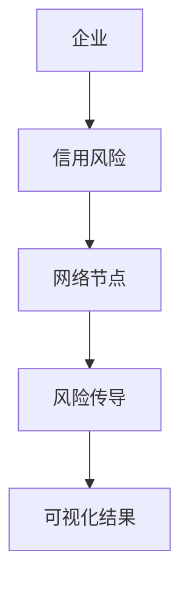
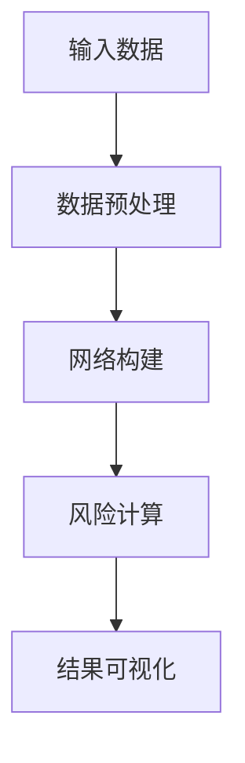
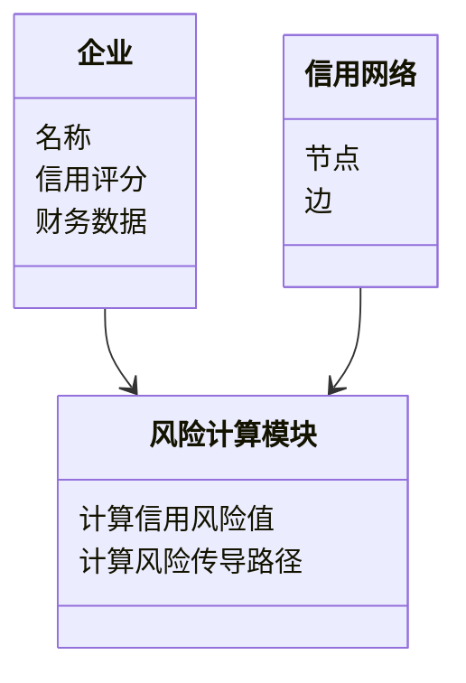
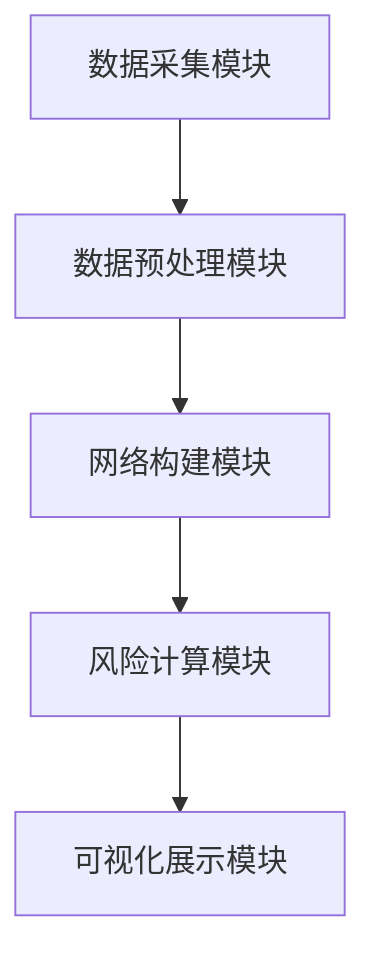
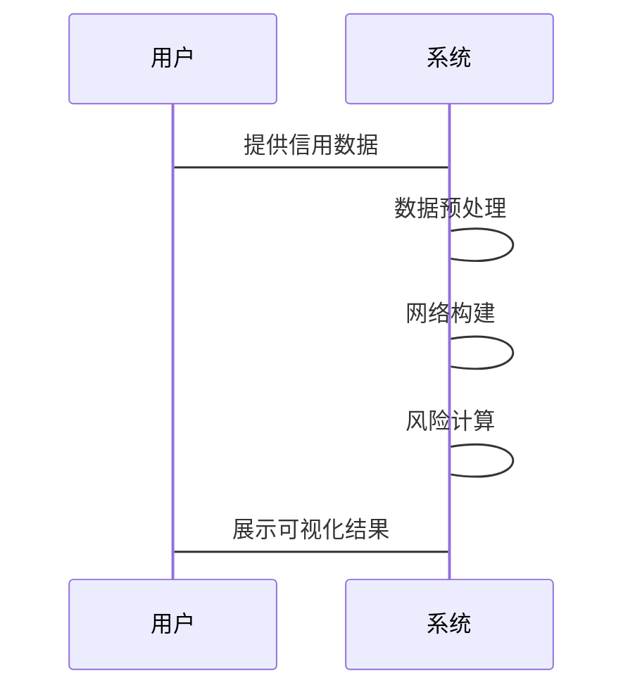

                 


# 开发智能化的企业信用风险传导网络可视化系统

## 关键词：企业信用风险、网络可视化、系统架构、算法原理、项目实战

## 摘要：本文详细探讨了开发智能化的企业信用风险传导网络可视化系统的核心概念、算法原理、系统架构以及实际应用。通过分析信用风险的网络传导机制，结合可视化技术，构建了一个智能化的信用风险评估与管理平台，为企业信用风险管理提供了新的视角和解决方案。

---

# 第1章 企业信用风险传导网络可视化系统概述

## 1.1 问题背景

### 1.1.1 信用风险的定义与重要性
信用风险是指企业在信用交易中未能履行其债务责任，导致债权人遭受损失的可能性。在现代经济中，信用风险已成为企业风险管理的核心内容之一，尤其是在供应链金融和企业间交易中，信用风险的管理直接关系到企业的生存与发展。

### 1.1.2 企业信用风险传导的复杂性
随着经济全球化和企业间合作的深化，信用风险的传导路径变得日益复杂。一家企业的信用问题可能通过供应链传导至多个相关企业，甚至波及整个行业或区域经济。传统的基于单个企业的信用评估方法难以捕捉这种网络化风险传导的动态变化。

### 1.1.3 可视化技术在信用风险分析中的作用
可视化技术能够将复杂的信用关系和风险传导路径以图形形式呈现，帮助决策者直观理解风险分布和传导机制。通过可视化，可以快速识别高风险节点和关键传导路径，为风险管理和应对提供有力支持。

## 1.2 问题描述

### 1.2.1 传统信用风险分析的局限性
传统的信用风险分析方法通常基于单个企业的财务数据，难以捕捉企业间复杂的信用关系和风险传导路径。这种方法在面对网络化风险时显得力不从心，无法有效识别系统性风险。

### 1.2.2 网络化信用风险传导的挑战
企业间的信用关系形成了复杂的网络结构，风险的传导路径和影响范围难以预测。如何在动态变化的网络中实时捕捉风险，并采取有效的应对措施，是当前信用风险管理面临的重要挑战。

### 1.2.3 可视化系统的需求与目标
开发一个智能化的企业信用风险传导网络可视化系统，能够实时监测和分析信用网络的变化，识别高风险节点和传导路径，为风险管理和决策提供直观支持。系统的开发目标是实现信用风险的可视化、动态化和智能化管理。

## 1.3 问题解决

### 1.3.1 可视化系统的核心功能
- **网络构建**：基于企业间的信用关系，构建信用网络。
- **风险计算**：通过算法计算各节点的信用风险值。
- **可视化展示**：将信用网络和风险分布以图形形式呈现。

### 1.3.2 网络化分析的优势
- **全局视角**：从整个网络的角度分析信用风险，识别系统性风险。
- **动态更新**：实时更新信用网络和风险分布，捕捉风险变化。
- **直观展示**：通过图形化界面，帮助用户快速理解风险情况。

### 1.3.3 系统的边界与外延
- **边界**：系统专注于信用风险的网络化分析和可视化，不涉及企业的具体业务数据。
- **外延**：系统可以与其他风险管理工具和决策支持系统集成，提供更全面的风险管理解决方案。

## 1.4 概念结构与核心要素

### 1.4.1 系统组成模块
- **数据采集模块**：采集企业间的信用关系和相关数据。
- **网络构建模块**：基于数据构建信用网络。
- **风险计算模块**：计算各节点的信用风险值。
- **可视化模块**：将信用网络和风险分布以图形形式展示。

### 1.4.2 核心要素的定义与关系
- **信用网络**：由企业节点和信用关系边组成，反映了企业间的信用依赖关系。
- **信用风险值**：每个节点的信用风险值反映了其违约的可能性。
- **风险传导路径**：连接高风险节点的路径，反映了风险的传导方向和路径。

### 1.4.3 系统架构的初步设想
- **数据层**：存储企业信用数据和网络结构。
- **计算层**：实现信用网络的构建和风险计算。
- **展示层**：将计算结果以图形形式展示给用户。

---

# 第2章 核心概念与ER实体关系图

## 2.1 核心概念原理

### 2.1.1 信用风险的度量方法
信用风险的度量通常基于企业的财务数据、市场数据和信用评分模型。常见的信用评分模型包括Logistic回归、决策树和机器学习模型（如随机森林和XGBoost）。

### 2.1.2 网络传导机制的数学模型
网络传导机制可以通过图论模型进行描述，其中企业节点之间的连接表示信用关系。风险传导可以通过网络中的边权重和节点属性进行计算。

### 2.1.3 可视化技术的实现方式
可视化技术包括图论算法、布局算法和交互式图形展示。常用的图论算法包括Kruskal算法和Prim算法，用于构建最小生成树和网络结构。

## 2.2 概念属性特征对比

| 概念 | 属性 | 特征 |
|------|------|------|
| 信用网络 | 节点 | 企业节点 |
|        | 边   | 信用关系边 |
| 风险计算 | 方法 | 基于信用评分模型 |
| 可视化展示 | 图形类型 | 网络图、节点颜色、边权重 |

## 2.3 ER实体关系图



---

# 第3章 算法原理与实现

## 3.1 算法原理

### 3.1.1 图论算法在信用网络中的应用
图论算法用于构建信用网络和计算节点间的最短路径。例如，使用Dijkstra算法计算网络中的最短路径，用于识别风险传导的最可能路径。

### 3.1.2 网络流算法的原理
网络流算法用于计算信用网络中的流量和瓶颈。例如，使用最大流算法识别网络中的瓶颈节点，这些节点可能是风险传导的关键路径。

### 3.1.3 风险传导的数学模型
风险传导可以通过加权网络模型进行计算。假设企业i的信用风险值为R_i，企业j的信用风险传导值可以通过以下公式计算：

$$ R_j = \sum_{i} w_{ij} \cdot R_i $$

其中，$w_{ij}$是企业i和企业j之间的边权重。

## 3.2 算法流程图



## 3.3 算法实现

### 3.3.1 Python代码实现
```python
import networkx as nx
import matplotlib.pyplot as plt

# 创建信用网络
G = nx.DiGraph()

# 添加节点
G.add_nodes_from(['A', 'B', 'C'])

# 添加边
G.add_edges_from([('A', 'B'), ('B', 'C'), ('A', 'C')])

# 计算最短路径
shortest_paths = nx.all_pairs_shortest_path(G)

# 可视化网络
nx.draw(G, with_labels=True, edge_color='blue', node_color='white')
plt.show()
```

---

# 第4章 系统分析与架构设计

## 4.1 问题场景介绍
企业信用风险传导网络可视化系统需要解决的问题包括：如何实时监测信用网络的变化，如何快速识别高风险节点和传导路径，以及如何将复杂的风险信息以直观的图形形式展示给用户。

## 4.2 项目介绍
本项目旨在开发一个智能化的企业信用风险传导网络可视化系统，通过数据采集、网络构建、风险计算和可视化展示，帮助企业识别和管理信用风险。

## 4.3 系统功能设计

### 4.3.1 领域模型


### 4.3.2 系统架构设计


### 4.3.3 接口设计
系统提供以下接口：
- 数据输入接口：接收企业间的信用数据。
- 网络构建接口：基于数据构建信用网络。
- 风险计算接口：计算各节点的信用风险值。
- 可视化展示接口：将计算结果以图形形式展示。

### 4.3.4 交互流程


---

# 第5章 项目实战

## 5.1 环境安装
开发环境：Python 3.8及以上版本，安装NetworkX、Matplotlib和Plotly库。

## 5.2 核心代码实现
### 5.2.1 数据采集模块
```python
import csv

# 读取CSV文件
with open('credit_data.csv', 'r') as file:
    reader = csv.reader(file)
    data = list(reader)
```

### 5.2.2 网络构建模块
```python
import networkx as nx

# 创建信用网络
G = nx.Graph()

# 添加节点
G.add_nodes_from(['A', 'B', 'C'])

# 添加边
G.add_edges_from([('A', 'B'), ('B', 'C'), ('A', 'C')])
```

### 5.2.3 风险计算模块
```python
# 计算各节点的信用风险值
risk_scores = {'A': 0.8, 'B': 0.6, 'C': 0.4}
```

### 5.2.4 可视化展示模块
```python
import matplotlib.pyplot as plt

# 可视化网络
nx.draw(G, with_labels=True, edge_color='blue', node_color='white')
plt.show()
```

## 5.3 案例分析
以一个简单的供应链为例，分析信用风险的传导路径。假设企业A和企业B之间的信用关系较强，企业B和企业C之间的信用关系较弱。通过系统计算，可以识别出企业A的信用风险较高，可能通过企业B传导至企业C。

---

# 第6章 总结与展望

## 6.1 系统总结
本文开发了一个智能化的企业信用风险传导网络可视化系统，通过数据采集、网络构建、风险计算和可视化展示，帮助企业识别和管理信用风险。

## 6.2 未来展望
未来，系统可以在以下方面进行改进：
- **实时监测**：增加实时数据更新功能，实现信用网络的动态更新。
- **预测模型**：引入机器学习算法，提高信用风险预测的准确性。
- **交互功能**：增加用户交互功能，支持用户自定义分析和风险模拟。

## 6.3 最佳实践 tips
- 数据质量是系统准确性的重要保障，建议企业定期更新信用数据。
- 可视化界面的设计应考虑用户体验，确保直观易用。
- 系统的维护和更新需要结合企业的实际需求，不断优化功能和性能。

## 6.4 小结
本文通过系统化的分析和设计，提出了一种基于网络可视化的信用风险管理方法，为企业信用风险的智能化管理提供了新的思路和解决方案。

---

# 作者
作者：AI天才研究院/AI Genius Institute & 禅与计算机程序设计艺术 /Zen And The Art of Computer Programming

