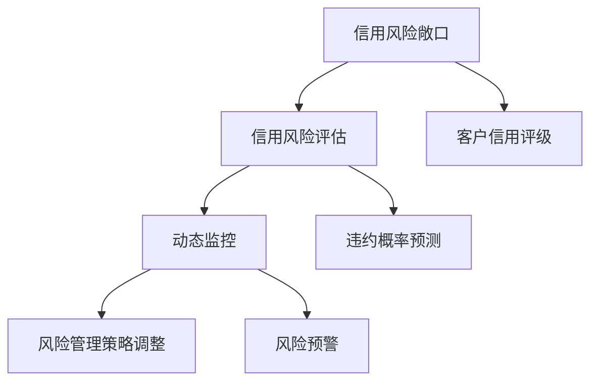

                 

# 开发智能化的企业信用风险敞口动态管理系统

> 关键词：企业信用风险，风险敞口，动态管理，人工智能，风险管理系统，智能化

> 摘要：本文探讨了如何利用人工智能技术开发一个智能化的企业信用风险敞口动态管理系统。通过分析信用风险敞口的动态特征，结合智能化管理的核心要素，本文提出了基于机器学习的算法原理和系统架构设计方案，最终通过实际案例展示了系统的实现和应用效果。

---

# 第一部分: 背景介绍与核心概念

# 第1章: 企业信用风险敞口管理的背景与挑战

## 1.1 信用风险敞口的基本概念

### 1.1.1 信用风险的定义与特征

信用风险是指企业在经营活动中由于交易对手或客户无法履行其财务义务而可能遭受的损失。信用风险敞口则是指企业在特定时间段内对客户的信用风险暴露程度，通常通过量化的方法进行衡量。

- **定义**：信用风险敞口是企业在一定时间内的信用风险暴露的总量，包括直接和间接的风险。
- **特征**：
  - 动态性：随着市场环境和企业经营状况的变化而变化。
  - 多维性：受企业内部和外部多种因素的影响，如企业财务状况、行业风险、市场环境等。
  - 可测量性：可以通过数学模型和数据分析进行量化评估。

### 1.1.2 信用风险敞口的计算与度量

信用风险敞口的计算通常涉及以下几个方面：

1. **客户信用评级**：通过分析客户的财务状况、还款能力等因素，评估客户的信用等级。
2. **违约概率（PD）**：预测客户在一定期限内违约的概率。
3. **违约损失率（LGD）**：在客户违约时，企业可能遭受的损失比例。
4. **风险敞口量化**：结合上述因素，计算企业在不同客户和业务线上的信用风险敞口。

### 1.1.3 信用风险敞口的分类与层次

信用风险敞口可以根据不同的维度进行分类：

- **按业务类型**：如贷款业务、贸易信用、供应链金融等。
- **按客户规模**：如大型企业、中型企业、小微企业。
- **按行业**：如金融、制造、零售等行业。

## 1.2 企业信用风险管理的现状与挑战

### 1.2.1 传统信用风险管理的局限性

传统的信用风险管理方法通常依赖于静态的分析和经验判断，存在以下问题：

- **数据依赖性**：过于依赖历史数据，难以捕捉实时变化的市场风险。
- **主观性**：信用评级和风险判断往往依赖人工经验，存在主观性和不确定性。
- **响应滞后**：传统的风险管理方法通常周期较长，难以满足动态风险管理的需求。

### 1.2.2 数字化转型中的信用风险管理需求

随着企业数字化转型的推进，信用风险管理也需要借助现代信息技术实现智能化和自动化：

- **数据驱动**：利用大数据技术，整合企业内外部数据，提升风险评估的准确性和全面性。
- **实时监控**：通过实时数据分析，实现对信用风险敞口的动态监控和预警。
- **自动化决策**：利用人工智能技术，实现信用风险评估和管理的自动化。

### 1.2.3 智能化信用风险管理的必要性

智能化信用风险管理是企业应对复杂多变的市场环境的必然选择：

- **提高效率**：通过自动化和智能化手段，大幅提高信用风险管理的效率。
- **增强准确性**：利用机器学习算法，提升信用风险评估的精准度。
- **支持决策**：为企业的信用风险管理提供数据支持和决策依据。

## 1.3 问题背景与问题描述

### 1.3.1 信用风险敞口动态管理的核心问题

企业在经营过程中，信用风险敞口会随着市场环境、客户需求和企业自身的经营状况变化而不断变化。如何实时监控和动态调整信用风险敞口，是企业信用风险管理的核心问题。

- **动态性**：信用风险敞口需要实时更新和调整，以反映最新的市场和企业状况。
- **复杂性**：涉及多个变量和因素，需要综合分析和判断。
- **实时性**：要求系统能够快速响应市场变化，提供实时的风险评估和预警。

### 1.3.2 企业信用风险管理中的关键挑战

企业在信用风险管理中面临以下关键挑战：

- **数据获取与整合**：如何获取和整合来自不同来源的高质量数据，是信用风险管理的基础。
- **模型构建与优化**：如何构建准确的信用风险评估模型，并进行持续优化，是技术难点。
- **实时监控与预警**：如何实现信用风险敞口的实时监控，并及时发出预警，是系统设计的重点。

### 1.3.3 问题解决的目标与预期效果

开发智能化的企业信用风险敞口动态管理系统的目标是：

- **实时监控**：实现信用风险敞口的实时监控和动态调整。
- **智能评估**：利用人工智能技术，提高信用风险评估的准确性和效率。
- **决策支持**：为企业的信用风险管理提供数据支持和决策依据。

预期效果包括：

- **降低风险敞口**：通过智能化管理，有效降低企业的信用风险敞口。
- **提升效率**：自动化处理和实时监控，大幅提高管理效率。
- **增强竞争力**：通过精准的风险管理，增强企业在市场中的竞争力。

## 1.4 问题的边界与外延

### 1.4.1 信用风险敞口管理的边界

信用风险敞口管理的边界包括以下几个方面：

- **时间范围**：通常是指企业在一定时间范围内的信用风险暴露。
- **业务范围**：涵盖企业的所有信用业务，如贷款、赊销、供应链金融等。
- **客户范围**：包括所有与企业有信用交易的客户。

### 1.4.2 与相关概念的区分

信用风险敞口管理与以下概念需要区分：

- **信用评分**：信用评分是评估客户信用状况的重要指标，但不直接等同于信用风险敞口。
- **信用风险预警**：信用风险预警是对信用风险的提前警示，但不包括敞口的动态管理。
- **信用风险管理**：信用风险管理是一个综合的过程，包括风险识别、评估、监控和控制，而信用风险敞口管理是其中的重要环节。

### 1.4.3 问题的适用范围与限制

信用风险敞口动态管理系统适用于各种类型的企业，但需要考虑以下限制：

- **数据质量**：系统依赖于高质量的数据输入，数据不足或不准确可能影响评估结果。
- **模型性能**：模型的准确性和实时性取决于算法的选择和训练数据的质量。
- **系统成本**：智能化系统的开发和维护需要较高的技术投入和资金支持。

## 1.5 核心要素与概念结构

### 1.5.1 核心概念的构成

信用风险敞口动态管理的核心概念包括以下几个方面：

- **信用风险评估**：通过数据分析和模型构建，评估客户的信用风险。
- **动态监控**：实时跟踪信用风险敞口的变化，及时调整风险管理策略。
- **智能化管理**：利用人工智能技术，实现信用风险的自动化评估和管理。

### 1.5.2 概念之间的关系

以下是核心概念之间的关系对比：

| 比较维度 | 传统信用风险管理 | 智能化信用风险管理 |
|----------|------------------|---------------------|
| 数据来源 | 主要依赖历史数据 | 结合实时数据和历史数据 |
| 方法论  | 以经验判断为主 | 以数据分析和机器学习为主 |
| 响应时间 | 周期较长          | 实时或准实时         |
| 准确性   | 较低             | 较高                |

### 1.5.3 概念结构图

以下是信用风险敞口动态管理的概念结构图：

---

# 第二部分: 核心概念与联系

# 第2章: 信用风险敞口动态管理的核心概念

## 2.1 信用风险敞口的动态特征

### 2.1.1 风险敞口的动态变化

信用风险敞口会随着以下因素的变化而动态变化：

- **市场环境**：如经济周期、行业趋势等。
- **客户需求**：如客户财务状况、交易规模等。
- **企业策略**：如信用政策、风险管理策略等。

### 2.1.2 风险敞口的实时性要求

信用风险敞口的动态管理需要满足以下实时性要求：

- **实时数据更新**：及时获取最新的市场和客户数据。
- **实时评估**：根据实时数据，快速评估信用风险敞口。
- **实时预警**：根据评估结果，及时发出预警信息。

### 2.1.3 风险敞口的多维度分析

信用风险敞口的分析需要考虑多个维度：

- **客户维度**：不同客户的信用风险敞口不同。
- **业务维度**：不同业务线的信用风险敞口不同。
- **时间维度**：信用风险敞口会随着时间的推移而变化。

## 2.2 智能化管理的核心要素

### 2.2.1 数

