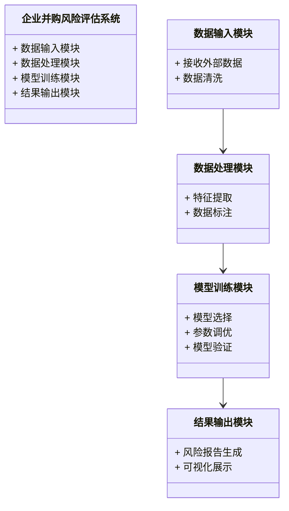
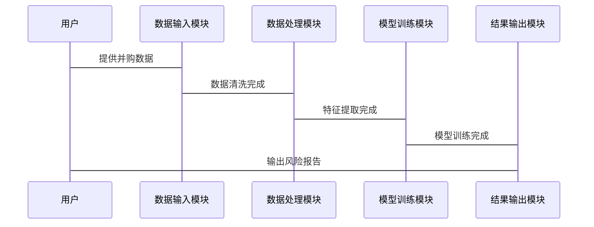

                 


# 开发智能化的企业并购风险评估模型

> 关键词：企业并购，风险评估，人工智能，机器学习，系统架构，数据驱动

> 摘要：本文详细探讨了开发智能化企业并购风险评估模型的全过程，从背景分析到算法实现，从系统架构设计到项目实战，结合丰富的案例和详细的代码实现，为读者提供了一套完整的解决方案。

---

# 第一部分: 企业并购风险评估模型的背景与核心概念

## 第1章: 企业并购风险评估模型的背景与问题背景

### 1.1 企业并购的背景与挑战

#### 1.1.1 企业并购的定义与特点
企业并购是指一家企业通过购买或合并另一家企业，以实现业务扩展、资源整合或市场竞争优势。其特点包括高复杂性、高风险性和高回报性。

#### 1.1.2 并购过程中的主要风险类型
- **财务风险**：如目标企业财务状况不佳、债务问题等。
- **市场风险**：如市场竞争加剧、政策变化等。
- **管理风险**：如整合失败、文化冲突等。
- **法律风险**：如合规性问题、知识产权纠纷等。

#### 1.1.3 传统并购风险评估的局限性
传统方法依赖人工经验，主观性强，难以量化，且效率低下。

---

### 1.2 智能化企业并购风险评估的必要性

#### 1.2.1 数据驱动决策的重要性
通过大数据分析，可以更准确地识别和量化风险。

#### 1.2.2 AI技术在企业并购中的应用潜力
AI技术可以帮助预测市场趋势、评估目标企业价值、识别潜在风险。

#### 1.2.3 智能化模型的优势与价值
- 提高评估效率。
- 降低人为误差。
- 提供实时监控和反馈。

---

## 第2章: 企业并购风险评估的核心概念与模型结构

### 2.1 并购风险评估的核心要素

#### 2.1.1 财务风险分析
- 资产负债表分析。
- 现金流预测。
- 盈利能力评估。

#### 2.1.2 市场风险评估
- 行业趋势分析。
- 竞争对手分析。
- 宏观经济环境评估。

#### 2.1.3 管理风险识别
- 领导层稳定性。
- 组织结构合理性。
- 企业文化兼容性。

---

### 2.2 并购风险模型的结构与功能

#### 2.2.1 数据输入与处理模块
- 数据清洗。
- 特征提取。
- 数据标注。

#### 2.2.2 风险评估算法模块
- 选择合适的算法（如随机森林、支持向量机）。
- 模型训练。
- 模型优化。

#### 2.2.3 结果输出与可视化模块
- 风险等级输出。
- 可视化报告生成。
- 数据驱动的决策支持。

---

### 2.3 模型的核心概念与属性对比

#### 2.3.1 模型属性特征对比表格
| 模型属性 | 传统模型 | 智能化模型 |
|----------|----------|------------|
| 数据来源 | 小样本数据 | 大数据驱动 |
| 计算效率 | 低效 | 高效 |
| 准确性 | 低 | 高 |

#### 2.3.2 ER实体关系图架构
```mermaid
erd
  图表标题：企业并购风险评估模型的ER图

  企业E
    - 企业ID (PK)
    - 企业名称
    - 财务状况
    - 市场地位
  并购交易T
    - 交易ID (PK)
    - 并购时间
    - 并购金额
    - 并购类型
  风险因素F
    - 风险ID (PK)
    - 风险类型
    - 风险概率
  评估结果R
    - 结果ID (PK)
    - 风险等级
    - 建议措施

  企业E --> 并购交易T：参与交易
  并购交易T --> 风险因素F：涉及风险
  并购交易T --> 评估结果R：产生结果
```

---

## 第3章: 并购风险评估模型的算法原理

### 3.1 算法原理概述

#### 3.1.1 机器学习在风险评估中的应用
- 监督学习：分类问题（如风险等级分类）。
- 无监督学习：聚类问题（如风险因素聚类）。

#### 3.1.2 基于AI的模型选择与优化
- 使用随机森林或梯度提升树（如XGBoost）进行分类。
- 通过交叉验证优化模型参数。

---

### 3.2 算法实现流程

#### 3.2.1 数据预处理与特征提取
```python
import pandas as pd
from sklearn.preprocessing import StandardScaler

# 数据加载与预处理
data = pd.read_csv('merger_acquisition.csv')
data = data.dropna()  # 删除缺失值
data = pd.get_dummies(data)  # 特征编码
```

#### 3.2.2 模型训练与参数调优
```python
from sklearn.ensemble import RandomForestClassifier
from sklearn.model_selection import GridSearchCV

# 参数调优
param_grid = {
    'n_estimators': [100, 200],
    'max_depth': [None, 10, 20],
    'min_samples_split': [2, 5]
}

grid_search = GridSearchCV(RandomForestClassifier(), param_grid, cv=5)
grid_search.fit(X_train, y_train)
best_model = grid_search.best_estimator_
```

#### 3.2.3 模型评估与验证
```python
from sklearn.metrics import accuracy_score, classification_report

y_pred = best_model.predict(X_test)
print(f'Accuracy: {accuracy_score(y_test, y_pred)}')
print(classification_report(y_test, y_pred))
```

---

### 3.3 数学模型与公式

#### 3.3.1 风险概率计算公式
$$ P(\text{风险发生}) = \frac{\text{历史风险事件数}}{\text{总样本数}} $$

#### 3.3.2 模型优化的数学推导
$$ \text{损失函数} = \sum_{i=1}^{n} (y_i - \hat{y}_i)^2 $$
$$ \text{优化目标} = \min \text{损失函数} $$

---

## 第4章: 系统分析与架构设计方案

### 4.1 问题场景介绍

#### 4.1.1 并购风险评估的典型场景
- 某公司计划并购一家科技企业，需评估财务风险、市场风险和管理风险。

#### 4.1.2 系统目标与功能需求
- 实时数据采集。
- 风险评估报告生成。
- 多维度数据可视化。

---

### 4.2 系统功能设计

#### 4.2.1 领域模型类图


---

### 4.3 系统接口与交互设计

#### 4.3.1 系统交互序列图


---

## 第5章: 项目实战与代码实现

### 5.1 环境安装与配置

#### 5.1.1 开发环境搭建
- 安装Python 3.8及以上版本。
- 安装必要的库：scikit-learn、pandas、mermaid、jupyter。

#### 5.1.2 数据集获取与预处理
```python
import pandas as pd

# 数据加载与预处理
data = pd.read_csv('merger_acquisition.csv')
data = data.dropna()  # 删除缺失值
data = pd.get_dummies(data)  # 特征编码
```

---

### 5.2 核心代码实现

#### 5.2.1 数据处理代码
```python
from sklearn.model_selection import train_test_split

X = data.drop('risk_grade', axis=1)
y = data['risk_grade']

X_train, X_test, y_train, y_test = train_test_split(X, y, test_size=0.2, random_state=42)
```

#### 5.2.2 模型训练代码
```python
from sklearn.ensemble import RandomForestClassifier
from sklearn.model_selection import GridSearchCV

param_grid = {
    'n_estimators': [100, 200],
    'max_depth': [None, 10, 20],
    'min_samples_split': [2, 5]
}

grid_search = GridSearchCV(RandomForestClassifier(), param_grid, cv=5)
grid_search.fit(X_train, y_train)
best_model = grid_search.best_estimator_
```

---

### 5.3 代码解读与分析

#### 5.3.1 关键代码段分析
- 数据预处理部分：通过`dropna()`和`get_dummies()`完成数据清洗和特征编码。
- 模型训练部分：使用`GridSearchCV`进行参数调优，确保模型性能最优。

---

## 第6章: 最佳实践与总结

### 6.1 小结
智能化企业并购风险评估模型通过大数据和AI技术，显著提高了风险评估的效率和准确性。

### 6.2 注意事项
- 数据质量对模型性能影响重大。
- 模型需定期更新以适应市场变化。

### 6.3 拓展阅读
- 《机器学习实战》
- 《深入浅出人工智能》

---

# 作者：AI天才研究院/AI Genius Institute & 禅与计算机程序设计艺术 /Zen And The Art of Computer Programming

