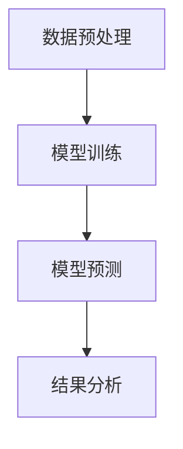

                 


# 开发智能化的企业现金流预测模型

## 关键词
企业现金流预测、机器学习、时间序列分析、深度学习、智能化预测、大数据分析

## 摘要
现金流预测是企业财务管理中的关键环节，智能化预测模型通过机器学习和大数据分析，显著提升了预测的准确性和效率。本文从现金流预测模型的背景与意义出发，详细探讨了其核心概念、算法原理、系统架构设计以及项目实战，结合数学模型和实际案例，提供了从理论到实践的全面指导。文章最后总结了最佳实践和注意事项，为开发智能化现金流预测模型提供了深入的见解和方法。

---

# 第一部分: 现金流预测模型的背景与意义

## 第1章: 现金流预测模型的背景与意义

### 1.1 企业现金流预测的重要性
#### 1.1.1 现金流预测的定义与作用
现金流预测是指通过历史数据和相关因素，预测企业未来一定时期内的现金流入和流出情况。它在企业财务管理、投资决策和风险控制中具有重要作用。

#### 1.1.2 智能化预测的必要性
传统的人工预测方法效率低下且容易出错，而智能化预测模型能够利用大数据和机器学习算法，显著提高预测的准确性和效率。

#### 1.1.3 企业财务管理中的现金流预测
现金流预测是企业制定预算、优化资金分配和评估投资项目的重要依据。

### 1.2 智能化预测的核心概念
#### 1.2.1 数据驱动的预测方法
智能化预测依赖于大量数据，通过分析历史数据和外部因素，预测未来的现金流情况。

#### 1.2.2 机器学习在现金流预测中的应用
机器学习算法（如时间序列分析、深度学习等）能够捕捉数据中的复杂模式，提高预测的准确性。

#### 1.2.3 智能化预测的边界与外延
智能化预测不仅关注数据本身，还考虑外部环境和业务逻辑的影响。

---

## 第2章: 现金流预测模型的核心要素

### 2.1 现金流预测模型的组成部分
#### 2.1.1 数据输入：历史现金流数据
模型需要输入的历史现金流数据，包括收入、支出等。

#### 2.1.2 模型结构：预测算法
选择合适的预测算法（如ARIMA、LSTM等）是模型的核心部分。

#### 2.1.3 输出结果：预测现金流值
模型输出的预测现金流值是企业决策的重要依据。

### 2.2 核心概念与联系
#### 2.2.1 现金流预测模型的实体关系图


---

## 第3章: 现金流预测模型的算法原理

### 3.1 时间序列分析
#### 3.1.1 ARIMA模型原理
ARIMA（自回归积分滑动平均模型）通过捕捉数据的自相关性和趋势，进行预测。

#### 3.1.2 LSTM网络的原理
长短时记忆网络（LSTM）能够有效捕捉时间序列数据中的长期依赖关系。

#### 3.1.3 算法流程图


### 3.2 机器学习模型
#### 3.2.1 线性回归模型
线性回归模型适用于线性关系较强的现金流预测。

#### 3.2.2 支持向量回归
支持向量回归通过构建支持向量机，进行非线性预测。

#### 3.2.3 随机森林模型
随机森林模型通过集成学习，提高预测的准确性和稳定性。

#### 3.2.4 算法选择与对比
对比不同算法的优缺点，选择最适合的预测模型。

---

## 第4章: 现金流预测系统的架构设计

### 4.1 系统功能设计
#### 4.1.1 数据采集模块
从企业财务系统中采集历史现金流数据。

#### 4.1.2 数据预处理模块
对数据进行清洗、标准化和特征提取。

#### 4.1.3 模型训练模块
选择合适的算法，训练预测模型。

#### 4.1.4 结果展示模块
将预测结果以可视化形式展示，便于企业决策。

### 4.2 系统架构图
```mermaid
graph LR
A[数据源] --> B[数据采集]
B --> C[数据预处理]
C --> D[模型训练]
D --> 

---

接下来，我会继续按照这个结构，详细撰写每个章节的内容，确保文章的逻辑清晰、内容丰富且易于理解。通过逐步分析和推理，结合实际案例和代码示例，为读者提供一个全面的现金流预测模型开发指南。

