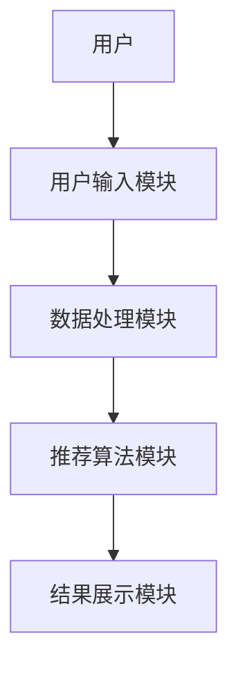

                 


# 开发智能化的企业融资方案推荐系统

> 关键词：智能化推荐系统，企业融资，算法原理，系统架构，项目实战

> 摘要：本文将详细介绍开发智能化的企业融资方案推荐系统的背景、核心概念、算法原理、系统架构设计以及项目实战。通过逐步分析和推理，我们将探讨如何利用人工智能技术，解决企业在融资过程中面临的复杂问题，为企业提供高效、精准的融资方案推荐。

---

# 第1章: 企业融资需求的背景与挑战

## 1.1 企业融资需求的背景
### 1.1.1 企业融资的基本概念
企业在经营过程中，经常会面临资金短缺的问题，需要通过融资来获取发展所需的资源。融资方式包括银行贷款、股权投资、债券融资等多种形式。

### 1.1.2 当前企业融资的主要渠道
1. **银行贷款**：传统的融资方式，适合有稳定现金流的企业。
2. **股权投资**：风险投资、私募股权等，适合高成长型企业。
3. **债券融资**：适合信用评级较高的企业。
4. ** crowdfunding（众筹）**：新兴的融资方式，适合初创企业。

### 1.1.3 融资方案推荐的必要性
企业在选择融资方式时，往往面临信息不对称、选择复杂等问题。智能化的融资方案推荐系统能够帮助企业快速找到最适合的融资方式，降低融资成本。

## 1.2 当前企业融资推荐中的问题与挑战
### 1.2.1 信息不对称
企业对不同融资方式的特点、风险和适用场景缺乏全面了解。

### 1.2.2 融资需求多样化
不同企业的发展阶段、行业特点和财务状况差异较大，融资需求也各有不同。

### 1.2.3 融资市场的动态变化
金融市场环境复杂多变，融资政策、市场利率等因素都会影响融资方案的可行性。

## 1.3 智能化推荐系统的解决方案
通过大数据分析和人工智能技术，智能化推荐系统能够根据企业的具体需求和市场环境，提供个性化的融资方案推荐。

---

# 第2章: 核心概念与系统架构

## 2.1 核心概念
### 2.1.1 用户需求分析
系统需要收集企业的财务数据、经营状况、行业特点等信息，作为推荐的基础。

### 2.1.2 融资方案匹配
基于机器学习算法，对企业的需求进行分析，匹配最适合的融资方案。

### 2.1.3 推荐结果展示
将匹配结果以直观的方式呈现给用户，包括推荐方案的优缺点、可行性分析等。

## 2.2 系统架构设计
### 2.2.1 系统功能模块
1. **用户输入模块**：收集企业的融资需求信息。
2. **数据处理模块**：对输入数据进行清洗和预处理。
3. **推荐算法模块**：基于机器学习算法，生成推荐方案。
4. **结果展示模块**：将推荐结果以可视化的方式呈现给用户。

### 2.2.2 系统架构图


---

# 第3章: 算法原理与数学模型

## 3.1 推荐算法的核心原理
### 3.1.1 协同过滤算法
协同过滤是一种基于用户行为相似性推荐算法，分为基于用户的协同过滤和基于物品的协同过滤。

### 3.1.2 基于机器学习的推荐算法
利用机器学习模型，如随机森林、支持向量机等，对企业的特征进行分类或回归预测。

### 3.1.3 深度学习在推荐系统中的应用
使用神经网络模型，如神经协同过滤（Neural Collaborative Filtering）来捕捉用户和物品之间的复杂关系。

## 3.2 数学模型与公式
### 3.2.1 协同过滤的数学公式
$$ \hat{r}_{u,i} = \bar{r} + \sum_{k=1}^{K} (b_u^k + b_i^k) $$

### 3.2.2 矩阵分解模型
$$ P \times Q^T = R $$

---

# 第4章: 系统实现与项目实战

## 4.1 项目实战
### 4.1.1 环境安装
需要安装Python、机器学习库（如scikit-learn、tensorflow）等。

### 4.1.2 核心代码实现
```python
import numpy as np
from sklearn.metrics.pairwise import pairwise_distances

def collaborative_filtering(X, k):
    # 计算相似度矩阵
    sim = pairwise_distances(X, metric='cosine')
    # 矩阵分解
    U, S, V = np.linalg.svd(sim)
    U = U[:, :k]
    V = V[:, :k]
    return U.dot(V.T)

# 示例数据
X = np.array([[4, 3], [3, 2], [2, 1]])
result = collaborative_filtering(X, 2)
print(result)
```

### 4.1.3 案例分析
通过实际案例，展示如何利用协同过滤算法对企业融资方案进行推荐。

---

# 第5章: 总结与展望

## 5.1 本章小结
本文详细介绍了开发智能化的企业融资方案推荐系统的背景、核心概念、算法原理和系统架构设计。通过实际案例分析，展示了系统的实现过程。

## 5.2 注意事项
在实际应用中，需要注意数据隐私保护、模型的可解释性等问题。

## 5.3 拓展阅读
推荐读者进一步阅读相关领域的书籍和论文，深入了解机器学习和深度学习在推荐系统中的应用。

---

# 作者：AI天才研究院/AI Genius Institute & 禅与计算机程序设计艺术 /Zen And The Art of Computer Programming

