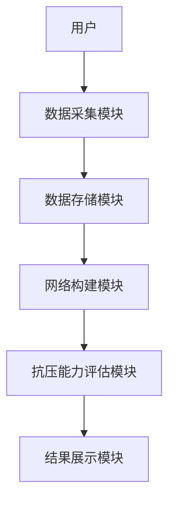
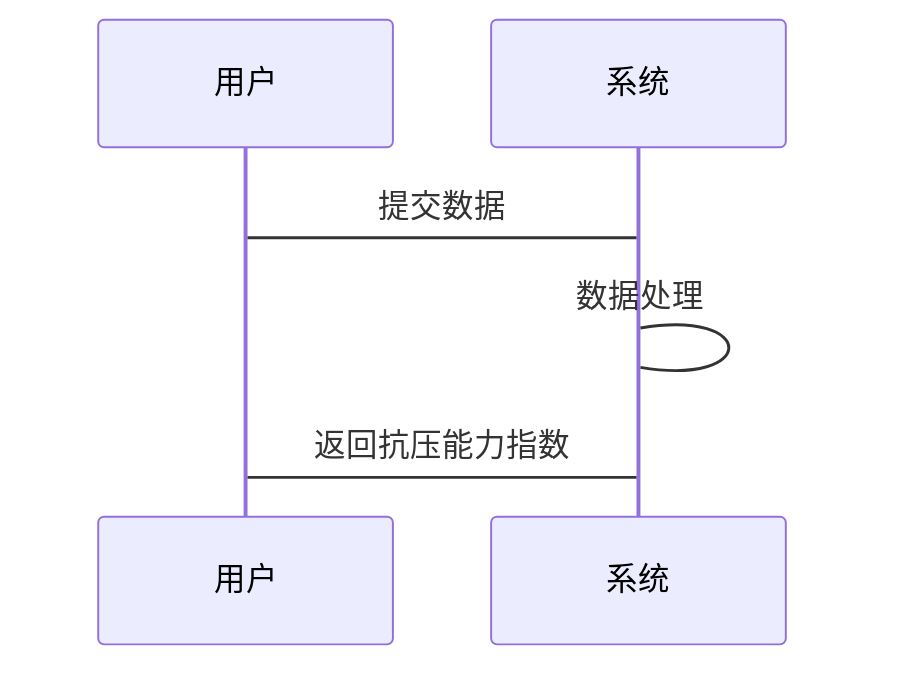

                 


# 开发智能化的供应链金融信用网络抗压能力分析模型

## 关键词：供应链金融、信用网络、抗压能力、分析模型、人工智能

## 摘要：供应链金融信用网络抗压能力分析模型是一种结合供应链金融与信用评估的智能化模型，旨在通过分析供应链金融信用网络的抗压能力，为金融决策提供支持。本文将从核心概念、算法原理、系统设计到项目实战，详细阐述该模型的开发过程和应用价值。

---

## 第1章: 供应链金融与信用网络概述

### 1.1 供应链金融的定义与特点

供应链金融是一种通过整合供应链上下游企业，利用核心企业的信用支持，为供应链上的中小微企业提供融资服务的模式。其特点包括：
- **数据驱动**：依赖供应链上的交易数据和信用数据。
- **多级关联**：涉及核心企业、供应商、分销商等多方主体。
- **动态风险评估**：根据供应链的实时数据动态调整风险评估。

### 1.2 信用网络的定义与特点

信用网络是指由多个信用主体及其之间的信用关系构成的网络。其特点包括：
- **多主体性**：涉及多个信用主体，如银行、企业、个人等。
- **复杂关系**：信用关系可能涉及直接和间接的关联。
- **网络效应**：信用网络的规模和结构会影响整体信用风险。

### 1.3 供应链金融与信用网络的结合

供应链金融与信用网络的结合体现在以下几个方面：
- **数据共享**：供应链上的交易数据可以用于信用网络的构建。
- **风险传递**：供应链上的信用风险可能通过网络传递，影响整体供应链的稳定性。
- **协同优化**：通过信用网络分析，优化供应链上的融资结构和风险控制。

---

## 第2章: 供应链金融信用网络抗压能力分析模型的核心概念与联系

### 2.1 核心概念原理

供应链金融信用网络抗压能力分析模型的核心原理在于通过构建供应链信用网络，分析网络的抗压能力。抗压能力指的是在供应链受到外部冲击时，网络的稳定性、恢复能力和风险分散能力。

### 2.2 核心概念属性特征对比表

| 比较维度 | 供应链金融 | 信用网络 |
|----------|------------|----------|
| 数据来源 | 供应链交易数据 | 信用评估数据 |
| 核心目标 | 提供融资支持 | 评估信用风险 |
| 依赖因素 | 供应链结构 | 信用关系网络 |

### 2.3 ER实体关系图架构

供应链金融信用网络的ER实体关系图如下：

```mermaid
er
  supplier
  product
  order
  core_company
  bank
  credit_link
  transaction
  risk_assessment
```

---

## 第3章: 供应链金融信用网络抗压能力分析模型的算法原理

### 3.1 算法原理概述

供应链金融信用网络抗压能力分析模型的算法原理如下：
1. **数据预处理**：清洗和整合供应链交易数据和信用数据。
2. **网络构建**：基于信用关系构建信用网络。
3. **抗压能力评估**：通过网络分析算法评估网络的抗压能力。

### 3.2 算法实现步骤

```mermaid
graph TD
    A[开始] -> B[数据预处理]
    B -> C[构建信用网络]
    C -> D[计算抗压能力指标]
    D -> E[输出结果]
    E -> F[结束]
```

### 3.3 算法的数学模型与公式

供应链金融信用网络抗压能力分析模型的数学公式如下：

$$抗压能力指数 = \frac{\sum_{i=1}^{n} (1 - \frac{d_i}{D})}{n}$$

其中，$d_i$ 表示节点 $i$ 的度数，$D$ 表示网络的最大度数，$n$ 表示节点总数。

---

## 第4章: 系统分析与架构设计

### 4.1 问题场景介绍

在供应链金融中，中小微企业由于缺乏足够的信用数据，往往难以获得融资支持。通过构建供应链金融信用网络抗压能力分析模型，可以提高中小微企业的融资效率。

### 4.2 系统功能设计

系统功能设计包括：
- 数据采集模块：采集供应链交易数据和信用数据。
- 网络构建模块：基于信用关系构建信用网络。
- 抗压能力评估模块：计算抗压能力指数。

### 4.3 系统架构设计

系统架构设计如下：



### 4.4 接口设计

接口设计包括：
- 数据接口：从数据库中获取数据。
- 计算接口：调用抗压能力计算模块。

### 4.5 交互设计

交互设计如下：



---

## 第5章: 项目实战

### 5.1 环境安装

需要安装以下工具：
- Python 3.8+
- Mermaid
- Jupyter Notebook

### 5.2 核心代码实现

```python
import networkx as nx

def calculate_pressur

