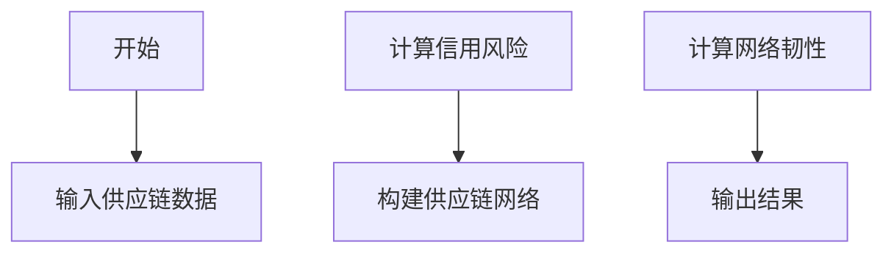

                 


# 开发智能化的供应链金融信用网络韧性分析模型

> 关键词：供应链金融，信用网络，网络韧性，信用评估，风险管理

> 摘要：本文详细介绍了开发智能化的供应链金融信用网络韧性分析模型的过程，从核心概念的定义与特点，到算法原理的推导与实现，再到系统架构的设计与优化，最后结合实际案例进行分析与总结。本文旨在为供应链金融领域的从业者和研究人员提供一种新的思路和方法，以提升供应链金融系统的网络韧性与信用风险评估能力。

---

# 第一部分: 供应链金融与信用网络韧性分析模型的背景与核心概念

# 第1章: 供应链金融与信用网络韧性分析模型概述

## 1.1 供应链金融的定义与特点

### 1.1.1 供应链金融的定义
供应链金融（Supply Chain Finance, SCF）是指通过整合供应链上下游企业之间的资金流、信息流和物流，优化资源配置，降低企业运营成本，提高供应链整体效率的金融活动。供应链金融的核心在于通过金融手段将供应链上下游企业紧密联系起来，实现资金的高效分配和风险的共同承担。

### 1.1.2 供应链金融的核心特点
- **协同性**：供应链金融强调供应链上下游企业之间的协同合作，通过信息共享和资源整合，降低交易成本。
- **风险分担**：供应链金融通过金融工具将供应链中的风险分散到不同的参与方，降低单一企业的风险暴露。
- **高效性**：通过金融手段优化资金流动，缩短供应链的资金周转周期，提高资金使用效率。

### 1.1.3 供应链金融在企业运营中的作用
供应链金融能够帮助企业在供应链上下游之间建立更加紧密的合作关系，降低企业的财务负担，同时提高供应链的整体抗风险能力。

---

## 1.2 信用网络的定义与特点

### 1.2.1 信用网络的定义
信用网络是指由供应链中的企业和金融机构组成的信用关系网络，通过信用评级、授信额度等手段，评估企业之间的信用风险，优化资源配置。

### 1.2.2 信用网络的核心特点
- **动态性**：信用网络中的信用关系和信用评级会随着企业的经营状况和市场环境的变化而动态调整。
- **复杂性**：信用网络涉及多个参与方，企业之间的信用关系可能存在多重依赖和交叉影响。
- **风险传导性**：信用网络中的信用风险可能通过供应链中的企业传导至整个供应链，甚至影响到金融机构的稳定性。

### 1.2.3 信用网络在供应链中的作用
信用网络能够通过信用评估和风险控制，优化供应链中的资金分配和资源配置，降低供应链的信用风险。

---

## 1.3 网络韧性分析的定义与特点

### 1.3.1 网络韧性分析的定义
网络韧性分析是指通过网络理论和算法，评估一个网络在面对节点失效、边断裂等干扰时的抗干扰能力和恢复能力。网络韧性分析的核心目标是识别网络中的关键节点和脆弱环节，制定相应的风险应对策略。

### 1.3.2 网络韧性分析的核心特点
- **抗干扰性**：网络韧性分析能够评估网络在面对外部干扰时的抗干扰能力。
- **恢复性**：网络韧性分析能够评估网络在受到干扰后的恢复能力。
- **动态性**：网络韧性分析需要考虑网络结构和权重的动态变化。

### 1.3.3 网络韧性在供应链金融中的重要性
网络韧性分析能够帮助供应链金融系统识别和应对供应链中的信用风险和网络风险，提高供应链金融系统的抗风险能力。

---

## 1.4 供应链金融信用网络韧性分析模型的定义与特点

### 1.4.1 模型的定义
供应链金融信用网络韧性分析模型是一种基于网络理论和信用评估的模型，旨在通过分析供应链金融信用网络的结构和权重，评估网络的抗干扰能力和恢复能力，优化供应链金融系统的信用风险控制能力。

### 1.4.2 模型的核心特点
- **综合性**：模型综合考虑了供应链金融中的信用风险、网络结构和节点权重等因素。
- **动态性**：模型能够动态调整网络的权重和结构，适应供应链金融环境的变化。
- **可扩展性**：模型可以根据实际需求扩展网络规模和复杂度。

### 1.4.3 模型与传统供应链金融分析的区别
传统供应链金融分析主要关注单个企业的信用风险和财务状况，而供应链金融信用网络韧性分析模型则关注整个供应链金融信用网络的结构和网络韧性，能够更好地识别和应对供应链金融系统中的系统性风险。

---

## 1.5 本章小结

本章详细介绍了供应链金融、信用网络和网络韧性的定义与特点，以及供应链金融信用网络韧性分析模型的定义与特点。通过对比传统供应链金融分析与供应链金融信用网络韧性分析模型的差异，本文为后续的模型构建和算法设计奠定了理论基础。

---

# 第2章: 核心概念与联系

## 2.1 核心概念原理

### 2.1.1 供应链网络的构建
供应链网络的构建需要考虑供应链中的企业关系、交易规模、资金流动等因素，通过构建网络图，分析网络的结构特征。

### 2.1.2 信用风险的传播机制
信用风险在供应链金融信用网络中的传播机制可以通过网络理论中的路径分析方法进行建模，识别信用风险的传播路径和影响范围。

### 2.1.3 网络韧性的度量方法
网络韧性的度量方法包括节点重要性分析、网络切割分析、恢复时间分析等，能够帮助识别网络中的关键节点和脆弱环节。

---

## 2.2 核心概念属性特征对比

以下是一个核心概念属性特征的对比表格：

| 概念       | 属性                   | 特征描述                                                                 |
|------------|------------------------|--------------------------------------------------------------------------|
| 供应链网络 | 结构                   | 包括企业节点、交易关系、资金流动等                                       |
| 信用网络   | 权重                   | 包括信用评级、授信额度、违约概率等                                       |
| 网络韧性    | 抗干扰能力             | 包括节点失效后的网络恢复能力、网络结构的稳定性等                         |

---

## 2.3 ER实体关系图架构

以下是供应链金融信用网络韧性分析模型的ER实体关系图：


---

## 2.4 本章小结

本章通过对比和分析供应链金融、信用网络和网络韧性等核心概念的属性特征，构建了供应链金融信用网络韧性分析模型的ER实体关系图，为后续的算法设计和系统实现奠定了基础。

---

# 第3章: 算法原理讲解

## 3.1 算法原理概述

### 3.1.1 网络分析算法
网络分析算法包括节点度分析、中心性分析、社区发现算法等，用于分析供应链金融信用网络的结构特征。

### 3.1.2 信用评估算法
信用评估算法包括信用评分模型、信用风险模型等，用于评估供应链金融信用网络中企业的信用风险。

### 3.1.3 网络韧性计算算法
网络韧性计算算法包括节点失效分析、网络切割分析、恢复时间分析等，用于评估供应链金融信用网络的网络韧性。

---

## 3.2 算法流程图

以下是算法的流程图：



---

## 3.3 算法实现代码

以下是网络韧性计算算法的Python实现示例：

```python
def calculate_supply_chain_risk(supply_chain_data):
    # 输入：供应链数据，包括企业信息、信用关系、交易数据等
    # 输出：供应链信用网络韧性分析结果
    
    # 1. 构建供应链网络
    network = build_supply_chain_network(supply_chain_data)
    
    # 2. 计算信用风险
    credit_risk = calculate_credit_risk(network)
    
    # 3. 计算网络韧性
    network_resilience = calculate_network_resilience(network, credit_risk)
    
    # 4. 输出结果
    return network_resilience
```

---

## 3.4 本章小结

本章详细介绍了供应链金融信用网络韧性分析模型的算法原理，包括网络分析算法、信用评估算法和网络韧性计算算法，并通过流程图和代码示例展示了算法的实现步骤。

