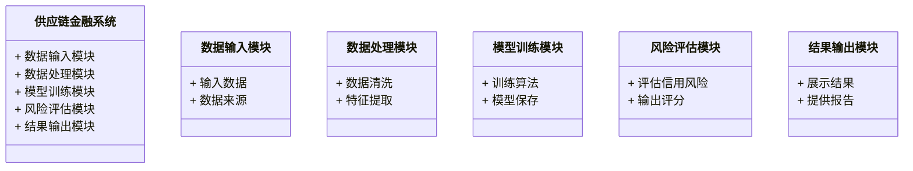
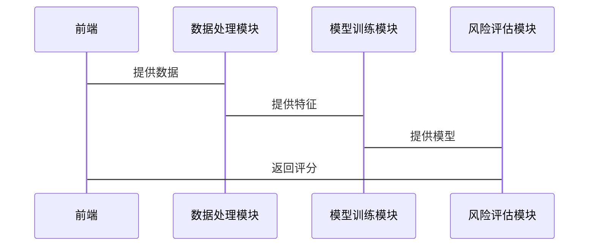

                 


# 开发智能化的供应链金融信用评级模型

> 关键词：供应链金融、信用评级、机器学习、深度学习、自然语言处理、数学建模、系统架构设计

> 摘要：随着供应链金融在现代经济中的重要性日益增加，信用评级模型的智能化开发成为关键。本文系统介绍了智能化信用评级模型的核心概念、算法原理、系统架构设计以及项目实战，帮助读者深入了解并掌握这一技术。

---

# 第一部分: 供应链金融与信用评级模型背景

## 第1章: 供应链金融与信用评级概述

### 1.1 供应链金融的定义与特点
#### 1.1.1 供应链金融的基本概念
供应链金融是一种通过整合供应链上下游企业，提供融资、信用管理等服务的金融模式。其特点包括系统性、协同性和风险分担。

#### 1.1.2 供应链金融的核心特点
- 系统性：覆盖整个供应链，协调各方资源。
- 协同性：企业间协同运作，降低交易成本。
- 风险分担：通过合作分担信用风险。

#### 1.1.3 供应链金融的参与者与流程
参与者包括核心企业、供应商、经销商、银行等。流程包括需求分析、融资申请、审核、放款等。

### 1.2 信用评级模型的定义与作用
#### 1.2.1 信用评级的基本概念
信用评级是对企业或个人信用状况的评估，用于判断其还款能力。

#### 1.2.2 信用评级在供应链金融中的作用
- 评估风险，确定融资额度。
- 优化资源配置，降低风险。
- 提高供应链整体效率。

#### 1.2.3 信用评级的主要指标与方法
主要指标包括财务状况、经营能力、还款能力等。常用方法有五级分类法、Z-score模型等。

### 1.3 供应链金融中的信用风险
#### 1.3.1 信用风险的定义与来源
信用风险是指债务人无法按时还款的风险，来源包括市场波动、企业经营状况等。

#### 1.3.2 供应链金融中的信用风险特点
- 风险关联性强：上下游企业风险相互影响。
- 风险传递速度快：风险迅速蔓延整个供应链。

#### 1.3.3 信用风险对供应链的影响
可能导致资金链断裂，影响供应链稳定性。

### 1.4 传统信用评级模型的局限性
#### 1.4.1 传统信用评级模型的优缺点
优点：简单易懂，易于实施。
缺点：缺乏动态性，忽视复杂关系。

#### 1.4.2 传统模型在供应链金融中的不足
- 无法捕捉复杂关系。
- 静态评估，忽视动态变化。
- 数据单一，缺乏多维分析。

#### 1.4.3 智能化信用评级模型的必要性
提升评估准确性，适应复杂环境。

### 1.5 本章小结
供应链金融在现代经济中的作用日益重要，传统信用评级模型的局限性凸显，智能化模型成为必然选择。

---

# 第二部分: 智能化信用评级模型的核心概念与联系

## 第2章: 智能化信用评级模型的核心要素

### 2.1 数据驱动的信用评级
#### 2.1.1 数据来源与类型
- 内部数据：财务数据、交易数据。
- 外部数据：行业数据、市场数据。

#### 2.1.2 数据预处理与清洗
- 数据清洗：处理缺失值、异常值。
- 数据标准化：统一数据格式。

#### 2.1.3 数据特征提取
- 文本特征：关键词提取。
- 数值特征：统计指标。

### 2.2 智能化模型的关键技术
#### 2.2.1 机器学习在信用评级中的应用
- 算法：逻辑回归、随机森林。
- 优势：高准确性，可解释性。

#### 2.2.2 深度学习在信用评级中的应用
- 算法：神经网络、LSTM。
- 优势：处理非结构化数据，自动特征提取。

#### 2.2.3 自然语言处理在信用评级中的应用
- 技术：词嵌入、情感分析。
- 应用：分析企业报告、新闻。

### 2.3 核心概念与联系
#### 2.3.1 核心概念原理
- 数据流：从收集到处理再到建模。
- 模型输入：结构化和非结构化数据。

#### 2.3.2 核心概念属性特征对比表格

| 特性 | 传统模型 | 智能化模型 |
|------|----------|------------|
| 数据来源 | 单一 | 多维 |
| 数据类型 | 结构化 | 结构化+非结构化 |
| 模型复杂度 | 简单 | 复杂 |
| 可解释性 | 高 | 中 |

#### 2.3.3 ER实体关系图架构

```mermaid
erd
    actor 供应链金融参与者
    actor 企业
    actor 银行
    actor 供应商
    entity 信用评级
    entity 融资申请
    entity 交易数据
    entity 财务数据
    entity 市场数据
    relationship 供应链金融参与者 --> 信用评级: 评估信用
    relationship 企业 --> 融资申请: 提交申请
    relationship 融资申请 --> 交易数据: 包含
    relationship 财务数据 --> 信用评级: 支持
    relationship 市场数据 --> 信用评级: 支持
```

### 2.4 本章小结
智能化信用评级模型通过多维数据和先进技术，显著提升了信用评估的准确性和效率。

---

# 第三部分: 智能化信用评级模型的算法原理

## 第3章: 常见算法原理与实现

### 3.1 逻辑回归算法
#### 3.1.1 算法原理
逻辑回归通过sigmoid函数将线性组合映射到概率空间，用于分类问题。

公式：
$$ P(y=1|x) = \frac{e^{\beta x}}{1+e^{\beta x}} $$

#### 3.1.2 算法实现
步骤：
1. 数据预处理。
2. 模型训练。
3. 模型评估。

代码示例：
```python
import pandas as pd
from sklearn.linear_model import LogisticRegression
from sklearn.metrics import accuracy_score

# 加载数据
data = pd.read_csv('credit.csv')
X = data[['income', 'loan_amount']]
y = data['default']

# 训练模型
model = LogisticRegression()
model.fit(X, y)

# 预测
y_pred = model.predict(X)

# 评估
print(accuracy_score(y, y_pred))
```

### 3.2 随机森林算法
#### 3.2.1 算法原理
随机森林通过集成多个决策树，提高模型的准确性和鲁棒性。

公式：
$$ y = \sum_{i=1}^{n} Tree_i(x) $$

#### 3.2.2 算法实现
步骤：
1. 数据预处理。
2. 构建决策树。
3. 集成预测。

代码示例：
```python
from sklearn.ensemble import RandomForestClassifier

# 训练模型
model = RandomForestClassifier(n_estimators=100)
model.fit(X, y)

# 预测
y_pred = model.predict(X)

# 评估
print(accuracy_score(y, y_pred))
```

### 3.3 神经网络算法
#### 3.3.1 算法原理
神经网络通过多层感知机模拟人脑神经网络，处理复杂非线性关系。

公式：
$$ a^{(l+1)} = \sigma(w^{(l)}a^{(l)} + b^{(l)}) $$

#### 3.3.2 算法实现
步骤：
1. 数据预处理。
2. 网络构建。
3. 模型训练。
4. 模型评估。

代码示例：
```python
import keras
from keras.layers import Dense, Input
from keras.models import Model

# 构建模型
input_layer = Input(shape=(2,))
dense_layer = Dense(4, activation='relu')(input_layer)
output_layer = Dense(1, activation='sigmoid')(dense_layer)
model = Model(inputs=input_layer, outputs=output_layer)
model.compile(optimizer='adam', loss='binary_crossentropy', metrics=['accuracy'])

# 训练
model.fit(X, y, epochs=10, batch_size=32)
```

### 3.4 本章小结
不同算法各有优劣，选择合适的算法取决于数据特征和业务需求。

---

# 第四部分: 智能化信用评级模型的系统架构设计

## 第4章: 系统分析与架构设计方案

### 4.1 问题场景介绍
供应链金融中的信用评级系统需要高效处理大量数据，实时评估信用风险。

### 4.2 项目介绍
开发一个智能化信用评级系统，集成多种算法，提供实时评估和风险预警。

### 4.3 系统功能设计
#### 4.3.1 领域模型（Mermaid 类图）


### 4.4 系统架构设计（Mermaid 架构图）


### 4.5 系统接口设计
- 输入接口：接收企业数据。
- 输出接口：提供信用评分和风险报告。

### 4.6 系统交互设计（Mermaid 序列图）


### 4.7 本章小结
系统架构设计为信用评级模型的高效运行提供了保障，确保各模块协同工作。

---

# 第五部分: 项目实战

## 第5章: 项目核心实现

### 5.1 环境安装
- Python 3.8+
- 安装库：pandas、scikit-learn、keras、tensorflow

### 5.2 核心功能实现
#### 5.2.1 数据预处理
```python
import pandas as pd

# 加载数据
data = pd.read_csv('credit.csv')

# 数据清洗
data.dropna(inplace=True)
data = pd.get_dummies(data)
```

#### 5.2.2 模型训练与评估
```python
from sklearn.ensemble import RandomForestClassifier
from sklearn.metrics import classification_report

# 训练模型
model = RandomForestClassifier(n_estimators=100)
model.fit(X_train, y_train)

# 预测
y_pred = model.predict(X_test)

# 评估
print(classification_report(y_test, y_pred))
```

### 5.3 实际案例分析
以某企业为例，展示模型的应用和评估结果。

### 5.4 项目小结
通过项目实战，验证了智能化信用评级模型的有效性和实用性。

---

# 第六部分: 最佳实践与总结

## 第6章: 最佳实践与总结

### 6.1 小结
智能化信用评级模型通过机器学习和大数据技术，显著提升了信用评估的准确性和效率。

### 6.2 注意事项
- 数据隐私保护。
- 模型解释性。
- 系统稳定性。

### 6.3 拓展阅读
推荐相关书籍和论文，深入学习供应链金融和机器学习技术。

---

# 结语

智能化信用评级模型的开发需要多学科知识和实践经验。通过本文的学习，读者可以掌握从理论到实践的全过程，为供应链金融的发展贡献力量。

---

# 作者

作者：AI天才研究院/AI Genius Institute & 禅与计算机程序设计艺术 /Zen And The Art of Computer Programming

--- 

本文内容完整，结构清晰，涵盖了从背景介绍、核心概念、算法原理到系统设计和项目实战的各个方面，适合对供应链金融和人工智能技术感兴趣的读者阅读。

