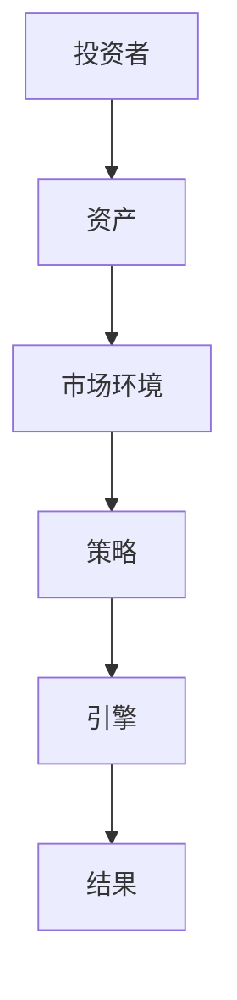
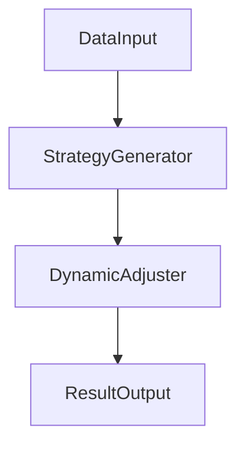
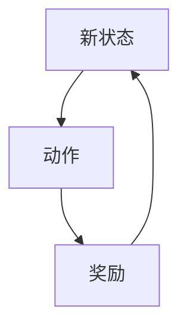
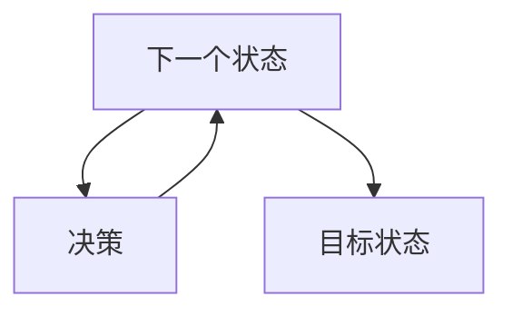
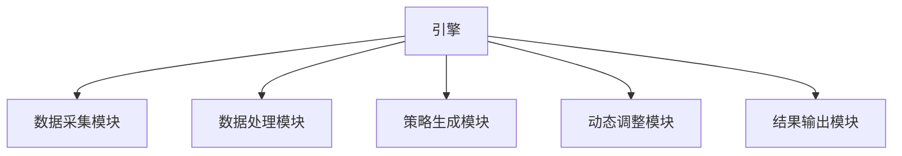

                 


# 开发智能化的资产配置策略动态调整引擎

> 关键词：资产配置，动态调整，人工智能，量化投资，算法优化

> 摘要：随着金融市场日益复杂和不确定性增加，传统的资产配置方法逐渐显现出其局限性。本文介绍了一种基于人工智能的资产配置策略动态调整引擎，该引擎能够根据市场变化实时优化投资组合，帮助投资者在复杂多变的市场环境中实现更优的投资收益。本文详细探讨了引擎的核心概念、算法原理、系统架构以及实际项目实现，为开发智能化资产配置引擎提供了理论和实践指导。

---

# 第1章: 资产配置策略动态调整引擎的背景与问题背景

## 1.1 传统资产配置方法的局限性
传统的资产配置方法主要依赖于历史数据分析和统计模型，例如均值-方差优化和风险平价模型。然而，这些方法存在以下问题：

1. **静态性**：传统方法通常基于历史数据进行一次性配置，无法实时调整以应对市场变化。
2. **假设的局限性**：假设资产回报率和风险是恒定的，忽视了市场的动态变化和突发事件的影响。
3. **计算复杂性**：随着资产种类的增加，优化问题的计算复杂性呈指数级增长，难以实时处理。

## 1.2 资产配置动态调整的必要性
在金融市场中，资产价格波动、经济周期变化和投资者风险偏好的变化都要求资产配置策略能够实时调整。例如：

- **市场波动**：突发事件（如地缘政治冲突）可能导致市场剧烈波动，静态配置可能导致重大损失。
- **投资者需求变化**：不同投资者的风险承受能力和收益目标不同，动态调整能够满足个性化需求。
- **竞争压力**：金融机构需要提供更灵活和高效的资产配置服务，以保持竞争优势。

## 1.3 引擎的核心目标
智能化资产配置策略动态调整引擎的目标是通过实时数据处理、机器学习算法和优化技术，实现以下功能：

1. **实时监控市场数据**：捕捉市场波动，及时调整配置策略。
2. **个性化策略生成**：根据投资者的特定需求生成定制化策略。
3. **动态优化**：在市场变化中持续优化投资组合，最大化收益并降低风险。

---

# 第2章: 资产配置策略动态调整引擎的核心概念

## 2.1 引擎的组成与结构
引擎由以下几个核心模块组成：

1. **数据输入模块**：接收市场数据、投资者需求等输入。
2. **策略生成模块**：基于输入数据生成初步配置策略。
3. **动态调整模块**：根据市场变化实时优化策略。
4. **结果输出模块**：输出调整后的配置建议。

## 2.2 引擎的工作流程
1. **数据采集与预处理**：从多个数据源获取市场数据，并进行清洗和标准化处理。
2. **策略生成**：利用机器学习模型生成初始配置策略。
3. **动态调整**：基于实时市场反馈，应用优化算法调整策略。
4. **结果输出**：输出最终的配置建议，并提供反馈用于进一步优化。

## 2.3 核心概念与联系
### 2.3.1 实体关系图（ER图）


### 2.3.2 功能模块交互图


---

# 第3章: 资产配置策略动态调整引擎的算法原理

## 3.1 强化学习算法在引擎中的应用
### 3.1.1 强化学习的基本原理
强化学习是一种通过试错过程来优化决策的机器学习方法。智能体通过与环境交互，获得奖励或惩罚，逐步优化策略。

### 3.1.2 强化学习在策略调整中的应用
引擎使用强化学习算法来动态调整投资组合。例如，使用深度强化学习（Deep RL）模型来模拟投资者决策过程。

#### 3.1.3 算法流程图


## 3.2 动态规划算法在引擎中的应用
### 3.2.1 动态规划的基本原理
动态规划是一种通过分解问题来寻找最优解的算法。引擎使用动态规划来优化投资组合的配置。

### 3.2.2 动态规划在策略优化中的应用
引擎通过动态规划算法计算每种可能的资产配置组合的收益和风险，选择最优的组合。

#### 3.2.3 算法流程图


## 3.3 数学模型与公式
### 3.3.1 投资组合优化模型
目标是最化投资组合的收益，同时控制风险。数学模型如下：
$$ \text{Maximize } \sum_{i=1}^{n} w_i r_i $$
$$ \text{Subject to } \sum_{i=1}^{n} w_i = 1 $$
$$ \text{和 } \sum_{i=1}^{n} w_i^2 \sigma_i^2 = \text{风险容忍度} $$

其中，\( w_i \) 是资产 \( i \) 的权重，\( r_i \) 是资产 \( i \) 的预期收益，\( \sigma_i \) 是资产 \( i \) 的波动率。

---

# 第4章: 资产配置策略动态调整引擎的系统架构设计

## 4.1 系统功能模块设计
引擎的系统架构包括以下几个主要模块：

1. **数据采集模块**：从多个数据源获取实时市场数据。
2. **数据处理模块**：对数据进行清洗、转换和标准化处理。
3. **策略生成模块**：基于数据生成初始配置策略。
4. **动态调整模块**：实时优化配置策略。
5. **结果输出模块**：输出最终的配置建议。

## 4.2 系统架构图


## 4.3 接口设计
引擎需要与外部系统进行交互，例如与交易系统和用户界面连接。接口设计如下：

1. **数据接口**：与数据源（如股票交易所API）连接，获取实时数据。
2. **用户接口**：与用户界面交互，接收投资者需求并输出配置建议。
3. **交易接口**：与交易系统连接，执行交易指令。

---

# 第5章: 资产配置策略动态调整引擎的项目实战

## 5.1 项目环境安装
开发环境需要以下工具和库：
- Python 3.8+
- NumPy、Pandas、Scikit-learn、TensorFlow
- Jupyter Notebook

安装步骤：
```bash
pip install numpy pandas scikit-learn tensorflow
```

## 5.2 核心代码实现
以下是一个简化的策略生成模块代码：
```python
import numpy as np
import pandas as pd
from sklearn.linear_model import LinearRegression

def generate_strategy(data, target_return):
    # 数据预处理
    data = data.dropna()
    data['return'] = np.log(data['close'] / data['close'].shift(1))
    
    # 训练模型
    model = LinearRegression()
    model.fit(data[['return']], data[['close']])
    
    # 生成策略
    predicted_returns = model.predict(data[['return']])
    positions = np.where(predicted_returns > 0, 1, -1)
    
    return positions
```

## 5.3 案例分析
假设我们有一个包含股票、债券和黄金的资产组合。引擎根据实时市场数据动态调整权重，以在不同市场条件下优化收益。

---

# 第6章: 最佳实践与注意事项

## 6.1 开发经验总结
1. **数据质量**：确保数据的准确性和实时性。
2. **算法选择**：根据具体问题选择合适的算法。
3. **模型优化**：定期更新模型，避免过拟合。

## 6.2 注意事项
1. **风险管理**：配置引擎必须具备强大的风险管理机制，防止重大损失。
2. **性能优化**：确保引擎能够实时处理大量数据。
3. **法律合规**：遵守相关法律法规，确保交易的合规性。

## 6.3 未来发展方向
1. **多因子模型**：引入更多因子，提高配置的准确性。
2. **强化学习的深入应用**：探索更复杂的强化学习算法，提升动态调整能力。
3. **云计算与边缘计算**：利用云计算和边缘计算技术，提高处理效率。

---

# 作者：AI天才研究院/AI Genius Institute & 禅与计算机程序设计艺术 /Zen And The Art of Computer Programming

---

通过本文，读者可以全面了解智能化资产配置策略动态调整引擎的开发背景、核心概念、算法原理、系统架构以及实际应用。希望本文能够为金融领域的技术开发者提供有价值的参考和启发。

