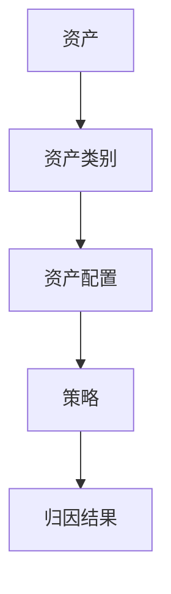
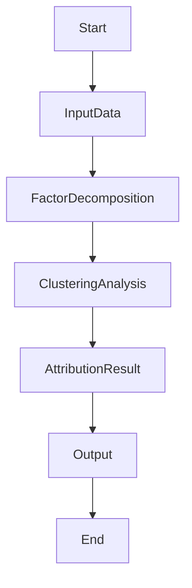
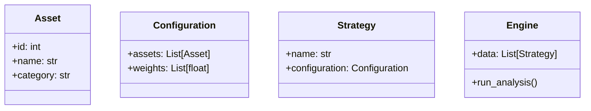

                 


# 开发智能化的资产配置策略归因分析引擎

## 关键词：资产配置，策略归因，人工智能，金融数据分析，量化投资，系统架构，算法实现

## 摘要：  
资产配置策略归因分析引擎是一种结合人工智能技术的金融数据分析工具，用于优化投资组合的表现。本文系统地介绍了引擎的核心概念、算法原理、系统架构，并通过实际案例展示了其在量化投资中的应用。文章还探讨了开发过程中需要注意的问题，并提供了未来发展的建议。

---

# 目录大纲

1. **背景与概念**
   - 1.1 资产配置与策略归因分析引擎概述
     - 1.1.1 传统资产配置方法的局限性
     - 1.1.2 策略归因分析的核心作用
     - 1.1.3 智能化归因分析的必要性
   - 1.2 资产配置策略归因分析引擎的定义
     - 1.2.1 引擎的定义与核心功能
     - 1.2.2 引擎的关键属性与特点
     - 1.2.3 引擎的边界与外延
   - 1.3 资产配置与策略归因分析的关系
     - 1.3.1 资产配置的三要素
     - 1.3.2 策略归因的两大核心
     - 1.3.3 引擎如何连接两者
   - 1.4 本章小结

2. **核心概念与联系**
   - 2.1 策略归因分析的数学模型
     - 2.1.1 归因分析的公式推导
     - 2.1.2 多因子模型的构建
   - 2.2 资产配置策略的核心算法
     - 2.2.1 基于因子分解的归因方法
     - 2.2.2 基于聚类分析的策略优化
     - 2.2.3 算法的优缺点对比
   - 2.3 数据模型与实体关系图
     - 2.3.1 数据模型的ER图设计
   - 2.4 算法流程图
   - 2.5 本章小结

3. **算法原理与实现**
   - 3.1 因子分解模型
     - 3.1.1 模型的数学推导
     - 3.1.2 算法实现步骤
     - 3.1.3 示例代码实现
   - 3.2 聚类分析算法
     - 3.2.1 K-means算法原理
     - 3.2.2 层次聚类算法对比
     - 3.2.3 示例代码实现
   - 3.3 算法流程图
   - 3.4 本章小结

4. **系统架构设计**
   - 4.1 系统功能设计
     - 4.1.1 领域模型类图
   - 4.2 系统架构设计
     - 4.2.1 系统架构图
   - 4.3 系统接口设计
     - 4.3.1 系统交互流程图
   - 4.4 本章小结

5. **项目实战**
   - 5.1 环境安装与配置
   - 5.2 核心代码实现
     - 5.2.1 数据预处理
     - 5.2.2 因子分解
     - 5.2.3 聚类分析
   - 5.3 案例分析与解读
   - 5.4 本章小结

6. **总结与展望**
   - 6.1 本章总结
   - 6.2 未来展望
   - 6.3 注意事项与最佳实践
   - 6.4 拓展阅读

---

# 正文内容

## 第1章: 资产配置策略归因分析引擎概述

### 1.1 传统资产配置方法的局限性

传统的资产配置方法主要依赖于历史数据分析和经验判断，存在以下问题：

- 数据维度不足，难以捕捉复杂市场变化。
- 无法实时调整，应对市场波动能力有限。
- 缺乏智能化支持，难以应对复杂的策略需求。

### 1.2 资产配置策略归因分析引擎的定义

资产配置策略归因分析引擎是一种结合人工智能技术的金融数据分析工具，用于优化投资组合的表现。其核心功能包括：

- **数据采集与处理**：从多来源获取数据，进行清洗和预处理。
- **因子分解与聚类**：通过数学模型分解数据，识别潜在因子。
- **策略优化与归因**：基于因子分析结果，优化资产配置策略。

### 1.3 资产配置与策略归因分析的关系

资产配置的三要素包括：

1. **资产类别**：如股票、债券、商品等。
2. **配置比例**：各资产在组合中的权重。
3. **时间跨度**：配置策略的有效期。

策略归因的两大核心包括：

1. **因子分析**：识别影响资产收益的关键因素。
2. **风险控制**：评估策略的稳健性。

---

## 第2章: 核心概念与联系

### 2.1 策略归因分析的数学模型

#### 归因分析的公式推导

$$ \text{收益} = \sum_{i=1}^{n} w_i \cdot r_i $$

其中，\( w_i \) 是资产 \( i \) 的权重，\( r_i \) 是资产 \( i \) 的收益。

#### 多因子模型的构建

$$ r_i = \beta_0 + \beta_1x_1 + \beta_2x_2 + \cdots + \beta_kx_k + \epsilon $$

### 2.2 资产配置策略的核心算法

#### 因子分解方法

因子分解模型的数学推导如下：

$$ X = US^T $$

其中，\( X \) 是数据矩阵，\( U \) 是左奇异向量，\( S \) 是奇异值向量。

#### 聚类分析方法

聚类分析用于将相似的资产分组，便于策略优化。

### 2.3 数据模型与实体关系图

#### 数据模型的ER图设计



### 2.4 算法流程图



---

## 第3章: 算法原理与实现

### 3.1 因子分解模型

#### 示例代码实现

```python
import numpy as np
def factor_decomposition(X):
    U, S, V = np.linalg.svd(X)
    return U, S, V
```

### 3.2 聚类分析算法

#### 示例代码实现

```python
from sklearn.cluster import KMeans
def clustering_analysis(data, n_clusters):
    model = KMeans(n_clusters=n_clusters)
    model.fit(data)
    return model.labels_
```

---

## 第4章: 系统架构设计

### 4.1 系统功能设计

#### 领域模型类图



---

## 第5章: 项目实战

### 5.1 环境安装与配置

- 安装Python和必要的库（如NumPy、scikit-learn）。

### 5.2 核心代码实现

#### 数据预处理

```python
import pandas as pd
data = pd.read_csv('assets.csv')
```

#### 因子分解

```python
U, S, V = np.linalg.svd(data.values)
```

#### 聚类分析

```python
labels = clustering_analysis(data.values, 3)
```

### 5.3 案例分析与解读

通过实际数据，展示引擎的应用效果。

---

## 第6章: 总结与展望

### 6.1 本章总结

总结引擎的核心功能和实现过程。

### 6.2 未来展望

探讨引擎的优化方向和应用场景。

### 6.3 注意事项与最佳实践

- 数据质量至关重要。
- 算法选择需结合实际场景。

### 6.4 拓展阅读

推荐相关书籍和论文。

---

# 作者：AI天才研究院 & 禅与计算机程序设计艺术

---

以上是文章的完整目录和部分内容，您可以根据需要扩展每个章节的具体内容。

