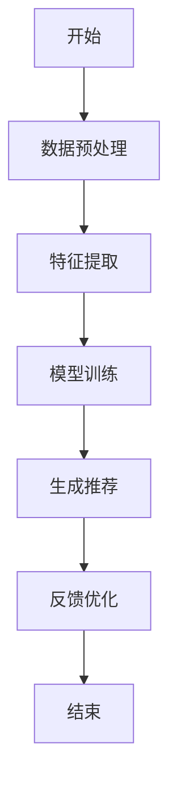
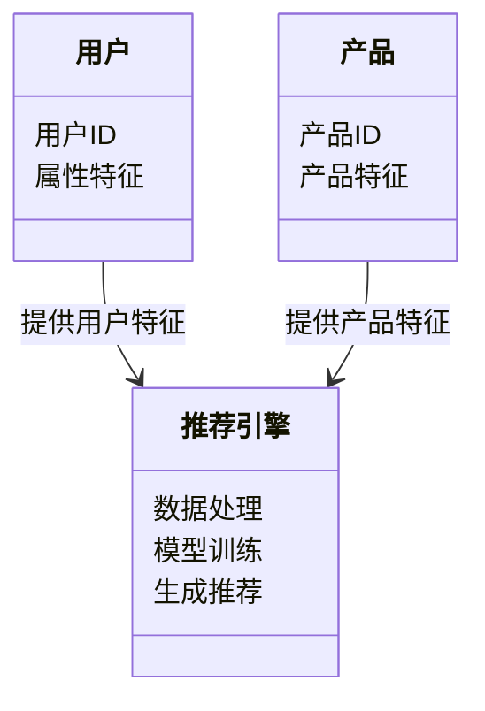
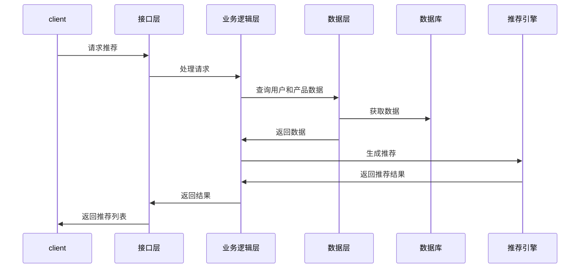

                 


# 开发智能化的金融产品交叉销售推荐引擎

> 关键词：金融产品、交叉销售、推荐引擎、人工智能、机器学习、深度学习

> 摘要：本文详细探讨了开发智能化金融产品交叉销售推荐引擎的核心技术与实现方法。从问题背景到算法选择，从系统架构设计到项目实战，系统地分析了推荐引擎在金融行业中的应用价值和实现过程。通过理论与实践相结合的方式，展示了如何利用人工智能技术提升金融产品的交叉销售效率和客户满意度。

---

## 第1章: 金融产品交叉销售推荐引擎的背景与概念

### 1.1 问题背景

#### 1.1.1 金融行业中的交叉销售挑战
金融行业竞争激烈，客户获取成本高，如何通过交叉销售现有客户以提高收入成为关键。传统交叉销售依赖人工经验，效率低，精准度差，难以应对海量数据和复杂需求。

#### 1.1.2 传统交叉销售的局限性
- 数据孤岛：各业务系统数据分散，缺乏统一整合和分析。
- 人工经验主导：依赖销售经验和直觉，难以系统化和优化。
- 客户洞察不足：难以准确捕捉客户需求变化，推荐缺乏针对性。

#### 1.1.3 智能化推荐引擎的必要性
智能化推荐引擎利用人工智能技术，通过大数据分析和深度学习模型，精准匹配客户需求与产品，提高销售效率和客户满意度，降低运营成本。

### 1.2 问题描述

#### 1.2.1 交叉销售的核心问题
如何基于客户行为数据和产品特征，推荐最相关的金融产品组合，实现精准销售。

#### 1.2.2 用户行为分析与预测
分析用户的历史交易、浏览行为、产品持有情况，预测用户的潜在需求。

#### 1.2.3 产品关联性建模
建立产品之间的关联关系，分析哪些产品组合能够提高销售概率。

### 1.3 问题解决与目标

#### 1.3.1 智能化推荐引擎的目标
- 提供实时、个性化的推荐服务。
- 提高交叉销售的成功率和客户满意度。
- 最大化产品推荐的收益。

#### 1.3.2 解决方案的框架
- 数据采集与预处理。
- 用户和产品特征提取。
- 构建推荐模型并优化。
- 实现实时推荐和反馈机制。

#### 1.3.3 边界与外延
- 仅考虑现有客户，不涉及新客户获取。
- 不处理单一产品推荐，专注于组合推荐。
- 不涉及产品定价和风险评估。

### 1.4 概念结构与核心要素

#### 1.4.1 核心概念的定义
- 用户：系统的目标客户。
- 产品：金融机构提供的金融产品。
- 推荐引擎：基于AI的推荐系统。
- 用户行为：用户与系统交互的记录。
- 推荐结果：推荐的产品组合。

#### 1.4.2 概念属性特征对比表
| 概念 | 属性 | 特征 |
|------|------|------|
| 用户 | ID | 唯一标识符 |
| 用户 | 属性 | 年龄、职业、收入 |
| 产品 | ID | 唯一标识符 |
| 产品 | 类型 | 理财、基金、保险 |

#### 1.4.3 ER实体关系图
```mermaid
er
  actor: 用户
  product: 产品
  recommendation: 推荐记录
  transaction: 交易记录
  relation: 关联关系
  actor -|many>| recommendation: 用户推荐关系
  product -|many>| recommendation: 产品推荐关系
  transaction -|many>| recommendation: 交易推荐关系
  product -|many>| relation: 产品关联关系
```

---

## 第2章: 交叉销售推荐引擎的核心概念与联系

### 2.1 核心概念原理

#### 2.1.1 数据处理与特征提取
- 数据预处理：清洗、去重、格式统一。
- 特征提取：从用户行为、产品属性中提取关键特征。

#### 2.1.2 模型训练与优化
- 训练推荐模型，调整参数，优化推荐效果。

#### 2.1.3 实时推荐与反馈机制
- 实时生成推荐结果，并根据用户反馈优化模型。

### 2.2 概念属性特征对比表
| 概念 | 属性 | 特征 |
|------|------|------|
| 用户 | 行为 | 浏览、点击、购买 |
| 产品 | 属性 | 风险等级、收益、期限 |
| 推荐结果 | 类型 | 组合推荐、单一推荐 |

### 2.3 ER实体关系图
```mermaid
er
  actor: 用户
  product: 产品
  recommendation: 推荐记录
  transaction: 交易记录
  actor -|many>| recommendation: 用户推荐关系
  product -|many>| recommendation: 产品推荐关系
  transaction -|many>| recommendation: 交易推荐关系
```

---

## 第3章: 算法原理与数学模型

### 3.1 算法原理

#### 3.1.1 协同过滤算法
基于用户行为数据，找到相似用户的偏好，推荐相似产品。

#### 3.1.2 基于内容的推荐算法
分析产品特征，推荐与当前产品相似的产品。

#### 3.1.3 深度学习推荐模型
使用神经网络模型，学习用户和产品的高维表示，生成推荐。

### 3.2 算法流程图


### 3.3 数学模型与公式

#### 3.3.1 协同过滤模型
计算用户间的相似度：
$$ \text{相似度} = \frac{\sum (x_i - \bar{x})(y_i - \bar{y})}{\sqrt{\sum (x_i - \bar{x})^2} \cdot \sqrt{\sum (y_i - \bar{y})^2}} $$

#### 3.3.2 深度学习模型
使用多层感知机（MLP）进行推荐：
$$ p(user, product) = f(W_1 \cdot x + b) $$
其中，$x$ 是输入特征，$W_1$ 是权重，$b$ 是偏置，$f$ 是激活函数。

---

## 第4章: 系统分析与架构设计

### 4.1 系统功能设计

#### 4.1.1 领域模型


#### 4.1.2 系统架构设计


### 4.2 系统接口设计

#### 4.2.1 API 接口
- GET /recommendations?userId=123
- POST /recommendations?productId=456

#### 4.2.2 交互流程图


---

## 第5章: 项目实战

### 5.1 环境安装

#### 5.1.1 安装Python
```bash
pip install python3
pip install numpy
pip install pandas
pip install scikit-learn
```

### 5.2 核心代码实现

#### 5.2.1 数据预处理
```python
import pandas as pd

data = pd.read_csv('transactions.csv')
data = data.drop_duplicates()
```

#### 5.2.2 特征提取
```python
from sklearn.preprocessing import StandardScaler

scaler = StandardScaler()
features = scaler.fit_transform(data[['age', 'income', 'risk_score']])
```

#### 5.2.3 模型训练
```python
from sklearn.neighbors import NearestNeighbors

model = NearestNeighbors(n_neighbors=5, algorithm='brute')
model.fit(features)
```

#### 5.2.4 生成推荐
```python
import numpy as np

user_features = scaler.transform([[30, 80000, 0.5]])
distances, indices = model.kneighbors(user_features)
recommended_products = data.iloc[indices[0]]
```

### 5.3 项目小结
通过项目实战，我们实现了从数据预处理到模型训练，再到推荐生成的完整流程，验证了推荐引擎在金融产品交叉销售中的实际应用价值。

---

## 第6章: 总结与展望

### 6.1 总结
本文详细介绍了开发智能化金融产品交叉销售推荐引擎的关键技术与实现方法，从理论到实践，全面展示了推荐引擎在金融行业中的应用。

### 6.2 未来展望
未来，推荐引擎可以进一步优化模型，引入实时数据流处理，加强用户隐私保护，探索更精准的推荐策略。

---

## 作者
作者：AI天才研究院/AI Genius Institute  
联系邮箱：contact@aicourse.com  
官方网站：https://www.aicourse.com

