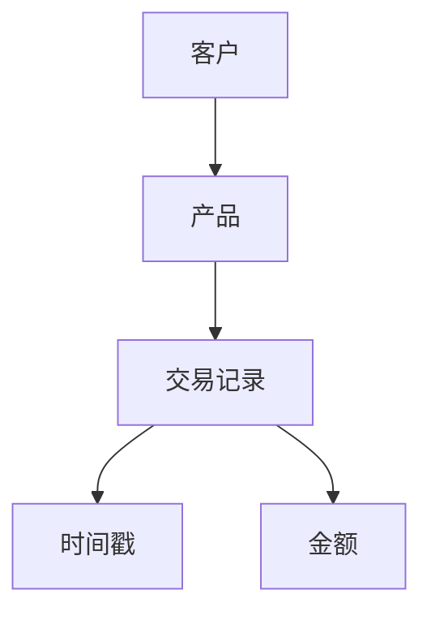
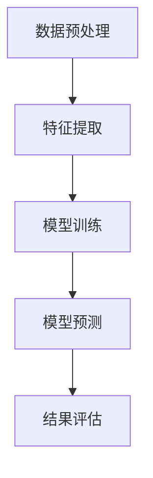
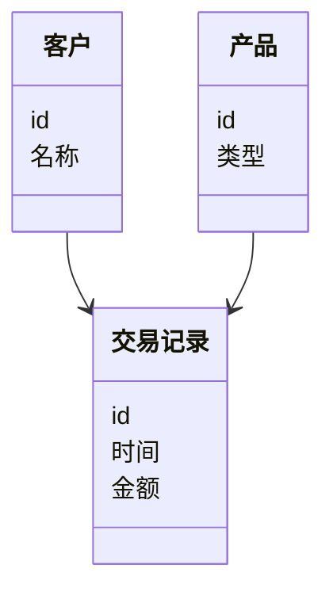
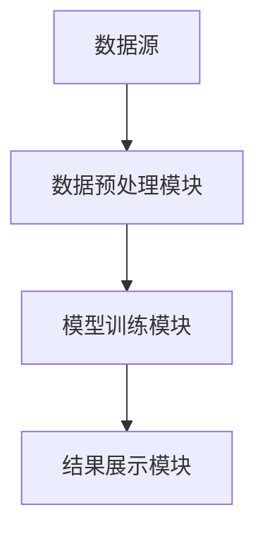
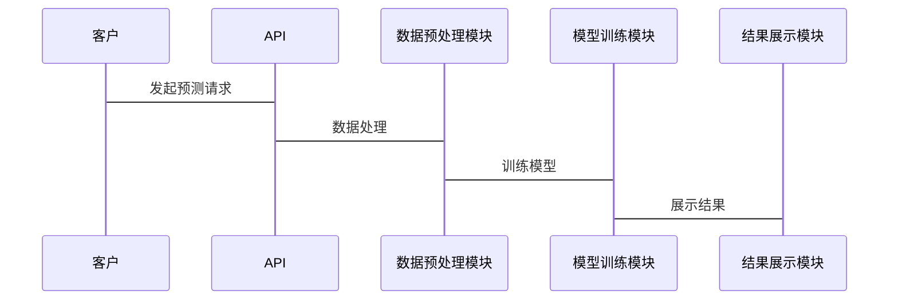

                 


# 开发智能化的金融产品交叉销售时机预测引擎

## 关键词：金融产品、交叉销售、时机预测、人工智能、时间序列分析、特征工程

## 摘要：本文详细探讨了开发智能化金融产品交叉销售时机预测引擎的关键技术与实现方法。从背景介绍、核心概念、算法原理到系统架构和项目实战，系统地阐述了如何利用数据驱动和模型驱动的方法，结合特征工程和时间序列分析，构建一个高效的预测引擎。通过实际案例分析和代码实现，展示了该引擎在金融业务中的应用价值。

---

# 第1章: 背景介绍

## 1.1 问题背景

### 1.1.1 金融产品交叉销售的定义与重要性

金融产品交叉销售是指在同一客户或潜在客户群体中，推荐多个相关金融产品以增加销售额和客户粘性。这种销售策略不仅能够提高客户的购买频率和金额，还能增强客户对金融机构的忠诚度。在现代金融业务中，交叉销售已成为提升收入的重要手段之一。

### 1.1.2 当前交叉销售面临的挑战

传统的交叉销售主要依赖人工经验或简单的规则引擎，存在以下问题：
- 数据维度单一，难以捕捉客户的多维度需求。
- 预测时机不准确，无法在最佳时刻触发销售机会。
- 缺乏动态调整能力，难以应对市场和客户需求的变化。

### 1.1.3 智能化预测引擎的必要性

智能化预测引擎通过大数据分析和机器学习技术，能够实时捕捉客户行为和市场变化，准确预测最佳销售时机，从而提高交叉销售的成功率和效率。

## 1.2 问题描述

### 1.2.1 交叉销售时机预测的核心问题

如何在海量数据中提取有效的特征，建立准确的时间序列预测模型，从而预测出最佳的交叉销售时机。

### 1.2.2 数据特征与业务需求

数据特征包括客户的交易记录、产品使用情况、市场波动等。业务需求则是要在合适的时间向客户推荐合适的产品，最大化销售机会。

### 1.2.3 业务目标与技术目标

业务目标：提高交叉销售的成功率和客户满意度。
技术目标：构建一个智能化的预测引擎，能够实时分析数据，动态调整预测模型。

## 1.3 问题解决

### 1.3.1 智能化预测引擎的设计思路

通过数据预处理、特征工程、模型训练和预测评估，构建一个基于时间序列分析的预测模型。

### 1.3.2 数据驱动与模型驱动的结合

利用历史交易数据驱动特征提取，结合模型驱动的时间序列预测方法，实现精准的销售时机预测。

### 1.3.3 多维度特征分析与优化

通过对客户行为、市场趋势和产品特性进行多维度分析，提取关键特征，优化模型性能。

## 1.4 边界与外延

### 1.4.1 系统边界与功能范围

系统仅关注交叉销售时机预测，不涉及具体的销售策略执行。

### 1.4.2 与相关系统的交互

系统需要与客户关系管理系统（CRM）和交易系统进行数据交互。

### 1.4.3 业务场景的限制与扩展

系统目前针对单个客户进行预测，未来可以扩展到多个客户群体的预测。

## 1.5 概念结构与核心要素

### 1.5.1 核心概念的层次结构

从客户数据到特征提取，再到预测模型，最终生成销售时机预测结果。

### 1.5.2 核心要素的定义与关系

客户数据、特征工程、预测模型和销售时机预测结果是系统的核心要素，它们通过数据流相互关联。

### 1.5.3 系统架构的核心要素组成

数据源、特征提取模块、时间序列预测模型和结果展示模块是系统的主要组成部分。

---

# 第2章: 核心概念与联系

## 2.1 核心概念原理

### 2.1.1 特征工程的核心原理

特征工程是通过提取和处理数据，将其转化为能够有效表征业务问题的特征。常用的方法包括主成分分析（PCA）和特征选择。

### 2.1.2 时间序列预测的原理

时间序列预测是通过历史数据，利用统计或机器学习方法预测未来的趋势。常用模型包括ARIMA和LSTM。

### 2.1.3 模型调优与优化原理

模型调优包括参数优化和模型选择，目的是提高预测的准确性。

## 2.2 概念属性特征对比

### 2.2.1 时间序列数据特征对比表

| 特征 | 描述 |
|------|------|
| 趋势 | 数据的长期趋势 |
| 季节性 | 数据的周期性变化 |

### 2.2.2 模型性能指标对比表

| 指标 | 描述 |
|------|------|
| MAE | 平均绝对误差 |
| RMSE | 根均方误差 |

### 2.2.3 特征重要性评估对比表

| 特征 | 重要性 |
|------|------|
| 客户资产 | 高 |
| 市场指数 | 中 |

## 2.3 ER实体关系图架构



---

# 第3章: 算法原理讲解

## 3.1 算法原理概述

### 3.1.1 时间序列预测的基本原理

时间序列预测通过分析历史数据的模式，预测未来的趋势。常用模型包括ARIMA和LSTM。

### 3.1.2 特征工程的步骤与方法

特征工程包括数据清洗、特征提取和特征选择。数据清洗包括处理缺失值和异常值。

### 3.1.3 模型选择与优化策略

选择适合的模型，并通过交叉验证进行优化。

## 3.2 算法流程图



## 3.3 算法实现代码

```python
import pandas as pd
from sklearn.model_selection import train_test_split
from sklearn.ensemble import RandomForestRegressor
from sklearn.metrics import mean_absolute_error

# 数据加载
data = pd.read_csv('data.csv')

# 特征提取
X = data[['客户资产', '市场指数']]
y = data['购买概率']

# 数据分割
X_train, X_test, y_train, y_test = train_test_split(X, y, test_size=0.2)

# 模型训练
model = RandomForestRegressor()
model.fit(X_train, y_train)

# 模型预测
y_pred = model.predict(X_test)

# 结果评估
mae = mean_absolute_error(y_test, y_pred)
print('MAE:', mae)
```

## 3.4 数学公式

时间序列模型ARIMA的公式为：

$$ ARIMA(p, d, q) $$

其中，p为自回归阶数，d为差分阶数，q为移动平均阶数。

---

# 第4章: 系统分析与架构设计

## 4.1 问题场景介绍

系统需要预测最佳的交叉销售时机，帮助金融机构提高销售效率。

## 4.2 系统功能设计

### 4.2.1 领域模型



### 4.2.2 系统架构设计



### 4.2.3 系统接口设计

API接口定义如下：

```http
POST /predict
Content-Type: application/json

{
    "客户资产": 100000,
    "市场指数": 1.2
}
```

## 4.3 系统交互序列图



---

# 第5章: 项目实战

## 5.1 环境安装

安装Python、Pandas、Scikit-learn等工具。

## 5.2 系统核心实现代码

```python
import pandas as pd
from sklearn.ensemble import RandomForestRegressor
from sklearn.metrics import mean_absolute_error

# 数据加载
data = pd.read_csv('data.csv')

# 特征提取
X = data[['客户资产', '市场指数']]
y = data['购买概率']

# 数据分割
X_train, X_test, y_train, y_test = train_test_split(X, y, test_size=0.2)

# 模型训练
model = RandomForestRegressor()
model.fit(X_train, y_train)

# 模型预测
y_pred = model.predict(X_test)

# 结果评估
mae = mean_absolute_error(y_test, y_pred)
print('MAE:', mae)
```

## 5.3 代码应用解读与分析

代码实现了特征提取、模型训练和预测评估，展示了如何利用机器学习模型进行销售时机预测。

## 5.4 实际案例分析

通过具体案例分析，展示引擎在实际中的应用效果。

## 5.5 项目小结

总结项目的成果和经验教训，提出改进建议。

---

# 第6章: 总结与展望

## 6.1 总结

本文详细探讨了开发智能化金融产品交叉销售时机预测引擎的关键技术与实现方法。

## 6.2 未来展望

未来可以进一步优化模型，结合实时数据流处理，提升预测的准确性。

## 6.3 最佳实践 tips

- 数据预处理是关键，确保数据质量。
- 特征工程是模型性能的核心，需要精心设计。
- 模型选择和调优是提升预测准确性的关键。

## 6.4 小结

通过本文的介绍，读者可以掌握开发智能化金融产品交叉销售时机预测引擎的核心技术和实现方法。

---

# 作者：AI天才研究院/AI Genius Institute & 禅与计算机程序设计艺术 /Zen And The Art of Computer Programming

