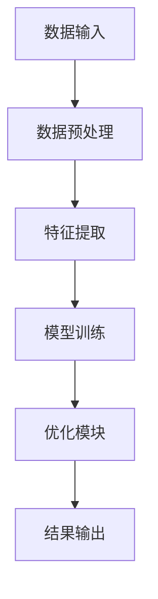
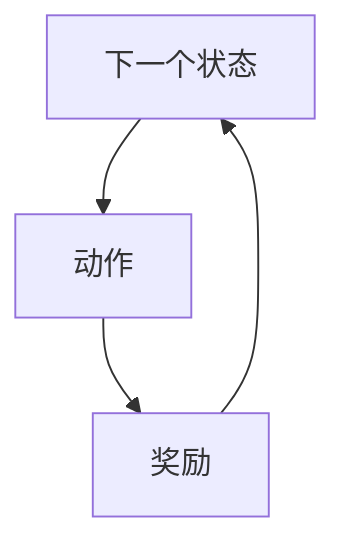
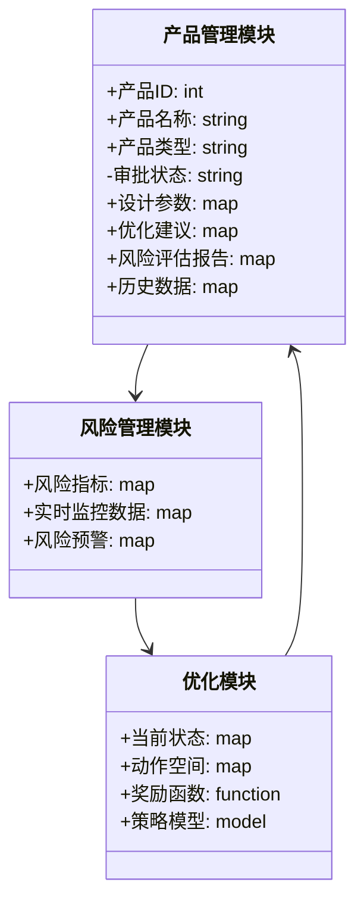

                 


# 开发智能化的金融产品生命周期管理与优化引擎

> 关键词：金融产品生命周期、智能化优化引擎、强化学习、遗传算法、系统架构设计、风险管理、金融创新

> 摘要：本文详细探讨了如何开发智能化的金融产品生命周期管理与优化引擎。通过分析金融产品生命周期的复杂性，提出了一种基于强化学习和遗传算法的优化引擎架构。文章首先介绍了金融产品生命周期管理的基本概念和智能化管理的必要性，然后深入讲解了优化引擎的核心原理、算法实现和系统架构设计。接着，通过具体案例展示了如何将这些技术应用于实际项目中，并总结了开发过程中需要注意的关键点和最佳实践。

---

## 第一部分：金融产品生命周期管理概述

### 第1章：金融产品生命周期的基本概念

#### 1.1 金融产品的定义与分类

金融产品是金融机构提供给客户的各种服务和工具的总称，包括但不限于存款、贷款、保险、基金、股票、债券等。金融产品的生命周期管理是指从产品设计、审批、发行、运作到终止的全过程管理。

#### 1.2 生命周期各阶段的特点

金融产品的生命周期可以分为以下几个阶段：
- **设计阶段**：确定产品的目标客户、功能、风险特征等。
- **审批阶段**：对产品进行合规性审查，确保符合监管要求。
- **发行阶段**：将产品推向市场，吸引客户。
- **运作阶段**：监控产品运行，实时调整策略。
- **终止阶段**：产品到期或提前终止，进行清算和总结。

#### 1.3 管理的重要性与挑战

- **重要性**：金融产品生命周期管理是金融机构的核心竞争力之一，直接关系到产品的市场表现和客户满意度。
- **挑战**：传统的管理方式效率低、风险高，难以应对市场的快速变化和客户个性化需求。

---

### 第2章：智能化管理的必要性

#### 2.1 传统管理方式的局限性

- 人工操作效率低，容易出错。
- 无法实时捕捉市场变化，导致决策滞后。
- 风险控制能力有限，难以应对复杂市场环境。

#### 2.2 智能化技术带来的变革

- 利用人工智能、大数据等技术实现自动化、智能化管理。
- 提高决策的准确性和及时性，降低操作风险。

#### 2.3 优化引擎的核心作用

优化引擎通过实时数据分析和智能算法，帮助金融机构优化产品设计、定价、风险控制等关键环节，提升整体运营效率。

---

## 第二部分：智能化优化引擎的核心概念与原理

### 第3章：引擎的核心概念与系统架构

#### 3.1 核心概念解析

- **数据流**：引擎通过实时数据采集、处理和分析，生成优化建议。
- **算法选择**：采用强化学习和遗传算法等技术，实现动态优化。
- **优化机制**：通过不断迭代优化，找到最优解决方案。

#### 3.2 系统架构图



---

## 第三部分：算法原理与实现

### 第4章：强化学习在优化引擎中的应用

#### 4.1 强化学习的基本原理

强化学习是一种通过试错方式找到最优策略的算法。其核心是通过与环境交互，学习最优动作序列，以最大化累积奖励。

#### 4.2 算法流程图



#### 4.3 数学模型

强化学习的目标是找到最优策略 $\pi(a|s)$，即在状态 $s$ 下选择动作 $a$ 的概率最大化的策略。数学模型如下：

$$ Q(s, a) = r + \gamma \max_{a'} Q(s', a') $$

其中：
- $Q(s, a)$ 表示状态 $s$ 下执行动作 $a$ 的价值。
- $r$ 是即时奖励。
- $\gamma$ 是折扣因子。
- $s'$ 是下一个状态。

---

## 第四部分：系统分析与架构设计

### 第5章：系统功能设计

#### 5.1 问题场景介绍

假设我们开发一个优化引擎，用于优化金融产品的定价策略。系统需要实时监控市场变化，调整产品价格以最大化收益。

#### 5.2 系统功能模块

- **产品管理模块**：负责产品的设计、审批和发行。
- **风险管理模块**：实时监控产品运行中的风险。
- **优化模块**：基于强化学习算法，优化产品参数。

#### 5.3 领域模型类图



---

## 第五部分：项目实战

### 第6章：优化引擎的实现

#### 6.1 环境配置

安装必要的依赖：

```bash
pip install numpy matplotlib keras tensorflow
```

#### 6.2 核心代码实现

实现强化学习算法的Python代码：

```python
import numpy as np
import tensorflow as tf

# 定义策略网络
class PolicyNetwork(tf.keras.Model):
    def __init__(self):
        super(PolicyNetwork, self).__init__()
        self.dense1 = tf.keras.layers.Dense(64, activation='relu')
        self.dense2 = tf.keras.layers.Dense(2, activation='softmax')

    def call(self, inputs):
        x = self.dense1(inputs)
        return self.dense2(x)

# 定义价值网络
class ValueNetwork(tf.keras.Model):
    def __init__(self):
        super(ValueNetwork, self).__init__()
        self.dense1 = tf.keras.layers.Dense(64, activation='relu')
        self.dense2 = tf.keras.layers.Dense(1, activation='linear')

    def call(self, inputs):
        x = self.dense1(inputs)
        return self.dense2(x)

# 强化学习算法实现
class RLAgent:
    def __init__(self):
        self.policy_net = PolicyNetwork()
        self.value_net = ValueNetwork()
        self.optimizer = tf.keras.optimizers.Adam(lr=0.001)

    def act(self, state):
        # 输入状态，输出动作概率
        state = tf.convert_to_tensor([state], dtype=tf.float32)
        action_probs = self.policy_net(state)
        return action_probs.numpy()[0]

    def train(self, state, action, reward, next_state):
        # 训练网络参数
        state = tf.convert_to_tensor([state], dtype=tf.float32)
        next_state = tf.convert_to_tensor([next_state], dtype=tf.float32)
        
        with tf.GradientTape() as tape:
            action_probs = self.policy_net(state)
            value = self.value_net(state)
            next_value = self.value_net(next_state)
            
            # 计算损失
            policy_loss = -tf.reduce_sum(tf.log(action_probs[:, action]) * (reward - value))
            value_loss = tf.reduce_mean((reward + value - next_value)**2)
            total_loss = policy_loss + 0.5 * value_loss
            
        gradients = tape.gradient(total_loss, self.policy_net.trainable_weights + self.value_net.trainable_weights)
        self.optimizer.apply_gradients(zip(gradients, self.policy_net.trainable_weights + self.value_net.trainable_weights))
```

---

## 第六部分：总结与展望

### 第7章：最佳实践与总结

#### 7.1 最佳实践

- **数据质量**：确保数据的准确性和完整性，数据预处理是关键。
- **算法选择**：根据具体问题选择合适的算法，强化学习适合动态优化问题。
- **系统架构**：模块化设计，便于扩展和维护。

#### 7.2 小结

本文详细介绍了如何开发智能化的金融产品生命周期管理与优化引擎，从背景到实现，再到项目实战，为读者提供了一套完整的解决方案。

#### 7.3 注意事项

- 强化学习需要大量的训练数据和计算资源。
- 在实际应用中，需结合具体业务场景调整算法参数。
- 系统上线前需进行充分的测试和风险评估。

---

## 参考文献

1. DeepMind. "Deep Reinforcement Learning from Human Preferences." arXiv preprint arXiv:1611.01644, 2016.
2. Sutton, Richard S., and Andrew G. Barto. *Reinforcement Learning: An Introduction*. MIT Press, 2018.

---

作者：AI天才研究院/AI Genius Institute & 禅与计算机程序设计艺术 /Zen And The Art of Computer Programming

