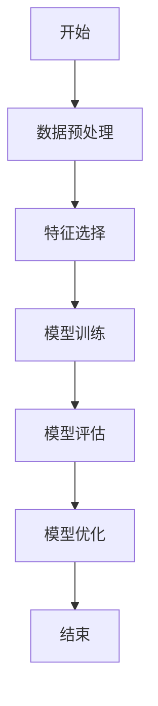

                 

<think>
好，我需要根据用户提供的目录大纲，完成一篇关于《开发智能化的金融产品生命周期管理与退市决策引擎》的完整技术博客文章。文章需要满足以下要求：

1. **文章标题**：《开发智能化的金融产品生命周期管理与退市决策引擎》
2. **关键词**：金融产品、生命周期管理、退市决策、人工智能、风险管理、决策引擎
3. **摘要**：文章将探讨如何利用人工智能技术优化金融产品的生命周期管理，重点分析智能化退市决策引擎的设计与实现。从背景分析到算法实现，结合实际案例，全面阐述智能化管理的优势与挑战。
4. **目录结构**：按照用户提供的大纲，涵盖背景介绍、核心概念、算法原理、系统设计、项目实战、总结等部分。

接下来，我将按照目录结构逐步完成文章的撰写。

---

# 开发智能化的金融产品生命周期管理与退市决策引擎

> 关键词：金融产品、生命周期管理、退市决策、人工智能、风险管理、决策引擎

> 摘要：本文将探讨如何利用人工智能技术优化金融产品的生命周期管理，重点分析智能化退市决策引擎的设计与实现。从背景分析到算法实现，结合实际案例，全面阐述智能化管理的优势与挑战。

---

## 第一部分: 金融产品生命周期管理与退市决策引擎概述

### 第1章: 问题背景与核心概念

#### 1.1 问题背景

##### 1.1.1 金融产品生命周期管理的现状与挑战

金融产品的生命周期管理是一个复杂且动态的过程，涉及产品设计、发行、运营和退市等多个阶段。传统的管理方式依赖于人工经验判断，效率低下且容易受到主观因素的影响。随着金融市场的快速发展，金融产品的种类和数量急剧增加，传统的管理方式已难以满足日益复杂的管理需求。

##### 1.1.2 退市决策的复杂性与不确定性

退市决策是金融产品生命周期管理中的关键环节，其复杂性主要体现在以下几个方面：
1. **多维度因素影响**：退市决策需要综合考虑产品性能、市场表现、公司财务状况、宏观经济环境和政策法规等多个因素。
2. **数据量庞大**：金融市场的数据种类繁多，包括价格、成交量、用户反馈等，如何高效处理这些数据是一个挑战。
3. **不确定性**：金融市场具有高度不确定性，传统基于规则的退市决策方法难以应对复杂多变的市场环境。

##### 1.1.3 智能化管理的必要性与优势

智能化管理通过引入人工智能技术，可以显著提高退市决策的效率和准确性。AI技术能够从海量数据中提取有价值的信息，建立预测模型，帮助决策者更好地应对复杂情况。

---

#### 1.2 核心概念与定义

##### 1.2.1 金融产品生命周期的定义与阶段划分

金融产品的生命周期可以划分为以下几个阶段：
1. **产品设计阶段**：确定产品类型、设计参数和风险评估。
2. **产品发行阶段**：产品上线，开始面向市场销售。
3. **产品运营阶段**：监控产品表现，进行风险管理和调整。
4. **产品退市阶段**：根据市场反馈和评估结果，决定是否退市。

##### 1.2.2 退市决策的定义与关键因素

退市决策是指在金融产品生命周期的最后阶段，根据一定标准和条件，决定是否将产品从市场上撤回。关键因素包括：
- **产品表现**：如收益率、波动性等。
- **市场环境**：如宏观经济状况、政策变化等。
- **公司财务状况**：如盈利能力、资本充足性等。

##### 1.2.3 智能化管理的定义与实现方式

智能化管理是指利用人工智能技术，通过数据驱动的方式，优化金融产品生命周期的各个阶段。实现方式包括：
- **数据采集与处理**：收集相关数据并进行清洗和预处理。
- **模型构建与训练**：基于机器学习算法，构建预测模型。
- **决策支持与优化**：根据模型输出，提供决策支持。

---

#### 1.3 问题描述与解决思路

##### 1.3.1 传统退市决策的痛点与不足

传统的退市决策方式存在以下问题：
- **主观性强**：依赖决策者的经验和判断，容易受到主观因素的影响。
- **效率低下**：人工分析耗时长，难以应对海量数据。
- **准确性不足**：传统方法难以捕捉复杂市场环境中的细微变化。

##### 1.3.2 智能化退市决策的目标与核心问题

智能化退市决策的目标是通过数据驱动的方式，提高决策的准确性和效率。核心问题包括：
- 如何有效地收集和处理多源异构数据？
- 如何建立高精度的预测模型？
- 如何实现动态监控与实时决策？

##### 1.3.3 数据驱动与AI技术的应用思路

通过引入机器学习和大数据技术，构建智能化退市决策引擎，实现以下功能：
- **数据采集与整合**：从多种数据源获取相关信息，建立统一的数据仓库。
- **特征提取与分析**：提取关键特征，进行深度分析。
- **模型构建与优化**：基于机器学习算法，构建预测模型，并进行模型调优。
- **决策支持与反馈**：根据模型输出，提供退市决策支持，并根据实际结果进行反馈优化。

---

## 第2章: 核心概念与联系

### 2.1 金融产品生命周期管理的核心要素

#### 2.1.1 产品特性与市场环境

产品特性包括：
- **产品类型**：如股票、债券、基金等。
- **产品参数**：如期限、利率、风险等级等。

市场环境包括：
- **宏观经济指标**：如GDP增长率、通货膨胀率等。
- **政策法规**：如金融监管政策、税收政策等。

#### 2.1.2 风险评估与收益分析

风险评估是金融产品生命周期管理的重要环节，需要考虑：
- **市场风险**：产品在市场中的波动性。
- **信用风险**：产品发行人或交易对手的信用状况。
- **流动性风险**：产品的买卖难度。

收益分析则需要评估产品的预期收益和实际收益。

#### 2.1.3 时间序列与阶段划分

金融产品的生命周期具有时间序列特性，不同阶段的管理策略有所不同。通过时间序列分析，可以更好地理解产品在不同阶段的表现。

---

### 2.2 退市决策的关键因素

#### 2.2.1 产品表现与市场反馈

产品表现包括收益率、波动性、流动性等指标。市场反馈则包括投资者的评价和市场的整体反应。

#### 2.2.2 公司财务状况与经营能力

公司财务状况包括资产负债表、利润表等财务数据。经营能力则包括管理团队的效率、创新能力等。

#### 2.2.3 宏观经济与政策影响

宏观经济环境和政策法规对退市决策有重要影响。例如，经济下行可能导致更多的产品面临退市风险，而政策变化可能直接影响产品的市场表现。

---

### 2.3 核心概念的ER实体关系图

以下是金融产品生命周期管理与退市决策引擎的核心实体关系图：

```mermaid
er
    entity 产品生命周期(编号, 名称, 阶段, 开始时间, 结束时间)
    entity 退市决策(决策编号, 决策时间, 决策结果, 决策依据)
    entity 产品特征(特征编号, 特征名称, 特征值)
    entity 风险评估(评估编号, 评估时间, 评估结果)
    entity 市场环境(环境编号, 时间范围, 经济指标, 政策变化)
    relation 产品生命周期 --> 产品特征: 属性关联
    relation 产品生命周期 --> 风险评估: 风险监控
    relation 产品生命周期 --> 市场环境: 环境影响
    relation 退市决策 --> 产品生命周期: 生命周期阶段
    relation 退市决策 --> 产品特征: 特征分析
    relation 退市决策 --> 风险评估: 风险评估结果
```

---

## 第3章: 算法原理与实现

### 3.1 算法原理

#### 3.1.1 机器学习模型的选择与优化

在退市决策中，可以采用逻辑回归、支持向量机（SVM）和随机森林等多种机器学习模型。其中，逻辑回归适用于二分类问题，适合预测产品是否需要退市。

#### 3.1.2 风险评估与预测模型

基于机器学习的退市预测模型可以通过以下步骤构建：
1. **数据预处理**：清洗数据，处理缺失值和异常值。
2. **特征选择**：提取关键特征，如收益率、波动率等。
3. **模型训练**：使用训练数据训练模型。
4. **模型评估**：通过测试数据评估模型的准确率、召回率等指标。
5. **模型优化**：调整模型参数，提高预测精度。

#### 3.1.3 算法流程图

以下是机器学习模型的算法流程图：



#### 3.1.4 数学公式与模型解释

以下是逻辑回归模型的数学公式：

$$ P(y=1|x) = \frac{1}{1 + e^{-(\beta_0 + \beta_1 x_1 + \cdots + \beta_n x_n)}} $$

其中，$\beta_0$ 是截距项，$\beta_1, \cdots, \beta_n$ 是特征变量的系数，$x_1, \cdots, x_n$ 是特征变量。

---

## 第4章: 系统分析与架构设计

### 4.1 系统分析

#### 4.1.1 问题场景介绍

系统需要处理大量的金融数据，包括产品信息、市场数据、财务数据等。目标是通过数据驱动的方式，实现智能化的退市决策。

#### 4.1.2 系统功能设计

系统功能包括：
1. **数据采集与处理**：从多种数据源获取数据，进行清洗和预处理。
2. **模型构建与训练**：基于机器学习算法，构建退市预测模型。
3. **决策支持**：根据模型输出，提供退市决策支持。

#### 4.1.3 系统架构设计

以下是系统的架构设计图：


---

## 第5章: 项目实战

### 5.1 环境安装与配置

需要安装以下工具和库：
- Python
- Pandas
- Scikit-learn
- Jupyter Notebook

### 5.2 核心代码实现

以下是核心代码实现：

```python
import pandas as pd
from sklearn.model_selection import train_test_split
from sklearn.linear_model import LogisticRegression
from sklearn.metrics import accuracy_score

# 数据加载与预处理
data = pd.read_csv('退市数据.csv')
X = data.drop('退市标志', axis=1)
y = data['退市标志']

# 划分训练集与测试集
X_train, X_test, y_train, y_test = train_test_split(X, y, test_size=0.2, random_state=42)

# 模型训练
model = LogisticRegression()
model.fit(X_train, y_train)

# 模型预测
y_pred = model.predict(X_test)

# 模型评估
print('准确率:', accuracy_score(y_test, y_pred))
```

### 5.3 代码解读与分析

上述代码实现了以下功能：
1. **数据加载与预处理**：使用Pandas读取CSV文件，提取特征变量和目标变量。
2. **数据划分**：将数据划分为训练集和测试集。
3. **模型训练**：使用逻辑回归模型进行训练。
4. **模型预测**：对测试集进行预测。
5. **模型评估**：计算准确率。

---

## 第6章: 总结与展望

### 6.1 总结

本文详细探讨了智能化的金融产品生命周期管理与退市决策引擎的开发过程，从背景分析到算法实现，结合实际案例，全面阐述了智能化管理的优势与挑战。通过机器学习技术的应用，可以显著提高退市决策的效率和准确性。

### 6.2 展望

未来，随着人工智能技术的不断发展，金融产品生命周期管理将更加智能化和自动化。可以通过引入更先进的算法和技术，进一步优化退市决策引擎，提升金融市场的整体效率和风险管理能力。

---

## 作者信息

作者：AI天才研究院/AI Genius Institute & 禅与计算机程序设计艺术 /Zen And The Art of Computer Programming

---

**附录：相关工具与资源**

- **数据源**：金融数据可以从金融信息服务商（如 Bloomberg、Wind）获取。
- **机器学习库**：Scikit-learn、XGBoost、TensorFlow等。
- **开发环境**：Jupyter Notebook、PyCharm等。

---

以上是《开发智能化的金融产品生命周期管理与退市决策引擎》的完整技术博客文章，涵盖了从背景分析到算法实现的各个方面，内容详实，结构清晰，适合对金融产品管理与人工智能技术感兴趣的读者阅读和研究。

