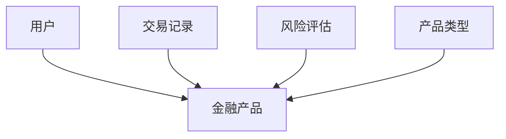
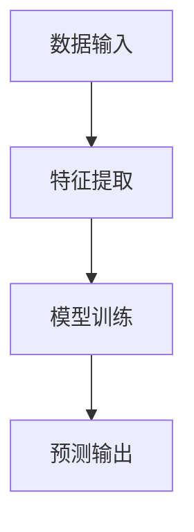
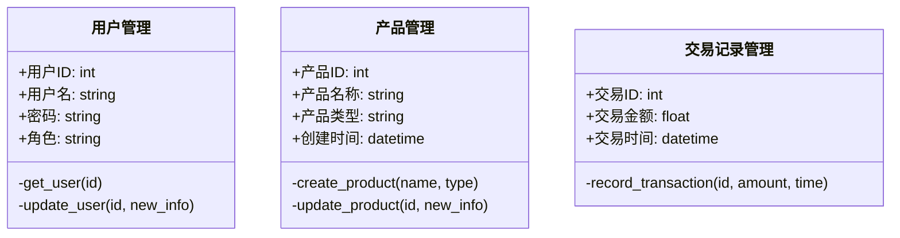
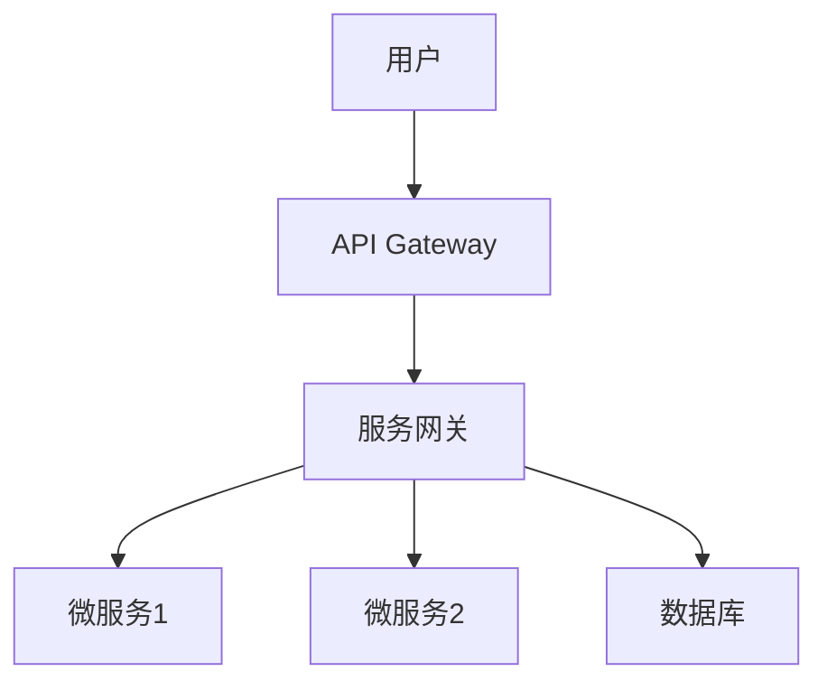
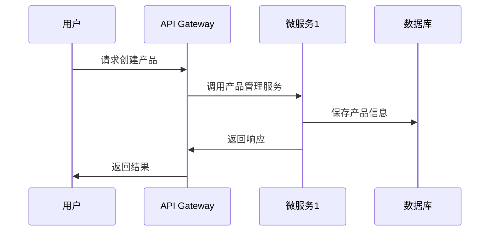

                 


# 开发智能化的金融产品生命周期管理平台

## 关键词：金融产品生命周期管理、智能化平台、机器学习、自然语言处理、系统架构设计

## 摘要：  
随着金融行业的快速发展，金融产品的生命周期管理变得日益复杂。传统的管理方式已经难以满足高效、精准的需求。本书将介绍如何开发一个智能化的金融产品生命周期管理平台，通过结合机器学习和自然语言处理等技术，实现金融产品的智能化管理。本书详细讲解了平台的核心概念、算法原理、系统架构设计以及项目实战，为读者提供一套完整的解决方案。

---

# 第1章: 背景介绍

## 1.1 问题背景

### 1.1.1 传统金融产品管理的痛点
传统金融产品管理存在流程复杂、效率低下、风险控制不足等问题。例如，产品审批周期长，人工操作易出错，数据孤岛导致信息不透明。

### 1.1.2 智能化管理的需求
随着大数据和人工智能技术的发展，金融行业对智能化管理的需求日益迫切。智能化管理能够提高效率、降低风险、优化决策。

### 1.1.3 金融行业数字化转型的必要性
数字化转型是金融行业提升竞争力的重要手段。通过智能化平台，金融机构可以更好地应对市场变化和客户需求。

## 1.2 问题描述

### 1.2.1 金融产品生命周期的复杂性
金融产品从设计、审批、发行到终止，涉及多个环节和部门，流程复杂且容易出错。

### 1.2.2 现有管理系统的不足
现有系统通常依赖人工操作，效率低，且难以应对复杂的市场变化和风险评估。

### 1.2.3 智能化管理的必要性
通过智能化平台，可以实现自动化、数据驱动的管理，提高效率和准确性。

## 1.3 问题解决

### 1.3.1 智能化管理的解决方案
采用机器学习和自然语言处理技术，构建智能化管理平台，实现自动化流程和智能决策。

### 1.3.2 平台的目标与定位
平台的目标是实现金融产品生命周期的智能化管理，定位是金融机构的数字化转型工具。

### 1.3.3 平台的核心功能
包括产品设计、审批、发行、监控和终止等环节的智能化管理。

## 1.4 边界与外延

### 1.4.1 平台的功能边界
平台仅负责金融产品的生命周期管理，不涉及其他业务模块。

### 1.4.2 平台的外延扩展
未来可以扩展到更多业务领域，如客户关系管理、风险评估等。

### 1.4.3 平台与其他系统的接口关系
平台需要与银行核心系统、客户关系管理系统等进行接口对接。

## 1.5 核心要素组成

### 1.5.1 平台的核心模块
包括用户管理、产品管理、交易记录管理、风险评估模块等。

### 1.5.2 各模块之间的关系
用户管理模块与产品管理模块交互，交易记录模块与风险评估模块结合。

### 1.5.3 平台的整体架构
采用分层架构，包括数据层、业务逻辑层和用户界面层。

---

# 第2章: 核心概念与联系

## 2.1 核心概念原理

### 2.1.1 智能化管理的核心原理
通过机器学习和自然语言处理技术，实现数据驱动的决策和自动化流程。

### 2.1.2 数据驱动的决策机制
利用大数据分析，提供实时风险评估和市场趋势预测。

### 2.1.3 自动化流程的核心算法
采用机器学习算法，实现自动化审批和流程优化。

## 2.2 核心概念属性特征对比

### 2.2.1 模块化与整体性的对比
模块化便于维护和扩展，整体性保证系统协调运行。

### 2.2.2 数据驱动与规则驱动的对比
数据驱动更具灵活性和准确性，规则驱动适用于已知规则的场景。

### 2.2.3 自动化与半自动化的对比
自动化效率高，半自动化适用于复杂场景。

## 2.3 ER实体关系图



---

# 第3章: 算法原理讲解

## 3.1 算法原理

### 3.1.1 机器学习算法
采用时间序列分析（如ARIMA模型）和自然语言处理（如文本分类）算法。

### 3.1.2 自然语言处理算法
使用文本分类算法（如朴素贝叶斯）进行文档分类。

## 3.2 算法流程图



## 3.3 算法实现代码

### 时间序列分析代码

```python
import pandas as pd
from statsmodels.tsa.arima_model import ARIMA

# 加载数据
data = pd.read_csv('data.csv')

# 模型训练
model = ARIMA(data['value'], order=(5, 1, 0))
model_fit = model.fit(disp=0)

# 预测
forecast = model_fit.forecast(steps=5)
print(forecast)
```

### 文本分类代码

```python
from sklearn.feature_extraction.text import TfidfVectorizer
from sklearn.naive_bayes import MultinomialNB

# 数据准备
texts = ["This is a positive text.", "This is a negative text."]

# 特征提取
vectorizer = TfidfVectorizer()
X = vectorizer.fit_transform(texts)

# 模型训练
model = MultinomialNB()
model.fit(X, [1, 0])

# 预测
new_text = ["This is a great product."]
X_new = vectorizer.transform(new_text)
prediction = model.predict(X_new)
print(prediction)
```

---

# 第4章: 数学模型和公式

## 4.1 时间序列分析模型

$$ ARIMA(p, d, q) $$

## 4.2 风险评估模型

$$ \text{风险评分} = \alpha \times \text{信用评分} + \beta \times \text{交易记录} $$

---

# 第5章: 系统分析与架构设计方案

## 5.1 项目背景

### 5.1.1 项目介绍
开发一个智能化的金融产品生命周期管理平台，目标是实现高效、精准的管理。

## 5.2 系统功能设计

### 5.2.1 领域模型



### 5.2.2 系统架构设计



### 5.2.3 接口设计



---

# 第6章: 项目实战

## 6.1 环境安装

### 6.1.1 安装Python和相关库
安装Python 3.8及以上版本，安装Pandas、Scikit-learn、statsmodels等库。

## 6.2 系统核心实现源代码

### 6.2.1 用户管理模块

```python
class User:
    def __init__(self, user_id, username, password, role):
        self.user_id = user_id
        self.username = username
        self.password = password
        self.role = role

    def get_user(self, user_id):
        # 返回用户信息
        pass

    def update_user(self, new_info):
        # 更新用户信息
        pass
```

### 6.2.2 产品管理模块

```python
class Product:
    def __init__(self, product_id, product_name, product_type, create_time):
        self.product_id = product_id
        self.product_name = product_name
        self.product_type = product_type
        self.create_time = create_time

    def create_product(self, name, type):
        # 创建产品
        pass

    def update_product(self, product_id, new_info):
        # 更新产品信息
        pass
```

## 6.3 案例分析

### 6.3.1 风险评估案例
使用ARIMA模型预测金融产品的风险评分，实现自动化风险监控。

## 6.4 项目小结

### 6.4.1 项目总结
通过开发智能化平台，实现了金融产品的高效管理，提升了金融机构的竞争力。

---

# 第7章: 总结与展望

## 7.1 总结

本书详细介绍了开发智能化金融产品生命周期管理平台的核心概念、算法原理、系统架构设计以及项目实战。通过这些内容，读者可以掌握如何构建一个高效的智能化管理平台。

## 7.2 展望

未来，随着人工智能技术的不断发展，智能化管理平台将更加智能化和自动化。同时，数据安全和隐私保护也将成为平台发展的重要方向。

---

# 附录

## 附录A: 工具安装指南
如何安装Python和相关库，配置开发环境。

## 附录B: 常用API接口
平台提供的API接口及其使用方法。

## 附录C: 参考文献
相关书籍和论文的引用。

---

# 作者：AI天才研究院/AI Genius Institute & 禅与计算机程序设计艺术 /Zen And The Art of Computer Programming

---

通过以上目录，读者可以系统地学习如何开发智能化的金融产品生命周期管理平台，从理论到实践，全面掌握相关技术和方法。

