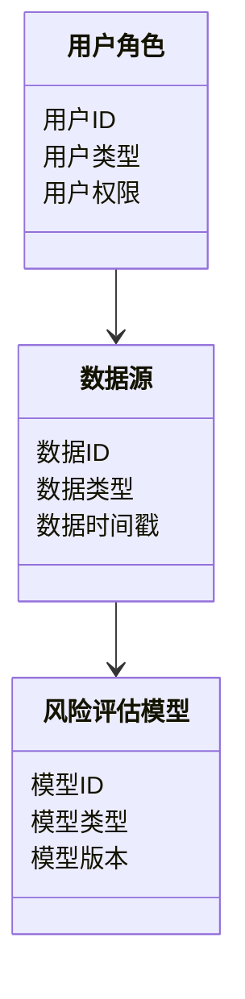

                 


# 开发智能化的金融产品生命周期风险动态管理平台

**关键词**: 金融产品生命周期, 风险管理, 智能化, 机器学习, 实时监控

**摘要**: 本文详细探讨了开发智能化的金融产品生命周期风险动态管理平台的关键步骤。通过分析金融产品管理中的挑战，结合人工智能技术，提出了基于数据驱动的解决方案。文章涵盖了平台的核心概念、算法原理、系统架构设计以及项目实战，提供了从理论到实践的全面指导。通过具体案例分析，展示了平台在实时监控和风险预警中的实际应用，为金融行业的风险管理提供了新的思路。

---

## 第一部分: 背景介绍

### 第1章: 问题背景与描述

#### 1.1 问题背景

在金融行业，产品的生命周期管理涉及从研发到退市的多个阶段，每个阶段都伴随着不同的风险。传统的方法依赖于人工监控和定期报告，这种方法效率低下且难以捕捉实时变化。随着市场的波动和客户需求的多样化，传统的静态风险管理方式已无法满足现代金融业务的需求。

#### 1.2 问题描述

金融产品的生命周期管理面临以下挑战：
1. **复杂性**：产品的生命周期涉及多个部门和系统，协调复杂。
2. **动态性**：市场环境和客户需求不断变化，风险也随之动态变化。
3. **数据碎片化**：各阶段数据分散，难以形成统一的视图。

#### 1.3 问题解决思路

智能化的金融产品生命周期风险动态管理平台通过数据驱动的方法，实时监控和分析各阶段数据，预测潜在风险并提供预警。该平台能够自动调整策略，优化管理流程，降低风险。

#### 1.4 边界与外延

- **边界**：平台专注于产品生命周期的管理，不涉及产品设计和营销环节。
- **外延**：未来可扩展至客户行为分析和市场趋势预测。

#### 1.5 核心要素组成

- **数据采集**：整合各阶段数据，包括市场、财务和客户行为数据。
- **风险评估模型**：基于机器学习模型预测风险。
- **系统反馈**：实时调整管理策略，优化风险控制。

---

## 第二部分: 核心概念与联系

### 第2章: 核心概念原理

#### 2.1 风险动态管理的理论基础

- **数据驱动**：利用大数据分析技术，实时监控市场变化。
- **动态管理**：基于实时数据调整风险管理策略。
- **决策支持**：通过数据可视化提供决策支持。

#### 2.2 AI在金融产品管理中的应用

- **机器学习**：用于风险预测和市场趋势分析。
- **自然语言处理**：分析非结构化数据，如新闻和报告。
- **图神经网络**：识别市场关联，预测系统性风险。

### 第3章: 核心概念对比分析

#### 3.1 概念属性特征对比

| 特性         | 数据驱动          | 传统规则驱动     |
|--------------|-------------------|------------------|
| 分析速度      | 实时             | 定期             |
| 精准度        | 高               | 低               |
| 灵活性        | 高               | 低               |

#### 3.2 ER实体关系图

```mermaid
erDiagram
    actor 用户角色 {
        <属性> 用户ID
        <属性> 用户类型
        <属性> 用户权限
    }
    actor 风险评估模型 {
        <属性> 模型ID
        <属性> 模型类型
        <属性> 模型版本
    }
    actor 数据源 {
        <属性> 数据ID
        <属性> 数据类型
        <属性> 数据时间戳
    }
    用户角色 --> 风险评估模型
```

---

## 第三部分: 算法原理讲解

### 第3章: 算法原理

#### 3.1 时间序列分析

使用ARIMA模型预测市场变化：
$$ ARIMA(p, d, q) $$

#### 3.2 机器学习模型

- **随机森林**：用于特征重要性分析。
- **XGBoost**：用于分类和回归任务。

#### 3.3 图神经网络

用于识别市场关联：
$$ A = XW + b $$

---

## 第四部分: 系统分析与架构设计

### 第4章: 系统架构设计

#### 4.1 领域模型



#### 4.2 系统架构

```mermaid
container 微服务架构 {
    service 数据采集服务
    service 风险评估服务
    service 监控服务
}
```

---

## 第五部分: 项目实战

### 第5章: 项目实战

#### 5.1 环境安装

安装Python、TensorFlow和Flask框架。

#### 5.2 核心代码

```python
import pandas as pd
from sklearn.ensemble import RandomForestClassifier

# 数据处理
data = pd.read_csv('data.csv')
X = data.drop('label', axis=1)
y = data['label']

# 模型训练
model = RandomForestClassifier()
model.fit(X, y)

# API接口
from flask import Flask, request, jsonify

app = Flask(__name__)

@app.route('/predict', methods=['POST'])
def predict():
    data = request.json['data']
    prediction = model.predict([data])
    return jsonify({'prediction': int(prediction[0])})

if __name__ == '__main__':
    app.run()
```

#### 5.3 案例分析

通过具体案例展示平台的应用效果。

---

## 第六部分: 最佳实践

### 第6章: 最佳实践

#### 6.1 总结

智能化的金融产品生命周期管理平台通过数据驱动的方法，显著提升了风险管理效率。

#### 6.2 注意事项

- 确保数据质量和完整性。
- 选择合适的模型和算法。
- 定期更新模型和数据源。

---

**作者：AI天才研究院/AI Genius Institute & 禅与计算机程序设计艺术 /Zen And The Art of Computer Programming**

