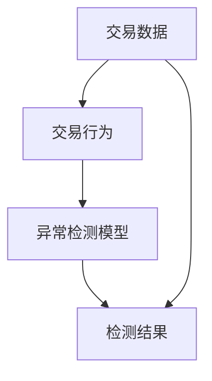
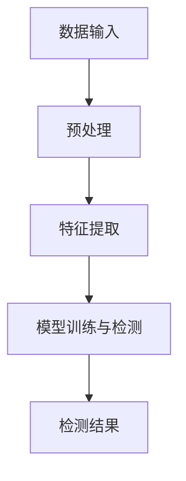
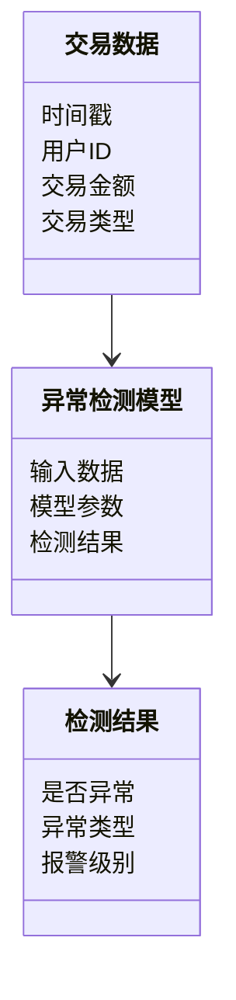
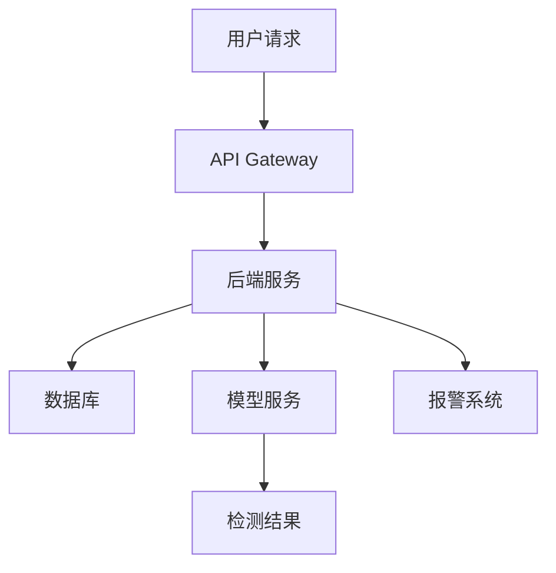
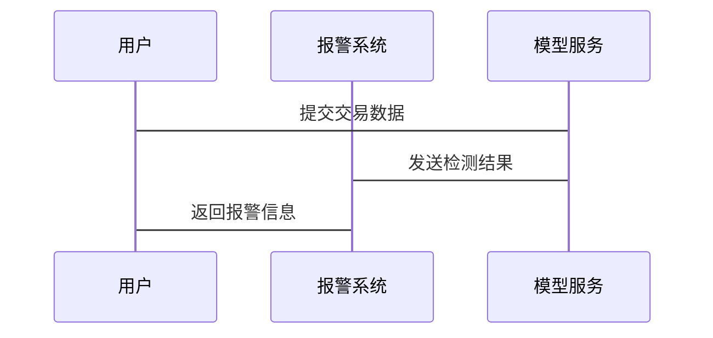

                 


# 开发智能化的金融市场异常交易检测模型

## 关键词：金融市场，异常交易，人工智能，深度学习，算法原理，系统架构，项目实战

## 摘要：本文详细探讨了开发智能化的金融市场异常交易检测模型的全过程，从背景介绍到系统架构设计，再到项目实战，全面解析了如何利用人工智能技术实现高效、准确的异常交易检测。文章通过理论与实践相结合的方式，帮助读者深入理解模型开发的核心技术和实际应用。

---

# 第1章: 金融市场异常交易检测的背景与问题描述

## 1.1 金融市场异常交易的背景

### 1.1.1 金融市场的基本概念与运作机制

金融市场是资金流动的核心场所，包括股票、债券、期货等多种金融工具的交易。市场的参与者包括投资者、机构、监管机构等，交易活动遵循一定的规则和市场机制。

### 1.1.2 异常交易的定义与分类

异常交易指违背正常市场规律的交易行为，可能包括操纵市场、内幕交易、异常大额交易等。根据交易行为的特征，异常交易可划分为市场操纵型、内幕信息型、异常资金流动型等。

### 1.1.3 异常交易的危害与监管需求

异常交易会破坏市场公平性，损害投资者利益，影响市场稳定性。因此，监管机构需要及时识别并处理异常交易，维护市场秩序。

## 1.2 异常交易检测的必要性

### 1.2.1 保护投资者利益

及时检测异常交易可以防止投资者因市场操纵等行为遭受损失。

### 1.2.2 维护市场公平性

通过检测异常交易，可以打击市场操纵行为，确保市场公平竞争。

### 1.2.3 提升金融机构的风险管理能力

异常交易检测帮助金融机构识别潜在风险，提升整体风险管理水平。

## 1.3 传统异常交易检测方法的局限性

### 1.3.1 基于规则的检测方法

通过预定义的规则进行检测，如设置交易量阈值。这种方法简单但规则有限，难以应对复杂多变的异常行为。

### 1.3.2 基于统计的检测方法

利用统计方法识别偏离均值的行为，如使用z-score方法。但这种方法对数据分布假设敏感，且难以捕捉复杂模式。

### 1.3.3 传统方法的局限性与改进需求

传统方法在面对高频交易、大数据量时表现不佳，难以实时处理和识别复杂的异常模式。

## 1.4 智能化检测的兴起

### 1.4.1 人工智能技术的发展

人工智能技术的进步为复杂模式识别提供了可能，特别是在处理非线性关系和高维数据方面。

### 1.4.2 深度学习在金融领域的应用

深度学习模型在处理时间序列数据和复杂模式方面表现优异，适用于金融市场的异常检测。

### 1.4.3 智能化检测的优势与潜力

智能化检测能够实时处理大数据，识别复杂模式，提升检测准确性和效率。

## 1.5 本章小结

本章介绍了金融市场异常交易的背景、定义、危害以及传统检测方法的局限性，强调了智能化检测的重要性。

---

# 第2章: 异常交易检测的核心概念与联系

## 2.1 异常交易检测的定义与属性

### 2.1.1 异常交易检测的定义

异常交易检测是通过分析交易数据，识别与正常交易模式不符的异常行为。

### 2.1.2 核心属性特征对比表

| 属性 | 正常交易 | 异常交易 |
|------|----------|----------|
| 交易频率 | 低或适中 | 高或突然增加 |
| 交易金额 | 与市场平均相符 | 明显偏离市场平均 |
| 交易时间 | 符合市场规律 | 集中在非交易时段或异常时段 |
| 交易行为 | 符合市场预期 | 违反市场规律或操纵市场 |

### 2.1.3 ER实体关系图



## 2.2 异常交易检测的原理与流程

### 2.2.1 检测原理概述

通过分析交易数据，利用算法识别异常模式。

### 2.2.2 检测流程图



---

# 第3章: 异常交易检测的算法原理与实现

## 3.1 算法原理概述

### 3.1.1 基于统计的异常检测

#### 3.1.1.1 马尔可夫链模型

马尔可夫链用于分析时间序列数据，适用于检测交易行为中的异常模式。

$$ P(x_t | x_{t-1}) $$

### 3.1.2 机器学习算法

#### 3.1.2.1 支持向量机 (SVM)

用于分类问题，适用于异常交易的识别。

### 3.1.3 深度学习模型

#### 3.1.3.1 长短期记忆网络 (LSTM)

用于处理时间序列数据，捕捉长期依赖关系。

---

## 3.2 算法实现与代码示例

### 3.2.1 环境安装

```bash
pip install numpy pandas scikit-learn
```

### 3.2.2 代码实现

```python
import numpy as np
from sklearn.svm import OneClassSVM

# 示例交易数据
X = np.random.randn(100, 10)

# 训练模型
model = OneClassSVM(gamma='auto')
model.fit(X)

# 预测异常点
y_pred = model.predict(X)
```

---

# 第4章: 系统分析与架构设计

## 4.1 问题场景介绍

系统需实时处理高频交易数据，识别异常交易行为，提供实时报警。

## 4.2 系统功能设计

### 4.2.1 领域模型



### 4.2.2 系统架构设计



### 4.2.3 接口设计

- 数据接口：接收交易数据，格式为JSON。
- 模型接口：调用检测模型，返回检测结果。

### 4.2.4 交互流程



---

# 第5章: 项目实战

## 5.1 环境安装与配置

```bash
pip install numpy pandas scikit-learn tensorflow
```

## 5.2 系统核心实现

### 5.2.1 数据预处理

```python
import pandas as pd

# 加载数据
data = pd.read_csv('交易数据.csv')
# 数据清洗
data.dropna(inplace=True)
```

### 5.2.2 模型训练与部署

```python
from tensorflow.keras import layers

# 构建LSTM模型
model = tf.keras.Sequential()
model.add(layers.LSTM(64, input_shape=(None, 10)))
model.add(layers.Dense(1, activation='sigmoid'))
model.compile(loss='binary_crossentropy', optimizer='adam')
model.fit(x_train, y_train, epochs=10)
```

## 5.3 实际案例分析

分析某次市场操纵事件，展示模型如何识别异常交易行为，并提供详细的案例解读。

---

# 第6章: 总结与展望

## 6.1 最佳实践

- 数据清洗与特征工程是关键。
- 选择合适的算法，如LSTM和XGBoost。
- 定期更新模型，应对市场变化。

## 6.2 小结

本文详细介绍了金融市场异常交易检测模型的开发过程，从背景到实现，全面解析了相关技术和方法。

## 6.3 注意事项

- 数据隐私保护
- 模型解释性
- 实时性要求

## 6.4 拓展阅读

推荐相关书籍和论文，供进一步学习。

---

# 作者：AI天才研究院 & 禅与计算机程序设计艺术

感谢您的阅读！

