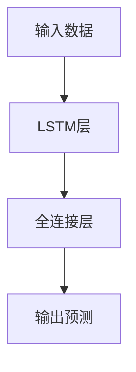
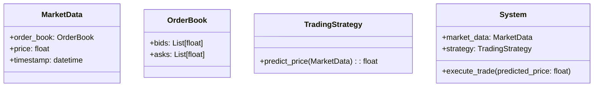
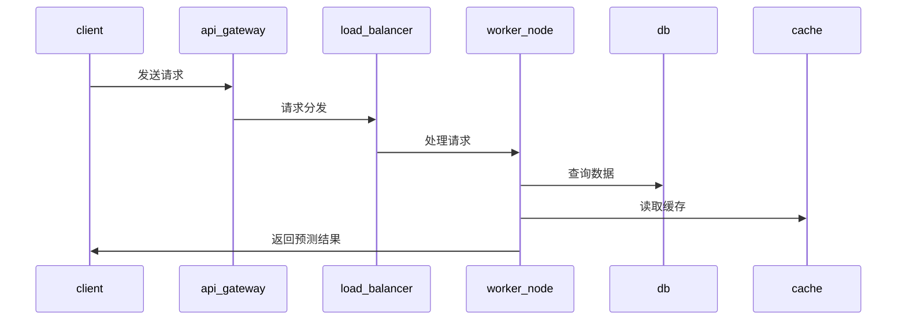

                 


# 开发智能化的金融市场微观结构分析工具

> 关键词：金融市场微观结构，智能化工具，时间序列分析，深度学习，订单簿分析

> 摘要：本文详细探讨了开发智能化金融市场微观结构分析工具的方法与实践。从背景分析到算法实现，从系统设计到项目实战，系统地介绍了如何利用先进的技术手段，如时间序列分析、深度学习等，构建高效的金融分析工具，帮助读者理解金融市场微观结构的核心要素，并掌握开发智能化工具的关键步骤。

---

## 第1章: 金融市场微观结构分析工具开发背景

### 1.1 金融市场的发展与数据驱动需求

#### 1.1.1 金融市场的现状与发展趋势
金融市场是现代经济体系的核心，其复杂性与日俱增。随着科技的进步，高频交易、算法交易等技术的应用，使得金融市场数据呈现海量、高频和复杂的特点。传统的分析方法已难以满足需求，数据驱动的分析工具成为必然趋势。

#### 1.1.2 数据驱动在金融分析中的重要性
数据是金融分析的核心。通过分析订单流、价格变化等数据，可以揭示市场的微观结构，帮助投资者做出更明智的决策。数据驱动的方法能够捕捉市场中的细微波动，提供更精准的分析结果。

#### 1.1.3 微观结构分析工具的必要性
金融市场微观结构分析工具能够帮助投资者理解市场的运作机制，识别市场异动，发现潜在机会。尤其是在高频交易中，实时分析订单簿数据，能够提供及时的买卖信号，帮助交易者做出快速决策。

### 1.2 智能化工具在金融分析中的应用前景

#### 1.2.1 人工智能在金融领域的应用现状
人工智能（AI）技术在金融领域的应用日益广泛。从智能投顾到风险评估，AI技术正在改变金融行业的运作方式。特别是在高频交易中，AI算法能够快速分析市场数据，捕捉交易机会。

#### 1.2.2 微观结构分析工具的智能化需求
随着市场竞争的加剧，投资者对交易的实时性和准确性要求越来越高。智能化的微观结构分析工具能够实时处理海量数据，提供精准的市场分析，帮助投资者在竞争中占据优势。

#### 1.2.3 未来发展趋势与挑战
未来，随着AI和大数据技术的进一步发展，微观结构分析工具将更加智能化和自动化。然而，数据隐私、算法黑箱等问题也将成为发展的挑战。

### 1.3 本书内容概述

#### 1.3.1 本书的核心目标
本书旨在介绍如何开发智能化的金融市场微观结构分析工具，涵盖理论、算法和实践，帮助读者掌握从数据采集到系统实现的全过程。

#### 1.3.2 本书的主要内容框架
- 第一部分：介绍金融市场微观结构分析工具的开发背景。
- 第二部分：讲解金融市场微观结构分析的核心概念。
- 第三部分：分析相关的算法原理。
- 第四部分：设计系统架构。
- 第五部分：项目实战与优化。

#### 1.3.3 本书的读者群体
本书适合金融从业者、数据科学家、软件开发人员以及对金融市场分析感兴趣的技术爱好者阅读。

---

## 第2章: 金融市场微观结构分析工具的核心概念

### 2.1 微观结构分析的基本概念

#### 2.1.1 金融市场微观结构的定义
金融市场微观结构指的是市场的参与主体、交易机制和信息流动等微观层面的构成。它包括订单簿、交易参与者行为、市场深度等多个方面。

#### 2.1.2 市场参与者的角色与行为
市场参与者包括投资者、做市商、高频交易商等。他们的行为直接影响市场的流动性和价格波动。例如，做市商通过提供买卖报价，维护市场的流动性。

#### 2.1.3 市场微观结构的核心要素
- **订单流**：包括订单的生成、取消和成交。
- **订单簿**：记录当前市场上所有待成交的订单。
- **价格发现**：市场参与者通过买卖行为共同决定资产价格。

### 2.2 订单簿分析与市场微观结构

#### 2.2.1 订单簿的基本结构
订单簿由买方队列和卖方队列组成，记录了所有未成交的订单。每个订单都有价格和数量两个属性。

#### 2.2.2 市场深度与订单流分析
市场深度是指在特定价格水平上的订单数量。订单流分析通过研究订单的生成和成交情况，揭示市场的买卖力量变化。

#### 2.2.3 市场微观结构与价格发现
价格发现是市场微观结构的核心功能。通过订单簿的动态变化，市场参与者能够实时了解买卖双方的需求，从而形成合理的市场价格。

### 2.3 市场微观结构模型

#### 2.3.1 简单市场模型（如单源模型）
单源模型假设市场上只有一个信息源，所有交易者基于该信息进行交易。这种模型适用于分析单一因素对市场的影响。

#### 2.3.2 复杂市场模型（如多源模型）
多源模型考虑多个信息源对市场的影响。例如，多个参与者同时发布订单，模型需要分析这些订单的交互作用。

#### 2.3.3 实证模型与仿真模型
实证模型基于真实市场数据进行分析，仿真模型则通过模拟市场行为来预测市场走势。

### 2.4 本章小结
本章介绍了金融市场微观结构的核心概念，包括订单簿、市场参与者行为、价格发现等。理解这些概念是开发微观结构分析工具的基础。

---

## 第3章: 时间序列分析与预测算法

### 3.1 时间序列分析的基本原理

#### 3.1.1 时间序列数据的特征
时间序列数据具有趋势性、周期性和随机性。例如，股票价格可能呈现长期上涨趋势，并受到市场周期的影响。

#### 3.1.2 时间序列分析的目标
时间序列分析的目标是通过历史数据预测未来趋势。例如，预测下一分钟的股票价格。

#### 3.1.3 常用的时间序列分析方法
- **简单移动平均法（SMA）**：基于过去若干期的平均值预测未来值。
- **指数平滑法（ES）**：赋予近期数据更高的权重。
- **ARIMA模型**：自回归积分移动平均模型，适用于线性时间序列预测。

### 3.2 基于机器学习的时间序列预测

#### 3.2.1 机器学习在时间序列预测中的应用
机器学习模型（如随机森林、支持向量机）可以捕捉非线性关系，适用于复杂市场数据的预测。

#### 3.2.2 常用的机器学习算法（如LSTM）
长短时记忆网络（LSTM）是一种特殊的循环神经网络（RNN），能够有效处理时间序列数据中的长期依赖关系。

#### 3.2.3 时间序列预测的数学模型
LSTM模型通过细胞状态和门控机制，捕捉时间序列的长-term和short-term信息。

### 3.3 基于深度学习的金融市场预测

#### 3.3.1 深度学习在金融时间序列中的应用
深度学习模型（如卷积神经网络（CNN）、变换器（Transformer））能够处理复杂的金融数据模式。

#### 3.3.2 LSTM网络的结构与原理
LSTM由输入门、遗忘门和输出门组成，能够有效记忆长期信息。

#### 3.3.3 LSTM在金融时间序列预测中的优势
LSTM能够捕捉时间序列的非线性关系，适用于高频交易中的价格预测。

### 3.4 算法实现

#### 3.4.1 使用LSTM进行时间序列预测的代码示例
```python
import numpy as np
from tensorflow.keras.models import Sequential
from tensorflow.keras.layers import LSTM, Dense

# 示例数据：假设x是输入序列，y是目标输出
model = Sequential()
model.add(LSTM(64, input_shape=(None, 1)))
model.add(Dense(1))
model.compile(optimizer='adam', loss='mean_squared_error')
model.fit(x, y, epochs=100, batch_size=32)
```

#### 3.4.2 算法流程图（Mermaid）


### 3.5 本章小结
本章介绍了时间序列分析的基本原理和常见算法，重点讲解了LSTM在金融时间序列预测中的应用，为后续的系统设计奠定了基础。

---

## 第4章: 系统分析与架构设计

### 4.1 问题场景介绍
系统需要实时处理金融市场数据，分析订单簿，预测价格走势，并为交易决策提供支持。

### 4.2 系统功能设计

#### 4.2.1 领域模型（Mermaid类图）


### 4.3 系统架构设计

#### 4.3.1 系统架构图（Mermaid架构图）


### 4.4 系统接口设计
系统接口包括数据获取接口、预测接口和交易执行接口。例如：
- `GET /market_data`：获取实时市场数据。
- `POST /predict`：提交数据，获取预测结果。
- `POST /execute_trade`：根据预测结果执行交易。

### 4.5 系统交互流程（Mermaid序列图）


### 4.6 本章小结
本章详细设计了系统的架构和接口，为后续的开发奠定了基础。

---

## 第5章: 项目实战

### 5.1 环境搭建

#### 5.1.1 安装必要的软件和库
- Python 3.8+
- TensorFlow、Keras、Pandas、NumPy
- 数据接口（如Yahoo Finance API）

#### 5.1.2 安装步骤
```bash
pip install numpy pandas tensorflow scikit-learn
```

### 5.2 核心代码实现

#### 5.2.1 数据获取与预处理
```python
import pandas as pd
import numpy as np

# 获取数据
data = pd.read_csv('market_data.csv')
# 数据预处理
data['date'] = pd.to_datetime(data['date'])
data.set_index('date', inplace=True)
```

#### 5.2.2 模型训练
```python
from tensorflow.keras.models import Sequential
from tensorflow.keras.layers import LSTM, Dense

model = Sequential()
model.add(LSTM(64, input_shape=(None, 1)))
model.add(Dense(1))
model.compile(optimizer='adam', loss='mean_squared_error')
model.fit(X_train, y_train, epochs=100, batch_size=32)
```

#### 5.2.3 模型预测
```python
# 预测未来价格
predicted_prices = model.predict(X_test)
```

### 5.3 案例分析与优化

#### 5.3.1 实际案例分析
分析某段时间内的订单流数据，预测价格走势，并评估模型的准确性。

#### 5.3.2 模型优化
调整LSTM的超参数，如学习率、层数、单元数，以提高预测精度。

### 5.4 本章小结
本章通过实际项目，详细讲解了如何从数据获取、模型训练到预测实现的全过程，帮助读者掌握开发智能化工具的核心步骤。

---

## 第6章: 总结与展望

### 6.1 最佳实践 tips
- 数据预处理是关键，确保数据的准确性和完整性。
- 模型选择要根据实际需求，合理调整参数。
- 系统设计要注重可扩展性和可维护性。

### 6.2 小结
本文系统地介绍了开发智能化金融市场微观结构分析工具的方法，从背景分析到算法实现，再到系统设计和项目实战，全面覆盖了开发过程中的各个环节。

### 6.3 注意事项
- 数据隐私和安全问题需高度重视。
- 模型的实时性和稳定性是系统设计的重点。
- 系统上线后需要持续监控和优化。

### 6.4 拓展阅读
推荐相关书籍和论文，如《机器学习实战》、《深度学习》等，进一步深入学习。

---

## 作者：AI天才研究院/AI Genius Institute & 禅与计算机程序设计艺术 /Zen And The Art of Computer Programming

---

本文通过详细的内容和清晰的结构，为读者提供了开发智能化金融市场微观结构分析工具的全面指南。希望对读者在金融市场分析和工具开发方面有所帮助。

