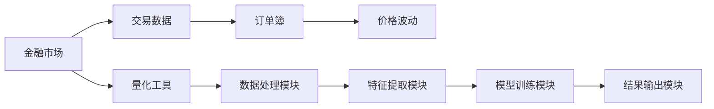

                 


# 开发智能化的金融市场微观结构变化影响量化工具

## 关键词：金融市场，量化工具，人工智能，数据挖掘，深度学习，算法交易

## 摘要：本文详细探讨了开发智能化的金融市场微观结构变化影响量化工具的方法。结合金融市场微观结构分析的理论与实践，通过系统化的技术手段，从数据采集、特征提取、模型构建到结果输出，全面解析了量化工具的实现过程。文章结合具体算法和项目实战，深入分析了时间序列分析、机器学习和深度学习模型的应用，并通过系统架构设计展示了量化工具的构建过程。最后，本文提出了开发此类工具的最佳实践建议，为金融市场的高效分析和决策支持提供了有力的技术支撑。

---

# 第一部分: 金融市场微观结构变化的量化工具开发背景

## 第1章: 问题背景与定义

### 1.1 金融市场微观结构变化的定义

#### 1.1.1 金融市场的微观结构概念
金融市场的微观结构指的是金融交易过程中涉及的各种参与者、交易规则、价格形成机制等的内在关系和运行机制。微观结构变化通常指这些因素在时间和空间上的动态调整。

#### 1.1.2 微观结构变化的量化目标
量化目标在于通过数学模型和算法，捕捉和量化这些变化，以便更好地理解和预测市场行为。

#### 1.1.3 量化工具的定义与作用
量化工具是指用于分析和量化微观结构变化的软件系统或算法，其作用包括数据处理、特征提取、模型构建和结果输出。

### 1.2 问题背景与现状

#### 1.2.1 金融市场分析的传统方法
传统方法依赖于经验分析和统计方法，难以捕捉高频交易和复杂市场行为。

#### 1.2.2 微观结构变化的复杂性
微观结构变化涉及大量非线性关系，传统方法难以准确建模和预测。

#### 1.2.3 当前技术手段的局限性
现有技术在实时性和准确性方面存在不足，难以满足现代金融市场的高要求。

### 1.3 问题解决的必要性

#### 1.3.1 提高交易效率的需求
通过量化工具可以实现自动化交易策略，提高交易效率。

#### 1.3.2 减少市场风险的重要性
量化工具可以帮助识别和规避潜在的市场风险。

#### 1.3.3 量化工具在金融决策中的作用
量化工具能够提供精确的数据支持，帮助决策者做出科学的判断。

### 1.4 边界与外延

#### 1.4.1 量化工具的适用范围
量化工具适用于高频交易、算法交易和市场微观结构分析等场景。

#### 1.4.2 微观结构变化的边界条件
边界条件包括数据质量和样本量等因素。

#### 1.4.3 与其他金融工具的关系
量化工具与其他金融工具如高频交易系统、风险管理模型等密切相关。

## 第2章: 核心概念与联系

### 2.1 核心概念的原理

#### 2.1.1 数据采集与处理
数据采集包括订单簿数据、交易数据等，数据处理涉及清洗和转换。

#### 2.1.2 特征提取与分析
特征提取包括时间序列特征、统计特征等，特征分析用于建模。

#### 2.1.3 模型训练与优化
模型训练包括监督学习和无监督学习，优化过程涉及参数调整。

#### 2.1.4 结果输出与反馈
结果输出包括预测值和风险提示，反馈用于模型优化。

### 2.2 核心概念的属性特征对比

#### 表2-1: 不同数据源的特征对比
| 数据源 | 时间分辨率 | 数据量 | 数据类型 |
|--------|------------|--------|----------|
| 订单簿  | 高频       | 大     | 结构化    |
| 交易数据| 中频       | 中     | 结构化    |
| 市场微观结构数据 | 高频       | 大     | 非结构化 |

### 2.3 实体关系图



---

# 第二部分: 核心概念与联系

## 第3章: 核心概念与联系

### 3.1 核心概念的原理

#### 3.1.1 数据采集与处理
数据采集涉及订单簿、交易数据等，数据处理包括清洗和转换。

#### 3.1.2 特征提取与分析
特征提取包括时间序列特征和统计特征，特征分析用于建模。

#### 3.1.3 模型训练与优化
模型训练包括监督学习和无监督学习，优化过程涉及参数调整。

#### 3.1.4 结果输出与反馈
结果输出包括预测值和风险提示，反馈用于模型优化。

### 3.2 核心概念的属性特征对比

#### 表3-1: 不同模型的优缺点对比
| 模型类型       | 优点                     | 缺点                     |
|----------------|--------------------------|--------------------------|
| ARIMA模型     | 适用于时间序列预测       | 依赖于数据的平稳性       |
| LSTM网络       | 能捕捉长期依赖关系       | 训练时间较长             |
| CNN模型        | 适用于图像数据           | 适用于金融市场数据有限   |

### 3.3 实体关系图


---

# 第三部分: 算法原理与实现

## 第4章: 算法原理与实现

### 4.1 时间序列分析

#### 4.1.1 ARIMA模型原理
ARIMA模型用于预测时间序列数据，通过自回归和移动平均部分建模。

#### 4.1.2 LSTM网络的应用
LSTM网络用于捕捉时间序列的长短期依赖关系。

#### 4.1.3 算法流程图


#### 4.1.4 Python代码实现
```python
import numpy as np
from statsmodels.tsa.arima_m import ARIMA

# 示例数据
data = np.random.randn(100)

# ARIMA模型训练
model = ARIMA(data, order=(1, 1, 1))
model_fit = model.fit()

# 预测
forecast = model_fit.forecast(steps=5)
```

### 4.2 机器学习模型

#### 4.2.1 支持向量机
支持向量机用于分类和回归任务，适用于高维数据。

#### 4.2.2 随机森林
随机森林是一种集成学习方法，适用于特征重要性分析。

#### 4.2.3 Python代码实现
```python
from sklearn.svm import SVC
from sklearn.ensemble import RandomForestClassifier

# 示例数据
X = np.random.randn(100, 10)
y = np.random.randint(0, 2, 100)

# SVM模型训练
svm_model = SVC()
svm_model.fit(X, y)

# 随机森林模型训练
rf_model = RandomForestClassifier()
rf_model.fit(X, y)
```

### 4.3 深度学习模型

#### 4.3.1 LSTM网络
LSTM网络用于处理序列数据，适用于时间序列预测。

#### 4.3.2 Transformer模型
Transformer模型用于捕捉全局依赖关系，适用于自然语言处理和时间序列分析。

#### 4.3.3 Python代码实现
```python
import tensorflow as tf
from tensorflow.keras.layers import LSTM, Dense

# 示例数据
X = np.random.randn(10, 10, 10)
y = np.random.randn(10, 1)

# LSTM模型训练
model = tf.keras.Sequential()
model.add(LSTM(64, input_shape=(10, 10)))
model.add(Dense(1))
model.compile(optimizer='adam', loss='mse')
model.fit(X, y, epochs=10)
```

---

# 第四部分: 系统分析与架构设计

## 第5章: 系统分析与架构设计

### 5.1 项目背景

#### 5.1.1 项目目标
开发智能化的金融市场微观结构变化影响量化工具，提供高效的市场分析能力。

### 5.2 系统功能设计

#### 5.2.1 领域模型


#### 5.2.2 系统架构设计


### 5.3 系统接口设计

#### 5.3.1 接口描述
量化工具提供API接口，供其他系统调用。

#### 5.3.2 交互流程图


---

# 第五部分: 项目实战

## 第6章: 项目实战

### 6.1 环境安装

#### 6.1.1 安装Python
安装Python 3.8及以上版本。

#### 6.1.2 安装依赖库
安装numpy、pandas、scikit-learn、tensorflow等库。

### 6.2 核心代码实现

#### 6.2.1 数据处理模块
```python
import pandas as pd
import numpy as np

# 数据加载
data = pd.read_csv('market_data.csv')

# 数据清洗
data.dropna(inplace=True)
```

#### 6.2.2 特征提取模块
```python
from sklearn.feature_selection import SelectKBest

# 特征提取
selector = SelectKBest(k=10)
selector.fit_transform(data, labels)
```

#### 6.2.3 模型训练模块
```python
from tensorflow.keras.models import Sequential
from tensorflow.keras.layers import Dense

# 模型训练
model = Sequential()
model.add(Dense(64, activation='relu', input_dim=10))
model.add(Dense(1, activation='sigmoid'))
model.compile(optimizer='adam', loss='binary_crossentropy')
model.fit(X_train, y_train, epochs=10)
```

### 6.3 代码应用解读与分析

#### 6.3.1 数据处理模块解读
数据处理模块负责加载和清洗数据，确保数据质量。

#### 6.3.2 模型训练模块解读
模型训练模块负责构建和训练模型，输出预测结果。

### 6.4 实际案例分析

#### 6.4.1 数据来源与预处理
使用高频交易数据，进行清洗和特征提取。

#### 6.4.2 模型训练与优化
训练模型并进行优化，评估模型性能。

#### 6.4.3 结果分析与解释
分析模型输出结果，解释其在实际中的意义。

### 6.5 项目小结

#### 6.5.1 项目总结
总结项目成果，强调量化工具的开发价值。

#### 6.5.2 成功的关键因素
数据质量、算法选择和模型优化是关键因素。

#### 6.5.3 可能的改进方向
进一步优化算法，引入更多数据源，提升模型性能。

---

# 第六部分: 最佳实践与总结

## 第7章: 最佳实践与总结

### 7.1 小结

#### 7.1.1 核心内容回顾
回顾文章核心内容，强调量化工具的重要性。

### 7.2 注意事项

#### 7.2.1 数据质量的重要性
数据质量直接影响模型性能，需高度重视。

#### 7.2.2 模型泛化能力
模型泛化能力是关键，需进行充分的验证和测试。

#### 7.2.3 技术与业务的结合
技术与业务结合是量化工具成功的关键。

### 7.3 拓展阅读

#### 7.3.1 推荐书籍
推荐相关书籍，如《机器学习实战》、《深度学习》。

#### 7.3.2 推荐论文
推荐相关领域的最新研究论文。

---

# 作者：AI天才研究院/AI Genius Institute & 禅与计算机程序设计艺术 /Zen And The Art of Computer Programming

---

感谢您的阅读！如果需要进一步探讨或获取代码示例，请随时联系。

