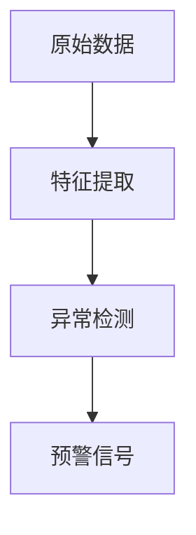
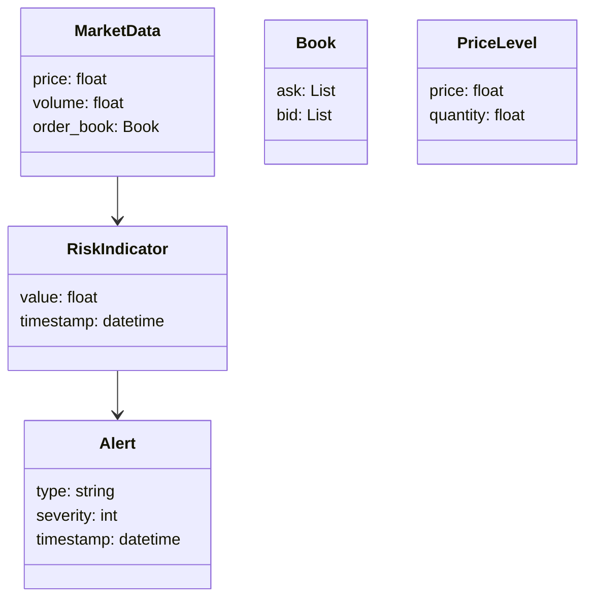

                 


# 开发智能化的金融市场微观结构变化预警模型

---

## 关键词：金融市场、微观结构、预警模型、算法原理、系统架构、异常检测

---

## 摘要：  
金融市场微观结构的变化往往预示着潜在的风险或机会，开发智能化的预警模型能够帮助投资者及时捕捉这些变化，从而做出更明智的决策。本文将从背景介绍、核心概念、算法原理、系统架构到项目实战，全面解析如何构建一个高效的金融市场微观结构变化预警模型。通过结合时间序列分析、小波变换和机器学习算法，本文将详细阐述模型的设计思路、实现方法及实际应用场景。

---

# 第一部分: 问题背景与目标

## 第1章: 问题背景与目标

### 1.1 问题背景

#### 1.1.1 金融市场微观结构的定义
金融市场微观结构是指市场参与者的交易行为、订单簿状态、交易量、价格波动等复杂动态关系。它反映了市场参与者的互动和市场机制的运作。

#### 1.1.2 微观结构变化对市场的影响
微观结构的变化可能预示着市场风险的增加，例如异常交易、市场操纵、流动性危机等。及时识别这些变化可以帮助投资者和监管机构采取相应的措施，降低潜在损失。

#### 1.1.3 预警模型的必要性
传统的市场分析方法依赖于经验判断和统计分析，但在复杂多变的金融市场中，这种方法往往不够及时和准确。通过智能化的预警模型，可以实时捕捉微观结构中的异常变化，提供更可靠的预警信号。

### 1.2 问题描述

#### 1.2.1 市场微观结构变化的主要形式
- 交易量激增或骤减
- 价格波动异常
- 订单簿深度变化
- 市场参与者行为模式的改变

#### 1.2.2 预警模型的目标与边界
- **目标**：实时监测市场微观结构的变化，提供预警信号。
- **边界**：不直接预测市场价格走势，专注于微观结构的变化。

#### 1.2.3 模型的适用场景与限制
- **适用场景**：高频交易、机构交易、市场监控。
- **限制**：依赖于高质量的数据输入，对数据质量和实时性要求较高。

---

## 第2章: 核心概念与联系

### 2.1 核心概念原理

#### 2.1.1 微观结构变化的特征提取
- **时间序列分析**：捕捉价格波动、交易量变化等动态特征。
- **订单簿分析**：分析订单的深度、买卖价差等。

#### 2.1.2 预警指标的构建方法
- **指标组合**：结合多个特征构建综合预警指标。
- **权重分配**：根据特征的重要性分配权重。

#### 2.1.3 模型的输入与输出关系
- **输入**：市场数据（如价格、交易量、订单簿状态等）。
- **输出**：预警信号（如“异常”、“正常”）。

### 2.2 核心概念对比表

| 概念       | 定义                                                                 | 属性                     | 示例                     |
|------------|----------------------------------------------------------------------|--------------------------|--------------------------|
| 微观结构    | 市场参与者的交易行为和市场机制运作的动态关系                     | 多样性、动态性            | 交易量、价格波动         |
| 预警信号    | 表示潜在风险或机会的指标                                         | 及时性、准确性            | 市场异动、交易量激增     |

### 2.3 ER实体关系图

```mermaid
er
actor(投资者) --|> order(订单): 下单
market_data(市场数据) --|> tick(分时数据): 更新
risk_indicator(风险指标) --|> alert(预警信号): 生成
```

---

# 第二部分: 模型算法与数学原理

## 第3章: 算法原理

### 3.1 特征提取算法

#### 3.1.1 时间序列分析



#### 3.1.2 小波分析

```python
import numpy as np
from scipy import signal

def wavelet_transform(data):
    # 小波变换参数
    wavelet = 'db4'
    level = 2
    coeffs = signal.wavedec(data, wavelet, level=level)
    return coeffs

# 示例数据
data = np.array([1, 2, 3, 4, 5, 6, 7, 8])
coeffs = wavelet_transform(data)
print(coeffs)
```

### 3.2 异常检测算法

#### 3.2.1 基于统计的方法

```python
import numpy as np
from sklearn.ensemble import IsolationForest

def anomaly_detection(data, n_estimators=100):
    model = IsolationForest(n_estimators=n_estimators, random_state=42)
    model.fit(data)
    return model.predict(data)

# 示例数据
data = np.random.normal(0, 1, 100)
outliers = anomaly_detection(data)
print(outliers)
```

### 3.3 分类算法

#### 3.3.1 基于逻辑回归的分类

```python
from sklearn.linear_model import LogisticRegression
from sklearn.model_selection import train_test_split
from sklearn.metrics import accuracy_score

# 示例数据
X = np.random.rand(100, 2)
y = np.random.randint(0, 2, 100)

# 划分训练集和测试集
X_train, X_test, y_train, y_test = train_test_split(X, y, test_size=0.2, random_state=42)

# 训练模型
model = LogisticRegression()
model.fit(X_train, y_train)

# 预测
y_pred = model.predict(X_test)
print("Accuracy:", accuracy_score(y_test, y_pred))
```

### 3.4 数学模型

#### 3.4.1 时间序列模型

$$ y_t = \alpha + \beta t + \epsilon_t $$

其中，$y_t$ 是目标变量，$\alpha$ 是截距，$\beta$ 是时间的系数，$\epsilon_t$ 是误差项。

#### 3.4.2 小波分析模型

$$ W_j = \sum_{k} h(k) x_{j-k} $$

其中，$W_j$ 是小波系数，$h(k)$ 是小波基函数，$x_{j-k}$ 是输入数据。

---

## 第4章: 系统架构设计

### 4.1 系统功能设计



### 4.2 系统架构设计


---

## 第5章: 项目实战

### 5.1 环境配置

```bash
pip install numpy scipy scikit-learn matplotlib
```

### 5.2 核心实现

#### 5.2.1 数据预处理

```python
import pandas as pd
import numpy as np

# 示例数据加载
data = pd.read_csv('market_data.csv')
data['datetime'] = pd.to_datetime(data['datetime'])
data.set_index('datetime', inplace=True)
```

#### 5.2.2 特征提取

```python
from scipy.signal import stft

# 计算小波变换
nperseg = 250
freqs, times, D = stft(data['price'], nperseg=nperseg)
```

#### 5.2.3 模型训练

```python
from sklearn.ensemble import RandomForestClassifier

# 划分训练集和测试集
X_train, X_test, y_train, y_test = train_test_split(X, y, test_size=0.2, random_state=42)

# 训练模型
model = RandomForestClassifier()
model.fit(X_train, y_train)

# 预测
y_pred = model.predict(X_test)
print("Accuracy:", accuracy_score(y_test, y_pred))
```

### 5.3 实际案例分析

#### 5.3.1 数据分析

```python
import matplotlib.pyplot as plt

plt.figure(figsize=(10, 6))
plt.plot(data['price'], label='Price')
plt.plot(data['预警信号'], label='Alert')
plt.legend()
plt.show()
```

#### 5.3.2 结果解读

- **预警信号的准确性**：通过混淆矩阵和ROC曲线评估模型性能。
- **异常检测的及时性**：分析模型在实时数据中的表现。

---

## 第6章: 拓展与优化

### 6.1 模型优化

#### 6.1.1 参数优化

```python
from sklearn.model_selection import GridSearchCV

param_grid = {
    'n_estimators': [100, 200],
    'max_depth': [None, 10, 20]
}

grid_search = GridSearchCV(RandomForestClassifier(), param_grid, cv=5)
grid_search.fit(X_train, y_train)
best_model = grid_search.best_estimator_
```

#### 6.1.2 实时性优化

- 使用滑动窗口技术处理实时数据。
- 优化特征提取算法的计算效率。

### 6.2 鲁棒性提升

- 引入异常值检测和数据清洗。
- 使用集成学习方法提高模型的稳定性。

### 6.3 其他技术结合

- 结合区块链技术实现去中心化的预警系统。
- 结合大数据技术处理海量市场数据。

---

## 第7章: 结论与展望

### 7.1 小结

本文详细介绍了如何开发智能化的金融市场微观结构变化预警模型，涵盖了背景、核心概念、算法原理、系统架构和项目实战。通过结合时间序列分析、小波变换和机器学习算法，我们能够有效地捕捉市场微观结构的变化，提供可靠的预警信号。

### 7.2 展望

未来的工作可以集中在以下几个方面：
- **模型优化**：进一步优化算法，提高模型的准确性和实时性。
- **数据源扩展**：引入更多的市场数据源，提高模型的泛化能力。
- **应用场景拓展**：将模型应用于更多领域，如量化交易、风险控制等。

---

## 作者：AI天才研究院/AI Genius Institute & 禅与计算机程序设计艺术 /Zen And The Art of Computer Programming

