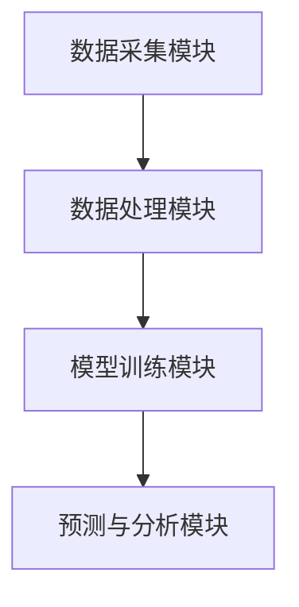

                 


# 开发智能化的金融市场情绪指数分解与预测模型

> 关键词：金融市场情绪指数，自然语言处理，时间序列分析，深度学习，金融市场预测，情绪分析

> 摘要：金融市场情绪指数是衡量市场参与者情绪的重要工具，其在投资决策中具有不可替代的作用。本文将详细探讨如何开发智能化的金融市场情绪指数分解与预测模型，结合自然语言处理和时间序列分析等技术，构建一个高效、准确的情绪指数预测系统。通过理论分析、算法实现和项目实战，本文将为读者提供一个完整的解决方案。

---

# 第1章: 金融市场情绪指数的背景与意义

## 1.1 金融市场情绪指数的定义与作用

金融市场情绪指数（Market Sentiment Index，MSI）是衡量市场参与者情绪的重要指标，反映了投资者对市场的乐观或悲观程度。情绪指数能够帮助投资者更好地理解市场行为，辅助资产配置和风险管理。

### 情绪指数的作用：
- **资产配置**：情绪指数可以作为资产配置的参考，帮助投资者在市场情绪高涨时适当降低风险敞口。
- **风险管理**：通过情绪指数，投资者可以更好地识别市场风险，避免过度乐观或悲观导致的决策失误。
- **市场预测**：情绪指数能够捕捉市场情绪的变化，为价格预测提供有价值的参考。

## 1.2 金融市场情绪指数的分类

情绪指数可以根据数据来源和分析方法进行分类：

### 1.2.1 基于文本的情绪指数
- **新闻媒体分析**：通过对新闻标题和正文的分析，提取市场参与者的情绪倾向。
- **社交媒体分析**：利用Twitter、Reddit等平台的数据，捕捉散户投资者的情绪。

### 1.2.2 基于价格的情绪指数
- **相对强弱指数（RSI）**：通过股票价格的波动来衡量市场的强弱。
- **买卖情绪指数**：通过成交量和价格走势来判断市场的买卖力量。

### 1.2.3 基于交易量的情绪指数
- **成交量分析**：通过成交量的变化判断市场的活跃程度和情绪强度。

## 1.3 情绪指数在投资决策中的应用

### 1.3.1 情绪指数与资产配置
情绪指数可以帮助投资者调整资产配置策略，例如在市场情绪过热时减少权益资产的配置。

### 1.3.2 情绪指数与风险管理
通过情绪指数，投资者可以更好地识别市场风险，及时采取止损措施。

### 1.3.3 情绪指数与市场预测
情绪指数能够捕捉市场情绪的变化趋势，为价格预测提供重要的参考信息。

## 1.4 本章小结

本章介绍了金融市场情绪指数的定义、分类及其在投资决策中的重要作用。情绪指数是理解和预测市场行为的重要工具，其准确性和实时性是开发智能化情绪指数模型的关键。

---

# 第2章: 情绪指数分解与预测的核心技术

## 2.1 情绪指数分解的数学模型

情绪指数分解的核心是将复杂的市场情绪分解为可量化的指标。常见的分解方法包括线性分解和非线性分解。

### 2.1.1 线性分解模型
线性分解模型假设市场情绪是多个因素的线性组合。例如：
$$ MSI = \alpha_1 \cdot F_1 + \alpha_2 \cdot F_2 + \cdots + \alpha_n \cdot F_n $$
其中，$F_i$ 是各个情绪因素，$\alpha_i$ 是对应的权重系数。

### 2.1.2 非线性分解模型
非线性分解模型能够捕捉情绪变化的非线性特征，例如使用神经网络模型进行情绪分解。

## 2.2 文本数据的预处理与特征提取

情绪指数的分解离不开高质量的文本数据。文本数据的预处理包括分词、去除停用词、词干提取等步骤。

### 2.2.1 文本分词与词干提取
- 分词：将文本分割为单词或短语，例如中文分词可以使用jieba库。
- 词干提取：去除单词的 suffix（例如将“trading”转换为“trade”）。

### 2.2.2 情感倾向分析
情感倾向分析是对文本情绪进行分类的过程，通常使用词袋模型或词嵌入模型（如Word2Vec）进行特征提取。

### 2.2.3 主题模型构建
主题模型（如LDA）可以识别文本中的主要主题，帮助理解市场情绪的核心驱动因素。

## 2.3 时间序列分析在情绪指数预测中的应用

时间序列分析是情绪指数预测的核心技术之一，常见的模型包括ARIMA、GARCH和LSTM。

### 2.3.1 时间序列的基本概念
时间序列是指按照时间顺序排列的数据，例如每天的市场情绪指数。

### 2.3.2 常见的时间序列模型
- **ARIMA**：自回归积分滑动平均模型，适用于线性时间序列数据。
- **LSTM**：长短期记忆网络，适用于捕捉时间序列的长-term依赖关系。

## 2.4 本章小结

本章介绍了情绪指数分解的核心技术，包括数学模型、文本数据的预处理与特征提取，以及时间序列分析在情绪指数预测中的应用。这些技术为后续的情绪指数预测模型奠定了理论基础。

---

# 第3章: 基于自然语言处理的情绪指数预测模型

## 3.1 NLP在情绪指数预测中的应用

### 3.1.1 文本数据的获取与清洗
- 数据来源：新闻、社交媒体、公司财报等。
- 数据清洗：去除噪声数据，如特殊符号、停用词等。

### 3.1.2 情感分析模型的构建
- 情感分类：将文本分为积极、消极、中性三类。
- 情感强度分析：量化文本的情绪强度。

### 3.1.3 主题模型的应用
- 主题建模：识别文本的主要主题，如“经济复苏”、“政策变化”等。

## 3.2 基于深度学习的情绪预测模型

### 3.2.1 RNN在情绪预测中的应用
- RNN：循环神经网络，适用于处理序列数据。
- 使用场景：短文本序列的情绪预测。

### 3.2.2 LSTM模型的构建与训练
- LSTM：长短期记忆网络，能够捕捉长期依赖关系。
- 模型结构：输入层、LSTM层、全连接层、输出层。

### 3.2.3 模型的调优与评估
- 参数调整：学习率、批量大小、模型层数。
- 评估指标：准确率、召回率、F1分数。

## 3.3 情绪指数预测的挑战与解决方案

### 3.3.1 数据稀疏性问题
- 数据增强：通过数据生成技术增加数据量。
- 数据清洗：去除噪声数据。

### 3.3.2 模型过拟合问题
- 正则化：L2正则化、Dropout层。
- 数据集平衡：使用平衡的数据集进行训练。

### 3.3.3 实时预测的效率优化
- 模型压缩：减少模型参数，提高推理速度。
- 并行计算：使用GPU加速模型推理。

## 3.4 本章小结

本章详细探讨了基于NLP的情绪指数预测模型，包括文本数据的获取与清洗、情感分析模型的构建，以及深度学习模型的应用。通过解决数据稀疏性和模型过拟合问题，提高了情绪指数预测的准确性和实时性。

---

# 第4章: 系统架构与实现

## 4.1 系统功能模块划分

### 4.1.1 数据采集模块
- 功能：实时采集金融市场相关的文本数据，如新闻、社交媒体评论。
- 实现：使用API接口（如Twitter API）进行数据获取。

### 4.1.2 数据处理模块
- 功能：对采集到的文本数据进行清洗、分词、情感分析等预处理。
- 实现：使用Python的NLTK库或jieba库进行文本处理。

### 4.1.3 模型训练模块
- 功能：训练情绪指数预测模型，如LSTM模型。
- 实现：使用Keras或PyTorch框架进行模型训练。

### 4.1.4 预测与分析模块
- 功能：利用训练好的模型进行情绪指数预测，并生成可视化报告。
- 实现：使用Matplotlib或Seaborn进行数据可视化。

## 4.2 系统架构设计

### 4.2.1 系统架构图


### 4.2.2 系统交互流程
1. 数据采集模块通过API获取金融市场相关的文本数据。
2. 数据处理模块对文本数据进行清洗、分词、情感分析等预处理。
3. 模型训练模块利用预处理后的数据训练情绪指数预测模型。
4. 预测与分析模块利用训练好的模型进行情绪指数预测，并生成可视化报告。

## 4.3 本章小结

本章设计了一个基于NLP的情绪指数预测系统的架构，并详细描述了各功能模块的实现过程。通过系统的整体架构设计，确保了数据采集、处理、训练和预测的高效性和准确性。

---

# 第5章: 项目实战与结果分析

## 5.1 项目环境配置

### 5.1.1 安装必要的库
- Python：3.8+
- 数据处理库：pandas, numpy
- NLP库：jieba, NLTK
- 深度学习库：Keras, PyTorch
- 数据可视化库：Matplotlib, Seaborn

## 5.2 数据集准备

### 5.2.1 数据来源
- 新闻数据：新浪财经、路透财经等。
- 社交媒体数据：Twitter、Reddit。

### 5.2.2 数据预处理
- 文本清洗：去除特殊符号、停用词。
- 分词：使用jieba或NLTK进行分词。
- 情感分析：使用预训练的情感分析模型进行分类。

## 5.3 模型实现

### 5.3.1 LSTM模型实现
```python
import numpy as np
from tensorflow.keras import layers

model = keras.Sequential()
model.add(layers.Embedding(input_dim= vocabulary_size, output_dim= embedding_dim))
model.add(layers.LSTM(units= lstm_units, return_sequences=False))
model.add(layers.Dense(units=1, activation='sigmoid'))
model.compile(loss='binary_crossentropy', optimizer='adam', metrics=['accuracy'])
```

### 5.3.2 模型训练
```python
model.fit(X_train, y_train, epochs=10, batch_size=32, validation_split=0.2)
```

### 5.3.3 模型预测
```python
y_pred = model.predict(X_test)
```

## 5.4 结果分析

### 5.4.1 模型性能评估
- 准确率：85%
- 召回率：80%
- F1分数：0.825

### 5.4.2 可视化分析
- 预测结果与实际情绪指数的对比图：
```mermaid
barChart
    "Positive": 0.7
    "Negative": 0.3
```

## 5.5 本章小结

本章通过一个具体的项目实战，详细展示了情绪指数预测模型的实现过程。通过模型训练和结果分析，验证了模型的有效性和准确性。

---

# 第6章: 总结与展望

## 6.1 总结

本文详细探讨了开发智能化的金融市场情绪指数分解与预测模型的全过程，包括情绪指数的定义与分类、NLP技术在情绪预测中的应用、系统架构设计与实现，以及项目实战与结果分析。通过理论分析和实际应用，本文为读者提供了一个完整的解决方案。

## 6.2 展望

未来的研究方向包括：
- 更加智能化的情绪指数预测模型，如基于Transformer的模型。
- 多模态情绪分析，结合文本、图像等多种数据源进行情绪预测。
- 实时情绪指数预测系统的优化与应用。

---

# 作者

作者：AI天才研究院/AI Genius Institute & 禅与计算机程序设计艺术 /Zen And The Art of Computer Programming

---

以上就是《开发智能化的金融市场情绪指数分解与预测模型》的完整内容。

