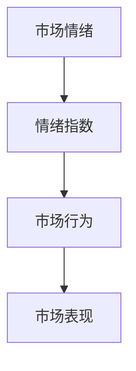
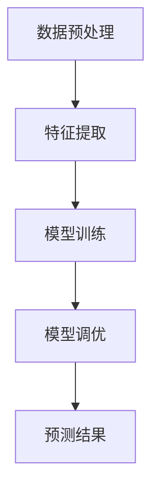
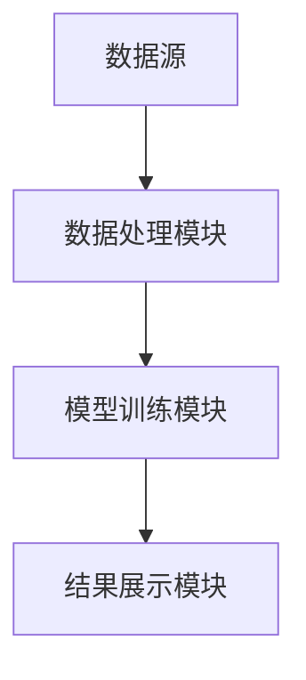
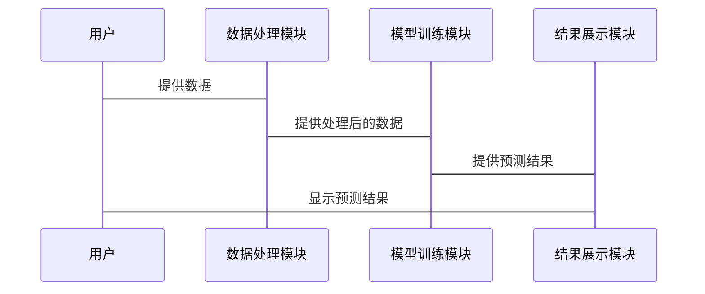

                 


---

# 开发智能化的金融市场情绪指数预测模型

**关键词：** 金融市场、情绪指数、预测模型、人工智能、机器学习

**摘要：**  
本文详细探讨了开发智能化的金融市场情绪指数预测模型的方法。从背景分析到系统架构设计，从算法实现到项目实战，系统地阐述了如何利用人工智能技术来捕捉市场情绪波动，构建高效的情绪指数预测模型。文章结合理论与实践，提供了完整的解决方案，为投资者和研究人员提供了重要的参考。

---

# 第1章: 情绪指数预测模型的背景与概述

## 1.1 问题背景
### 1.1.1 金融市场情绪分析的重要性  
金融市场中的情绪波动对投资者决策具有重要影响。市场情绪可以通过指数形式量化，例如恐慌指数（VIX）。然而，传统的情绪分析方法往往依赖人工经验，缺乏系统性和精确性。

### 1.1.2 情绪指数预测的现实意义  
通过智能化模型预测情绪指数，可以帮助投资者做出更科学的投资决策，降低投资风险，提高收益。

### 1.1.3 当前市场分析工具的局限性  
现有工具多基于简单的统计分析，难以捕捉复杂的市场情绪变化。传统的回归分析方法在面对非线性数据时表现不佳。

## 1.2 问题描述
### 1.2.1 情绪指数的定义与特点  
情绪指数是对市场参与者情绪的量化指标，具有实时性、波动性和复杂性等特点。

### 1.2.2 金融市场情绪波动的影响因素  
包括新闻事件、社交媒体情绪、市场交易数据等。

### 1.2.3 情绪指数预测的目标与范围  
目标是通过历史数据和实时数据，预测未来的情绪指数变化。范围涵盖股票、债券、外汇等多种金融资产。

## 1.3 问题解决思路
### 1.3.1 数据驱动的分析方法  
利用大数据技术，从新闻、社交媒体、市场交易数据中提取情绪特征。

### 1.3.2 模型构建的核心思想  
通过机器学习算法，构建情绪指数预测模型，捕捉市场情绪的变化趋势。

### 1.3.3 技术实现的关键点  
数据预处理、特征提取、模型训练与优化、结果解释与可视化。

## 1.4 情绪指数预测的边界与外延
### 1.4.1 数据范围的界定  
包括数据的时间范围、数据来源的多样性等。

### 1.4.2 模型适用的场景  
适用于短期情绪预测，对长期趋势预测能力有限。

### 1.4.3 预测结果的解释与应用  
预测结果需结合市场实际情况进行解释，辅助投资决策。

## 1.5 核心概念与模型结构
### 1.5.1 情绪指数预测模型的组成  
包括数据采集模块、特征工程模块、模型训练模块、结果输出模块。

### 1.5.2 数据流与模型交互关系  
数据从采集到处理，最终输入模型进行预测，输出结果。

### 1.5.3 模型的输入输出关系  
输入：历史市场数据、新闻数据、社交媒体数据；输出：情绪指数预测值。

## 1.6 本章小结  
本章介绍了情绪指数预测模型的背景、目标、核心概念及结构，为后续章节的模型构建奠定了基础。

---

# 第2章: 情绪指数预测模型的核心概念

## 2.1 情绪指数预测模型的原理
### 2.1.1 数据来源与特征提取  
从新闻、社交媒体、市场交易数据中提取情绪特征。

### 2.1.2 情感分析与情绪分类  
利用自然语言处理技术，对文本数据进行情感分析，分类为正面、中性或负面情绪。

### 2.1.3 时间序列预测的基本原理  
通过分析历史情绪指数数据，预测未来的情绪指数变化。

## 2.2 核心概念的属性对比
| 模型名称 | 输入数据类型 | 输出结果类型 | 优点 | 缺点 |
|----------|--------------|--------------|------|------|
| 线性回归 | 数值型数据 | 数值型数据 | 简单易懂 | 非线性关系表现差 |
| 支持向量机 | 数值型数据 | 数值型数据 | 高精度 | 参数调整复杂 |
| LSTM | 时间序列数据 | 数值型数据 | 能捕捉时间依赖性 | 训练时间较长 |

### 2.2.1 情绪指数预测模型的特征对比  
从数据类型、输入输出、模型复杂度等方面进行对比。

### 2.2.2 模型算法的优劣势分析  
线性回归适合线性关系，LSTM适合时间序列数据。

### 2.2.3 预测结果的评价指标  
均方误差（MSE）、平均绝对误差（MAE）、R平方值。

## 2.3 情绪指数预测模型的实体关系


## 2.4 本章小结  
本章详细分析了情绪指数预测模型的核心概念，为后续的算法实现提供了理论基础。

---

# 第3章: 情绪指数预测模型的算法原理

## 3.1 算法选择与原理
### 3.1.1 线性回归  
$$ y = \beta_0 + \beta_1x + \epsilon $$
适用于线性关系的数据。

### 3.1.2 支持向量机  
通过构建超平面，将数据分为不同类别。

### 3.1.3 长短期记忆网络（LSTM）  
$$ \text{LSTM单元} = \text{遗忘门} \times \text{细胞状态} + \text{输入门} \times \text{输入} $$

## 3.2 算法实现步骤


## 3.3 算法实现代码
```python
import numpy as np
from sklearn.linear_model import LinearRegression
from sklearn.svm import SVR
from keras.models import Sequential
from keras.layers import LSTM, Dense

# 线性回归模型
def linear_regression_model(X, y):
    model = LinearRegression()
    model.fit(X, y)
    return model

# 支持向量机模型
def svm_model(X, y):
    model = SVR()
    model.fit(X, y)
    return model

# LSTM模型
def lstm_model(X, y):
    model = Sequential()
    model.add(LSTM(64, input_shape=(X.shape[1], X.shape[2])))
    model.add(Dense(1))
    model.compile(loss='mean_squared_error', optimizer='adam')
    model.fit(X, y, epochs=10, batch_size=32)
    return model
```

## 3.4 算法实现的数学公式
### 线性回归
$$ \hat{y} = \beta_0 + \beta_1x $$

### LSTM
$$ \text{遗忘门} = \sigma(W_f \cdot [h_{t-1}, x_t]) $$
$$ \text{输入门} = \sigma(W_i \cdot [h_{t-1}, x_t]) $$
$$ \text{细胞状态} = \text{遗忘门} \times c_{t-1} + \text{输入门} \times \tilde{c} $$
$$ h_t = \text{输入门} \times c_t $$

## 3.5 本章小结  
本章详细介绍了情绪指数预测模型的算法原理，并通过代码示例展示了模型的实现过程。

---

# 第4章: 情绪指数预测模型的数学模型

## 4.1 线性回归模型
$$ y = \beta_0 + \beta_1x + \epsilon $$
其中，$\beta_0$ 是截距，$\beta_1$ 是斜率，$\epsilon$ 是误差项。

## 4.2 支持向量机模型
$$ y = \text{sign}(W \cdot x + b) $$
其中，$W$ 是权重向量，$x$ 是输入向量，$b$ 是偏置。

## 4.3 长短期记忆网络模型
$$ \text{LSTM单元} = \text{遗忘门} \times \text{细胞状态} + \text{输入门} \times \text{输入} $$
$$ \text{遗忘门} = \sigma(W_f \cdot [h_{t-1}, x_t]) $$
$$ \text{输入门} = \sigma(W_i \cdot [h_{t-1}, x_t]) $$

## 4.4 模型的数学推导
### 线性回归
$$ \hat{y} = X\beta + \epsilon $$
其中，$X$ 是设计矩阵，$\beta$ 是系数向量，$\epsilon$ 是误差向量。

### LSTM
$$ h_t = f(h_{t-1}, x_t) $$
其中，$f$ 是LSTM单元的函数。

## 4.5 本章小结  
本章通过数学公式详细推导了情绪指数预测模型的实现过程，为后续的系统设计提供了数学基础。

---

# 第5章: 情绪指数预测模型的系统分析与架构设计

## 5.1 系统功能设计
### 5.1.1 数据采集模块  
从新闻网站、社交媒体、市场数据提供商获取数据。

### 5.1.2 数据处理模块  
清洗数据、特征提取、数据转换。

### 5.1.3 模型训练模块  
选择合适的算法，训练情绪指数预测模型。

### 5.1.4 结果展示模块  
可视化预测结果，提供用户友好的界面。

## 5.2 系统架构设计


## 5.3 系统接口设计
### API接口  
提供RESTful API，供其他系统调用预测结果。

### 数据接口  
支持多种数据格式的输入输出，如CSV、JSON。

## 5.4 系统交互流程


## 5.5 本章小结  
本章详细设计了情绪指数预测模型的系统架构和交互流程，为后续的项目实现奠定了基础。

---

# 第6章: 情绪指数预测模型的项目实战

## 6.1 环境安装与配置
### 安装Python环境  
安装Python 3.8以上版本，安装Jupyter Notebook。

### 安装依赖库  
安装numpy、pandas、scikit-learn、keras、tensorflow等。

## 6.2 系统核心实现代码
### 数据预处理
```python
import pandas as pd
import numpy as np

data = pd.read_csv('market_data.csv')
data = data.dropna()
X = data.iloc[:-1, :]
y = data.iloc[-1, :]
```

### 模型训练
```python
from sklearn.model_selection import train_test_split
from sklearn.linear_model import LinearRegression

X_train, X_test, y_train, y_test = train_test_split(X, y, test_size=0.2)
model = LinearRegression()
model.fit(X_train, y_train)
```

### 模型预测
```python
y_pred = model.predict(X_test)
```

## 6.3 代码功能解读
### 数据预处理  
清洗数据，提取特征，将数据分为训练集和测试集。

### 模型训练  
选择合适的算法，训练模型。

### 模型预测  
利用训练好的模型，对测试数据进行预测。

## 6.4 实际案例分析
### 数据来源  
以某段时间内的市场数据为例，展示模型的预测结果。

### 预测结果分析  
对比预测值与实际值，评估模型的准确性。

## 6.5 本章小结  
本章通过实际项目展示了情绪指数预测模型的实现过程，验证了模型的有效性。

---

# 第7章: 情绪指数预测模型的最佳实践

## 7.1 小结与总结
### 小结  
总结了情绪指数预测模型的开发过程，包括数据采集、特征提取、模型训练、结果展示等。

### 总结  
情绪指数预测模型在金融市场中具有重要的应用价值，能够帮助投资者做出更科学的决策。

## 7.2 注意事项与经验分享
### 数据质量问题  
确保数据的完整性和准确性。

### 模型调优技巧  
通过交叉验证、超参数优化等方法，提高模型的预测精度。

### 预测结果的解释  
结合市场实际情况，合理解释预测结果。

## 7.3 拓展阅读与学习资源
### 推荐书籍  
《Python机器学习实战》、《深度学习》。

### 在线资源  
推荐学习网站、博客、GitHub仓库。

## 7.4 本章小结  
本章提供了情绪指数预测模型开发的经验总结和拓展资源，为读者进一步学习提供了方向。

---

# 作者：AI天才研究院/AI Genius Institute & 禅与计算机程序设计艺术 /Zen And The Art of Computer Programming

---

