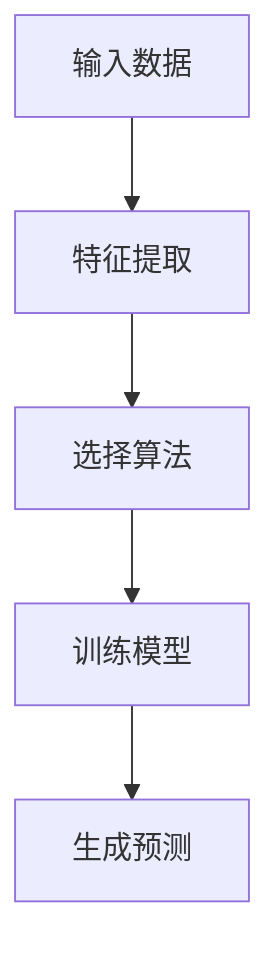
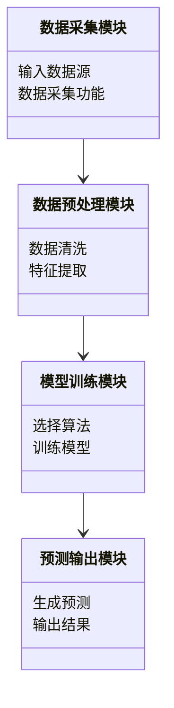
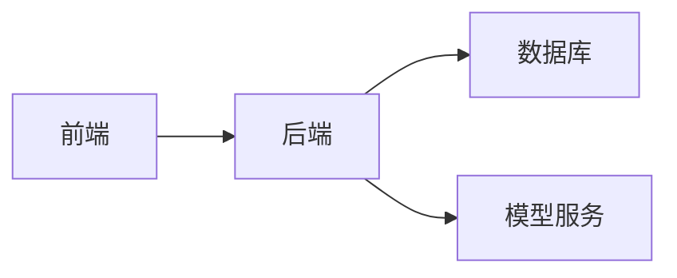
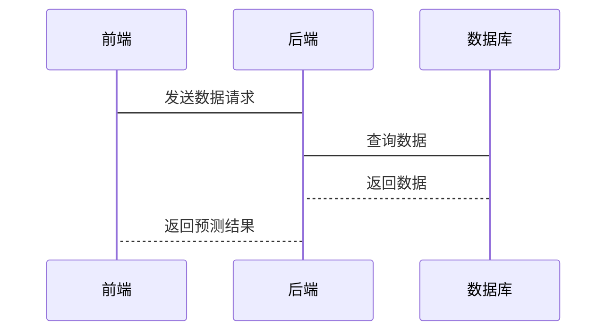

                 


# 开发智能化的金融市场流动性预测工具

> 关键词：金融市场流动性预测工具，智能化，时间序列分析，机器学习，深度学习，系统架构设计

> 摘要：本文详细探讨了开发智能化金融市场流动性预测工具的背景、核心概念、算法原理、系统架构设计及项目实战。通过分析金融市场流动性预测的重要性，介绍智能化预测工具的核心目标，详细讲解时间序列分析、机器学习和深度学习算法，以及系统架构设计与实现，最终提供一个完整的项目实战案例。

---

# 第一部分: 金融市场流动性预测工具开发背景与核心概念

## 第1章: 金融市场流动性预测的背景与问题描述

### 1.1 金融市场流动性概述

#### 1.1.1 金融市场的基本概念
金融市场是资金流动和资产交易的主要场所，包括股票、债券、外汇等交易市场。流动性是衡量市场资金流动速度和效率的重要指标。

#### 1.1.2 流动性的定义与重要性
流动性指资产转化为现金的能力。高流动性意味着资产易于快速变现，低流动性则反之。流动性是市场稳定性和风险控制的关键因素。

#### 1.1.3 流动性风险的潜在影响
流动性风险可能导致市场波动、资产贬值和交易成本增加。机构投资者需要准确预测流动性以优化资产配置和风险管理。

### 1.2 金融市场流动性预测的必要性

#### 1.2.1 机构投资者的需求
机构投资者需要准确预测流动性以优化投资组合和降低风险。

#### 1.2.2 市场监管的重要性
监管机构需要预测流动性以维护市场稳定，防止流动性危机。

#### 1.2.3 个人投资者的辅助决策作用
个人投资者需要流动性预测工具辅助决策，提高投资效率。

### 1.3 传统流动性预测方法的局限性

#### 1.3.1 时间序列分析的局限
传统时间序列分析方法（如ARIMA）难以捕捉复杂的非线性关系，预测精度有限。

#### 1.3.2 统计模型的不足
统计模型假设数据分布，可能无法适应实际市场的复杂性。

#### 1.3.3 传统机器学习方法的局限
传统机器学习模型（如线性回归）在处理高维、非线性数据时表现不佳。

### 1.4 智能化预测工具的核心目标

#### 1.4.1 提高预测准确性
通过引入深度学习和复杂算法，提高预测的准确性。

#### 1.4.2 实时性与动态调整
实现实时预测，动态调整模型参数以适应市场变化。

#### 1.4.3 多因素综合分析
整合市场数据、宏观经济指标等多因素，进行综合分析。

---

## 第2章: 智能化流动性预测工具的核心概念与联系

### 2.1 核心概念原理

#### 2.1.1 时间序列分析原理
时间序列分析用于研究数据随时间的变化规律，常用模型包括ARIMA、LSTM等。

#### 2.1.2 机器学习模型原理
机器学习通过训练数据模型，预测未来趋势，如随机森林、SVM等。

#### 2.1.3 深度学习模型原理
深度学习通过多层神经网络，捕捉数据中的复杂模式，如LSTM、Transformer等。

### 2.2 核心概念属性对比表

| 概念       | 连续性 | 趋势性 | 周期性 |
|------------|--------|--------|--------|
| 时间序列   | 高     | 高     | 高     |
| 机器学习   | 高     | 中     | 中     |
| 深度学习   | 高     | 高     | 高     |

### 2.3 实体关系图（ER图）


---

## 第3章: 智能化流动性预测工具的算法原理

### 3.1 时间序列分析算法

#### 3.1.1 ARIMA算法原理
ARIMA（自回归积分滑动平均）模型用于预测未来值，基于历史数据的趋势和周期性。

#### 3.1.2 LSTM算法原理
长短期记忆网络（LSTM）通过门控机制，捕捉时间序列的长期依赖关系。

#### 3.1.3 GARCH模型原理
广义自回归条件异方差模型（GARCH）用于预测波动性，适用于金融时间序列。

### 3.2 机器学习算法

#### 3.2.1 线性回归模型
线性回归用于预测变量与目标变量之间的线性关系。

#### 3.2.2 支持向量机（SVM）
SVM通过构建超平面，实现数据分类和回归预测。

#### 3.2.3 随机森林模型
随机森林通过集成学习，提高模型的准确性和鲁棒性。

### 3.3 深度学习算法

#### 3.3.1 LSTM网络结构
LSTM网络由输入门、遗忘门和输出门组成，用于处理序列数据。

#### 3.3.2 Transformer模型
Transformer通过自注意力机制，捕捉序列中的全局依赖关系。

#### 3.3.3 深度信念网络（DBN）
DBN通过多层神经网络，实现对复杂数据分布的学习。

### 3.4 算法流程图



---

# 第二部分: 系统分析与架构设计

## 第4章: 系统分析与架构设计

### 4.1 问题场景介绍

#### 4.1.1 问题背景
金融市场数据复杂，需要实时预测工具支持。

#### 4.1.2 问题目标
开发一个智能化的流动性预测工具，满足机构和个人投资者的需求。

### 4.2 项目介绍

#### 4.2.1 项目目标
开发一个高精度、实时的流动性预测工具。

#### 4.2.2 项目范围
涵盖数据收集、模型训练、预测输出等模块。

### 4.3 系统功能设计

#### 4.3.1 功能模块
- 数据采集模块
- 数据预处理模块
- 模型训练模块
- 预测输出模块

#### 4.3.2 领域模型类图



### 4.4 系统架构设计

#### 4.4.1 架构图



### 4.5 接口设计

#### 4.5.1 API接口
- 数据采集接口：用于接收市场数据。
- 预测结果接口：返回预测结果。

#### 4.5.2 交互序列图



---

# 第三部分: 项目实战

## 第5章: 项目实战

### 5.1 环境安装

#### 5.1.1 安装Python
安装Python 3.x版本，推荐使用Anaconda。

#### 5.1.2 安装依赖库
安装numpy、pandas、scikit-learn、tensorflow等库。

```bash
pip install numpy pandas scikit-learn tensorflow
```

### 5.2 核心代码实现

#### 5.2.1 数据预处理

```python
import pandas as pd
import numpy as np

# 加载数据
data = pd.read_csv('market_data.csv')

# 数据清洗
data.dropna(inplace=True)
data = data[~data['volume'].isnull()]
```

#### 5.2.2 模型训练

```python
from sklearn.model_selection import train_test_split
from sklearn.ensemble import RandomForestRegressor

# 划分训练集和测试集
X = data[['open', 'high', 'low', 'close', 'volume']]
y = data['next_day_volume']
X_train, X_test, y_train, y_test = train_test_split(X, y, test_size=0.2, random_state=42)

# 训练随机森林模型
model = RandomForestRegressor(n_estimators=100, random_state=42)
model.fit(X_train, y_train)
```

#### 5.2.3 预测与评估

```python
from sklearn.metrics import mean_squared_error

# 预测
y_pred = model.predict(X_test)

# 评估
mse = mean_squared_error(y_test, y_pred)
print(f'Mean Squared Error: {mse}')
```

### 5.3 案例分析

#### 5.3.1 数据分析
分析市场数据，提取相关特征，如开盘价、收盘价、成交量等。

#### 5.3.2 模型训练
使用训练好的模型，预测未来流动性。

#### 5.3.3 结果解读
解释预测结果，评估模型的准确性和实用性。

### 5.4 项目小结

总结项目实现的关键步骤和成果，讨论可能的优化方向。

---

## 第6章: 最佳实践、小结、注意事项和拓展阅读

### 6.1 最佳实践

#### 数据处理
确保数据质量，清洗和标准化数据。

#### 模型选择
根据实际需求选择合适的算法，如LSTM适合时间序列预测。

#### 超参数调优
通过网格搜索等方法，优化模型性能。

### 6.2 小结

本文详细介绍了智能化金融市场流动性预测工具的开发过程，从背景到实现，全面覆盖了相关知识和技能。

### 6.3 注意事项

- 数据隐私和安全问题
- 模型的实时性和可扩展性
- 市场环境的变化对模型的影响

### 6.4 拓展阅读

- 《机器学习实战》
- 《深度学习》
- 《时间序列分析》

---

# 作者信息

作者：AI天才研究院/AI Genius Institute  
联系邮箱：contact@aimasters.com  
个人网站：https://aimasters.com  

---

感谢您的阅读，希望本文对您开发智能化金融市场流动性预测工具有所帮助！

