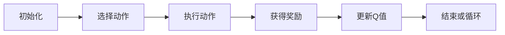
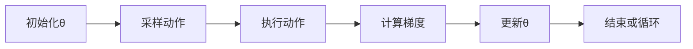
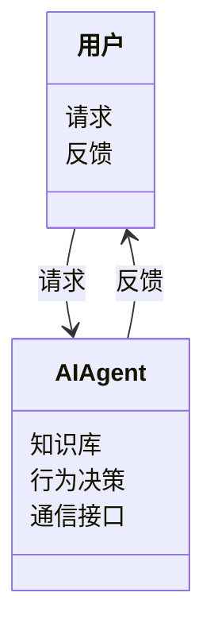
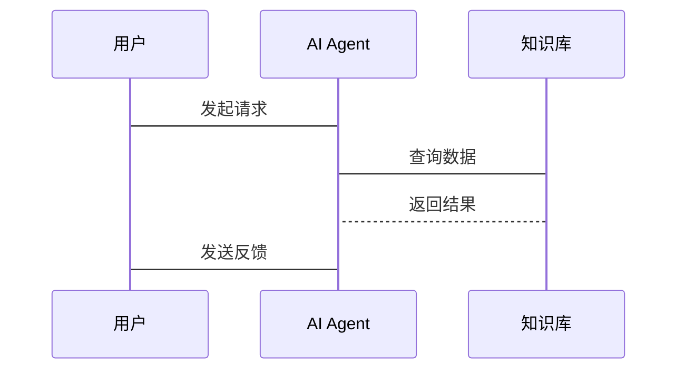

                 


# 强化学习在AI Agent人机协作中的应用

**关键词**：强化学习，AI Agent，人机协作，算法原理，系统架构

**摘要**：本文将深入探讨强化学习在AI Agent人机协作中的应用，从背景介绍、核心概念、算法原理、系统架构到项目实战，逐步分析强化学习如何驱动AI Agent在人机协作中的高效决策与优化。

---

## 第一部分：强化学习与AI Agent人机协作的背景介绍

### 第1章：强化学习与AI Agent概述

#### 1.1 强化学习的基本概念
- 1.1.1 强化学习的定义
- 1.1.2 强化学习的核心要素
- 1.1.3 强化学习与监督学习的区别

#### 1.2 AI Agent的基本概念
- 1.2.1 AI Agent的定义
- 1.2.2 AI Agent的分类
- 1.2.3 AI Agent的核心功能

#### 1.3 强化学习在AI Agent中的应用背景
- 1.3.1 强化学习与AI Agent的结合
- 1.3.2 人机协作的定义与特点
- 1.3.3 强化学习在人机协作中的优势

### 第2章：强化学习与AI Agent的核心概念

#### 2.1 强化学习的核心原理
- 2.1.1 状态、动作、奖励的定义
- 2.1.2 Q-learning算法的原理
- 2.1.3 策略梯度方法的原理

#### 2.2 AI Agent的核心功能
- 2.2.1 知识表示与推理
- 2.2.2 行为决策与规划
- 2.2.3 人机协作中的通信与协调

#### 2.3 强化学习与AI Agent的结合模型
- 2.3.1 强化学习驱动的决策过程
- 2.3.2 AI Agent的环境建模
- 2.3.3 人机协作中的反馈机制

### 第3章：强化学习与AI Agent的核心概念联系

#### 3.1 强化学习与AI Agent的属性对比
- 3.1.1 强化学习的属性
- 3.1.2 AI Agent的属性
- 3.1.3 两者属性的对比分析

#### 3.2 强化学习与AI Agent的ER实体关系图
```mermaid
er
classDiagram
    class 强化学习 {
        状态
        动作
        奖励
        策略
    }
    class AI Agent {
        知识库
        行为决策
        通信接口
    }
    强化学习 --> AI Agent : 驱动
    AI Agent --> 环境 : 交互
```

---

## 第二部分：强化学习的算法原理

### 第4章：强化学习算法的核心原理

#### 4.1 Q-learning算法
- 4.1.1 Q-learning的数学模型
$$ Q(s, a) = Q(s, a) + \alpha (r + \gamma \max Q(s', a') - Q(s, a)) $$
- 4.1.2 Q-learning的实现步骤
  1. 初始化Q表
  2. 选择动作
  3. 执行动作并获得奖励
  4. 更新Q值
- 4.1.3 Q-learning的流程图


#### 4.2 策略梯度方法
- 4.2.1 策略梯度的核心思想
$$ \nabla \theta J(\theta) = \mathbb{E}[ \nabla \log \pi_\theta(a|s) Q(s,a) ] $$
- 4.2.2 策略梯度的实现步骤
  1. 初始化参数θ
  2. 采样动作并执行
  3. 计算梯度并更新参数
- 4.2.3 策略梯度的流程图


#### 4.3 强化学习算法的代码实现
- 4.3.1 Q-learning的Python代码示例
```python
class QLearning:
    def __init__(self, state_space, action_space, alpha=0.1, gamma=0.9):
        self.Q = np.zeros((state_space, action_space))
        self.alpha = alpha
        self.gamma = gamma

    def choose_action(self, state):
        return np.argmax(self.Q[state, :])

    def update(self, state, action, reward, next_state):
        self.Q[state, action] += self.alpha * (reward + self.gamma * np.max(self.Q[next_state, :]) - self.Q[state, action])
```

---

## 第三部分：AI Agent的系统架构设计

### 第5章：AI Agent的系统架构

#### 5.1 问题场景介绍
- 5.1.1 人机协作的应用场景
- 5.1.2 AI Agent在协作中的角色
- 5.1.3 系统的功能需求

#### 5.2 系统功能设计
- 5.2.1 领域模型设计


#### 5.3 系统架构设计
- 5.3.1 系统架构图


#### 5.4 系统接口设计
- 5.4.1 接口定义
- 5.4.2 接口实现
- 5.4.3 接口文档

#### 5.5 系统交互流程
- 5.5.1 交互流程图


---

## 第四部分：项目实战

### 第6章：强化学习驱动的AI Agent项目

#### 6.1 项目环境安装
- 6.1.1 安装Python
- 6.1.2 安装依赖库（如numpy、tensorflow等）

#### 6.2 系统核心实现
- 6.2.1 强化学习算法实现
- 6.2.2 AI Agent实现
- 6.2.3 人机协作接口实现

#### 6.3 代码实现与解读
- 6.3.1 强化学习算法代码
```python
def强化学习算法():
    初始化Q表
    while True:
        选择动作
        执行动作
        获得奖励
        更新Q表
```

#### 6.4 案例分析与优化
- 6.4.1 案例分析
- 6.4.2 性能优化
- 6.4.3 效果对比

---

## 第五部分：总结与展望

### 第7章：强化学习在人机协作中的应用总结

#### 7.1 小结
- 7.1.1 强化学习的优势
- 7.1.2 AI Agent的核心作用
- 7.1.3 人机协作的未来发展

#### 7.2 注意事项
- 7.2.1 算法选择的注意事项
- 7.2.2 系统设计的注意事项
- 7.2.3 应用中的潜在问题

#### 7.3 拓展阅读
- 7.3.1 强化学习的经典论文
- 7.3.2 AI Agent的相关书籍
- 7.3.3 人机协作的前沿技术

---

**作者**：AI天才研究院/AI Genius Institute & 禅与计算机程序设计艺术 /Zen And The Art of Computer Programming

---

通过以上目录大纲，我们可以系统地了解强化学习在AI Agent人机协作中的应用，从理论到实践，从算法到系统设计，逐步深入，确保读者能够全面掌握相关知识和技能。

