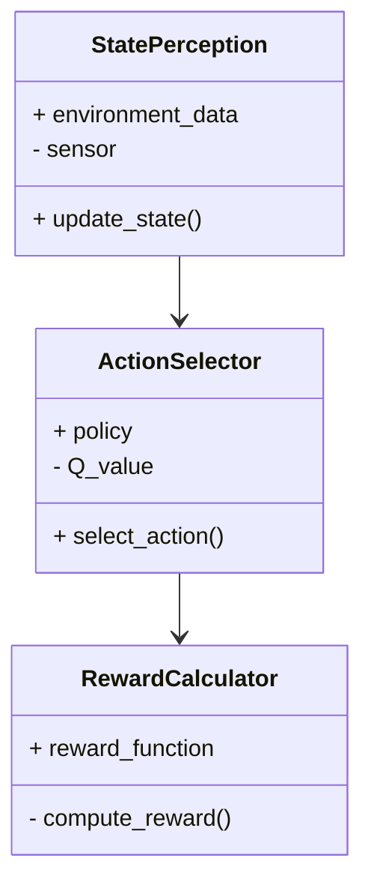
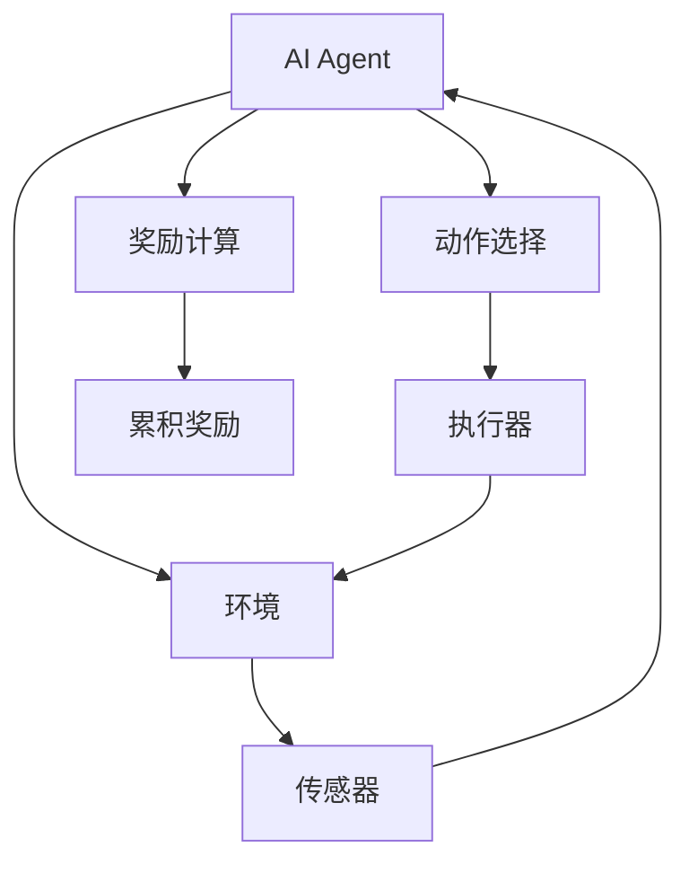
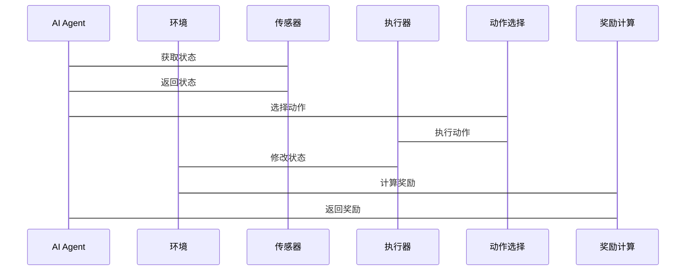

                 


```markdown
# 强化学习在AI Agent任务规划中的应用

> 关键词：强化学习，AI Agent，任务规划，马尔可夫决策过程，策略梯度，Actor-Critic架构

> 摘要：本文系统地探讨了强化学习在AI Agent任务规划中的应用。从强化学习的基本原理到任务规划的核心概念，从具体的算法实现到系统的架构设计，再到实际项目中的应用案例，本文全面解析了强化学习在任务规划中的作用与价值。通过详细的数学推导和实际代码实现，本文为读者提供了从理论到实践的完整知识链条。

---

## 第1章: 背景介绍

### 1.1 强化学习的基本概念
#### 1.1.1 强化学习的定义
强化学习是一种机器学习范式，通过智能体与环境的交互，学习最优策略以最大化累积奖励。其核心在于通过试错学习，逐步逼近最优决策。

#### 1.1.2 强化学习的核心要素
- 状态（State）：智能体所处的环境情况。
- 动作（Action）：智能体采取的行为。
- 奖励（Reward）：智能体行为的价值反馈。
- 策略（Policy）：智能体选择动作的规则。
- 值函数（Value Function）：衡量状态或动作价值的函数。

#### 1.1.3 强化学习与监督学习的区别
| 对比维度 | 监督学习 | 强化学习 |
|----------|----------|----------|
| 数据来源 | 标签数据 | 奖励信号 |
| 学习目标 | 预测任务 | 最大化累积奖励 |
| 反馈机制 | 即时反馈 | 延时反馈 |

### 1.2 AI Agent的定义与特点
#### 1.2.1 AI Agent的定义
AI Agent是一种能够感知环境、自主决策并采取行动的智能实体。

#### 1.2.2 AI Agent的核心功能
- 状态感知：通过传感器获取环境信息。
- 动作选择：基于当前状态选择最优动作。
- 目标导向：根据目标调整行为策略。

#### 1.2.3 AI Agent的应用场景
- 游戏AI：如自动驾驶、游戏NPC控制。
- 机器人控制：如工业机器人、服务机器人。
- 自然语言处理：如对话系统、智能助手。

### 1.3 任务规划的定义与分类
#### 1.3.1 任务规划的定义
任务规划是指智能体根据目标和环境状态，制定一系列行动步骤的过程。

#### 1.3.2 任务规划的分类
- 单一目标规划：如路径规划。
- 多目标规划：如任务分解。
- 动态环境规划：如实时任务调整。

#### 1.3.3 任务规划的应用领域
- 自动驾驶：路径规划与避障。
- 机器人控制：任务分解与执行。
- 智能助手：任务优先级排序。

### 1.4 强化学习与任务规划的关系
#### 1.4.1 强化学习在任务规划中的作用
- 提供决策机制：通过强化学习，AI Agent能够自主选择最优动作。
- 处理不确定性：强化学习能够适应动态变化的环境。
- 优化目标函数：通过最大化累积奖励，优化任务规划的效率。

#### 1.4.2 强化学习与任务规划的结合方式
- 直接应用：将任务规划问题转化为强化学习问题。
- 分层架构：将任务分解为多个子任务，分别应用强化学习。

#### 1.4.3 强化学习在任务规划中的优势
- 自适应性：能够根据环境变化调整策略。
- 最优化：能够找到全局最优解。
- 灵活性：适用于复杂动态环境。

---

## 第2章: 强化学习的核心概念与联系

### 2.1 强化学习的原理
#### 2.1.1 状态、动作、奖励的关系
状态是环境的描述，动作是智能体的选择，奖励是对智能体行为的反馈。智能体通过不断试错，学习最优策略。

#### 2.1.2 策略与值函数的定义
- 策略（Policy）：定义智能体在每个状态下选择动作的概率分布。
- 值函数（Value Function）：衡量状态或动作的价值，用于评估策略的好坏。

#### 2.1.3 探索与利用的平衡
探索：尝试新的动作以发现更好的策略。利用：根据已知信息采取当前最优动作。平衡：在探索与利用之间找到折中点，以加快收敛速度。

### 2.2 马尔可夫决策过程（MDP）
#### 2.2.1 MDP的定义与组成部分
- 状态空间（S）：所有可能的状态集合。
- 动作空间（A）：所有可能的动作集合。
- 状态转移概率（P）：从当前状态采取某个动作后转移到下一个状态的概率。
- 奖励函数（R）：智能体采取某个动作后获得的奖励。
- 终止状态（Termination State）：任务完成或失败的状态。

#### 2.2.2 MDP的状态转移概率
状态转移概率是强化学习的核心，描述了智能体在不同状态下采取不同动作后，转移到下一个状态的概率。

#### 2.2.3 MDP的最优策略求解
最优策略是指在所有可能的策略中，能够使累积奖励最大的策略。通过动态规划或强化学习算法，可以求解最优策略。

### 2.3 强化学习中的核心概念对比
| 对比维度 | 状态 | 动作 | 奖励 |
|----------|------|------|------|
| 作用 | 环境描述 | 行为选择 | 反馈机制 |
| 类型 | 离散/连续 | 离散/连续 | 标量/向量 |
| 示例 | 灰度值图像 | 方向选择 | 分数 |

### 2.4 任务规划中的状态与动作关系
#### 2.4.1 状态表示的构建
状态表示需要包含任务目标、环境信息和任务进度等。

#### 2.4.2 动作选择的机制
动作选择基于当前状态，结合奖励函数和策略函数，选择最优动作。

#### 2.4.3 奖励与目标的关系
奖励是对智能体行为的即时反馈，目标是长期的累积奖励最大化。

---

## 第3章: 强化学习的算法原理

### 3.1 Q-learning算法
#### 3.1.1 算法概述
Q-learning是一种基于值函数的强化学习算法，通过更新Q值表来逼近最优策略。

#### 3.1.2 算法流程
1. 初始化Q值表为零。
2. 在每个时间步，根据策略选择动作。
3. 计算即时奖励。
4. 更新Q值表：Q(s, a) = Q(s, a) + α(r + γ max Q(s', a'))。

#### 3.1.3 算法的数学模型
$$ Q(s, a) = Q(s, a) + \alpha (r + \gamma \max Q(s', a') - Q(s, a)) $$

### 3.2 策略梯度方法
#### 3.2.1 算法概述
策略梯度方法直接优化策略，通过梯度上升法最大化累积奖励。

#### 3.2.2 算法流程
1. 初始化策略参数θ。
2. 根据当前策略选择动作。
3. 计算累积奖励。
4. 计算策略梯度，并更新θ：θ = θ + α ∇θ J(θ)。

#### 3.2.3 算法的数学模型
$$ \nabla_\theta J(\theta) = \mathbb{E}_{\tau \sim \pi_\theta} [\nabla_\theta \log \pi_\theta(a|s) Q_\pi(s,a)] $$

### 3.3 Actor-Critic架构
#### 3.3.1 架构概述
Actor-Critic架构同时维护值函数和策略，通过两者协同优化策略。

#### 3.3.2 算法流程
1. 初始化策略θ和值函数V。
2. Actor选择动作，Critic评估状态价值。
3. 更新Critic：V(s) = V(s) + α(r + γ V(s') - V(s))。
4. 更新Actor：θ = θ + α ∇θ (Q(s,a) - V(s))。

#### 3.3.3 算法的数学模型
$$ Q(s,a) = R + \gamma V(s') $$
$$ \nabla_\theta Q(s,a) = \nabla_\theta \log \pi_\theta(a|s) \cdot Q(s,a) $$

---

## 第4章: 强化学习的数学模型

### 4.1 动态规划与强化学习的关系
动态规划是强化学习的基础，通过迭代更新值函数逼近最优策略。

### 4.2 策略评估的数学模型
$$ V_\pi(s) = \mathbb{E}_{a \sim \pi, s' \sim P} [r + \gamma V_\pi(s')] $$

### 4.3 策略改进的数学模型
$$ \pi'(a|s) = \arg \max_a Q_\pi(s,a) $$

### 4.4 值函数的近似表示
使用神经网络近似值函数，通过反向传播优化网络参数。

---

## 第5章: 系统分析与架构设计

### 5.1 任务规划的场景介绍
AI Agent在动态环境中进行任务规划，需要考虑环境变化、任务优先级和资源限制等因素。

### 5.2 系统功能设计
#### 5.2.1 系统功能模块
- 状态感知模块：获取环境信息。
- 动作选择模块：基于强化学习算法选择动作。
- 奖励机制模块：计算累积奖励。

#### 5.2.2 功能模块的类图设计


### 5.3 系统架构设计
#### 5.3.1 系统架构图


### 5.4 系统交互流程


---

## 第6章: 项目实战

### 6.1 环境配置与安装
安装Python、TensorFlow、OpenAI Gym等依赖库，配置强化学习环境。

### 6.2 核心代码实现
#### 6.2.1 状态表示
```python
class State:
    def __init__(self, position, target):
        self.position = position
        self.target = target
```

#### 6.2.2 动作选择
```python
def select_action(state, model):
    with tf.GradientTape() as tape:
        # 前向传播
        logits = model(state)
        # 计算损失
        loss = -tf.reduce_sum(tf.nn.log_softmax(logits) * action_labels)
    # 反向传播
    gradients = tape.gradient(loss, model.trainable_variables)
    # 更新模型
    optimizer.apply_gradients(zip(gradients, model.trainable_variables))
```

#### 6.2.3 奖励计算
```python
def compute_reward(state, action, next_state):
    if next_state.is_terminal:
        return -1 if not next_state.success else 1
    return 0
```

### 6.3 实际案例分析
通过具体任务（如路径规划）展示强化学习在任务规划中的应用，分析算法的收敛速度和策略的稳定性。

---

## 第7章: 最佳实践

### 7.1 小结
强化学习在AI Agent任务规划中具有重要价值，通过试错学习能够找到最优策略。

### 7.2 注意事项
- 状态表示要简洁准确。
- 奖励函数要合理设计。
- 算法选择要考虑环境特性。

### 7.3 拓展阅读
推荐相关书籍和论文，如《强化学习》、《深度强化学习》等。

---

## 作者

作者：AI天才研究院/AI Genius Institute & 禅与计算机程序设计艺术 /Zen And The Art of Computer Programming
```

