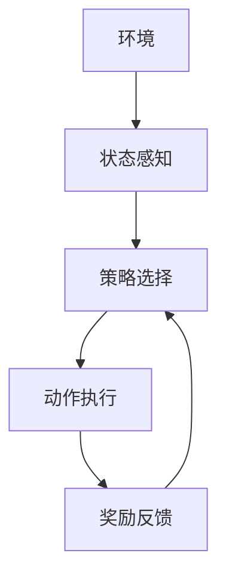

                 


# 强化学习在AI Agent决策优化中的应用

## 关键词
强化学习，AI Agent，决策优化，马尔可夫决策过程，策略，值函数

## 摘要
本文深入探讨了强化学习（Reinforcement Learning，RL）在AI Agent决策优化中的应用。通过分析强化学习的核心概念、算法原理、数学模型以及系统架构，本文为读者提供了从理论到实践的全面指南。文章首先介绍了强化学习的基本概念和AI Agent的定义，接着详细讲解了强化学习的核心原理，包括马尔可夫决策过程、策略和值函数等。随后，通过具体的算法流程图和数学公式，阐述了Q-learning、Deep Q-Network（DQN）、策略梯度（Policy Gradient）和Actor-Critic方法的实现细节。在系统设计部分，本文分析了AI Agent决策优化的系统架构，并通过实际项目案例展示了如何将强化学习应用于游戏AI和机器人导航。最后，本文总结了强化学习的优势与挑战，并给出了最佳实践建议。

---

## 第一部分: 强化学习与AI Agent决策优化背景

### 第1章: 强化学习与AI Agent概述

#### 1.1 强化学习的基本概念

**1.1.1 强化学习的定义**

强化学习是一种机器学习范式，通过智能体与环境的交互，学习最优策略以最大化累积奖励。与监督学习不同，强化学习不需要标注数据，而是通过试错机制进行学习。

**1.1.2 AI Agent的定义与特点**

AI Agent（智能体）是指在环境中能够感知并自主行动以实现目标的实体。AI Agent的特点包括自主性、反应性、目标导向性和社交能力。

**1.1.3 强化学习与AI Agent的关系**

强化学习为AI Agent提供了决策优化的方法，使其能够在复杂环境中做出最优选择。

#### 1.2 强化学习的核心框架

**1.2.1 状态（State）**

状态是环境在某一时刻的描述，例如在迷宫中，当前位置可以表示为一个状态。

**1.2.2 动作（Action）**

动作是智能体在某一状态下做出的选择，例如在迷宫中选择“左转”或“右转”。

**1.2.3 奖励（Reward）**

奖励是对智能体当前动作的反馈，通常以数值形式表示，用于指导智能体的行为。

**1.2.4 策略（Policy）**

策略是智能体选择动作的概率分布，例如在状态s下选择动作a的概率π(a|s)。

**1.2.5 值函数（Value Function）**

值函数表示状态或动作的优劣程度，例如Q(s, a)表示在状态s下执行动作a的预期累积奖励。

#### 1.3 强化学习的应用场景

**1.3.1 游戏AI**

在游戏AI中，强化学习用于训练智能体在复杂游戏环境中做出决策，如AlphaGo。

**1.3.2 机器人控制**

强化学习可以用于训练机器人在动态环境中执行任务，如抓取物体或导航。

**1.3.3 自动驾驶**

自动驾驶系统利用强化学习优化驾驶策略，以提高安全性和效率。

**1.3.4 金融投资**

强化学习用于训练智能投资组合，优化资产配置以最大化收益。

#### 1.4 本章小结

本章介绍了强化学习的基本概念、AI Agent的定义以及强化学习在多个领域的应用。

---

## 第二部分: 强化学习的核心概念与联系

### 第2章: 强化学习的核心原理

#### 2.1 马尔可夫决策过程（MDP）

**2.1.1 MDP的定义**

MDP是一个元组（S, A, P, R, γ），其中S是状态空间，A是动作空间，P是状态转移概率，R是奖励函数，γ是折扣因子。

**2.1.2 MDP的状态转移概率**

状态转移概率P(s' | s, a)表示在状态s下执行动作a后转移到状态s'的概率。

**2.1.3 MDP的最优策略**

最优策略是使累积奖励最大的策略，通常使用值函数或Q函数来衡量。

#### 2.2 策略与值函数的关系

**2.2.1 策略的定义**

策略π(a|s)表示在状态s下选择动作a的概率。

**2.2.2 值函数的定义**

值函数V(s)表示从状态s开始按照策略π行动的预期累积奖励。

**2.2.3 策略评估与优化**

策略评估是计算当前策略的值函数，而策略优化是寻找使值函数最大的策略。

---

## 第三部分: 强化学习算法原理

### 第3章: 基于值函数的强化学习算法

#### 3.1 Q-learning算法

**3.1.1 算法概述**

Q-learning是一种基于值函数的强化学习算法，通过更新Q表来学习最优策略。

**3.1.2 算法流程图**

```mermaid
graph TD
    A[状态s] --> B[动作a]
    B --> C[新的状态s']
    C --> D[奖励r]
    D --> E(Q(s,a) := r + γ*max(Q(s',a')))
```

**3.1.3 算法实现代码**

```python
import numpy as np

class QLearning:
    def __init__(self, state_space, action_space, gamma=0.99, alpha=0.1):
        self.q_table = np.zeros((state_space, action_space))
        self.gamma = gamma
        self.alpha = alpha

    def choose_action(self, state, epsilon=0.1):
        if np.random.random() < epsilon:
            return np.random.randint(0, self.q_table.shape[1])
        return np.argmax(self.q_table[state])

    def update_q_table(self, state, action, reward, next_state):
        self.q_table[state][action] = self.q_table[state][action] + self.alpha * (reward + self.gamma * max(self.q_table[next_state]) - self.q_table[state][action])
```

---

## 第四部分: 强化学习数学模型与公式

### 第4章: 强化学习的数学模型

#### 4.1 值函数的数学表达式

$$ V(s) = \max_a Q(s,a) $$

#### 4.2 Q函数的更新公式

$$ Q(s,a) = Q(s,a) + \alpha (r + \gamma V(s') - Q(s,a)) $$

---

## 第五部分: AI Agent决策优化的系统分析与架构设计

### 第5章: 系统设计与架构

#### 5.1 系统功能设计

- 状态感知模块：感知环境状态
- 动作选择模块：基于策略选择动作
- 奖励反馈模块：计算累积奖励

#### 5.2 系统架构设计



---

## 第六部分: 强化学习项目实战

### 第6章: 项目实战

#### 6.1 环境配置与安装

```bash
pip install gym
```

#### 6.2 核心代码实现

```python
import gym
from qlearning import QLearning

env = gym.make('CartPole-v1')
agent = QLearning(env.observation_space.shape[0], env.action_space.n)

for episode in range(1000):
    state = env.reset()
    while True:
        action = agent.choose_action(state)
        next_state, reward, done, _ = env.step(action)
        agent.update_q_table(state, action, reward, next_state)
        state = next_state
        if done:
            break
```

---

## 第七部分: 最佳实践、小结与扩展阅读

### 第7章: 总结与展望

#### 7.1 本章小结

本文详细介绍了强化学习在AI Agent决策优化中的应用，从理论到实践，为读者提供了全面的指导。

#### 7.2 最佳实践 tips

- 确保环境和算法的兼容性
- 合理设置超参数
- 定期保存和恢复训练进度

#### 7.3 扩展阅读

- 《Reinforcement Learning: Theory and Algorithms》
- 《Deep Reinforcement Learning》

---

## 作者

作者：AI天才研究院/AI Genius Institute & 禅与计算机程序设计艺术 /Zen And The Art of Computer Programming

---

以上是《强化学习在AI Agent决策优化中的应用》的完整目录大纲和部分内容，您可以根据需要进行调整。

