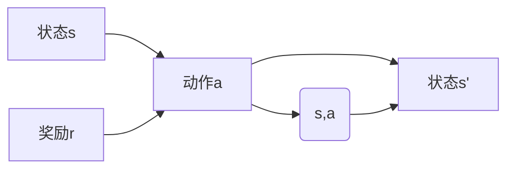

                 


# 强化学习在AI Agent对话生成中的创新应用

> 关键词：强化学习，AI Agent，对话生成，Q-learning，策略梯度，Actor-Critic

> 摘要：本文系统地探讨了强化学习在AI Agent对话生成中的创新应用，从强化学习的基本概念、核心算法到对话生成的系统架构设计，再到具体的项目实现，进行了全面而深入的分析。文章结合理论与实践，通过详细的数学公式推导和代码实现，展示了强化学习在对话生成中的独特优势和实际应用价值。

---

## 第1章: 强化学习的基本概念与应用背景

### 1.1 强化学习的定义与特点

#### 1.1.1 从监督学习到强化学习的演进
- 监督学习：基于标记数据，学习函数映射关系。
- 强化学习：通过与环境交互，学习策略以最大化累积奖励。

#### 1.1.2 强化学习的核心特点
- 环境交互：通过动作改变环境状态。
- 奖励机制：基于动作和状态的反馈，调整策略。
- 长期目标：最大化累积奖励。

#### 1.1.3 强化学习与其它机器学习方法的对比
- 监督学习：依赖标记数据。
- 无监督学习：依赖数据分布。
- 强化学习：依赖动作与环境的交互。

### 1.2 AI Agent对话生成的背景与挑战

#### 1.2.1 对话生成的基本概念
- 自然语言处理中的生成任务。
- 基于规则或模型的对话生成。

#### 1.2.2 AI Agent在对话生成中的独特优势
- 动态交互：实时调整对话内容。
- 智能决策：基于上下文选择最优动作。
- 适应性：根据用户反馈优化对话策略。

#### 1.2.3 当前对话生成技术的主要挑战
- 上下文理解的准确性。
- 对话目标的多样性。
- 奖励函数的设计难度。

---

## 第2章: 强化学习在对话生成中的创新应用

### 2.1 强化学习的核心概念与原理

#### 2.1.1 马尔可夫决策过程（MDP）
- 状态空间：S。
- 动作空间：A。
- 转移概率：P(s'|s,a)。
- 奖励函数：R(s,a,s')。

#### 2.1.2 策略与奖励机制
- 策略π(a|s)：给定状态s时选择动作a的概率。
- 奖励函数R(s,a,s')：对动作和状态转移的评估。

#### 2.1.3 动作空间与状态空间的定义
- 状态空间：对话历史、当前用户输入。
- 动作空间：可能的回复内容。

### 2.2 强化学习在对话生成中的应用框架

#### 2.2.1 对话生成的强化学习模型架构
- 状态表示：将对话历史编码为向量。
- 动作选择：生成回复并输出动作。

#### 2.2.2 基于强化学习的对话生成流程
- 初始化状态s。
- 选择动作a，输出回复。
- 更新状态s'，获取奖励r。
- 优化策略π。

#### 2.2.3 增量式训练与端到端优化
- 增量式训练：逐步优化策略。
- 端到端优化：直接优化对话生成模型。

---

## 第3章: 强化学习的核心算法与数学模型

### 3.1 值函数与策略优化

#### 3.1.1 Q-learning算法
- Q值更新公式：
$$ Q(s,a) \leftarrow Q(s,a) + \alpha \left(r + \max_{a'} Q(s',a') - Q(s,a)\right) $$

- Q-learning的mermaid图：


#### 3.1.2 策略梯度方法
- 策略梯度的核心公式：
$$ \nabla \theta \leftarrow \nabla \log \pi(a|s;\theta) \cdot Q(s,a) $$

- 策略梯度的mermaid图：
```mermaid
graph LR
A[状态s] --> C[动作a]
C --> B[状态s']
D[奖励r] --> C
C --> π(a|s;\theta)
C --> Q(s,a)
```

#### 3.1.3 Actor-Critic架构
- Actor-Critic的交替优化：
- Actor更新策略：$$ \theta \leftarrow \theta + \alpha \nabla J(\theta) $$
- Critic更新值函数：$$ w \leftarrow w + \beta \nabla (Q(s,a) - target) $$`

### 3.2 对话生成中的数学模型

#### 3.2.1 状态表示与动作空间
- 状态向量表示：$$ s = (s_1, s_2, ..., s_n) $$
- 动作向量表示：$$ a = (a_1, a_2, ..., a_m) $$`

#### 3.2.2 奖励函数的设计与实现
- 基于相似度的奖励：$$ r = \text{ Rouge-L}(a_{\text{生成}}, a_{\text{参考}}) $$
- 基于用户反馈的奖励：$$ r = f(\text{用户输入}) $$`

#### 3.2.3 动作选择的概率分布模型
- 多分类问题：$$ P(a|s) = \text{softmax}(\pi(s;\theta)) $$

---

## 第4章: 对话生成系统的系统分析与架构设计

### 4.1 系统功能设计

#### 4.1.1 对话生成的基本功能模块
- 输入处理：接收用户输入。
- 状态编码：将对话历史编码为向量。
- 动作选择：生成回复。
- 输出接口：返回回复文本。

#### 4.1.2 基于强化学习的优化模块
- 策略优化：更新策略参数。
- 奖励计算：计算动作奖励。
- 状态更新：更新对话状态。

#### 4.1.3 系统输入输出接口设计
- 输入接口：API或用户终端。
- 输出接口：API或聊天界面。

### 4.2 系统架构设计

#### 4.2.1 分层架构设计
- 用户层：接收输入，显示输出。
- 对话层：处理对话逻辑。
- 强化学习层：优化策略。

#### 4.2.2 模块间交互关系
- 用户输入 --> 对话层处理 --> 生成回复 --> 强化学习层优化 --> 更新策略。

#### 4.2.3 系统扩展性设计
- 支持多种对话模式。
- 支持多种奖励机制。
- 支持多种策略优化方法。

---

## 第5章: 强化学习算法的数学模型与公式

### 5.1 Q-learning算法的数学模型

- Q-learning的更新公式：
$$ Q(s,a) \leftarrow Q(s,a) + \alpha (r + \max_{a'} Q(s',a') - Q(s,a)) $$

- 状态转移概率矩阵：
$$ P(s'|s,a) = \text{概率矩阵} $$

- 奖励函数的数学表达：
$$ r = f(s,a,s') $$

### 5.2 策略梯度方法的数学推导

- 策略梯度的核心公式：
$$ \nabla \theta \leftarrow \nabla \log \pi(a|s;\theta) \cdot Q(s,a) $$

- 梯度计算的数学步骤：
1. 计算策略梯度：$$ \nabla \log \pi(a|s;\theta) $$
2. 计算Q值：$$ Q(s,a) $$
3. 更新策略参数：$$ \theta \leftarrow \theta + \alpha \nabla \theta $$

### 5.3 Actor-Critic架构的数学模型

- Actor的更新公式：
$$ \theta \leftarrow \theta + \alpha \nabla J(\theta) $$

- Critic的更新公式：
$$ w \leftarrow w + \beta \nabla (Q(s,a) - target) $$`

---

## 第6章: 项目实战与代码实现

### 6.1 环境安装与配置

#### 6.1.1 Python环境的搭建
- 安装Python 3.8+。
- 安装必要的库：TensorFlow、PyTorch、Keras。

#### 6.1.2 强化学习库的安装
- TensorFlow：`pip install tensorflow`
- PyTorch：`pip install torch`

#### 6.1.3 对话生成模型的依赖库安装
- transformers：`pip install transformers`

### 6.2 系统核心实现

#### 6.2.1 对话生成模型的代码实现
```python
import torch
from transformers import GPT2LMHeadModel, GPT2Tokenizer

class DialogueGenerator:
    def __init__(self, model_name="gpt2"):
        self.model = GPT2LMHeadModel.from_pretrained(model_name)
        self.tokenizer = GPT2Tokenizer.from_pretrained(model_name)
```

#### 6.2.2 强化学习算法的代码实现
```python
class QLearning:
    def __init__(self, state_space, action_space):
        self.Q = defaultdict(lambda: defaultdict(lambda: 0))
        self.state_space = state_space
        self.action_space = action_space
```

#### 6.2.3 系统接口的代码实现
```python
def generate_response(input_text):
    state = encode_dialogue_history(input_text)
    action = select_action(state)
    return decode_action_to_text(action)
```

### 6.3 代码解读与分析

#### 6.3.1 对话生成模型的代码解读
- 使用GPT-2模型生成回复。
- 对话历史编码为向量。

#### 6.3.2 强化学习算法的代码解读
- Q-learning算法更新Q值表。
- 动作选择基于Q值表。

#### 6.3.3 系统接口的代码解读
- 输入文本经过编码后选择动作。
- 动作解码为文本回复。

### 6.4 项目小结

#### 6.4.1 系统功能实现
- 实现了基于强化学习的对话生成。
- 集成了Q-learning算法。

#### 6.4.2 系统性能优化
- 使用GPT-2模型优化回复生成。
- 增量式训练优化策略。

#### 6.4.3 系统扩展性
- 支持多种对话模式。
- 支持多种策略优化方法。

---

## 第7章: 总结与展望

### 7.1 总结

- 强化学习在对话生成中的独特优势。
- 基于强化学习的对话生成系统架构。
- 实际项目中的应用案例分析。

### 7.2 小结

- 系统功能的实现。
- 项目实战的经验总结。
- 系统优化的方向。

### 7.3 注意事项

- 强化学习算法的选择。
- 奖励函数的设计。
- 系统性能的优化。

### 7.4 拓展阅读

- 基于Transformer的对话生成模型。
- 多智能体强化学习在对话生成中的应用。
- 基于深度强化学习的对话生成研究。

---

作者：AI天才研究院/AI Genius Institute & 禅与计算机程序设计艺术 /Zen And The Art of Computer Programming

