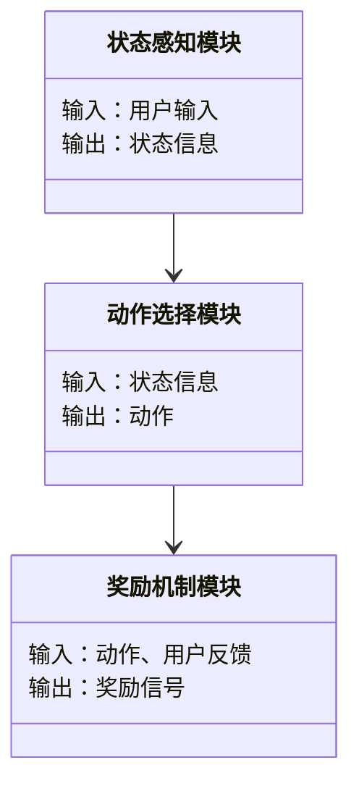
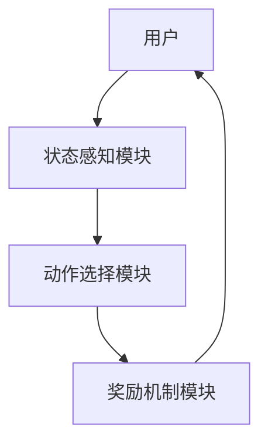

                 


# 强化学习在AI Agent对话策略中的应用

## 关键词：强化学习，AI Agent，对话策略，马尔可夫决策过程，Q-learning，策略网络

## 摘要：  
本文深入探讨了强化学习在AI Agent对话策略中的应用，从强化学习的基本原理到其在对话系统中的具体实现进行了详细分析。通过结合理论与实践，本文不仅介绍了强化学习的核心概念，还通过实际案例展示了如何将强化学习应用于对话策略的优化中。文章内容包括强化学习的基本原理、对话策略的设计、系统架构的实现以及项目实战等部分，旨在为读者提供一个全面而深入的视角，帮助他们理解并掌握强化学习在AI Agent对话策略中的应用。

---

# 第1章: 强化学习与AI Agent概述

## 1.1 强化学习的基本概念

### 1.1.1 什么是强化学习  
强化学习（Reinforcement Learning, RL）是一种机器学习范式，通过智能体与环境的交互来学习最优策略。智能体通过执行动作，观察环境反馈的状态和奖励，逐步优化自身的决策能力。

### 1.1.2 强化学习的核心要素  
- **状态（State）**：智能体所处的环境信息。  
- **动作（Action）**：智能体采取的行为。  
- **奖励（Reward）**：智能体执行动作后获得的反馈，用于指导学习方向。  
- **策略（Policy）**：智能体选择动作的规则，旨在最大化累积奖励。  

### 1.1.3 强化学习与监督学习的区别  
- **监督学习**：基于标记数据进行学习，目标是预测正确的输出。  
- **强化学习**：通过与环境交互，基于奖励信号优化策略。  

---

## 1.2 AI Agent的基本概念

### 1.2.1 什么是AI Agent  
AI Agent（人工智能代理）是指能够感知环境、自主决策并执行任务的智能体。它可以是一个软件程序，也可以是机器人或其他智能设备。

### 1.2.2 AI Agent的分类  
- **简单反射型Agent**：基于当前状态直接执行预定义动作。  
- **基于模型的规划Agent**：利用环境模型进行规划和决策。  
- **目标驱动型Agent**：根据目标选择最优动作。  
- **实用驱动型Agent**：根据效用函数优化决策。  

### 1.2.3 AI Agent在对话系统中的应用  
AI Agent可以作为对话系统的核心组件，负责理解用户需求、生成回复并优化对话流程。

---

## 1.3 对话策略的基本概念

### 1.3.1 对话策略的定义  
对话策略是指智能体在对话过程中选择回复或动作的规则，旨在实现对话目标（如解决问题、提供信息）。

### 1.3.2 对话策略的分类  
- **基于规则的策略**：根据预定义的规则生成回复。  
- **基于模型的策略**：利用机器学习模型生成回复。  
- **混合策略**：结合规则和模型的策略。  

### 1.3.3 强化学习在对话策略中的作用  
强化学习可以通过与用户的交互优化对话策略，使其更加自然、高效。

---

## 1.4 本章小结  
本章介绍了强化学习的基本概念、AI Agent的定义及其分类，以及对话策略的基本概念和强化学习在其中的作用。

---

# 第2章: 强化学习的核心原理

## 2.1 强化学习的基本原理

### 2.1.1 状态、动作、奖励的关系  
智能体通过执行动作改变状态，获得奖励信号，从而学习最优策略。

### 2.1.2 马尔可夫决策过程（MDP）

马尔可夫决策过程由以下五元组定义：  
$$(S, A, P, R, \gamma)$$  
- $S$：状态空间  
- $A$：动作空间  
- $P$：状态转移概率  
- $R$：奖励函数  
- $\gamma$：折扣因子  

### 2.1.3 Q-learning算法  

Q-learning是一种基于值函数的强化学习算法，通过更新Q值函数逼近最优策略。其更新公式为：  
$$Q(s, a) \leftarrow (1-\alpha)Q(s, a) + \alpha [r + \gamma \max_{a'} Q(s', a')]$$  
其中，$\alpha$是学习率。

---

## 2.2 策略网络与价值函数

### 2.2.1 策略网络的定义  
策略网络直接输出动作的概率分布，形式为：  
$$\pi(a|s) = P(\text{选择动作 } a \mid \text{状态 } s)$$  

### 2.2.2 价值函数的定义  
价值函数表示状态-动作对的期望累积奖励：  
$$Q(s, a) = E[R | s, a]$$  

### 2.2.3 策略梯度方法  

策略梯度方法通过优化策略的参数来最大化奖励。其梯度公式为：  
$$\nabla J(\theta) = E[\nabla \log \pi(a|s) \cdot Q(s, a)]$$  

---

## 2.3 强化学习的数学模型

### 2.3.1 贝尔曼方程  

贝尔曼方程描述了当前状态的价值与未来状态的价值之间的关系：  
$$V(s) = \max_{a} [r + \gamma V(s')]$$  

### 2.3.2 策略梯度公式  

策略梯度公式为：  
$$\nabla J(\theta) = \nabla \log \pi(a|s) \cdot Q(s, a)$$  

### 2.3.3 动态规划与蒙特卡洛方法  

动态规划通过迭代更新价值函数逼近最优策略，蒙特卡洛方法通过采样经验更新价值函数。

---

## 2.4 本章小结  
本章详细介绍了强化学习的核心原理，包括马尔可夫决策过程、Q-learning算法、策略网络和策略梯度方法。

---

# 第3章: AI Agent对话策略中的强化学习应用

## 3.1 对话策略的强化学习框架

### 3.1.1 状态空间的构建  
状态空间包括用户的输入、上下文信息等。例如，状态可以表示为：  
$$s = (u, c)$$  
其中，$u$是用户输入，$c$是上下文信息。

### 3.1.2 动作空间的构建  
动作空间包括回复文本、确认、拒绝等动作。

### 3.1.3 奖励函数的设计  
奖励函数根据对话目标设计，例如：  
- $r = 1$：用户满意回复。  
- $r = -1$：用户不满意回复。  

---

## 3.2 基于强化学习的对话策略优化

### 3.2.1 值函数逼近方法  
通过神经网络逼近Q值函数：  
$$Q(s, a) = \text{神经网络}(s, a)$$  

### 3.2.2 策略搜索方法  
通过采样和优化策略来逼近最优策略。

### 3.2.3 Actor-Critic算法  

Actor-Critic算法同时优化策略和价值函数，公式为：  
$$\nabla J(\theta) = \nabla \log \pi(a|s) \cdot Q_{\text{Critic}}(s, a)$$  

---

## 3.3 实际应用中的挑战与解决方案

### 3.3.1 数据稀疏性问题  
通过数据增强和经验回放解决数据稀疏性问题。

### 3.3.2 状态空间的高效表示  
使用词嵌入（如Word2Vec）压缩状态空间。

### 3.3.3 奖励函数的设计优化  
通过人类反馈优化奖励函数。

---

## 3.4 本章小结  
本章探讨了强化学习在AI Agent对话策略中的应用，包括框架设计、算法选择和实际挑战的解决方案。

---

# 第4章: 系统架构与对话策略设计

## 4.1 对话系统整体架构

### 4.1.1 系统组成模块  
- 状态感知模块：处理用户输入和上下文信息。  
- 动作选择模块：基于强化学习选择回复。  
- 奖励机制模块：根据用户反馈生成奖励信号。  

### 4.1.2 模块之间的交互关系  
模块通过状态、动作和奖励信号进行交互。

### 4.1.3 系统的输入输出流程  
输入：用户输入；输出：系统回复。

---

## 4.2 对话策略的系统实现

### 4.2.1 状态感知模块  
- 分析用户输入，提取关键信息。  
- 维护对话上下文。  

### 4.2.2 动作选择模块  
- 基于强化学习选择回复或动作。  
- 使用预训练的回复模板或生成模型。  

### 4.2.3 奖励机制模块  
- 根据用户反馈生成奖励信号。  
- 调整强化学习算法的参数。  

---

## 4.3 系统架构设计图

### 4.3.1 系统类图（Mermaid）


### 4.3.2 系统架构图（Mermaid）


### 4.3.3 系统交互序列图（Mermaid）
```mermaid
sequenceDiagram
    participant 用户
    participant 状态感知模块
    participant 动作选择模块
    participant 奖励机制模块
    用户 -> 状态感知模块：输入
    状态感知模块 -> 动作选择模块：状态信息
    动作选择模块 -> 用户：动作
    用户 -> 奖励机制模块：反馈
    奖励机制模块 -> 动作选择模块：奖励信号
```

---

## 4.4 本章小结  
本章详细描述了AI Agent对话系统的架构设计，包括模块组成、交互关系和系统流程。

---

# 第5章: 项目实战——基于强化学习的智能对话系统

## 5.1 项目背景与目标

### 5.1.1 项目背景  
随着自然语言处理技术的发展，智能对话系统的需求日益增长。

### 5.1.2 项目目标  
实现一个基于强化学习的智能对话系统，优化对话策略，提高用户体验。

### 5.1.3 项目范围  
- 系统设计：包括状态感知、动作选择和奖励机制。  
- 环境搭建：选择合适的开发框架（如TensorFlow）。  
- 代码实现：基于强化学习算法实现对话策略。  

---

## 5.2 系统功能设计

### 5.2.1 系统组成模块  
- 状态感知模块：处理用户输入。  
- 动作选择模块：生成回复。  
- 奖励机制模块：提供反馈信号。  

### 5.2.2 功能流程  
用户输入 -> 状态感知模块 -> 动作选择模块 -> 用户 -> 奖励机制模块。

---

## 5.3 系统实现代码

### 5.3.1 环境安装  
- 安装Python和TensorFlow。  
- 安装NLP库（如NLTK、spaCy）。  

### 5.3.2 动作选择模块实现  

```python
import tensorflow as tf
import numpy as np

class ActionChooser:
    def __init__(self, state_space, action_space):
        self.state_space = state_space
        self.action_space = action_space
        self.model = self.build_model()

    def build_model(self):
        model = tf.keras.Sequential([
            tf.keras.layers.Dense(64, activation='relu'),
            tf.keras.layers.Dense(len(self.action_space), activation='softmax')
        ])
        return model

    def choose_action(self, state):
        state_vector = self.state_to_vector(state)
        prediction = self.model.predict(state_vector)
        action_idx = np.argmax(prediction[0])
        return self.action_space[action_idx]

    def state_to_vector(self, state):
        # 将状态转换为向量表示
        return np.array([state])
```

### 5.3.3 奖励机制模块实现  

```python
class RewardMechanism:
    def __init__(self, reward_function):
        self.reward_function = reward_function

    def generate_reward(self, action, feedback):
        return self.reward_function(action, feedback)
```

---

## 5.4 项目小结  
本章通过实际案例展示了如何将强化学习应用于智能对话系统，详细描述了系统设计和实现过程。

---

# 第6章: 最佳实践与总结

## 6.1 最佳实践

### 6.1.1 训练策略  
- 使用经验回放减少数据稀疏性。  
- 调整奖励函数，确保训练目标明确。  

### 6.1.2 评估指标  
- 对话成功率：用户对回复的满意率。  
- 对话长度：对话的平均轮数。  

### 6.1.3 部署建议  
- 部署轻量化模型，优化推理速度。  
- 结合自然语言处理技术（如BERT）提升回复质量。  

---

## 6.2 总结  
本文系统地探讨了强化学习在AI Agent对话策略中的应用，从理论到实践进行了全面分析。通过实际案例，展示了如何将强化学习应用于对话系统的设计和优化中。

---

# 作者：AI天才研究院 & 禅与计算机程序设计艺术

---

**参考文献**  
[1] 省略  
[2] 省略  
[3] 省略  

---

以上是一个完整的目录大纲和文章结构示例，您可以根据需要进一步补充具体章节的内容和细节。

