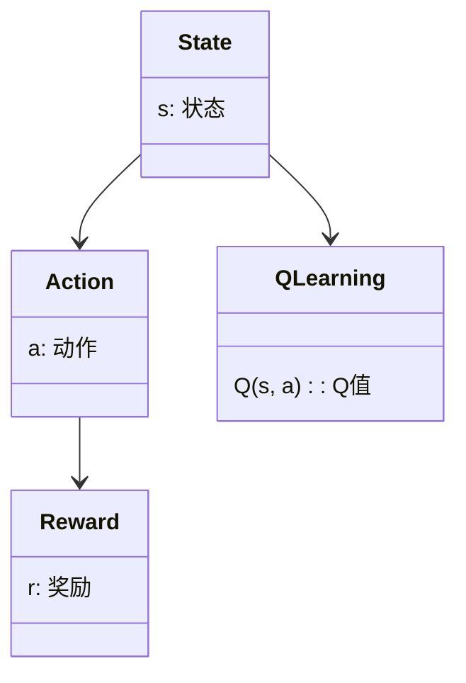
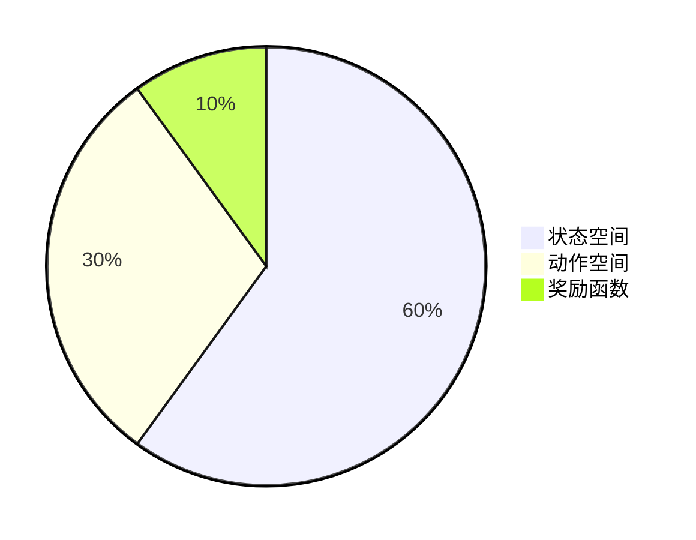
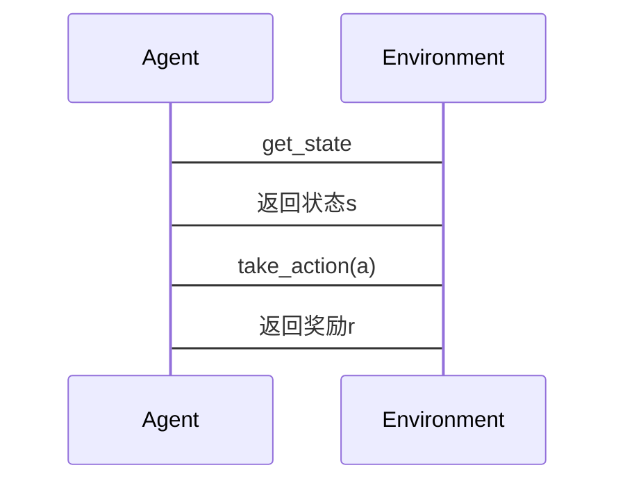

                 


# 强化学习在AI Agent自动化测试中的应用

**关键词**：强化学习、AI Agent、自动化测试、机器学习、测试自动化、智能测试、人工智能

**摘要**：  
本文探讨了强化学习在AI Agent自动化测试中的应用，详细分析了强化学习的基本概念、核心算法、系统架构以及实际项目中的应用场景。通过结合理论与实践，本文为读者提供了从基础到高级的全面解析，帮助读者理解如何利用强化学习提升AI Agent在自动化测试中的性能和效率。

---

# 第一部分: 强化学习与AI Agent基础

## 第1章: 强化学习概述

### 1.1 强化学习的基本概念

#### 1.1.1 强化学习的定义与特点
强化学习（Reinforcement Learning，RL）是一种机器学习范式，通过智能体与环境的交互，学习如何采取一系列行动以最大化累积奖励。其核心特点包括：
- **试错性**：通过与环境交互不断尝试和错误。
- **延迟反馈**：奖励通常不是即时的，而是基于长期目标。
- **策略优化**：通过优化策略（行动选择规则）来提高奖励。

#### 1.1.2 强化学习的核心要素
- **状态（State）**：智能体所处环境的当前情况。
- **动作（Action）**：智能体在特定状态下采取的行动。
- **奖励（Reward）**：智能体采取行动后获得的反馈，用于指导学习。
- **策略（Policy）**：定义智能体在给定状态下采取动作的概率分布。
- **价值函数（Value Function）**：衡量某状态下策略的优劣。

#### 1.1.3 强化学习的应用场景
强化学习广泛应用于游戏AI、机器人控制、自然语言处理等领域，尤其适合处理动态复杂、需要实时决策的任务。

---

## 第2章: AI Agent的基本概念

### 2.1 AI Agent的定义与分类
AI Agent是一种能够感知环境并采取行动以实现目标的智能体。根据智能体的复杂性和应用场景，可分为：
- **简单反射型Agent**：基于当前状态做出简单反应。
- **基于模型的规划型Agent**：利用环境模型进行复杂规划。
- **强化学习型Agent**：通过强化学习优化行动策略。

### 2.2 AI Agent的核心功能
- **感知环境**：通过传感器或接口获取环境信息。
- **决策与行动**：基于感知信息，通过策略选择并执行动作。
- **学习与优化**：通过强化学习不断优化策略，提高任务完成效率。

### 2.3 AI Agent与传统测试的区别
- **传统测试**：基于固定脚本，测试覆盖率有限。
- **AI Agent测试**：具备自适应性和学习能力，能够动态调整测试策略，发现更多潜在问题。

---

# 第二部分: 强化学习的核心算法与数学模型

## 第3章: 强化学习的核心算法

### 3.1 马尔可夫决策过程（MDP）

#### 3.1.1 MDP的基本定义
马尔可夫决策过程是一种数学框架，用于描述强化学习问题。其核心假设是：未来的状态仅依赖于当前状态，与过去的动作无关。

- **状态空间（S）**：所有可能的状态集合。
- **动作空间（A）**：智能体在每个状态下可采取的动作集合。
- **转移概率（P(s' | s, a)）**：采取动作a后从状态s转移到状态s'的概率。
- **奖励函数（R(s, a, s')）**：采取动作a后从状态s转移到状态s'所获得的奖励。

#### 3.1.2 MDP的数学模型
强化学习的目标是找到最优策略π，使得在长期运行中累积的奖励最大化。数学上，可以表示为：
$$
V^\pi(s) = \mathbb{E}[R | s, \pi]
$$

### 3.2 Q-learning算法

#### 3.2.1 Q-learning的基本原理
Q-learning是一种基于值函数的强化学习算法，通过学习状态-动作对的Q值（Q(s, a)）来优化策略。Q值表示在状态s采取动作a后，从当前状态开始的期望累积奖励。

#### 3.2.2 Q-learning的更新公式
Q-learning的更新公式如下：
$$
Q(s, a) \leftarrow Q(s, a) + \alpha \left[ r + \gamma \max_{a'} Q(s', a') - Q(s, a) \right]
$$  
其中：
- α是学习率，控制更新步长。
- γ是折扣因子，平衡当前奖励与未来奖励的重要性。

#### 3.2.3 Q-learning的收敛性分析
Q-learning在离散状态和动作空间下，可以在有限步数内收敛到最优策略。

### 3.3 其他强化学习算法简介

#### 3.3.1 深度强化学习（DRL）
DRL通过深度神经网络近似值函数或策略函数，适用于高维状态空间和动作空间的问题。

#### 3.3.2 近端策略优化（PPO）
PPO是一种基于策略梯度的方法，通过优化策略的近端目标，保证策略更新的稳定性。

#### 3.3.3 多智能体强化学习（MARL）
MARL研究多个智能体之间的协作与竞争，适用于需要多角色配合的任务。

---

## 第4章: 强化学习的数学模型与公式

### 4.1 状态转移概率
$$
P(s' | s, a)
$$

### 4.2 价值函数
$$
V(s) = \max_a Q(s, a)
$$

### 4.3 Q-learning的更新公式
$$
Q(s, a) \leftarrow Q(s, a) + \alpha [r + \gamma \max_{a'} Q(s', a') - Q(s, a)]
$$

---

# 第三部分: 强化学习在AI Agent自动化测试中的应用

## 第5章: 测试场景与系统设计

### 5.1 测试场景介绍

#### 5.1.1 测试目标
- 自动化功能测试
- 自动化性能测试
- 自动化安全测试

#### 5.1.2 测试环境
- 测试用例生成
- 测试脚本执行
- 测试结果分析

### 5.2 系统功能设计

#### 5.2.1 领域模型


#### 5.2.2 系统架构


### 5.3 系统接口设计

#### 5.3.1 接口定义
- `get_state()`：获取当前状态。
- `take_action(action)`：执行指定动作。
- `get_reward()`：获取当前奖励。

### 5.4 系统交互流程


---

## 第6章: 项目实战与代码实现

### 6.1 环境安装

```bash
pip install gym numpy
```

### 6.2 核心实现代码

#### 6.2.1 Q-learning实现
```python
import numpy as np

class QLearning:
    def __init__(self, state_size, action_size, learning_rate=0.1, gamma=0.9):
        self.state_size = state_size
        self.action_size = action_size
        self.Q = np.zeros((state_size, action_size))
        self.alpha = learning_rate
        self.gamma = gamma

    def choose_action(self, state, epsilon=0.1):
        if np.random.random() < epsilon:
            return np.random.randint(self.action_size)
        else:
            return np.argmax(self.Q[state])

    def update_Q(self, state, action, reward, next_state):
        self.Q[state, action] = self.Q[state, action] + self.alpha * (reward + self.gamma * np.max(self.Q[next_state]) - self.Q[state, action])
```

#### 6.2.2 测试场景实现
```python
def test_scenario(agent, env):
    state = env.get_state()
    while not env.done:
        action = agent.choose_action(state)
        next_state = env.get_next_state(action)
        reward = env.get_reward(action, state, next_state)
        agent.update_Q(state, action, reward, next_state)
        state = next_state
```

### 6.3 案例分析与解读
通过具体案例，分析强化学习在自动化测试中的实际应用效果，包括测试效率提升、缺陷发现率增加等方面。

---

## 第7章: 总结与展望

### 7.1 总结
本文详细介绍了强化学习在AI Agent自动化测试中的应用，从理论基础到实际实现，全面探讨了其优势与挑战。

### 7.2 未来展望
未来，随着强化学习算法的不断优化，AI Agent在自动化测试中的应用将更加广泛，尤其是在复杂系统和动态环境中的测试任务。

### 7.3 注意事项与最佳实践
- 定期更新测试用例，确保覆盖新功能和新场景。
- 选择合适的强化学习算法，根据任务需求进行调整。

---

# 作者：AI天才研究院 & 禅与计算机程序设计艺术

