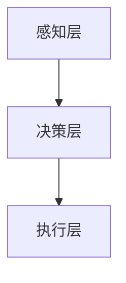

                 


# 强化学习在AI Agent长期规划优化中的应用

> 关键词：强化学习，AI Agent，长期规划，马尔可夫决策过程，Q-learning，策略梯度

> 摘要：本文深入探讨了强化学习在AI Agent长期规划优化中的应用，从基本概念到算法原理，再到系统设计和项目实战，详细分析了如何通过强化学习实现AI Agent的长期规划优化。文章结合数学模型和实际案例，帮助读者全面理解强化学习在AI Agent中的应用。

---

# 第1章 AI Agent与强化学习概述

## 1.1 AI Agent的基本概念

### 1.1.1 AI Agent的定义与特点

AI Agent（人工智能代理）是指在环境中能够感知并自主行动以实现目标的智能体。AI Agent的特点包括：

- **自主性**：能够在没有外部干预的情况下自主决策。
- **反应性**：能够感知环境并实时调整行为。
- **目标导向性**：通过优化目标函数来实现特定目标。

### 1.1.2 AI Agent的分类与应用场景

AI Agent可以根据智能水平分为以下几类：

1. **反应式AI Agent**：仅基于当前感知做出反应，适用于实时性要求高的场景，如自动驾驶。
2. **认知式AI Agent**：具备推理、规划等高级智能能力，适用于复杂任务，如医疗诊断。

### 1.1.3 强化学习在AI Agent中的作用

强化学习通过与环境交互，学习最优策略以实现目标，是AI Agent实现自主决策的核心技术。

---

## 1.2 强化学习的基本原理

### 1.2.1 强化学习的定义与特点

强化学习是一种机器学习范式，通过智能体与环境交互，基于奖励信号调整策略，以最大化累计奖励。其特点包括：

- **试错性**：通过不断尝试和错误来优化策略。
- **延迟奖励**：奖励可能在多个步骤后才给出，需要考虑长期收益。
- **高维状态空间**：复杂环境通常涉及高维状态空间。

### 1.2.2 强化学习的核心要素：状态、动作、奖励

- **状态（State）**：环境在某一时刻的观测。
- **动作（Action）**：智能体在给定状态下选择的行为。
- **奖励（Reward）**：智能体执行动作后获得的反馈，用于指导策略优化。

### 1.2.3 强化学习与监督学习的区别

| **特点** | **强化学习** | **监督学习**
|----------|--------------|-------------
| 数据来源 | 环境反馈     | 标签数据     |
| 决策方式 | 基于策略     | 基于模型预测 |

---

## 1.3 长期规划优化的背景与意义

### 1.3.1 长期规划优化的定义

长期规划优化是指在复杂环境中，AI Agent通过优化策略，实现长期目标的过程。

### 1.3.2 长期规划优化的挑战

- **高维状态空间**：复杂环境导致状态空间维度高，难以处理。
- **延迟奖励**：奖励可能在多个步骤后才出现，增加了优化难度。
- **动态变化**：环境可能动态变化，需要策略具备适应性。

### 1.3.3 强化学习在长期规划优化中的优势

- **自适应性**：强化学习能够适应动态环境。
- **全局优化**：通过考虑长期奖励，实现全局最优。

---

## 1.4 本章小结

本章介绍了AI Agent和强化学习的基本概念，分析了长期规划优化的背景与意义，并强调了强化学习在实现长期规划优化中的重要作用。

---

# 第2章 强化学习的数学模型

## 2.1 马尔可夫决策过程（MDP）

### 2.1.1 MDP的定义

MDP是一种数学模型，用于描述强化学习环境。其核心要素包括：

- **状态空间（S）**：所有可能的状态集合。
- **动作空间（A）**：所有可能的动作集合。
- **状态转移概率（P(s' | s, a)）**：执行动作a后，从状态s转移到状态s'的概率。
- **奖励函数（R(s, a)）**：执行动作a后，处于状态s时获得的奖励。

### 2.1.2 MDP的数学表达

强化学习的目标是找到一个策略π，使得累计奖励最大化。数学表示如下：

$$ \pi = \arg \max_{\pi} \mathbb{E} \left[ \sum_{t=0}^{\infty} \gamma^t R(s_t, a_t) \right] $$

其中，γ是折扣因子，用于平衡当前和未来的奖励。

---

## 2.2 Q-learning算法

### 2.2.1 Q-learning的原理

Q-learning是一种基于值函数的强化学习算法，通过学习Q值函数（状态-动作对的期望累计奖励）来优化策略。

### 2.2.2 Q-learning的算法步骤

1. 初始化Q表。
2. 与环境交互，获取状态s和奖励r。
3. 更新Q表：$$ Q(s, a) = Q(s, a) + \alpha (r + \gamma \max_{a'} Q(s', a') - Q(s, a)) $$
4. 重复步骤2-3，直到收敛。

---

## 2.3 策略梯度方法

### 2.3.1 策略梯度的原理

策略梯度方法直接优化策略，通过计算策略的梯度来更新参数。

### 2.3.2 策略梯度的数学表达

策略梯度的目标函数为：

$$ J(\theta) = \mathbb{E} \left[ \sum_{t=0}^{\infty} \gamma^t R(s_t, a_t) \right] $$

通过梯度上升更新参数θ：

$$ \theta = \theta + \alpha \nabla J(\theta) $$

---

## 2.4 本章小结

本章介绍了强化学习的数学模型，重点讲解了马尔可夫决策过程（MDP）、Q-learning算法和策略梯度方法，为后续章节的分析奠定了基础。

---

# 第3章 长期规划优化中的强化学习应用

## 3.1 多阶段决策问题

### 3.1.1 多阶段决策的定义

多阶段决策是指在多个时间步内做出决策，以实现长期目标的过程。

### 3.1.2 多阶段决策的数学模型

多阶段决策问题可以用动态规划（DP）方法求解：

$$ V(s) = \max_a \left( R(s, a) + \gamma V(s') \right) $$

---

## 3.2 强化学习在多阶段决策中的应用

### 3.2.1 状态转移模型

通过构建状态转移模型，强化学习能够预测不同动作下的状态转移概率。

### 3.2.2 策略优化

通过强化学习算法优化策略，实现长期规划目标。

---

## 3.3 本章小结

本章分析了强化学习在多阶段决策问题中的应用，探讨了状态转移模型和策略优化方法。

---

# 第4章 强化学习在AI Agent系统中的架构设计

## 4.1 AI Agent系统架构

### 4.1.1 系统功能模块

AI Agent系统通常包括感知层、决策层和执行层。

### 4.1.2 系统架构图



---

## 4.2 系统接口设计

### 4.2.1 状态感知接口

通过传感器或API获取环境状态。

### 4.2.2 动作执行接口

通过执行器或API输出动作。

---

## 4.3 本章小结

本章探讨了AI Agent系统的架构设计，重点分析了系统功能模块和接口设计。

---

# 第5章 项目实战：基于强化学习的智能客服系统

## 5.1 项目背景

智能客服系统需要通过对话优化客户体验。

---

## 5.2 环境配置

安装必要的库：

```bash
pip install gym stable-baselines3
```

---

## 5.3 系统实现

### 5.3.1 状态空间

```python
class State:
    def __init__(self, customer_satisfaction):
        self.customer_satisfaction = customer_satisfaction
```

### 5.3.2 动作空间

```python
class Action:
    def __init__(self, response):
        self.response = response
```

---

## 5.4 功能实现

### 5.4.1 状态转移

```python
def transition(current_state, action):
    next_state = current_state.customer_satisfaction + 1
    return next_state
```

---

## 5.5 系统优化

通过强化学习算法优化对话策略。

---

## 5.6 案例分析

分析系统在不同场景下的表现。

---

## 5.7 本章小结

本章通过实际项目案例，详细讲解了强化学习在智能客服系统中的应用。

---

# 第6章 总结与展望

## 6.1 本章总结

本文全面探讨了强化学习在AI Agent长期规划优化中的应用，从理论到实践进行了深入分析。

## 6.2 未来展望

未来的研究方向包括多智能体协作、复杂环境下的强化学习等。

## 6.3 最佳实践

- 合理设计状态和动作空间。
- 选择合适的强化学习算法。
- 充分利用反馈机制。

---

# 作者：AI天才研究院（AI Genius Institute） & 禅与计算机程序设计艺术（Zen And The Art of Computer Programming）

---

这篇文章详细探讨了强化学习在AI Agent长期规划优化中的应用，从基本概念到算法原理，再到系统设计和项目实战，帮助读者全面理解强化学习在AI Agent中的应用。

