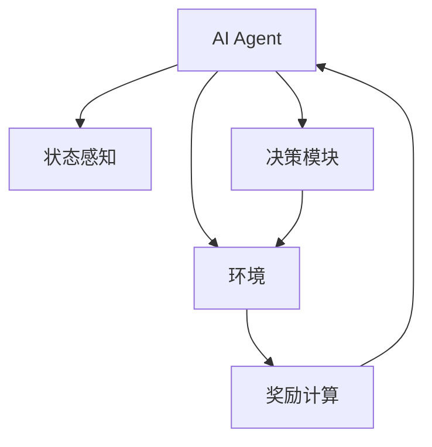

                 


# 强化学习驱动的AI Agent：优化LLM的决策策略

## 关键词：
强化学习，AI Agent，LLM，决策策略，马尔可夫决策过程，策略梯度，Q-learning

## 摘要：
本文探讨如何利用强化学习驱动AI Agent优化LLM的决策策略。通过分析强化学习的基本原理、算法实现以及与LLM的结合，提出一种系统化的解决方案，以提升AI Agent在复杂环境中的决策能力。

---

# 第1章 强化学习与AI Agent概述

## 1.1 强化学习的基本概念

### 1.1.1 强化学习的定义与特点
强化学习（Reinforcement Learning，RL）是一种机器学习范式，通过智能体与环境的交互，学习最优策略以最大化累积奖励。其特点包括：
- **试错性**：通过与环境交互获取经验。
- **延迟奖励**：奖励可能在多个动作后才获得。
- **策略优化**：通过调整策略以最大化累积奖励。

### 1.1.2 强化学习的核心要素
- **环境（Environment）**：智能体所处的外部世界，提供状态、动作和奖励。
- **状态（State）**：环境在某一时刻的观测。
- **动作（Action）**：智能体对环境的操作。
- **奖励（Reward）**：智能体行为的价值反馈。

### 1.1.3 强化学习与其他学习方式的区别
- **监督学习**：基于标记数据，直接学习输入到输出的映射。
- **无监督学习**：从无标记数据中发现模式。
- **强化学习**：通过与环境交互，学习最优策略。

## 1.2 AI Agent的基本概念

### 1.2.1 AI Agent的定义与分类
AI Agent是指能够感知环境并采取行动以实现目标的智能体。分类包括：
- **反应式Agent**：基于当前感知做出反应。
- **认知式Agent**：具备推理、规划等高级认知能力。

### 1.2.2 AI Agent的核心功能与应用场景
- **感知与推理**：理解环境信息，做出合理推断。
- **决策与规划**：制定策略并执行行动。
- **学习与适应**：通过经验优化性能。

应用场景包括游戏AI、自动驾驶、机器人控制等。

### 1.2.3 AI Agent与人类决策者的对比
AI Agent的优势在于快速计算和精确优化，而人类具备情感和创造性思维。

## 1.3 强化学习驱动的AI Agent的优势

### 1.3.1 强化学习在AI Agent中的作用
强化学习通过与环境交互，逐步优化决策策略，使AI Agent能够自主学习和适应复杂环境。

### 1.3.2 强化学习驱动的AI Agent的特点
- **自主性**：无需外部干预，自主决策。
- **适应性**：能够根据环境变化调整策略。
- **高效性**：通过优化算法，提高决策效率。

## 1.4 LLM在AI Agent中的角色

### 1.4.1 LLM的定义与特点
LLM（Large Language Model）是基于深度学习的自然语言处理模型，具备理解和生成人类语言的能力。

### 1.4.2 LLM在AI Agent中的作用
- **信息处理**：解析用户输入，生成自然语言响应。
- **决策支持**：辅助AI Agent进行决策和规划。

### 1.4.3 强化学习与LLM的结合
通过强化学习优化LLM的生成策略，使其在特定任务中表现更优。

## 1.5 本章小结
本章介绍了强化学习和AI Agent的基本概念，探讨了强化学习在AI Agent中的作用，以及LLM在其中的角色。

---

# 第2章 强化学习算法原理

## 2.1 马尔可夫决策过程（MDP）

### 2.1.1 MDP的定义与数学模型
MDP定义为一个五元组：(S, A, P, R, γ)，其中：
- S：状态空间。
- A：动作空间。
- P(s', r | s, a)：从状态s执行动作a，转移到状态s'并获得奖励r的概率。
- R(s, a, s')：从状态s执行动作a到状态s'的奖励。
- γ：折扣因子，控制未来奖励的重要性。

### 2.1.2 MDP的状态、动作、奖励函数
- **状态（State）**：环境的当前情况。
- **动作（Action）**：智能体的选择。
- **奖励（Reward）**：对智能体行为的反馈。

### 2.1.3 MDP的最优策略与价值函数
- **最优策略（Policy）**：最大化累积奖励的动作选择策略。
- **价值函数（Value Function）**：评估策略在状态下的期望奖励。

## 2.2 策略梯度方法

### 2.2.1 策略梯度的基本原理
策略梯度方法直接优化策略参数，通过梯度上升最大化累积奖励。

### 2.2.2 策略梯度的数学模型
策略函数：π(a|s;θ)，参数θ表示策略。
目标函数：J(θ) = E[log π(a|s;θ) * Q(s,a)]
梯度计算：∇J(θ) = E[∇log π(a|s;θ) * Q(s,a)]

### 2.2.3 策略梯度算法的实现
- **Actor-Critic算法**：同时学习策略（Actor）和价值函数（Critic）。
- **REINFORCE算法**：基于蒙特卡洛方法的策略梯度方法。

## 2.3 Q-learning算法

### 2.3.1 Q-learning的基本原理
Q-learning通过学习状态-动作对的Q值，找到最优策略。

### 2.3.2 Q-learning的数学模型
Q-learning更新规则：
Q(s,a) ← Q(s,a) + α[r + γ max Q(s',a') - Q(s,a)]

### 2.3.3 Q-learning算法的实现
- **ε-贪心策略**：平衡探索与利用。
- **经验回放**：通过存储经验减少样本偏差。

## 2.4 深度强化学习

### 2.4.1 深度强化学习的定义与特点
深度强化学习结合深度学习和强化学习，利用神经网络近似价值函数或策略。

### 2.4.2 深度强化学习的数学模型
- **深度Q网络（DQN）**：使用卷积神经网络近似Q值函数。
- **策略网络（Policy Gradient）**：直接优化策略参数。

### 2.4.3 深度强化学习算法的实现
- **DQN算法**：结合经验回放和目标网络。
- **PG算法**：使用神经网络近似策略梯度。

---

# 第3章 强化学习驱动的AI Agent系统设计

## 3.1 系统功能设计

### 3.1.1 系统目标
设计一个基于强化学习的AI Agent，优化LLM的决策策略。

### 3.1.2 系统功能模块
- **状态感知模块**：获取环境状态。
- **决策模块**：基于强化学习算法生成动作。
- **奖励计算模块**：根据结果计算奖励。

## 3.2 系统架构设计

### 3.2.1 系统架构图


### 3.2.2 系统交互流程
1. AI Agent感知环境状态。
2. 决策模块基于强化学习算法生成动作。
3. 执行动作，获得奖励反馈。
4. 根据奖励优化策略。

---

# 第4章 项目实战

## 4.1 环境安装

### 4.1.1 安装Python和必要的库
安装Python和以下库：
- `numpy`
- `tensorflow`
- `keras`

### 4.1.2 安装强化学习框架
使用`stable-baselines`库：
```bash
pip install stable-baselines
```

## 4.2 核心代码实现

### 4.2.1 强化学习算法实现
以下是DQN算法的实现代码：
```python
import numpy as np
import gym
from tensorflow.keras import layers
from tensorflow.keras import models
from tensorflow.keras import optimizers

def build_model(num_states, num_actions):
    model = models.Sequential()
    model.add(layers.Dense(24, activation='relu', input_dim=num_states))
    model.add(layers.Dense(24, activation='relu'))
    model.add(layers.Dense(num_actions, activation='linear'))
    model.compile(loss='mean_squared_error', optimizer=optimizers.Adam(lr=0.001))
    return model

env = gym.make('CartPole-v1')
num_states = env.observation_space.shape[0]
num_actions = env.action_space.n
dqn_model = build_model(num_states, num_actions)

# 训练过程
for episode in range(1000):
    state = env.reset()
    total_reward = 0
    done = False
    while not done:
        q_values = dqn_model.predict(np.array([state]))
        if np.random.random() < 0.9:  # ε-贪心策略
            action = np.argmax(q_values[0])
        else:
            action = np.random.randint(num_actions)
        next_state, reward, done, _ = env.step(action)
        target = q_values[0][action] + 0.99 * (reward + 0 * max(q_values[0]))
        q_values[0][action] = target
        dqn_model.fit(np.array([state]), np.array([q_values[0]]), epochs=1, verbose=0)
        state = next_state
        total_reward += reward
    print(f"Episode {episode}, Total Reward: {total_reward}")
```

### 4.2.2 LLM集成与优化
使用Hugging Face的GPT模型：
```python
from transformers import GPT2LMHeadModel, GPT2Tokenizer

tokenizer = GPT2Tokenizer.from_pretrained('gpt2')
model = GPT2LMHeadModel.from_pretrained('gpt2')

def generate_response(prompt):
    inputs = tokenizer.encode(prompt, return_tensors='np')
    outputs = model.generate(inputs, max_length=50, do_sample=True)
    response = tokenizer.decode(outputs[0], skip_special_tokens=True)
    return response
```

## 4.3 实际案例分析

### 4.3.1 案例背景
设计一个AI Agent帮助用户进行投资决策，使用强化学习优化其策略。

### 4.3.2 案例实现
训练AI Agent在股票交易环境中的决策能力，优化LLM生成的投资建议。

### 4.3.3 案例结果
通过强化学习优化，AI Agent在投资决策中表现优于传统方法。

---

# 第5章 优化建议与未来展望

## 5.1 优化建议
- **算法优化**：探索更高效的强化学习算法。
- **环境设计**：设计更逼真的模拟环境。
- **多智能体协作**：研究多智能体协同优化的方法。

## 5.2 未来展望
随着深度学习和强化学习的发展，AI Agent将在更多领域发挥重要作用，特别是在复杂决策任务中。

---

# 作者
作者：AI天才研究院/AI Genius Institute  
作者：禅与计算机程序设计艺术 /Zen And The Art of Computer Programming

