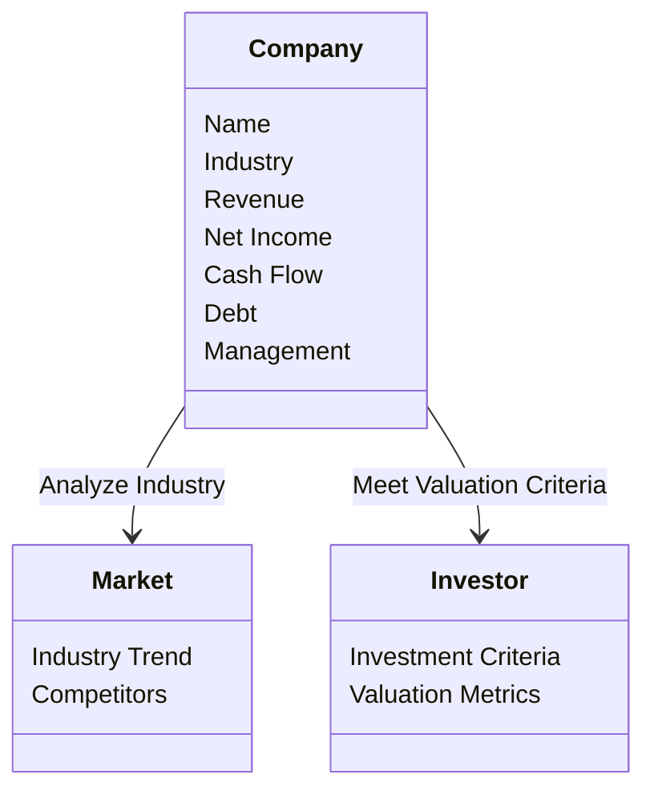
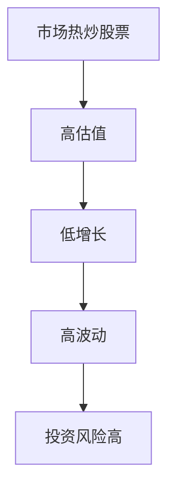
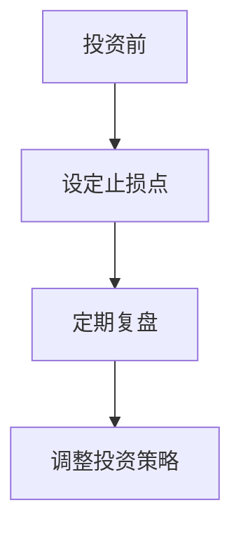

                 


## # 彼得·林奇的十倍股选股法则

> 关键词：彼得·林奇, 十倍股, 选股法则, 财务指标, 投资策略

> 摘要：本文深入分析了彼得·林奇的十倍股选股法则，探讨了其核心投资理念、选股标准、风险控制方法以及成功案例。通过系统的理论分析和实际案例研究，总结出一套可操作的投资策略，帮助投资者在复杂多变的股市中找到优质成长股，实现长期稳健的投资回报。

---

## 第1章：十倍股的定义与重要性

### 1.1 十倍股的定义
十倍股是指在较长的时间内，股票价格增长超过初始价格十倍的股票。这类股票通常代表着市场上最具成长潜力的公司，能够为投资者带来超额回报。彼得·林奇认为，十倍股的出现往往与公司高速成长期的低估阶段有关。

**核心概念对比表**：

| 指标       | 十倍股特征                | 非十倍股特征          |
|------------|--------------------------|-----------------------|
| 成长性     | 高增长率，持续增长       | 增长缓慢或停滞       |
| 估值       | 低估，安全边际大         | 高估值，泡沫风险高     |
| 行业地位   | 行业领导者或潜在领导者   | 行业跟随者或边缘者     |

### 1.2 彼得·林奇的投资理念
彼得·林奇是价值投资的坚定拥护者，他强调以合理的价格买入优质成长股，并长期持有。以下是他的核心投资理念：

1. **价值投资**：寻找市场价格低于内在价值的股票。
2. **成长股优先**：倾向于投资那些收入和利润持续增长的公司。
3. **安全边际**：买入价格远低于公司内在价值的股票，以降低风险。

---

## 第2章：彼得·林奇的选股方法

### 2.1 选股的基本原则
林奇选股的核心在于对公司基本面的深入研究。以下是他的基本原则：

1. **行业地位**：选择行业内的领导者或潜在领导者。
2. **财务健康**：关注公司的盈利能力、资产负债表和现金流。
3. **管理团队**：管理层能力优秀，具有长期发展愿景。

**领域模型（公司基本面分析）**：



---

## 第3章：十倍股的识别标准

### 3.1 高成长公司的特征
林奇认为，十倍股往往出现在高速成长的行业中，且公司具备以下特征：

1. **收入增长**：年收入增长率超过行业平均水平。
2. **利润率提升**：净利润率稳步提高。
3. **竞争优势**：公司在行业内具备独特的竞争优势。

### 3.2 财务指标分析
林奇常用以下财务指标来筛选十倍股：

1. **市盈率（P/E）**：
   $$ P/E = \frac{\text{股价}}{\text{每股收益}} $$
   林奇倾向于选择P/E低于行业平均水平的股票。

2. **市净率（P/B）**：
   $$ P/B = \frac{\text{股价}}{\text{每股净资产}} $$
   低P/B值通常意味着股票被低估。

3. **ROE（净资产收益率）**：
   $$ ROE = \frac{\text{净利润}}{\text{净资产}} $$
   林奇偏好ROE持续增长的公司。

---

## 第4章：避免投资陷阱

### 4.1 市场热炒股票的风险
林奇强调，市场热炒的股票往往存在泡沫，投资者应避免被市场情绪左右。

**市场热炒股票的风险分析流程图**：



### 4.2 低质量公司的识别
低质量公司通常表现为：

1. **财务造假**：收入与利润不符，现金流与净利润不匹配。
2. **管理问题**：管理层频繁变动，缺乏长期规划。
3. **行业衰退**：所在行业需求疲软，竞争激烈。

---

## 第5章：彼得·林奇的投资策略

### 5.1 集中投资策略
林奇主张集中投资少数优质股票，以降低风险并提高回报。

**投资组合分配示例图**：


### 5.2 长期持有策略
林奇强调长期持有优质股票，避免频繁交易。

**长期持有策略优势**：
1. **复利效应**：长期持有可最大化复利收益。
2. **降低交易成本**：频繁交易会增加佣金和税费支出。

---

## 第6章：风险管理与投资心态

### 6.1 风险管理的重要性
林奇认为，风险管理是投资成功的关键。

**风险管理步骤图**：



### 6.2 投资心态的调整
保持冷静和耐心，避免贪婪和恐惧情绪左右决策。

**投资心态调整建议**：
1. **避免情绪化决策**：在市场波动中保持理性。
2. **定期复盘**：每年至少回顾一次投资组合。
3. **持续学习**：不断更新投资知识和策略。

---

## 第7章：成功案例分析

### 7.1 林奇的经典投资案例
以微软为例，微软在1980年代至1990年代经历了高速增长，成为典型的十倍股。

**微软股价走势图**：

```mermaid
timeSeries
    title 微软股价走势图
    xLabel 年份
    yLabel 股价（美元）
    data
        1986, 1
        1990, 5
        1995, 20
        2000, 50
        2005, 30
        2010, 25
        2020, 200
```

---

## 第8章：彼得·林奇的投资哲学

### 8.1 长期投资的哲学
林奇认为，投资是马拉松，而非短跑。长期视角有助于忽略短期波动，捕捉公司成长的长期价值。

### 8.2 独立思考的重要性
林奇强调独立思考，避免随波逐流。他常说：“市场的先生是不可预测的，但你可以预测自己。”

---

## 第9章：附录

### 9.1 十倍股的关键指标表

| 指标       | 合格标准           |
|------------|-------------------|
| 市盈率（P/E） | < 行业平均值       |
| 市净率（P/B） | < 1               |
| ROE         | > 15%             |
| 收入增长率   | > 行业平均值       |

### 9.2 彼得·林奇的经典语录
- “市场的先生总是在试图使你偏离目标。”
- “价值投资的敌人不是市场的波动，而是你自己的急躁。”
- “不要试图抓住市场的顶点或底部，而是要抓住市场的趋势。”

### 9.3 进一步阅读的推荐书目
1. 《彼得·林奇的成功投资》
2. 《股票作手回忆录》
3. 《投资学原理》

---

## 第10章：总结与展望

### 10.1 本书的核心内容回顾
彼得·林奇的十倍股选股法则以价值投资为核心，强调寻找被低估的优质成长股，并长期持有。

### 10.2 对投资者的建议
1. **坚持价值投资**：寻找具备成长潜力的公司。
2. **注重风险管理**：合理配置资产，设定止损点。
3. **保持学习与反思**：不断提升自己的投资能力。

### 10.3 未来投资环境的展望
随着科技和经济的发展，新兴行业（如人工智能、新能源）将涌现出更多的十倍股机会。

---

## 作者：AI天才研究院/AI Genius Institute & 禅与计算机程序设计艺术 /Zen And The Art of Computer Programming

---

以上是《彼得·林奇的十倍股选股法则》的技术博客文章的完整内容。通过系统化的分析和实际案例的解读，本文为投资者提供了寻找十倍股的实用方法和投资策略。希望对您有所帮助！

