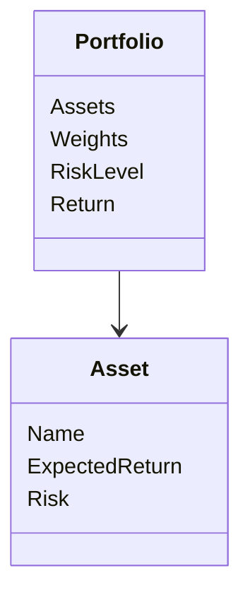
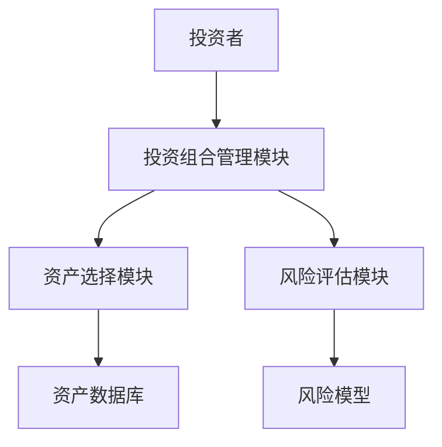

                 


# 彼得·林奇的多元化投资组合构建

## 关键词：投资组合、彼得·林奇、多元化投资、投资策略、资产配置

## 摘要：本文系统地介绍了彼得·林奇的多元化投资组合构建方法，从投资的基本概念到具体的数学模型和系统架构设计，详细讲解了如何通过多元化策略实现资产的稳定增长。文章结合理论与实践，提供了丰富的案例分析和代码实现，帮助读者全面理解并掌握多元化投资的精髓。

---

# 第一部分: 投资的基础概念与多元化投资的重要性

## 第1章: 投资的基本概念与多元化的重要性

### 1.1 投资的基本概念

#### 1.1.1 投资的定义与分类

- **定义**：投资是指将资金投入特定资产或项目，以期获得未来收益的行为。
- **分类**：包括股票、债券、房地产、黄金等多种资产类别。

#### 1.1.2 多元化投资的必要性

- **分散风险**：通过投资不同类型的资产，降低单一资产波动对整体投资组合的影响。
- **提高收益潜力**：多元化可以平衡风险与收益，捕捉不同资产的上涨机会。

#### 1.1.3 投资风险与收益的关系

- **风险与收益的正相关性**：高风险通常意味着高收益，但并非绝对。
- **风险分散化**：通过多元化投资，可以有效降低非系统性风险。

### 1.2 彼得·林奇的背景与投资理念

#### 1.2.1 彼得·林奇的生平简介

- **职业经历**：彼得·林奇是美国著名的投资经理，曾管理富达麦哲伦基金，创造了优异的投资业绩。
- **投资哲学**：注重基本面分析，寻找具有持续增长潜力的公司。

#### 1.2.2 彼得·林奇的投资哲学

- **长期投资**：避免频繁交易，注重长期价值。
- **分散投资**：通过投资不同类型资产降低风险。

#### 1.2.3 彼得·林奇的成功经验

- **多样化投资组合**：林奇通过投资多种资产，实现了稳定增长。
- **持续学习**：不断研究市场变化，调整投资策略。

### 1.3 多元化投资组合的核心思想

#### 1.3.1 多元化投资的定义

- **定义**：将资金分配到多种资产或资产类别中，以降低投资风险并提高收益潜力。

#### 1.3.2 多元化投资的优势

- **降低风险**：通过分散投资，减少单一资产波动对整体组合的影响。
- **提高收益稳定性**：不同资产在不同市场环境下的表现具有互补性，使整体收益更加稳定。

#### 1.3.3 多元化投资的实现方式

- **资产配置**：根据市场环境和个人风险偏好，调整各类资产的配置比例。
- **定期再平衡**：定期审视投资组合，根据市场变化和个人目标进行调整。

## 1.4 本章小结

- 本章介绍了投资的基本概念，强调了多元化投资的重要性，并通过彼得·林奇的投资哲学和成功经验，展示了如何通过多样化策略实现稳定收益。

---

# 第二部分: 投资组合构建的理论基础

## 第2章: 现代投资组合理论与CAPM模型

### 2.1 现代投资组合理论（MPT）概述

#### 2.1.1 MPT的核心思想

- **核心思想**：通过优化投资组合的收益与风险关系，找到最优风险回报比。

#### 2.1.2 MPT的数学模型

- **公式推导**：
  - 投资组合的期望收益：$$E(r_p) = \sum w_i E(r_i)$$
  - 投资组合的方差：$$\sigma_p^2 = \sum w_i^2 \sigma_i^2 + 2 \sum w_i w_j \sigma_i \sigma_j \rho_{ij}$$

#### 2.1.3 MPT的实践意义

- **实践意义**：帮助投资者找到在给定风险水平下收益最大的投资组合。

### 2.2 CAPM模型的原理与应用

#### 2.2.1 CAPM模型的定义

- **定义**：资本资产定价模型，用于计算资产的预期收益。

#### 2.2.2 CAPM模型的公式推导

- **公式**：$$E(r_i) = R_f + \beta_i (E(r_m) - R_f)$$
  - $$R_f$$：无风险利率
  - $$E(r_m)$$：市场预期收益率
  - $$\beta_i$$：资产i的贝塔系数

#### 2.2.3 CAPM模型在投资组合构建中的应用

- **应用**：通过计算不同资产的贝塔系数，确定最优资产配置比例。

### 2.3 本章小结

- 本章介绍了现代投资组合理论和CAPM模型，强调了理论在投资组合构建中的重要性。

---

# 第三部分: 投资组合构建的核心算法与数学模型

## 第3章: 投资组合优化的数学模型

### 3.1 均值-方差优化模型

#### 3.1.1 均值-方差优化的定义

- **定义**：通过优化投资组合的期望收益与方差，找到最优投资组合。

#### 3.1.2 均值-方差优化的数学公式

- **优化目标**：$$\min \sigma_p^2$$
  - 约束条件：$$\sum w_i = 1$$

#### 3.1.3 均值-方差优化的实现步骤

1. 收集资产的历史收益数据。
2. 计算资产的期望收益和协方差矩阵。
3. 使用优化算法求解最优权重。

### 3.2 使用Python实现投资组合优化

#### 3.2.1 Python环境安装与配置

- **工具安装**：安装Python、NumPy、Pandas、SciPy。

#### 3.2.2 投资组合优化的代码实现

```python
import numpy as np
from scipy.optimize import minimize

def portfolio_var(weights, returns):
    return (weights.T @ returns @ weights)

weights = [0.5, 0.5]
returns = np.array([[0.1, 0.2], [0.2, 0.1]])

result = minimize(portfolio_var, weights, args=(returns,), method='SLSQP')
print(result.x)
```

#### 3.2.3 代码的功能解读与分析

- **功能解读**：代码通过优化算法求解最优权重，使得投资组合的方差最小。

### 3.3 本章小结

- 本章通过均值-方差模型和Python代码，详细讲解了投资组合优化的实现过程。

---

# 第四部分: 投资组合构建的系统分析与架构设计

## 第4章: 投资组合构建的系统架构

### 4.1 问题场景的介绍

#### 4.1.1 投资组合构建的背景

- **背景**：投资者希望通过多元化投资实现资产保值增值。

#### 4.1.2 投资组合构建的目标

- **目标**：构建一个风险可控、收益稳定的投资组合。

#### 4.1.3 投资组合构建的约束条件

- **约束**：资金限制、风险承受能力、投资期限等。

### 4.2 系统功能设计

#### 4.2.1 领域模型



#### 4.2.2 系统架构设计



### 4.3 本章小结

- 本章通过系统架构设计，展示了投资组合构建的整体框架。

---

## 项目实战

### 5.1 投资组合实战案例

#### 5.1.1 环境安装与配置

- **工具**：Python、Pandas、Matplotlib。

#### 5.1.2 核心代码实现

```python
import pandas as pd
import matplotlib.pyplot as plt

# 数据加载
data = pd.read_csv('assets.csv')

# 计算收益
returns = data.pct_change().dropna()

# 优化模型
from pyparetopy import pyparetopy
model = pyparetopy.PyPortfolioOpt(returns)
model.minimize_volatility()
weights = model.weights

# 可视化
plt.bar(weights.index, weights.values)
plt.title('Optimal Weights')
plt.show()
```

#### 5.1.3 案例分析与解读

- **案例分析**：通过优化模型，确定了各资产的最优权重。
- **解读**：权重反映了各资产在投资组合中的重要性。

### 5.2 本章小结

- 本章通过实际案例，展示了如何通过系统设计构建投资组合。

---

## 总结与展望

### 6.1 总结

- **总结**：本文详细讲解了彼得·林奇的多元化投资策略，从理论到实践，帮助读者全面理解投资组合构建。

### 6.2 小结

- **小结**：多元化投资是降低风险、提高收益的有效方法。

### 6.3 注意事项

- **风险管理**：投资者需时刻关注市场变化，及时调整投资策略。
- **长期视角**：投资需具备耐心，避免短期波动影响决策。

### 6.4 拓展阅读

- **相关书籍**：《彼得·林奇的成功投资》。
- **在线资源**：投资组合优化的开源工具和文献。

---

# 作者：AI天才研究院/AI Genius Institute & 禅与计算机程序设计艺术 /Zen And The Art of Computer Programming

