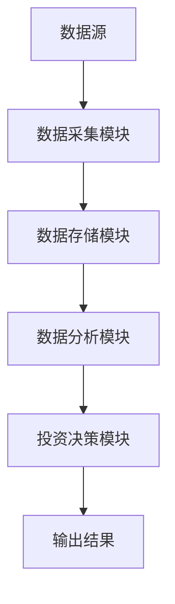

                 


# 彼得·林奇的实地调研投资法

> 关键词：彼得·林奇、投资方法、实地调研、基本面分析、量化分析、投资系统

> 摘要：本文深入探讨了彼得·林奇的实地调研投资法，从投资的基本概念、林奇的投资哲学、实地调研的重要性，到基本面分析、财务指标与估值方法、投资系统的构建，再到项目实战和最佳实践，全面解析了这一投资方法的核心思想和实际应用。

---

## 第一部分: 背景介绍

### 第1章: 投资的基本概念

#### 1.1 什么是投资
投资是指将资金投入到某个项目或资产中，以期在未来获得收益或资本增值的行为。投资的核心在于通过分析资产的内在价值和市场趋势，做出明智的决策。

#### 1.2 投资的基本原则
- **分散投资**：不要将所有资金投入到单一资产中，以降低风险。
- **长期视角**：投资不是短期的赌博，而是长期的价值创造。
- **风险管理**：识别和控制风险是投资成功的关键。

#### 1.3 投资的分类与特点
- **股票投资**：通过购买公司股份成为股东，分享公司成长的收益。
- **债券投资**：购买政府或企业的债券，定期获得利息收入。
- **房地产投资**：通过购买房产或其他房地产资产获得收益。

---

### 第2章: 彼得·林奇的投资哲学

#### 2.1 彼得·林奇的生平简介
彼得·林奇是美国著名投资专家，曾任富达麦哲伦基金的经理，以卓越的投资业绩闻名。他的投资哲学强调深入研究和长期持有优质资产。

#### 2.2 林奇的投资理念
- **价值投资**：寻找市场价格低于内在价值的股票。
- **长期持有**：避免频繁交易，减少交易成本和税务负担。
- **深入研究**：通过实地调研和数据分析，识别具有竞争优势的企业。

---

### 第3章: 实地调研投资法的背景

#### 3.1 投资分析的基本方法
- **基本面分析**：通过分析企业的财务报表、行业地位等基本面因素，评估其内在价值。
- **技术分析**：通过分析历史价格和成交量数据，预测未来的价格走势。
- **量化分析**：利用数学模型和算法，寻找投资机会。

#### 3.2 实地调研的重要性
- **信息优势**：实地调研能够获取一手信息，帮助投资者更准确地评估企业价值。
- **风险控制**：通过实地调研，投资者可以识别潜在风险，做出更明智的投资决策。

---

## 第二部分: 核心概念与联系

### 第4章: 基本面分析的核心要素

#### 4.1 财务报表分析
- **利润表**：反映企业一定时期内的收入、支出和利润情况。
- **资产负债表**：反映企业在某一特定时点的资产、负债和所有者权益情况。
- **现金流量表**：反映企业在一定时期内的现金流入和流出情况。

#### 4.2 行业分析与竞争优势
- **行业分析**：研究行业的发展趋势、竞争格局和市场容量。
- **竞争优势**：分析企业的核心竞争力，包括成本优势、技术优势和品牌优势。

---

### 第5章: 财务指标与估值方法

#### 5.1 财务指标分析
- **市盈率（P/E）**：股价与每股收益的比率，公式为：$P/E = \frac{股价}{每股收益}$。
- **市净率（P/B）**：股价与每股净资产的比率，公式为：$P/B = \frac{股价}{每股净资产}$。
- **股息率**：股息与股价的比率，公式为：$股息率 = \frac{股息}{股价} \times 100\%$。

#### 5.2 估值方法的比较
- **市盈率法**：适用于盈利稳定的公司。
- **市净率法**：适用于资产密集型行业。
- **现金流折现法**：适用于成长型企业。

---

## 第三部分: 算法原理讲解

### 第6章: 基于基本面分析的量化投资模型

#### 6.1 模型概述
- **输入**：企业的财务数据、市场数据。
- **输出**：投资建议（买入、持有、卖出）。

#### 6.2 算法流程
1. 数据收集与预处理。
2. 指标计算与筛选。
3. 投资决策逻辑。

#### 6.3 代码实现
```python
def calculate_pe(stock_price, earnings_per_share):
    return stock_price / earnings_per_share

def calculate_pb(stock_price, book_value_per_share):
    return stock_price / book_value_per_share

def investment_decision(pe, pb, growth_rate):
    if pe < 15 and pb < 2 and growth_rate > 5:
        return "买入"
    elif pe > 20 or pb > 3:
        return "卖出"
    else:
        return "持有"
```

---

### 第7章: 市场情绪与投资机会的预测

#### 7.1 市场情绪分析
- **市场情绪的量化指标**：恐慌指数、成交量指数。
- **市场情绪与投资决策的关系**：市场恐慌时可能是买入机会，市场狂热时可能是卖出信号。

#### 7.2 投资机会的预测
- **历史数据预测**：基于过去的数据，预测未来的价格走势。
- **市场情绪预测**：结合市场情绪指标，调整投资策略。

---

## 第四部分: 系统分析与架构设计方案

### 第8章: 投资分析系统的构建

#### 8.1 系统功能设计
- **数据采集模块**：收集企业的财务数据和市场数据。
- **数据分析模块**：计算财务指标和估值指标。
- **投资决策模块**：根据模型输出投资建议。

#### 8.2 系统架构设计


---

## 第五部分: 项目实战

### 第9章: 环境安装与核心代码实现

#### 9.1 环境安装
- 安装Python和必要的库（如Pandas、NumPy）。

#### 9.2 核心代码实现
```python
import pandas as pd
import numpy as np

def calculate_earnings_per_share(revenue, expenses):
    net_income = revenue - expenses
    return net_income / shares_outstanding
```

---

## 第六部分: 最佳实践

### 第10章: 小结与注意事项

#### 10.1 小结
- 彼得·林奇的实地调研投资法强调基本面分析和长期持有。
- 通过量化分析和系统构建，可以提高投资决策的科学性。

#### 10.2 注意事项
- 投资需谨慎，避免盲目跟风。
- 定期复盘和调整投资策略。

---

## 作者：AI天才研究院 & 禅与计算机程序设计艺术

