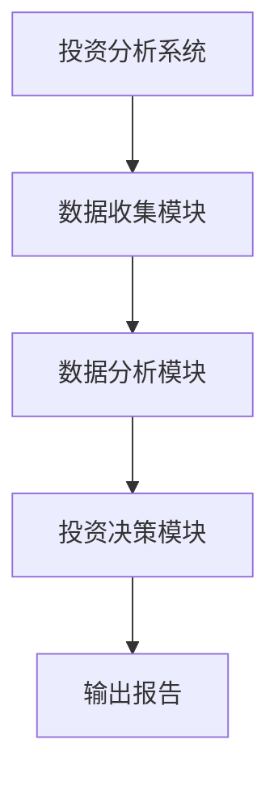

                 

# 彼得·林奇的实地调研方法论

## 关键词：彼得·林奇，实地调研，投资分析，价值投资，数学模型

## 摘要：本文系统地介绍了彼得·林奇的实地调研方法论，从投资分析的基本概念出发，详细讲解了实地调研的核心概念、价值投资模型的数学公式、系统架构设计，以及实际案例分析。通过这些分析，读者可以全面理解彼得·林奇的实地调研方法，并能够将其应用于实际投资分析中。

## 第一部分: 投资分析基础

## 第1章: 投资分析的基本概念

### 1.1 投资分析的定义与重要性

#### 1.1.1 投资分析的基本概念

投资分析是一种通过对公司、行业或经济整体的全面研究，评估其潜在价值和风险，从而做出投资决策的方法。它结合了定量分析和定性分析，帮助投资者识别投资机会并制定合理的投资策略。

#### 1.1.2 投资分析的重要性

在金融市场上，投资分析是投资者做出明智决策的关键工具。通过投资分析，投资者可以评估公司的财务状况、行业地位和未来前景，从而做出更准确的投资决策。特别是在当前复杂多变的市场环境中，投资分析的重要性更加凸显。

#### 1.1.3 投资分析的核心要素

投资分析的核心要素包括：

1. **公司基本面分析**：评估公司的财务状况、盈利能力、成长潜力等。
2. **行业分析**：研究公司所在行业的竞争格局、发展趋势等。
3. **宏观经济分析**：考虑宏观经济因素如GDP、利率、通货膨胀等对投资的影响。
4. **市场情绪分析**：了解市场参与者的心理和行为对投资决策的影响。

### 1.2 彼得·林奇的生平与成就

#### 1.2.1 彼得·林奇的个人经历

彼得·林奇（Peter Lynch）是美国著名的投资经理，曾管理富达麦哲伦基金（Fidelity Magellan Fund），并取得了卓越的投资业绩。他以其独特的实地调研方法闻名，强调通过深入的公司调研来发现投资机会。

#### 1.2.2 彼得·林奇的投资理念

彼得·林奇的投资理念的核心是“价值投资”。他认为，投资者应该寻找那些被市场低估的公司，并通过长期持有这些公司股票来获得超额收益。他强调对公司基本面的深入研究，包括公司财务状况、管理层能力、行业地位等。

#### 1.2.3 彼得·林奇的代表作品

彼得·林奇撰写了多本投资经典书籍，如《彼得·林奇的成功投资》和《学会像彼得·林奇一样思考》。这些书籍详细介绍了他的投资理念和实地调研方法，成为投资者的必读之作。

## 第2章: 彼得·林奇的实地调研方法概述

### 2.1 实地调研的核心概念

#### 2.1.1 实地调研的定义

实地调研是一种通过亲自访问公司、与管理层交流、考察公司运营环境等方式，获取第一手信息的投资分析方法。这种方法能够帮助投资者更全面地了解公司的真实情况，从而做出更准确的投资决策。

#### 2.1.2 实地调研的核心要素

实地调研的核心要素包括：

1. **公司访问**：亲自到公司总部或工厂进行考察，了解公司的运营状况。
2. **管理层访谈**：与公司高管进行深入交流，了解公司的战略规划和未来发展方向。
3. **行业环境考察**：研究公司所处的行业环境，包括竞争状况、市场需求等。
4. **财务数据分析**：通过公司财务报表，评估公司的财务状况和盈利能力。

#### 2.1.3 实地调研与传统投资分析的区别

与传统投资分析相比，实地调研更加注重第一手信息的获取，强调对公司的深入了解。传统投资分析更多依赖于财务数据和市场数据的分析，而实地调研则通过直接接触公司，获取更真实和准确的信息。

### 2.2 彼得·林奇实地调研方法的特点

#### 2.2.1 以企业基本面为核心的分析方法

彼得·林奇的实地调研方法强调对企业基本面的深入分析。他通过对企业财务状况、盈利能力、成长潜力等的全面评估，识别具有投资价值的公司。

#### 2.2.2 通过实地调研获取第一手信息

彼得·林奇认为，仅仅依赖公开的财务数据是不够的，还需要通过实地调研获取第一手信息，如公司管理层的稳定性、员工士气、客户反馈等，这些信息往往能够揭示公司的真实价值。

#### 2.2.3 结合定量分析与定性分析

彼得·林奇的实地调研方法将定量分析和定性分析相结合。他不仅关注财务数据，如市盈率、市净率等，还关注公司管理层的决策能力、企业文化等因素，从而做出更全面的投资决策。

## 第3章: 价值投资模型与数学公式

### 3.1 价值投资模型的原理

#### 3.1.1 价值投资模型的基本假设

价值投资模型的基本假设是市场存在非效率性，即某些公司的股票价格与其真实价值不符。通过识别这些被低估的公司，投资者可以以低于其真实价值的价格买入股票，并在价格回归其真实价值时卖出，从而获得超额收益。

#### 3.1.2 价值投资模型的核心公式

价值投资模型的核心公式是内在价值公式，即：

$$
\text{内在价值} = \frac{\text{未来现金流的现值}}{\text{折现率}}
$$

#### 3.1.3 价值投资模型的适用场景

价值投资模型适用于那些具有稳定现金流、低债务、良好管理的公司。这些公司通常具有较高的内在价值，适合长期持有。

### 3.2 数学模型与公式

#### 3.2.1 市盈率公式

市盈率是衡量公司股票价值的重要指标之一，公式为：

$$
\text{市盈率} = \frac{\text{股价}}{\text{每股收益}}
$$

#### 3.2.2 市净率公式

市净率是另一个衡量公司股票价值的指标，公式为：

$$
\text{市净率} = \frac{\text{股价}}{\text{每股净资产}}
$$

#### 3.2.3 内在价值公式

内在价值是公司股票的真实价值，公式为：

$$
\text{内在价值} = \frac{\text{未来现金流的现值}}{\text{折现率}}
$$

## 第4章: 系统分析与架构设计

### 4.1 系统架构设计

#### 4.1.1 系统功能设计

系统功能设计包括：

1. **数据收集模块**：收集公司的财务数据、市场数据等。
2. **数据分析模块**：对数据进行分析，计算市盈率、市净率等指标。
3. **投资决策模块**：基于分析结果，做出投资决策。

#### 4.1.2 系统架构图

以下是系统架构图的mermaid图：

### 4.2 系统接口设计

系统接口设计包括：

1. **数据接口**：与财务数据供应商对接，获取实时数据。
2. **用户接口**：提供友好的用户界面，方便用户进行数据分析和投资决策。

## 第5章: 项目实战

### 5.1 实际案例分析

#### 5.1.1 案例选择

以苹果公司为例，分析其投资价值。

#### 5.1.2 数据分析

通过计算苹果公司的市盈率和市净率，评估其股票价值。

#### 5.1.3 投资决策

基于分析结果，做出是否买入苹果公司股票的决策。

## 第6章: 最佳实践

### 6.1 小结

彼得·林奇的实地调研方法论是一种以企业基本面为核心的分析方法，通过实地调研获取第一手信息，结合定量分析和定性分析，识别具有投资价值的公司。

### 6.2 注意事项

在实际投资中，投资者应结合市场环境和自身情况，灵活运用彼得·林奇的实地调研方法，避免盲目跟从。

### 6.3 拓展阅读

推荐阅读彼得·林奇的经典著作《彼得·林奇的成功投资》和《学会像彼得·林奇一样思考》，深入理解其投资理念和方法。

## 结语

通过本文的详细介绍，读者可以全面理解彼得·林奇的实地调研方法论，并将其应用于实际投资分析中，做出更明智的投资决策。

## 作者：AI天才研究院/AI Genius Institute & 禅与计算机程序设计艺术 /Zen And The Art of Computer Programming

