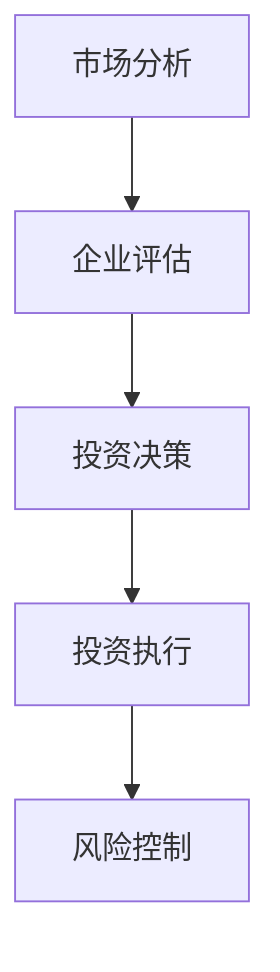

                 


# 彼得·林奇的本地投资优势：投资你所了解的

> 关键词：彼得·林奇、本地投资、投资策略、价值投资、投资哲学

> 摘要：本文深入探讨了彼得·林奇的本地投资优势，分析了投资自己了解的领域的核心理念、策略和实践方法。通过详细的背景介绍、核心概念分析、算法原理讲解、系统架构设计和项目实战，帮助读者全面理解并应用本地投资的优势。

---

## 第一部分：背景介绍

### 第1章：彼得·林奇的投资哲学

#### 1.1 投资的核心理念

彼得·林奇是美国著名的投资专家，以其独特的投资哲学闻名。他认为，成功的投资不仅仅是对市场的理解，更是对投资标的深入了解和信任。本地投资的优势在于投资者能够更好地了解本地市场的特点和企业的竞争优势。

#### 1.2 本地投资的背景与重要性

本地投资是指投资者将资金投入到自己熟悉且了解的本地市场或企业中。这种投资策略的核心在于利用本地市场的信息优势，降低投资风险，提高投资回报。

---

## 第二部分：核心概念与联系

### 第2章：本地投资的核心要素

#### 2.1 本地市场的特点

本地市场通常具有较高的透明度和可预测性。投资者能够更深入地了解本地企业的经营状况、行业趋势和政策环境。

#### 2.2 本地企业的竞争优势

本地企业通常在本地市场中具有较强的竞争优势，例如品牌影响力、客户资源和渠道优势等。

#### 2.3 本地行业的周期性分析

本地行业的周期性分析是本地投资的重要组成部分。投资者需要关注行业周期的变化，以更好地把握投资时机。

---

## 第三部分：算法原理讲解

### 第3章：本地投资的数学模型与风险评估

#### 3.1 投资回报的计算公式

$$\text{投资回报率} = \frac{\text{投资收益}}{\text{投资成本}} \times 100\%$$

通过计算投资回报率，投资者可以评估不同投资标的收益能力。

#### 3.2 风险评估模型

彼得·林奇强调风险控制的重要性。通过以下公式，投资者可以量化投资风险：

$$\text{风险暴露程度} = \text{投资金额} \times \text{市场波动率}$$

---

## 第四部分：系统分析与架构设计方案

### 第4章：本地投资的系统架构

#### 4.1 系统功能设计

- **市场分析模块**：分析本地市场的趋势和行业动态。
- **企业评估模块**：评估本地企业的财务状况和竞争优势。
- **投资决策模块**：根据分析结果制定投资策略。

#### 4.2 系统架构设计（Mermaid图）



---

## 第五部分：项目实战

### 第5章：本地投资的实际案例分析

#### 5.1 案例介绍

假设我们选择本地零售行业作为投资领域。通过市场调研和数据分析，我们发现本地零售企业具有较强的区域竞争优势。

#### 5.2 核心代码实现

以下是投资决策系统的伪代码：

```python
def analyze_market():
    # 获取市场数据
    market_data = get_market_data()
    # 分析市场趋势
    market_trend = analyze_trend(market_data)
    return market_trend

def assess_company():
    # 获取企业数据
    company_data = get_company_data()
    # 评估企业竞争力
    company_assessment = assess_competitiveness(company_data)
    return company_assessment

def make_investment_decision():
    market_trend = analyze_market()
    company_assessment = assess_company()
    # 制定投资策略
    investment_strategy = create_strategy(market_trend, company_assessment)
    return investment_strategy
```

---

## 第六部分：最佳实践与总结

### 第6章：本地投资的注意事项

#### 6.1 小结

本地投资的优势在于利用信息优势和区域竞争优势，降低投资风险。投资者需要深入了解本地市场和企业，制定合理的投资策略。

#### 6.2 注意事项

- **风险控制**：定期评估投资组合，及时调整。
- **持续学习**：关注市场动态，提升投资能力。
- **分散投资**：避免过度集中，降低风险。

---

## 结语

通过本文的分析，读者可以深入了解彼得·林奇的本地投资优势，掌握投资自己了解的领域的核心策略。本地投资不仅是降低风险的有效方法，也是实现长期投资收益的重要途径。

---

作者：AI天才研究院/AI Genius Institute & 禅与计算机程序设计艺术 /Zen And The Art of Computer Programming

