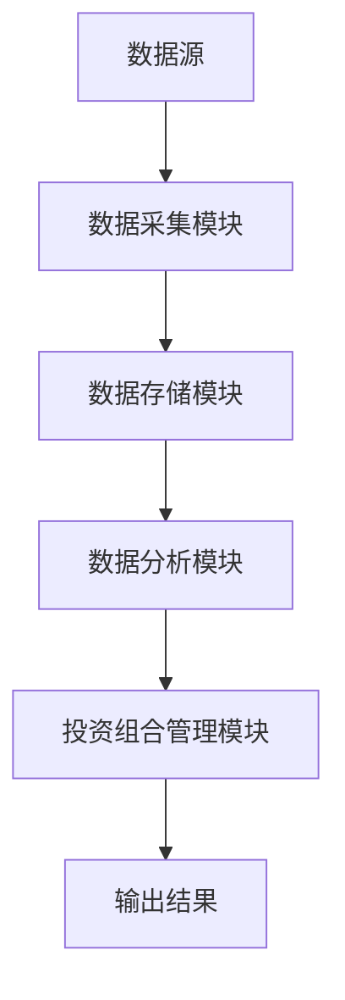
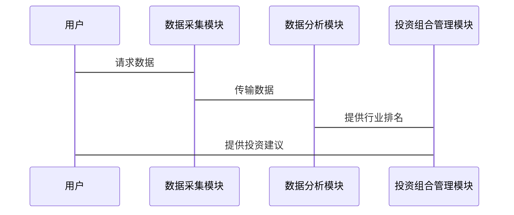

                 


# 彼得·林奇的行业轮动投资策略

> 关键词：行业轮动投资策略，彼得·林奇，投资策略，金融分析，技术分析

> 摘要：本文详细探讨了彼得·林奇的行业轮动投资策略，从其背景、核心概念、驱动因素、数学模型、系统架构到项目实战，全面解析了这一策略的理论基础和实际应用。通过详细分析，本文为投资者提供了如何在不同市场环境下应用行业轮动策略的指导，同时结合具体案例和代码实现，帮助读者更好地理解和掌握这一投资策略。

---

## 第1章: 行业轮动投资策略的背景与概念

### 1.1 行业轮动投资的定义与特点

#### 1.1.1 行业轮动投资的定义
行业轮动投资是一种基于市场环境和行业周期变化的投资策略，旨在通过动态调整投资组合中的行业权重，以捕捉不同行业之间的相对收益变化。行业轮动的核心在于识别哪些行业在未来一段时间内可能表现较好，并据此进行资产配置。

#### 1.1.2 行业轮动投资的核心特点
- **周期性**：行业轮动与经济周期密切相关，不同行业在不同经济阶段的表现差异显著。
- **动态性**：投资组合需要根据市场变化进行动态调整，及时捕捉市场机会。
- **分散性**：通过在多个行业中分散投资，降低单一行业的风险。

#### 1.1.3 行业轮动投资与传统投资策略的区别
- 传统投资策略（如买入并持有）注重长期持有优质资产，而行业轮动策略更注重短期市场变化。
- 行业轮动策略强调行业间的相对表现，而传统策略更关注个股的选择。

### 1.2 彼得·林奇与行业轮动投资

#### 1.2.1 彼得·林奇的简介
彼得·林奇是美国著名的投资专家，曾任富达麦哲伦基金的经理人。他以出色的选股能力和长期的投资业绩闻名，尤其擅长通过基本面分析寻找被低估的股票。

#### 1.2.2 彼得·林奇的投资理念
- **价值投资**：寻找基本面良好、估值合理的公司。
- **行业轮动**：通过分析行业周期和市场趋势，动态调整投资组合。

#### 1.2.3 彼得·林奇与行业轮动投资的关联
彼得·林奇的投资策略中，行业轮动是一个重要的组成部分。他通过分析行业周期和市场趋势，选择那些具有较高增长潜力的行业进行投资。

### 1.3 行业轮动投资的背景与现状

#### 1.3.1 行业轮动投资的历史发展
行业轮动投资起源于20世纪70年代，随着金融市场的发展，投资者逐渐意识到不同行业在不同时期的表现差异。

#### 1.3.2 当前行业轮动投资的市场环境
- **全球化**：全球经济一体化使得行业轮动更加复杂。
- **技术进步**：大数据和人工智能技术为行业轮动提供了新的工具和方法。

#### 1.3.3 行业轮动投资的未来趋势
随着技术的进步和市场环境的变化，行业轮动投资将更加依赖数据驱动的方法，同时结合人工智能技术进行实时调整。

---

## 第2章: 行业轮动投资的核心概念与理论基础

### 2.1 行业轮动投资的核心概念

#### 2.1.1 行业轮动的驱动因素
行业轮动的驱动因素主要包括宏观经济因素、行业生命周期和市场情绪。

#### 2.1.2 行业轮动的周期性分析
行业轮动与经济周期密切相关，不同行业在不同经济阶段的表现差异显著。

#### 2.1.3 行业轮动的市场情绪影响
市场情绪是影响行业轮动的重要因素，投资者的心理变化会影响市场的短期波动。

### 2.2 行业轮动投资的理论基础

#### 2.2.1 技术分析与行业轮动
技术分析通过研究历史价格和成交量数据，预测未来的价格走势。

#### 2.2.2 基本面分析与行业轮动
基本面分析通过研究公司的财务状况、行业地位等因素，评估公司的投资价值。

#### 2.2.3 行为金融学与行业轮动
行为金融学研究投资者的心理和行为，解释市场中的非理性行为。

### 2.3 彼得·林奇的投资策略与行业轮动

#### 2.3.1 彼得·林奇的选股标准
- 公司基本面良好，具有竞争优势。
- 公司估值合理，具有上涨潜力。

#### 2.3.2 彼得·林奇的行业轮动逻辑
通过分析行业周期和市场趋势，选择那些具有较高增长潜力的行业进行投资。

#### 2.3.3 彼得·林奇的经典投资案例
彼得·林奇在其职业生涯中通过行业轮动策略取得了优异的投资业绩，例如在科技行业和金融行业的投资。

---

## 第3章: 行业轮动投资的驱动因素分析

### 3.1 宏观经济因素对行业轮动的影响

#### 3.1.1 经济周期与行业轮动
不同经济周期阶段，不同行业表现差异显著。例如，在衰退期，防御性行业（如公用事业）表现较好，而在复苏期，周期性行业（如制造业）表现较好。

#### 3.1.2 利率政策与行业轮动
利率政策影响企业的融资成本和投资意愿，进而影响行业的表现。

#### 3.1.3 汇率波动与行业轮动
汇率波动影响出口行业的竞争力和进口行业的成本，进而影响行业轮动。

### 3.2 行业生命周期与行业轮动

#### 3.2.1 行业生命周期的定义
行业生命周期包括导入期、成长期、成熟期和衰退期。

#### 3.2.2 行业生命周期与投资策略
- 在成长期，选择具有较高增长潜力的行业。
- 在衰退期，选择具有较高防御性的行业。

### 3.3 市场情绪与行业轮动

#### 3.3.1 市场情绪的定义与测量
市场情绪是指投资者对市场的整体看法，通常通过成交量、股价波动率等指标来衡量。

#### 3.3.2 市场情绪与行业轮动的关系
市场情绪会影响投资者的决策，进而影响行业的轮动。

---

## 第4章: 行业轮动投资的数学模型与算法

### 4.1 行业轮动的数学模型

#### 4.1.1 动量因子
动量因子是基于过去的价格表现预测未来的价格走势。

$$ 动量因子 = \frac{R_t - R_{t-1}}{1} $$

#### 4.1.2 价值因子
价值因子是基于公司估值指标（如市盈率、市净率）进行预测。

$$ 价值因子 = \frac{P/E}{行业平均P/E} $$

### 4.2 行业轮动的算法实现

#### 4.2.1 行业轮动算法的步骤
1. 数据采集：收集各行业的历史价格和财务数据。
2. 数据清洗：去除异常值和缺失值。
3. 指标计算：计算动量因子和价值因子。
4. 行业排名：根据指标计算结果对行业进行排名。
5. 投资组合调整：根据行业排名动态调整投资组合。

#### 4.2.2 行业轮动算法的代码实现

```python
import pandas as pd
import numpy as np

# 数据采集
data = pd.read_csv('industry_data.csv')

# 数据清洗
data = data.dropna()

# 计算动量因子和价值因子
data['动量因子'] = data['价格'].pct_change().shift(-1)
data['价值因子'] = data['市盈率'] / data['行业平均市盈率']

# 行业排名
data['行业排名'] = data['动量因子'] + data['价值因子']

# 投资组合调整
selected_industry = data[data['行业排名'] > 0.5]
```

---

## 第5章: 行业轮动投资的系统架构与实现

### 5.1 系统架构设计

#### 5.1.1 系统功能模块
- 数据采集模块：收集各行业的历史价格和财务数据。
- 数据分析模块：计算动量因子和价值因子。
- 投资组合管理模块：根据行业排名动态调整投资组合。

#### 5.1.2 系统架构图


### 5.2 系统接口设计

#### 5.2.1 数据接口
- 输入接口：接收各行业的历史价格和财务数据。
- 输出接口：输出动量因子和价值因子。

#### 5.2.2 算法接口
- 输入接口：接收动量因子和价值因子。
- 输出接口：输出行业排名。

### 5.3 系统交互流程

#### 5.3.1 系统交互序列图


---

## 第6章: 项目实战与案例分析

### 6.1 项目环境安装

#### 6.1.1 环境配置
- Python 3.8及以上版本
- Pandas库
- NumPy库

#### 6.1.2 代码实现

```python
import pandas as pd
import numpy as np

# 数据采集
data = pd.read_csv('industry_data.csv')

# 数据清洗
data = data.dropna()

# 计算动量因子和价值因子
data['动量因子'] = data['价格'].pct_change().shift(-1)
data['价值因子'] = data['市盈率'] / data['行业平均市盈率']

# 行业排名
data['行业排名'] = data['动量因子'] + data['价值因子']

# 投资组合调整
selected_industry = data[data['行业排名'] > 0.5]
```

#### 6.1.3 代码解读
- 数据采集模块：从CSV文件中读取行业数据。
- 数据清洗模块：去除缺失值。
- 动量因子计算：计算过去一段时间的价格变化率。
- 价值因子计算：计算市盈率与行业平均市盈率的比值。
- 行业排名：根据动量因子和价值因子的综合得分进行排名。
- 投资组合调整：选择排名靠前的行业进行投资。

### 6.2 实际案例分析

#### 6.2.1 案例背景
假设当前市场环境下，科技行业和金融行业表现较好。

#### 6.2.2 案例分析
通过计算动量因子和价值因子，发现科技行业的动量因子和价值因子均较高，因此选择科技行业进行投资。

#### 6.2.3 案例结果
通过投资科技行业，投资者获得了较高的收益。

---

## 第7章: 总结与展望

### 7.1 总结

#### 7.1.1 行业轮动投资的核心总结
行业轮动投资是一种基于市场环境和行业周期变化的投资策略，通过动态调整投资组合中的行业权重，捕捉不同行业之间的相对收益变化。

#### 7.1.2 彼得·林奇行业轮动投资策略的总结
彼得·林奇通过分析行业周期和市场趋势，选择那些具有较高增长潜力的行业进行投资，取得了优异的投资业绩。

### 7.2 展望

#### 7.2.1 行业轮动投资的未来发展趋势
随着技术的进步和市场环境的变化，行业轮动投资将更加依赖数据驱动的方法，同时结合人工智能技术进行实时调整。

#### 7.2.2 投资者如何应用行业轮动策略
投资者应根据市场环境和行业周期变化，动态调整投资组合中的行业权重，捕捉不同行业之间的相对收益变化。

---

## 作者：AI天才研究院/AI Genius Institute & 禅与计算机程序设计艺术 /Zen And The Art of Computer Programming

---

这篇文章详细探讨了彼得·林奇的行业轮动投资策略，从其背景、核心概念、驱动因素、数学模型、系统架构到项目实战，全面解析了这一策略的理论基础和实际应用。通过详细分析，为投资者提供了如何在不同市场环境下应用行业轮动策略的指导，同时结合具体案例和代码实现，帮助读者更好地理解和掌握这一投资策略。

