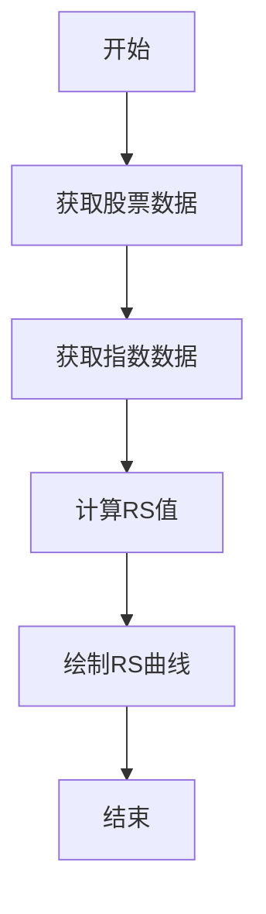
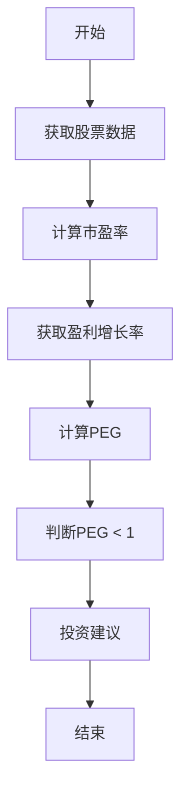
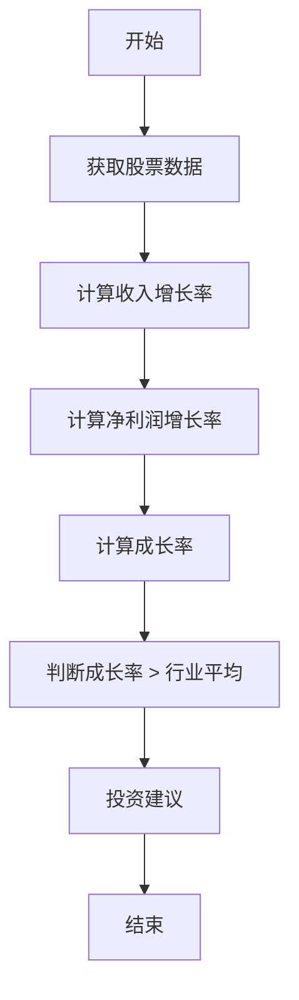

                 


# 彼得林奇四大选股指标详解

> 关键词：彼得·林奇，选股指标，相对强度，PEG，成长性，低市盈率

> 摘要：本文详细解读彼得·林奇的四大选股指标，包括相对强度、PEG、成长性和低市盈率，分析其原理、计算方法及实际应用，结合Python代码案例，帮助投资者掌握科学的选股方法。

---

## 第一部分: 彼得·林奇选股方法概述

### 第1章: 彼得·林奇选股方法概述

#### 1.1 投资的核心原理

投资的本质是通过分析企业的基本面、行业地位和市场趋势，选择具有长期增长潜力的股票，以实现资产的保值和增值。彼得·林奇作为全球著名投资专家，提出了许多经典的选股指标，帮助投资者筛选出具有成长性和估值优势的股票。

#### 1.2 彼得·林奇选股指标的核心概念

彼得·林奇的选股方法基于以下四个核心指标：

1. **相对强度（Relative Strength）**：衡量股票价格相对于市场指数的走势强度。
2. **PEG（市盈率相对盈利增长比率）**：评估股票估值是否合理。
3. **成长性（Growth）**：分析企业的收入和利润增长率。
4. **低市盈率（Low P/E Ratio）**：寻找被市场低估的股票。

#### 1.3 本章小结

彼得·林奇的选股方法以基本面分析为核心，结合相对强度和估值指标，帮助投资者筛选出具有长期增长潜力的股票。接下来我们将逐一分析这四个指标的定义、计算方法和实际应用。

---

## 第二部分: 相对强度（Relative Strength）指标

### 第2章: 相对强度指标详解

#### 2.1 相对强度的定义与计算

相对强度是指某只股票的价格走势相对于市场指数（如标普500）的强度。其计算公式为：

$$
RS = \frac{\text{股票价格}}{\text{指数价格}}
$$

相对强度的计算步骤如下：

1. 获取目标股票的历史价格数据。
2. 获取同期市场指数的历史价格数据。
3. 计算每段时间内股票价格与指数价格的比值。
4. 绘制RS曲线，分析其走势。

#### 2.2 相对强度的算法原理

相对强度算法流程图如下：



#### 2.3 相对强度的实战应用

##### 2.3.1 数据获取与处理

使用Python的`pandas`和`yfinance`库获取数据：

```python
import pandas as pd
import yfinance as yf

# 获取股票数据
stock = yf.download('AAPL', start='2020-01-01', end='2023-12-31')
index = yf.download('^GSPC', start='2020-01-01', end='2023-12-31')
```

##### 2.3.2 Python代码实现

计算相对强度：

```python
# 计算相对强度
rs = stock['Close'] / index['Close']
rs.plot(title='Relative Strength of AAPL vs S&P 500')
```

##### 2.3.3 案例分析与解读

以苹果公司（AAPL）为例，计算其相对于标普500指数的相对强度。如果RS值持续高于1，说明该股票走势强于市场指数，具有较高的投资价值。

#### 2.4 本章小结

相对强度是衡量股票市场表现的重要指标，能够帮助投资者识别出走势强劲的股票。通过RS曲线，投资者可以更好地把握市场趋势，制定投资策略。

---

## 第三部分: PEG（市盈率相对盈利增长比率）指标

### 第3章: PEG指标详解

#### 3.1 PEG的定义与计算

PEG是市盈率（P/E）与盈利增长率（G）的比值，公式为：

$$
PEG = \frac{\text{市盈率}}{\text{盈利增长率}}
$$

PEG的计算步骤如下：

1. 计算股票的市盈率（P/E）。
2. 获取公司的盈利增长率（净利润同比增长率）。
3. 计算PEG值。
4. 分析PEG值是否小于1，判断股票是否被低估。

#### 3.2 PEG的算法原理

PEG算法流程图如下：



#### 3.3 PEG的实战应用

##### 3.3.1 数据获取与处理

```python
import pandas as pd
import yfinance as yf

# 获取股票数据
data = yf.download('AAPL', start='2020-01-01', end='2023-12-31')
```

##### 3.3.2 Python代码实现

计算PEG值：

```python
# 计算市盈率
pe = data['Close'] / data['Earnings Per Share']

# 获取盈利增长率
growth = (data['Earnings'].diff() / data['Earnings']).fillna(0)

# 计算PEG
peg = pe / growth
peg.plot(title='PEG of AAPL')
```

##### 3.3.3 案例分析与解读

以苹果公司为例，计算其PEG值。如果PEG值小于1，说明股票估值较低，具有较高的投资价值。

#### 3.4 本章小结

PEG指标能够帮助投资者识别出具有成长性且估值合理的股票。通过PEG分析，投资者可以更好地判断股票的内在价值。

---

## 第四部分: 成长性（Growth）指标

### 第4章: 成长性指标详解

#### 4.1 成长性的定义与计算

成长性是指企业的收入和利润的增长能力。计算公式为：

$$
\text{成长率} = \frac{\text{收入增长率} + \text{净利润增长率}}{2}
$$

成长性的计算步骤如下：

1. 计算收入增长率。
2. 计算净利润增长率。
3. 计算成长率。
4. 分析成长率是否高于行业平均水平。

#### 4.2 成长性的算法原理

成长性算法流程图如下：



#### 4.3 成长性的实战应用

##### 4.3.1 数据获取与处理

```python
import pandas as pd
import yfinance as yf

# 获取股票数据
data = yf.download('AAPL', start='2020-01-01', end='2023-12-31')
```

##### 4.3.2 Python代码实现

计算成长率：

```python
# 计算收入增长率
revenue_growth = data['Revenue'].diff() / data['Revenue'].shift(1)

# 计算净利润增长率
net_income_growth = data['Net Income'].diff() / data['Net Income'].shift(1)

# 计算成长率
growth_rate = (revenue_growth + net_income_growth) / 2
growth_rate.plot(title='Growth Rate of AAPL')
```

##### 4.3.3 案例分析与解读

以苹果公司为例，计算其成长率。如果成长率高于行业平均水平，说明公司具有较强的盈利能力。

#### 4.4 本章小结

成长性指标能够帮助投资者识别出具有长期增长潜力的公司。通过成长率分析，投资者可以更好地判断公司的未来表现。

---

## 第五部分: 低市盈率（Low P/E Ratio）指标

### 第5章: 低市盈率指标详解

#### 5.1 低市盈率的定义与计算

低市盈率是指股票的市盈率低于市场平均水平。计算公式为：

$$
\text{市盈率} = \frac{\text{股价}}{\text{每股收益}}
$$

#### 5.2 低市盈率的实战应用

##### 5.2.1 数据获取与处理

```python
import pandas as pd
import yfinance as yf

# 获取股票数据
data = yf.download('^GSPC', start='2020-01-01', end='2023-12-31')
```

##### 5.2.2 Python代码实现

计算市盈率：

```python
# 计算市盈率
pe_ratio = data['Close'] / data['Earnings Per Share']
pe_ratio.plot(title='P/E Ratio of S&P 500')
```

##### 5.2.3 案例分析与解读

以标普500指数为例，计算其市盈率。如果市盈率低于市场平均水平，说明股票可能被低估，具有较高的投资价值。

#### 5.3 本章小结

低市盈率指标能够帮助投资者识别出被市场低估的股票。通过市盈率分析，投资者可以更好地判断股票的估值水平。

---

## 第六部分: 总结与投资建议

### 第6章: 总结与投资建议

#### 6.1 四大选股指标的综合应用

将相对强度、PEG、成长性和低市盈率四个指标结合起来，可以更全面地评估一只股票的投资价值。例如：

1. 选择相对强度高于市场的股票。
2. 选择PEG值小于1的股票。
3. 选择成长率高于行业平均水平的股票。
4. 选择市盈率低于市场平均水平的股票。

#### 6.2 投资建议

1. **长期投资**：彼得·林奇强调长期投资的重要性，建议投资者持有优质股票至少3-5年。
2. **分散投资**：不要将所有资金投入到一只股票中，分散投资可以降低风险。
3. **持续学习**：投资市场不断变化，建议投资者持续学习，关注行业动态和公司基本面。

#### 6.3 本章小结

彼得·林奇的四大选股指标为投资者提供了一套科学的选股方法。通过综合运用这些指标，投资者可以更好地筛选出具有长期增长潜力的股票，实现资产的保值和增值。

---

## 作者：AI天才研究院/AI Genius Institute & 禅与计算机程序设计艺术 /Zen And The Art of Computer Programming

