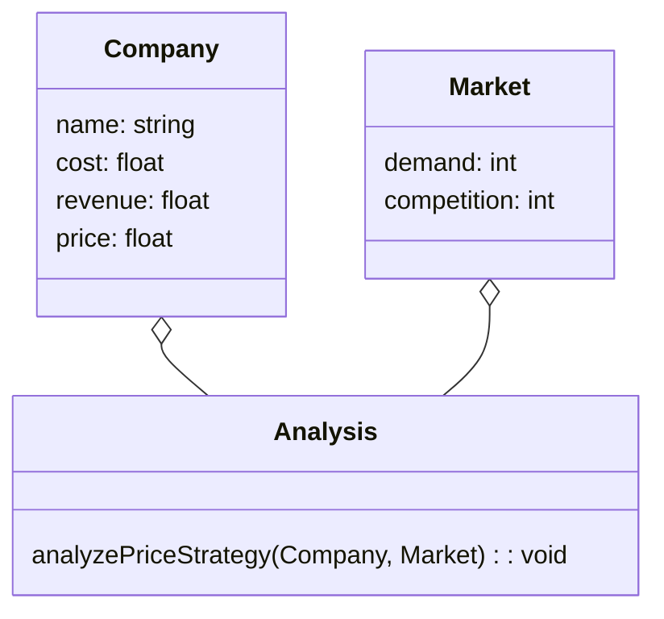
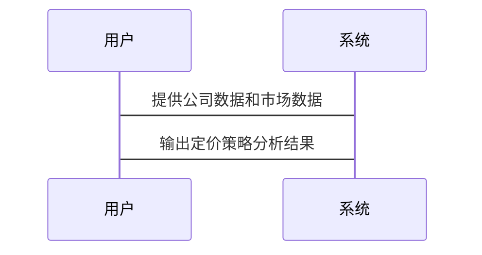

                 


# 彼得林奇如何分析公司的产品定价策略

## 关键词：彼得林奇、定价策略、价值投资、成本加成定价、市场需求分析

## 摘要：彼得·林奇是全球著名的价值投资者，他通过分析公司的定价策略来评估公司价值和投资机会。本文详细探讨了定价策略的核心概念、数学模型、系统分析与架构设计，以及通过实际案例分析定价策略对公司价值的影响，帮助读者掌握彼得·林奇的分析方法。

---

## 第一部分: 定价策略的基本概念与重要性

### 第1章: 定价策略的基本概念与重要性

#### 1.1 定价策略的基本概念

- **定价策略的定义**: 定价策略是企业在市场中确定其产品或服务价格的过程，旨在实现利润最大化、市场份额增长或品牌价值提升。

- **定价策略的核心要素**: 包括成本、市场需求、竞争环境、产品定位和客户价值。

- **定价策略在投资分析中的重要性**: 通过分析定价策略，投资者可以评估公司的定价能力、成本控制和市场定位，从而判断公司的竞争优势和潜在价值。

#### 1.2 彼得·林奇分析定价策略的背景

- **彼得·林奇与价值投资概述**: 彼得·林奇是全球著名的价值投资者，他注重分析公司的基本面，尤其是定价策略，以发现被低估的投资机会。

- **定价策略在价值投资中的地位**: 定价策略是评估公司价值的重要因素之一，彼得·林奇通过分析定价策略来判断公司的盈利能力和市场竞争力。

- **彼得·林奇分析定价策略的方法论**: 彼得·林奇强调对公司定价策略的深入分析，包括成本结构、市场需求和竞争对手的定价策略，以评估公司的定价能力和市场定位。

---

### 第2章: 彼得·林奇定价策略分析的核心概念

#### 2.1 定价策略的类型与特点

- **成本加成定价法**: 将产品的成本加上一定的加成率来确定价格。例如，$1+1=2$，如果成本为1，加成率为1，价格则为2。

- **市场导向定价法**: 根据市场需求和竞争环境来确定价格，强调市场份额的获取。

- **价值定价法**: 根据产品的实际价值和客户感知价值来定价，注重客户价值和品牌忠诚度。

#### 2.2 彼得·林奇分析定价策略的核心要素

- **公司成本结构分析**: 分析公司的生产成本、运营成本和研发投入，判断公司的成本控制能力。

- **市场需求分析**: 了解市场需求、价格弹性、消费者偏好和购买行为，评估定价策略的有效性。

- **竞争对手定价策略分析**: 分析竞争对手的定价策略，判断公司的定价优势和市场定位。

---

## 第三部分: 定价策略与公司价值的关系

### 第3章: 定价策略对公司利润的影响

#### 3.1 定价策略与利润率的关系

- **定价策略与利润率的关系**: 合理的定价策略可以提高利润率，过低或过高的定价都会影响公司的盈利能力。

- **定价策略对市场份额的影响**: 定价策略直接影响公司的市场份额，低价策略可能扩大市场份额，而高价策略可能限制市场份额。

- **定价策略与公司成长性的关系**: 通过合理的定价策略，公司可以在保证利润的同时，实现市场份额的扩展和公司的持续成长。

#### 3.2 彼得·林奇视角下的定价策略分析

- **定价策略与公司估值的关系**: 彼得·林奇认为，合理的定价策略能够反映公司的内在价值，从而帮助投资者评估公司的估值。

- **定价策略与投资决策的关联**: 通过分析定价策略，彼得·林奇能够判断公司的盈利能力和成长潜力，从而做出投资决策。

- **彼得·林奇如何通过定价策略发现投资机会**: 彼得·林奇通过分析定价策略，发现那些定价合理、成本控制能力强、市场定位准确的公司，作为投资机会。

---

## 第四部分: 定价策略分析的数学模型与公式

### 第4章: 定价策略的基本数学模型

#### 4.1 成本加成定价公式

$$ \text{价格} = \text{单位成本} \times (1 + \text{加成率}) $$

例如，如果单位成本为100，加成率为20%，则价格为 $100 \times 1.2 = 120$。

#### 4.2 边际成本定价公式

$$ \text{价格} = \text{边际成本} + \text{边际收益} $$

例如，边际成本为50，边际收益为30，则价格为 $50 + 30 = 80$。

#### 4.3 需求弹性定价公式

$$ \text{价格} = \frac{\text{收入}}{\text{需求弹性}} $$

例如，收入为1000，需求弹性为2，则价格为 $1000 / 2 = 500$。

---

## 第五部分: 系统分析与架构设计方案

### 第5章: 定价策略分析系统的构建

#### 5.1 问题场景介绍

- 定价策略分析系统的目的是帮助投资者分析公司的定价策略，评估公司价值和投资机会。

#### 5.2 系统功能设计

- **领域模型**: 使用Mermaid类图展示系统的实体和关系。



#### 5.3 系统架构设计

- **架构图**: 使用Mermaid架构图展示系统架构。


#### 5.4 系统交互设计

- **交互流程**: 使用Mermaid序列图展示系统交互。



---

## 第六部分: 项目实战

### 第6章: 定价策略分析的实战案例

#### 6.1 环境安装

- **工具安装**: 安装Python和相关库（如pandas、numpy、scipy）。

```bash
pip install pandas numpy scipy
```

#### 6.2 核心实现

- **定价策略分析函数**: 使用Python代码实现成本加成定价和边际成本定价。

```python
def cost_plus_pricing(unit_cost, markup):
    return unit_cost * (1 + markup)

def marginal_cost_pricing(marginal_cost, marginal_revenue):
    return marginal_cost + marginal_revenue
```

#### 6.3 数据分析与结果解读

- **数据分析**: 使用实际数据进行定价策略分析，生成分析结果。

#### 6.4 案例分析与解读

- **案例分析**: 以某公司为例，分析其定价策略，并给出投资建议。

#### 6.5 项目小结

- **项目总结**: 总结项目成果和经验，提出改进建议。

---

## 第七部分: 最佳实践与总结

### 第7章: 定价策略分析的最佳实践

#### 7.1 关键点总结

- **定价策略分析的关键点**: 成本分析、需求分析、竞争分析、定价模型的应用和结果验证。

#### 7.2 投资中的注意事项

- **投资中的注意事项**: 定价策略分析需要结合公司整体情况，考虑行业环境和市场变化，定期更新分析结果。

#### 7.3 持续优化的建议

- **持续优化的建议**: 定期收集新的数据，更新定价模型，关注行业趋势和政策变化。

#### 7.4 小结

- **小结**: 定价策略分析是价值投资的重要部分，通过深入分析定价策略，投资者可以发现优质的投资机会。

---

## 第八部分: 拓展阅读与学习资源

### 第8章: 相关书籍与资源推荐

#### 8.1 相关书籍推荐

- 《彼得·林奇的成功投资》
- 《定价策略与技巧》
- 《价值投资实战指南》

#### 8.2 在线资源与工具

- 网络课程: 投资分析与定价策略
- 在线工具: 定价策略分析软件

---

## 作者信息

作者：AI天才研究院/AI Genius Institute  
联系邮箱：contact@aigenius.org  
声明：本文由AI天才研究院原创，转载请注明出处。

