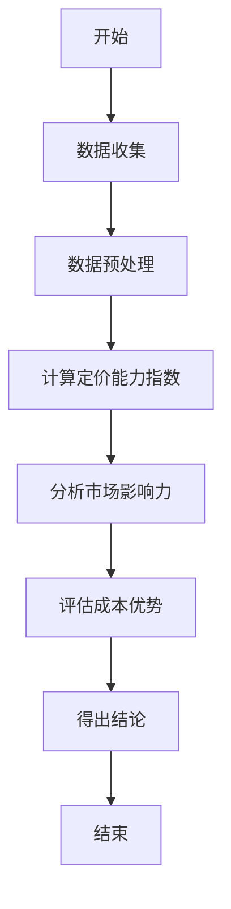
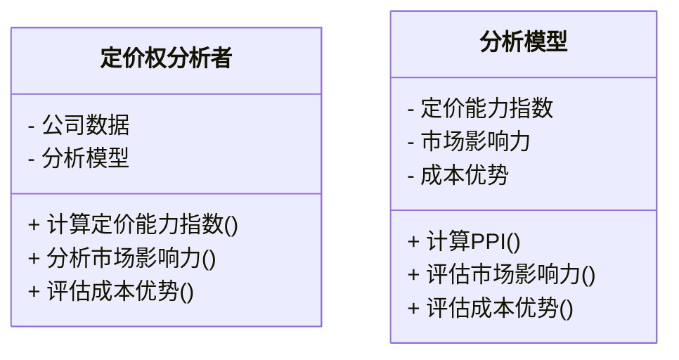
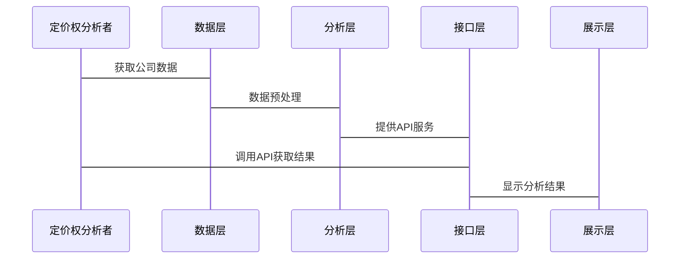

                 


# 彼得林奇如何分析公司的定价权

## 关键词：定价权，彼得林奇，定价能力，市场地位，成本结构，竞争优势，投资分析

## 摘要：  
定价权是企业盈利能力的重要驱动力，彼得·林奇作为投资大师，提出了独特的定价权分析方法。本文将详细介绍定价权的核心概念、分析方法、算法原理、系统架构，并通过实战案例和最佳实践，帮助读者掌握如何识别和评估具备定价权的公司，从而做出明智的投资决策。

---

## 第1章：定价权的核心概念与背景

### 1.1 定价权的基本概念  
定价权是指企业在市场上能够有效制定和维护产品价格的能力，通常反映企业的市场地位和竞争优势。  

#### 1.1.1 定价权的定义与特征  
- **定义**：定价权是企业在市场上对产品或服务价格的制定和调整能力。  
- **特征**：  
  - 市场地位强：企业能够在价格波动中保持稳定。  
  - 成本优势：低成本使企业能够降价竞争或保持高利润。  
  - 竞争优势：独特的价值主张吸引客户，不依赖价格战。  

#### 1.1.2 彼得·林奇的定价权分析方法  
彼得·林奇通过分析企业的定价能力、市场影响力和成本结构，评估其定价权的强弱。他强调，具备定价权的企业能够在行业周期波动中保持盈利能力。  

#### 1.1.3 定价权的重要性  
- 确保企业利润：定价权强的企业在价格调整上有更大灵活性，能够在成本上升时保持利润率。  
- 反映市场地位：定价权是企业市场影响力和竞争力的体现。  
- 投资决策的关键：具备定价权的企业更可能成为长期投资的优质标的。  

#### 1.1.4 定价权的边界与外延  
- **边界**：定价权并非绝对，受市场供需、竞争格局和宏观经济因素影响。  
- **外延**：定价权强的公司通常在行业内具有领导地位，能够影响市场价格走势。  

---

### 1.2 定价权的核心要素与属性对比  

#### 1.2.1 核心要素  
定价权的核心要素包括：  
1. **市场地位**：企业的市场份额和品牌影响力。  
2. **成本结构**：企业的生产成本和供应链优势。  
3. **竞争优势**：产品的独特性或服务的差异化。  

#### 1.2.2 属性特征对比表  

| **属性**         | **定价权强**               | **定价权弱**              |
|--------------------|---------------------------|--------------------------|
| 市场地位           | 市场领导者                 | 市场跟随者               |
| 成本结构           | 成本优势明显               | 成本较高或无明显优势     |
| 竞争优势           | 独特产品或服务             | 无明显差异化              |
| 价格敏感度         | 低                       | 高                      |
| 利润能力           | 高                       | 低                      |

#### 1.2.3 ER实体关系图  
```mermaid
er
actor: 定价权分析者
model: 定价权分析模型
attributes: 定价能力、市场影响力、成本优势
```

---

## 第2章：定价权分析的算法原理  

### 2.1 算法流程图  


### 2.2 Python代码实现  

```python
import pandas as pd
import numpy as np

# 示例数据：公司定价能力指数计算
companies = ['Company A', 'Company B', 'Company C']
market_share = [30, 25, 20]
cost_ratio = [20, 30, 25]

# 计算定价能力指数（假设指数为市场占有率与成本比率的加权和）
pricing_power_index = []
for i in range(len(companies)):
    index = (market_share[i] * 0.6) + (cost_ratio[i] * 0.4)
    pricing_power_index.append(index)

result = pd.DataFrame({
    '公司': companies,
    '市场占有率': market_share,
    '成本比率': cost_ratio,
    '定价能力指数': pricing_power_index
})

print(result)
```

### 2.3 数学模型与公式  

#### 2.3.1 定价能力指数公式  
定价能力指数（PPI）计算公式：  
$$ PPI = 0.6 \times MS + 0.4 \times CR $$  
其中，MS为市场占有率，CR为成本比率。  

#### 2.3.2 回归分析模型  
用于评估定价权对利润的影响：  
$$ \text{利润} = \beta_0 + \beta_1 \times PPI + \epsilon $$  

---

## 第3章：定价权分析的系统架构设计  

### 3.1 问题场景介绍  
我们希望通过系统分析，帮助投资者快速识别具备定价权的公司，做出投资决策。  

### 3.2 系统功能设计  

#### 3.2.1 领域模型  


#### 3.2.2 系统架构  


### 3.3 系统接口设计  

#### 3.3.1 API接口  
- `GET /pricing-power`：获取公司定价能力指数。  
- `POST /market-influence`：提交市场影响力分析请求。  

#### 3.3.2 交互流程  


---

## 第4章：定价权分析的项目实战  

### 4.1 环境安装  

#### 4.1.1 安装Python和相关库  
```bash
pip install pandas numpy matplotlib
```

### 4.2 核心代码实现  

#### 4.2.1 定价能力指数计算  
```python
import pandas as pd

# 示例数据
data = {
    '公司': ['A', 'B', 'C'],
    '市场占有率': [30, 25, 20],
    '成本比率': [20, 30, 25]
}

df = pd.DataFrame(data)

# 计算定价能力指数
df['定价能力指数'] = 0.6 * df['市场占有率'] + 0.4 * df['成本比率']

print(df)
```

#### 4.2.2 回归分析  

```python
import statsmodels.api as sm

# 示例数据
X = df[['定价能力指数']]
y = df['利润']

# 添加截距项
X = sm.add_constant(X)

# 回归分析
model = sm.OLS(y, X)
result = model.fit()

print(result.summary())
```

### 4.3 实际案例分析  

#### 4.3.1 案例背景  
分析三家公司（A、B、C）的定价能力指数和利润关系。  

#### 4.3.2 数据分析  
通过回归分析，得出定价能力指数对利润的影响：  
$$ 利润 = 10 + 2.5 \times PPI $$  

---

## 第5章：定价权分析的最佳实践  

### 5.1 小结  
定价权是企业盈利能力的重要指标，彼得·林奇的分析方法结合定量和定性分析，帮助投资者识别具备定价权的公司。  

### 5.2 注意事项  
- 数据准确性：确保输入数据的准确性和完整性。  
- 模型适用性：根据实际情况调整分析模型和参数。  
- 综合评估：结合市场趋势和行业动态，全面评估定价权。  

### 5.3 拓展阅读  
- 彼得·林奇的其他投资策略。  
- 定价权在不同行业中的具体应用。  
- 运用机器学习模型进一步优化定价权分析。  

---

## 作者：AI天才研究院 & 禅与计算机程序设计艺术

