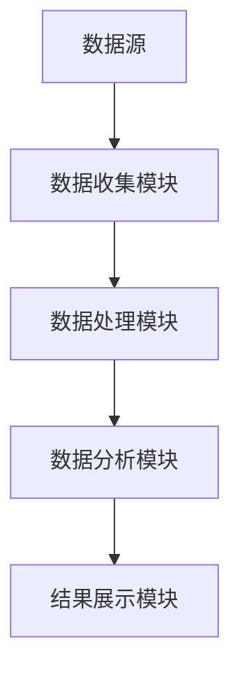

                 


# 彼得林奇如何分析公司的定价权随行业周期的变化

> 关键词：彼得·林奇，定价权，行业周期，企业战略，投资分析，定价策略

> 摘要：本文深入探讨彼得·林奇如何分析公司在不同行业周期中的定价权变化，结合定价权的核心概念、行业周期的影响、定价权的评估与测量方法、系统分析与架构设计以及项目实战，为读者提供全面的分析框架和实用的策略。

---

## 第一部分：定价权的背景与概念

### 第1章：定价权的定义与重要性

#### 1.1 定价权的定义
- **定价权**是指企业在市场中对其产品或服务制定价格的能力，反映了企业在市场中的竞争力和影响力。
- 定价权的核心要素包括市场结构、成本结构、竞争对手策略和消费者需求。
- 定价权的边界在于企业的市场地位和行业竞争格局，它不仅影响企业的利润，还影响行业的发展趋势。

#### 1.2 定价权的重要性
- **对企业战略**：定价权是企业制定市场策略的核心，决定了企业的盈利能力和发展空间。
- **对竞争力的影响**：拥有较强的定价权意味着企业在定价上有更大的灵活性，能够通过价格调整应对市场变化。
- **对行业的影响**：定价权高的企业通常能主导市场价格，影响行业竞争格局。

---

### 第2章：彼得·林奇的定价权分析框架

#### 2.1 核心概念原理
- **市场结构**：市场集中度、进入壁垒和替代品情况影响定价权。
- **成本结构**：固定成本和可变成本对企业定价策略的影响。
- **竞争对手分析**：竞争对手的定价策略和市场反应对企业定价权的影响。

#### 2.2 核心概念属性特征对比表

| 特性          | 高定价权企业 | 低定价权企业 |
|---------------|--------------|--------------|
| 市场结构       | 垄断或寡头   | 竞争充分     |
| 成本结构       | 成本可控     | 成本较高或不可控 |
| 竞争对手策略   | 竞争对手少   | 竞争对手多    |

#### 2.3 ER实体关系图

```mermaid
erDiagram
    customer[顾客] 
    company[企业] 
    product[产品] 
    market[市场]
    competitor[竞争对手]
    price[价格]
    cost[成本]
    relation1: customer -> product "购买"
    relation2: company -> product "提供"
    relation3: company -> competitor "竞争"
    relation4: product -> cost "涉及"
    relation5: company -> price "制定"
```

---

## 第二部分：定价权的核心概念与联系

### 第3章：定价权的核心概念与联系

#### 3.1 核心概念原理
- **市场结构**：垄断或寡头市场中，企业有更大的定价权。
- **成本结构**：高固定成本企业更依赖定价权来覆盖成本。
- **竞争对手分析**：了解竞争对手的定价策略有助于优化自身定价。

#### 3.2 核心概念属性特征对比表

| 特性          | 垄断市场     | 竞争市场       |
|---------------|-------------|---------------|
| 市场结构       | 高集中度     | 低集中度       |
| 定价策略       | 灵活         | 受限           |
| 竞争对手策略   | 少           | 多             |

---

## 第三部分：定价权随行业周期的变化

### 第4章：行业周期对定价权的影响

#### 4.1 行业周期的定义与阶段划分
- **增长期**：市场需求高，企业有较大的定价权。
- **成熟期**：市场竞争激烈，定价权下降。
- **衰退期**：需求下降，企业可能被迫降价，定价权进一步削弱。
- **复苏期**：市场逐渐恢复，企业可能重新获得定价权。

#### 4.2 不同阶段的定价权分析
- **增长期**：企业应提高价格，扩大市场份额。
- **成熟期**：通过差异化竞争保持定价权。
- **衰退期**：降低价格以维持市场份额。
- **复苏期**：逐步恢复定价权，调整策略。

---

## 第四部分：定价权的评估与测量方法

### 第5章：定价权的评估指标与模型

#### 5.1 常用评估指标
- **市场占有率**：企业市场份额反映定价能力。
- **价格敏感性分析**：评估价格变动对需求的影响。
- **利润率变化**：利润变化反映定价权的强弱。

#### 5.2 定价权评估模型
- **成本加成定价模型**：计算基于成本的定价。
  $$ \text{价格} = \text{成本} \times (1 + \text{加成率}) $$
- **竞争对手定价分析模型**：比较竞争对手的定价策略。

---

## 第五部分：系统分析与架构设计

### 第6章：系统功能与架构设计

#### 6.1 系统功能设计
- **数据收集模块**：收集市场数据和竞争对手信息。
- **数据分析模块**：应用统计模型和机器学习算法进行分析。
- **结果展示模块**：生成可视化报告和定价策略建议。

#### 6.2 系统架构设计
- **数据流图**：



---

## 第六部分：项目实战

### 第7章：定价权分析的系统实现

#### 7.1 环境安装
- **工具**：Python、Pandas、Matplotlib、Scikit-learn。

#### 7.2 核心代码实现
```python
import pandas as pd
from sklearn.linear_model import LinearRegression

# 数据加载
data = pd.read_csv('market_data.csv')

# 数据处理
X = data[['cost', 'competitor_price']]
y = data['price']

# 模型训练
model = LinearRegression()
model.fit(X, y)

# 预测与分析
predictions = model.predict(X)
print('模型系数:', model.coef_)
print('模型截距:', model.intercept_)
```

#### 7.3 案例分析
- **案例**：某行业在衰退期的定价策略调整。
- **分析**：使用模型预测价格变化，制定灵活的定价策略。

---

## 第七部分：总结与展望

### 第8章：总结与展望

#### 8.1 总结
- 彼得·林奇的定价权分析方法提供了系统的框架，帮助企业制定有效的定价策略。
- 结合行业周期变化，企业可以在不同阶段灵活调整定价策略，提升竞争力。

#### 8.2 展望
- 未来研究可结合更多数据源，如实时市场数据和消费者行为分析，优化定价模型。
- 结合人工智能技术，进一步提高定价权分析的准确性和实时性。

---

## 最佳实践与小结

- **最佳实践**：定期进行市场分析，及时调整定价策略。
- **小结**：定价权是企业战略的核心，行业周期变化要求企业灵活应对。

---

## 注意事项

- **数据准确性**：确保数据来源可靠，避免错误分析。
- **模型适用性**：根据实际情况选择合适的分析模型。

---

## 拓展阅读

- 彼得·林奇的《投资学入门：从零开始》
- 定价策略的经典文献

---

## 作者

作者：AI天才研究院/AI Genius Institute & 禅与计算机程序设计艺术 /Zen And The Art of Computer Programming

---

通过以上结构，本文系统地阐述了彼得·林奇如何分析定价权随行业周期的变化，结合理论分析和实际案例，为读者提供了全面的分析框架和实用的策略。

